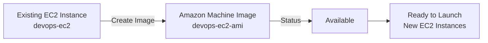
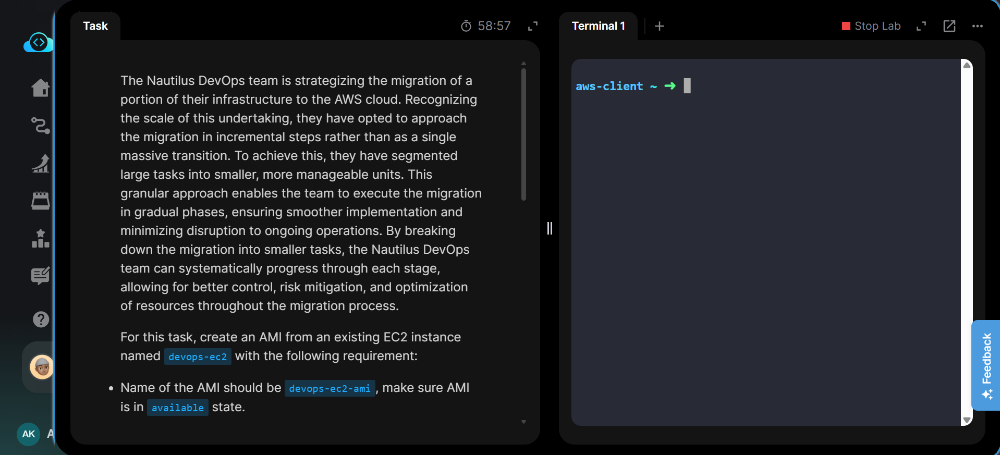
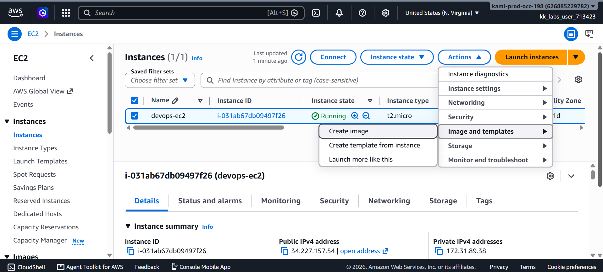
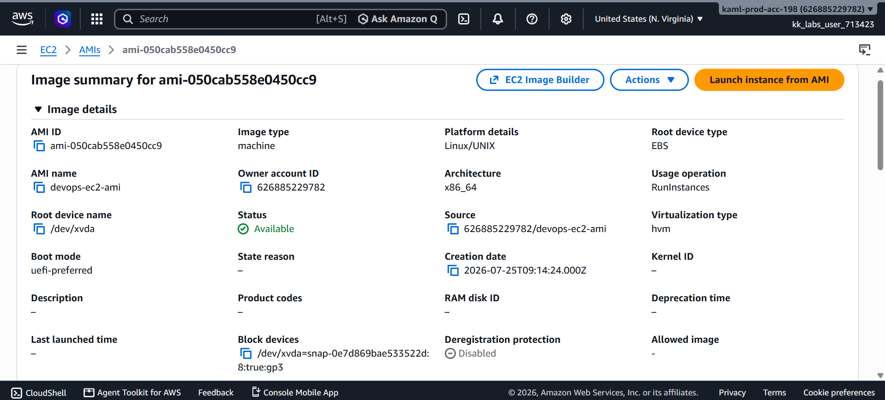
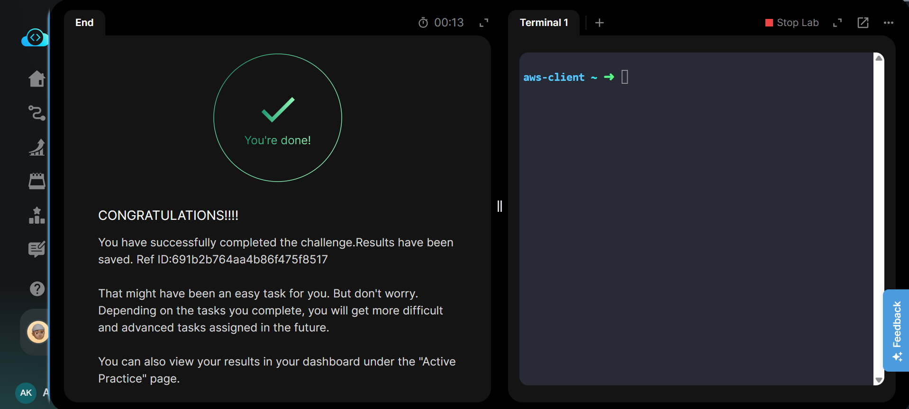

# Create an AMI from an EC2 Instance

## Project Information

| Field | Details |
|---|---|
| Project | Create an AMI from an EC2 Instance |
| Platform | AWS |
| Region | us-east-1 (N. Virginia) |
| Services | Amazon EC2, Amazon Machine Image (AMI), Amazon EBS |
| Purpose | Create a reusable machine image from an existing EC2 instance |

## Overview

This project demonstrates how to create an Amazon Machine Image (AMI) from an existing Amazon EC2 instance. AMIs provide a reusable image containing the configuration required to launch new EC2 instances with the same operating system and storage configuration.

An existing EC2 instance named `devops-ec2` was used to create a new AMI named `devops-ec2-ami`. After initiating image creation through the AWS Management Console, the AMI was monitored until its status changed to `Available`, confirming that the image was successfully created and ready for use.

## Objective

- Use the existing EC2 instance named `devops-ec2`.
- Create an Amazon Machine Image from the instance.
- Name the AMI `devops-ec2-ami`.
- Wait until the AMI reaches the `Available` state.
- Verify successful completion of the task.

## Skills Demonstrated

- Navigating Amazon EC2 resources
- Creating an AMI from an existing EC2 instance
- Understanding EC2 image creation
- Monitoring AMI creation status
- Verifying AMI availability
- Working with reusable EC2 machine images
- Understanding the relationship between EC2, AMIs, and EBS snapshots

## Services Used

- Amazon EC2
- Amazon Machine Image (AMI)
- Amazon EBS
- AWS Management Console

## Architecture Diagram

## Steps Performed

### 1. Reviewed the Task Requirements

Reviewed the lab requirements and identified the existing `devops-ec2` instance as the source for the new AMI.

### 2. Selected the Existing EC2 Instance

Navigated to:

`EC2 → Instances`

Selected the running EC2 instance:

`devops-ec2`

Then opened:

`Actions → Image and templates → Create image`

### 3. Created the AMI

Created a new Amazon Machine Image from the selected EC2 instance and configured the AMI name as:

`devops-ec2-ami`

The image creation process was then initiated through the AWS Management Console.

### 4. Verified AMI Availability

Navigated to the AMI section and verified the newly created image.

The AMI details showed:

- AMI Name: `devops-ec2-ami`
- Platform: Linux/UNIX
- Architecture: x86_64
- Root Device Type: EBS
- Status: `Available`

The `Available` status confirmed that the AMI creation process had completed successfully.

### 5. Verified Task Completion

The lab validation completed successfully, confirming that the required AMI had been created and was available for use.

## Commands Used

This task was performed using the **AWS Management Console**.

Equivalent AWS CLI commands for performing and verifying the same operation are documented separately:

➡️ [View AWS CLI Commands](Commands/commands.md)

## Troubleshooting

### AMI remains in Pending state

AMI creation is asynchronous and may take some time depending on the instance storage configuration.

Wait for the AMI status to change from:

`Pending → Available`

before validating or submitting the task.

### Unable to find the AMI

Ensure that the AWS Console is using the same region where the source EC2 instance and AMI were created.

### Incorrect AMI name

Verify that the AMI name exactly matches the task requirement:

`devops-ec2-ami`

## Debugging Notes

- Verified that the correct source EC2 instance was selected before creating the image.
- Confirmed that the AMI name matched the required value.
- Checked the AMI details after creation rather than assuming the operation completed immediately.
- Verified that the AMI reached the `Available` state before task submission.

## Best Practices

- Use descriptive and consistent AMI naming conventions.
- Verify the source EC2 instance before creating an image.
- Wait until an AMI reaches the `Available` state before using it.
- Regularly remove obsolete AMIs and associated snapshots to avoid unnecessary storage costs.
- Tag production AMIs with information such as environment, application, version, and creation date.
- Test important AMIs by launching a new instance before relying on them for recovery or deployment.

## Key Learnings

- An AMI can be created from an existing EC2 instance.
- AMIs provide reusable templates for launching EC2 instances.
- EBS-backed AMIs rely on snapshots of the instance's attached EBS volumes.
- AMI creation is asynchronous and initially enters a pending state.
- An AMI should reach the `Available` state before it can reliably be used to launch instances.
- AMIs are useful for backups, cloning, disaster recovery, and standardized deployments.

## Related Concepts

- Amazon EC2
- Amazon Machine Images (AMI)
- Amazon EBS
- EBS Snapshots
- EC2 Instance Backup
- Golden Images
- Disaster Recovery
- Infrastructure Standardization
- EC2 Instance Launching

## Screenshots

### 1. Task Requirements

### 2. Create Image from EC2 Instance

### 3. AMI Available

### 4. Task Completed

## Result

The Amazon Machine Image `devops-ec2-ami` was successfully created from the existing `devops-ec2` EC2 instance.

The AMI reached the **Available** state, confirming that it was successfully created and ready to be used for launching new EC2 instances.

**Task Status: Successfully Completed**