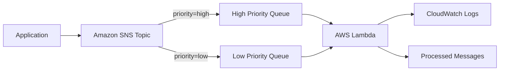
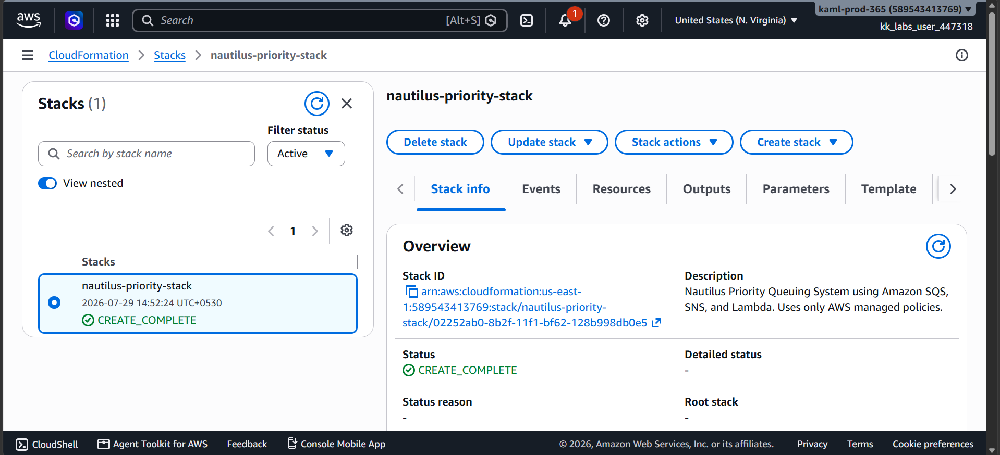
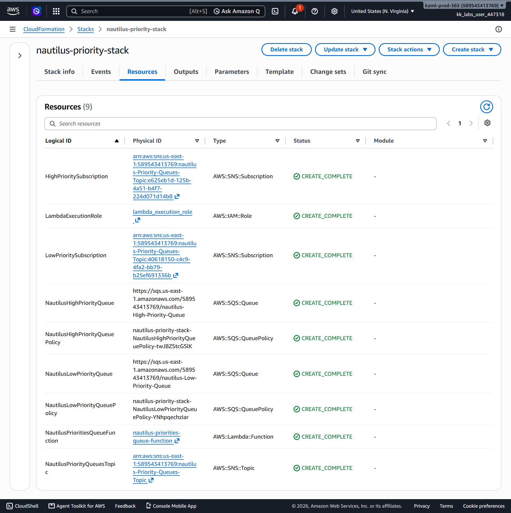
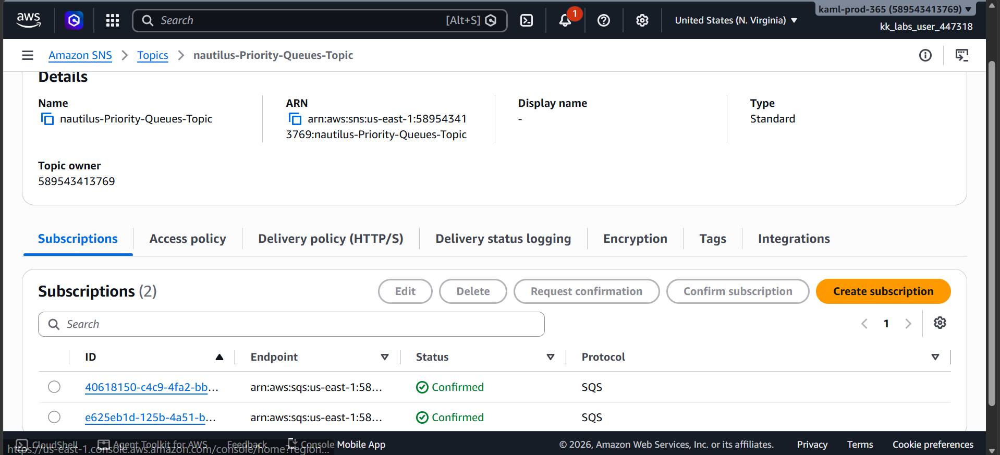
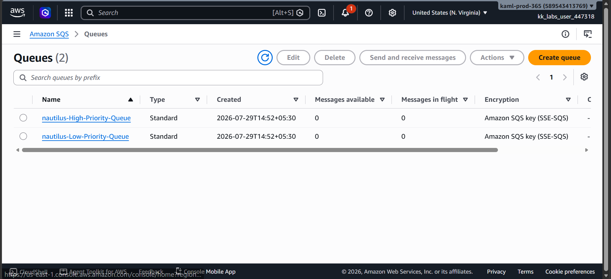
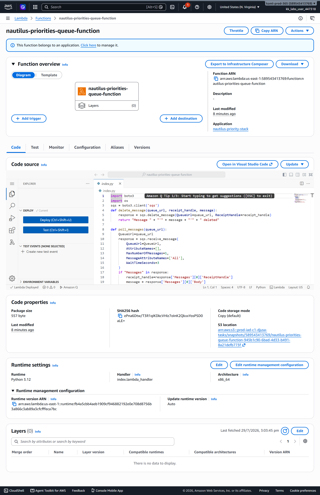
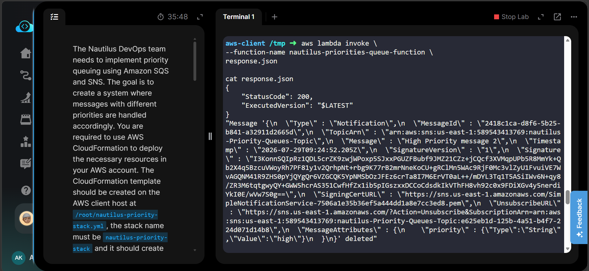
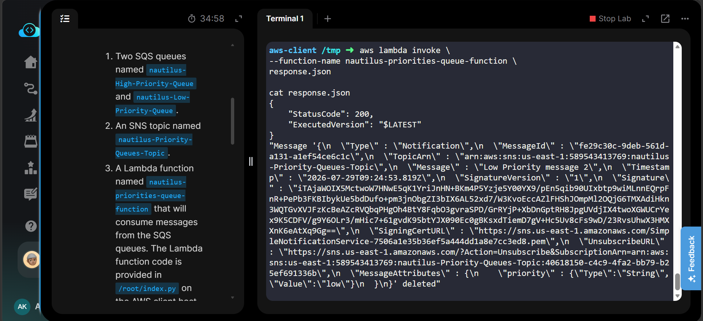
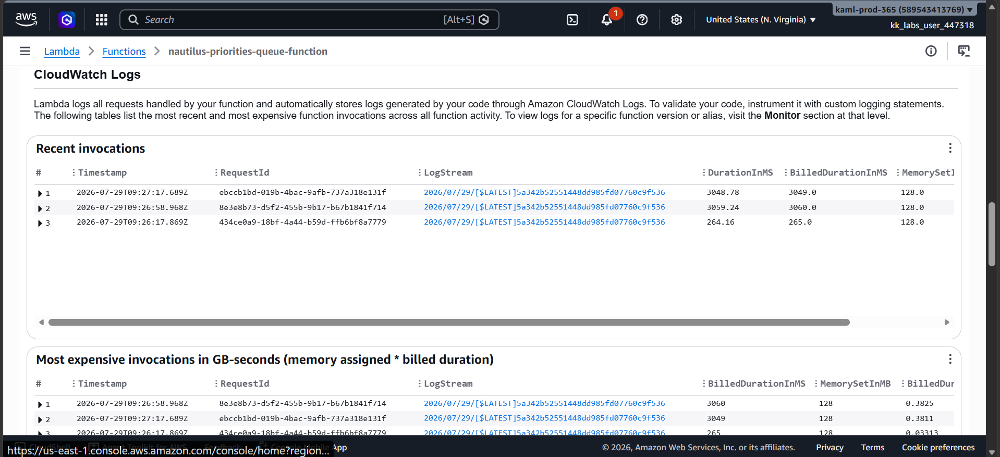
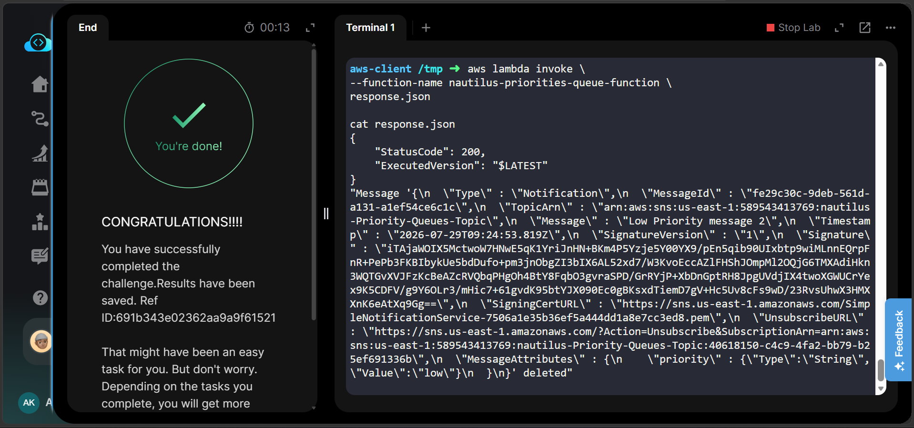

# 🚀 AWS CloudFormation - Priority Queuing System using Amazon SNS, Amazon SQS & AWS Lambda

<p align="center">


</p>

---

# 📑 Table of Contents

- [Project Information](#-project-information)
- [Overview](#-overview)
- [Objective](#-objective)
- [Skills Demonstrated](#-skills-demonstrated)
- [AWS Services Used](#-aws-services-used)
- [Architecture Diagram](#-architecture-diagram)
- [Project Structure](#-project-structure)
- [Implementation Steps](#-implementation-steps)
- [Commands Used](#-commands-used)
- [Troubleshooting](#-troubleshooting)
- [Key Learnings](#-key-learnings)
- [Related Concepts](#-related-concepts)
- [Interview Questions](#-interview-questions)
- [Screenshots](#-screenshots)
- [Result](#-result)

---

# 📌 Project Information

| Property | Value |
|----------|-------|
| Project Name | Priority Queuing System |
| Platform | AWS |
| Deployment Method | AWS CloudFormation |
| AWS Region | us-east-1 |
| Infrastructure as Code | Yes |
| Runtime | Python 3.12 |
| Lab Platform | KodeKloud Engineer |
| Status | ✅ Completed |

---

# 📖 Overview

This project demonstrates how to build an **event-driven priority messaging system** using AWS CloudFormation.

The infrastructure automatically provisions Amazon SNS, Amazon SQS queues, IAM Role, Queue Policies, SNS Subscriptions, and an AWS Lambda function.

The SNS topic receives messages with a **priority message attribute**. Based on the message attribute, SNS routes the messages to different SQS queues using **Subscription Filter Policies**.

The Lambda function polls the **High Priority Queue first**. If no high-priority messages are available, it then checks the **Low Priority Queue**.

The complete infrastructure is deployed using a single CloudFormation template.

---

# 🎯 Objective

The objective of this project is to:

- Deploy complete infrastructure using AWS CloudFormation.
- Create High and Low Priority Amazon SQS queues.
- Create an Amazon SNS Topic.
- Configure SNS Filter Policies.
- Route messages to the correct queue.
- Process High Priority messages before Low Priority messages.
- Deploy infrastructure using Infrastructure as Code (IaC).

---

# 💡 Skills Demonstrated

- AWS CloudFormation
- Infrastructure as Code (IaC)
- Amazon SNS
- Amazon SQS
- AWS Lambda
- IAM Roles
- Queue Policies
- SNS Subscription Filter Policies
- Event Driven Architecture
- CloudWatch Logs
- AWS CLI

---

# ☁ AWS Services Used

| Service | Purpose |
|----------|----------|
| AWS CloudFormation | Deploy complete infrastructure |
| Amazon SNS | Publish messages |
| Amazon SQS | Store priority messages |
| AWS Lambda | Process queue messages |
| AWS IAM | Lambda execution permissions |
| Amazon CloudWatch | Lambda logging and monitoring |

---

# 🏗 Architecture Diagram



---

# 📂 Project Structure

```
Task-47-Priority-Queuing-System
│
├── README.md
├── nautilus-priority-stack.yml
│
├── Commands
│   └── commands.md
│
└── Screenshots
    ├── 01-cloudformation-stack-create-complete.png
    ├── 02-cloudformation-resources.png
    ├── 03-sns-topic-subscriptions.png
    ├── 04-sqs-queues.png
    ├── 05-lambda-function.png
    ├── 06-high-priority-processing.png
    ├── 07-low-priority-processing.png
    ├── 08-cloudwatch-logs.png
    └── 09-task-completed.png
```

---

# ⚙ Implementation Steps

### Step 1

Created an IAM Role for Lambda execution.

---

### Step 2

Created two Amazon SQS queues.

- High Priority Queue
- Low Priority Queue

---

### Step 3

Created an Amazon SNS Topic.

---

### Step 4

Created SNS subscriptions with Filter Policies.

- priority = high
- priority = low

---

### Step 5

Configured Queue Policies to allow SNS to send messages to Amazon SQS.

---

### Step 6

Created AWS Lambda Function.

---

### Step 7

Uploaded the provided Python code to Lambda.

---

### Step 8

Published High and Low priority messages.

---

### Step 9

Invoked the Lambda function.

---

### Step 10

Verified that High Priority messages were processed before Low Priority messages.

---

# 💻 Commands Used

The complete list of AWS CLI commands used in this project is available here:

📄 **[Commands/commands.md](Commands/commands.md)**

The commands file includes:

- CloudFormation Template Validation
- Stack Creation
- Stack Verification
- Lambda Code Update
- SNS Message Publishing
- Lambda Invocation
- Resource Verification
- Cleanup Commands (Optional)

---

# 🔧 Troubleshooting

| Issue | Solution |
|---------|----------|
| CloudFormation stack creation failed | Validate the template before deployment using `validate-template`. |
| Lambda function did not process messages | Verify that the latest `index.py` was uploaded using `update-function-code`. |
| SNS messages were not delivered | Check Queue Policies and SNS Subscription Filter Policies. |
| Lambda returned **No more messages to poll** | Confirm that messages were published successfully before invoking Lambda. |
| Permission denied | Verify IAM Role permissions for Lambda, SNS, SQS, and CloudWatch. |

---

# 📚 Key Learnings

- Built an event-driven architecture using AWS managed services.
- Deployed infrastructure using Infrastructure as Code (IaC).
- Implemented message routing using Amazon SNS Filter Policies.
- Processed priority-based messages using Amazon SQS.
- Used AWS Lambda to poll multiple queues.
- Configured Queue Policies to allow SNS to publish to SQS.
- Managed AWS resources using CloudFormation.

---

# 🔗 Related Concepts

- Infrastructure as Code (IaC)
- Publish/Subscribe Messaging
- Event-Driven Architecture
- Serverless Computing
- Amazon SNS
- Amazon SQS
- AWS Lambda
- IAM Roles
- CloudWatch Logs

---

# 🎤 Interview Questions

### Why is Amazon SNS used?

Amazon SNS distributes published messages to multiple subscribers and supports filtering using message attributes.

---

### Why are two SQS queues created?

Separate queues allow High Priority and Low Priority messages to be processed independently.

---

### What is the purpose of SNS Filter Policies?

Filter Policies route messages to the correct SQS queue based on message attributes.

---

### Why does Lambda poll the High Priority Queue first?

To ensure urgent messages are processed before lower-priority messages.

---

### Why is a Queue Policy required?

Queue Policies allow Amazon SNS to send messages to Amazon SQS securely.

---

### Why can High Priority Message 2 be processed before High Priority Message 1?

Because Amazon SQS Standard Queues provide at-least-once delivery but do not guarantee message ordering. FIFO queues are required when strict ordering is needed.

---

# 📸 Screenshots

## 1. CloudFormation Stack

[](Screenshots/01-cloudformation-stack-create-complete.png)

---

## 2. CloudFormation Resources

[](Screenshots/02-cloudformation-resources.png)

---

## 3. SNS Topic & Subscriptions

[](Screenshots/03-sns-topic-subscriptions.png)

---

## 4. Amazon SQS Queues

[](Screenshots/04-sqs-queues.png)

---

## 5. Lambda Function

[](Screenshots/05-lambda-function.png)

---

## 6. High Priority Processing

[](Screenshots/06-high-priority-processing.png)

---

## 7. Low Priority Processing

[](Screenshots/07-low-priority-processing.png)

---

## 8. CloudWatch Logs

[](Screenshots/08-cloudwatch-logs.png)

---

## 9. Task Completed

[](Screenshots/09-task-completed.png)

---

# ✅ Result

Successfully deployed a priority-based messaging system using AWS CloudFormation.

The project automatically provisioned:

- Amazon SNS Topic
- High Priority Amazon SQS Queue
- Low Priority Amazon SQS Queue
- AWS Lambda Function
- IAM Execution Role
- Queue Policies
- SNS Subscription Filter Policies

Testing confirmed that High Priority messages were processed before Low Priority messages, meeting the project requirements.

---

# 🏆 Project Highlights

- ✅ Infrastructure as Code using AWS CloudFormation
- ✅ Event-Driven Architecture
- ✅ Serverless Processing with AWS Lambda
- ✅ Priority-Based Message Routing
- ✅ SNS Subscription Filter Policies
- ✅ Automated Infrastructure Deployment
- ✅ AWS CLI Automation
- ✅ CloudWatch Monitoring

---

# 🙌 Conclusion

This project demonstrates how Amazon SNS, Amazon SQS, AWS Lambda, and AWS CloudFormation can be combined to build a scalable, event-driven messaging system.

It highlights the power of Infrastructure as Code (IaC), message filtering, and serverless computing for creating reliable cloud-native applications.

---

⭐ **If you found this project helpful, consider giving it a star!**