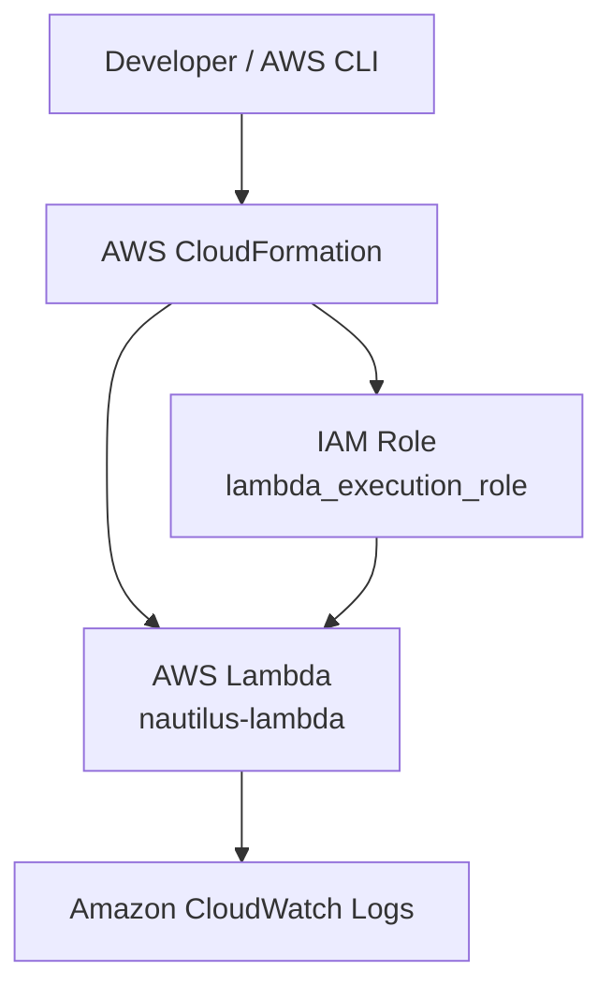
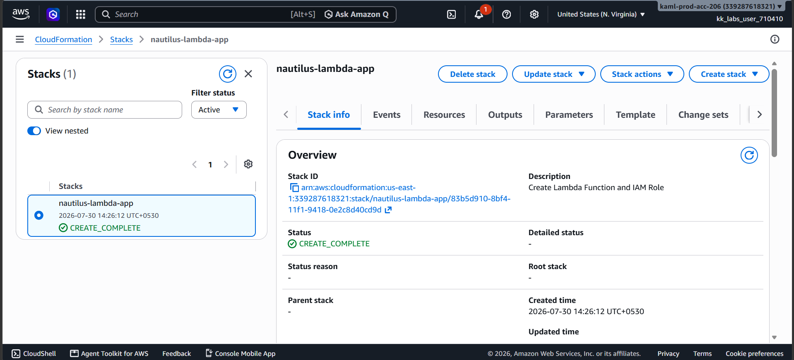
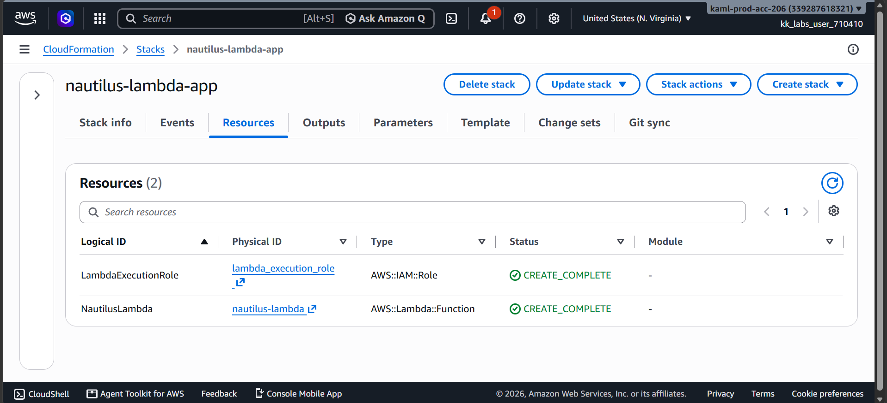
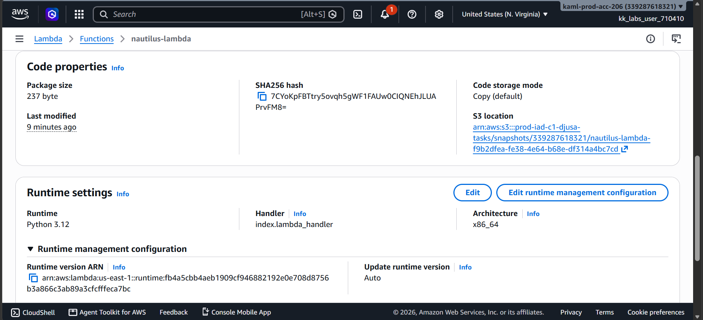
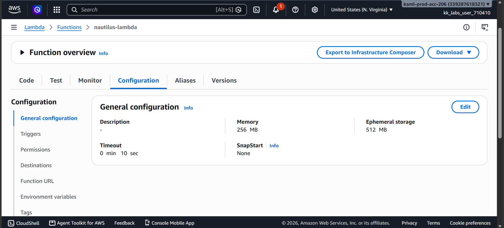
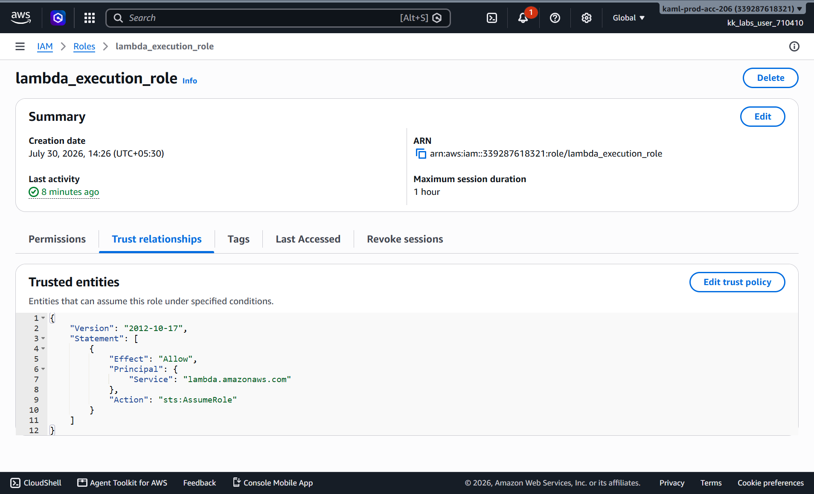
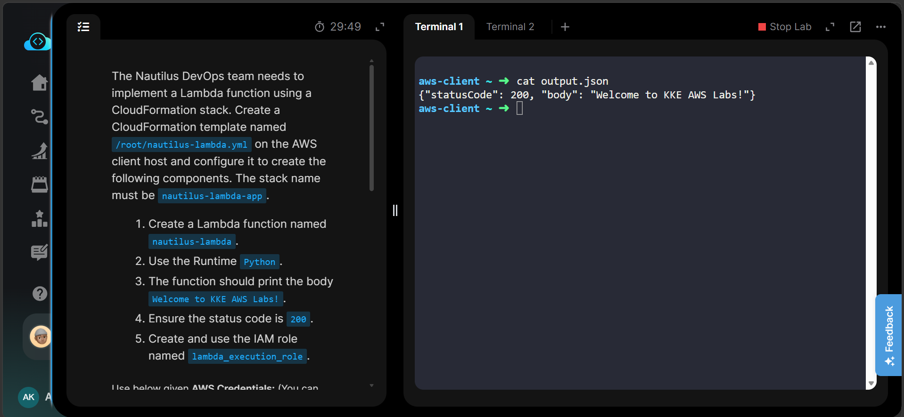
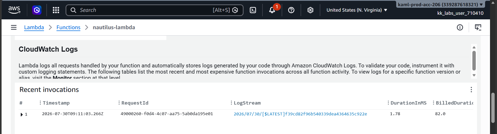
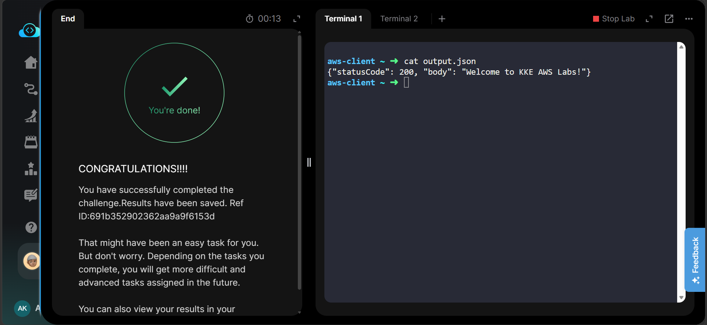

# 🚀 AWS Lambda Deployment using CloudFormation


---

# 📋 Project Information

| Property | Value |
|----------|-------|
| Project Name | AWS Lambda Deployment using CloudFormation |
| Task | Task 48 |
| Cloud Provider | Amazon Web Services (AWS) |
| Service | AWS Lambda |
| Deployment Method | AWS CloudFormation |
| Runtime | Python 3.12 |
| IAM Role | lambda_execution_role |
| Region | us-east-1 |
| Infrastructure Type | Infrastructure as Code (IaC) |

---

# 📖 Overview

This project demonstrates how to deploy an AWS Lambda function using AWS CloudFormation.

Instead of manually creating AWS resources from the AWS Console, the complete infrastructure is defined inside a CloudFormation template (`nautilus-lambda.yml`). CloudFormation automatically provisions the required AWS resources in a consistent and repeatable manner.

The Lambda function returns an HTTP status code **200** with the message:

```text
Welcome to KKE AWS Labs!
```

This project also creates the required IAM Execution Role and attaches the AWS managed execution policy required by Lambda.

---

# 🎯 Objective

The objective of this project is to automate Lambda deployment using Infrastructure as Code.

The CloudFormation template creates:

- AWS Lambda Function
- IAM Execution Role
- Basic Lambda Logging Permissions
- Inline Python Code

The deployed Lambda function returns a successful response with status code **200**.

---

# 🛠 Skills Demonstrated

- AWS Lambda
- AWS CloudFormation
- Infrastructure as Code (IaC)
- IAM Roles
- Python Runtime
- AWS CLI
- CloudFormation Stack Deployment
- Lambda Testing
- CloudWatch Integration

---

# ☁️ AWS Services Used

| Service | Purpose |
|----------|----------|
| AWS Lambda | Serverless Function |
| AWS CloudFormation | Infrastructure Deployment |
| AWS IAM | Lambda Execution Role |
| Amazon CloudWatch | Lambda Logs & Monitoring |
| AWS CLI | Stack Deployment & Verification |

---

# 🏗 Architecture Diagram



---

# ⚙️ Implementation Steps

### Step 1 – Create the CloudFormation Template

Created the CloudFormation template file on the AWS Client host.

```bash
vi /root/nautilus-lambda.yml
```

The template was configured to define the following AWS resources:

- IAM Execution Role (`lambda_execution_role`)
- AWS Lambda Function (`nautilus-lambda`)
- Python 3.12 Runtime
- Memory Size: **256 MB**
- Timeout: **10 Seconds**
- Inline Python function using the `ZipFile` property

---

### Step 2 – Validate the CloudFormation Template

Validated the template using the AWS CLI to ensure there were no syntax errors before deployment.

---

### Step 3 – Deploy the CloudFormation Stack

Deployed the validated CloudFormation template.

**Stack Name**

```text
nautilus-lambda-app
```

CloudFormation automatically provisioned all resources defined in the template.

---

### Step 4 – Verify the Created Resources

Verified that the following resources were created successfully:

- IAM Execution Role (`lambda_execution_role`)
- AWS Lambda Function (`nautilus-lambda`)

Also confirmed that the CloudFormation stack reached the **CREATE_COMPLETE** state.

---

### Step 5 – Invoke and Test the Lambda Function

Created a sample payload and invoked the Lambda function using the AWS CLI.

Expected Response:

```json
{
  "statusCode": 200,
  "body": "Welcome to KKE AWS Labs!"
}
```

---

### Step 6 – Verify CloudWatch Logs

Verified the Lambda execution by checking the CloudWatch Logs to ensure the function executed successfully and generated the expected logs.

---

### Step 7 – Confirm Successful Deployment

Confirmed that:

- The CloudFormation stack was deployed successfully.
- The Lambda function returned the expected response.
- CloudWatch Logs recorded the execution.
- All required resources were created in the **us-east-1** region.

---

# 💻 Commands Used

All commands used in this project are available in:

```text
Commands/commands.md
```

---

# 🔧 Troubleshooting

| Issue | Cause | Solution |
|-------|--------|----------|
| Stack creation failed | YAML syntax error | Validate template before deployment |
| IAM Role creation failed | CAPABILITY_NAMED_IAM missing | Deploy using `--capabilities CAPABILITY_NAMED_IAM` |
| Lambda invocation failed | Incorrect handler/runtime | Verify Runtime and Handler configuration |
| Access Denied | IAM permissions missing | Attach AWSLambdaBasicExecutionRole policy |
| Stack stuck in CREATE_IN_PROGRESS | Resource creation delay | Wait using CloudFormation wait command |

---

# 📚 Key Learnings

During this project, the following concepts were learned:

- Infrastructure as Code (IaC)
- CloudFormation Stack deployment
- AWS Lambda deployment using CloudFormation
- IAM Execution Roles
- AWS Managed Policies
- Inline Lambda code using ZipFile
- AWS CLI deployment workflow
- Lambda invocation
- CloudWatch logging
- CloudFormation validation

---

# 🔗 Related Concepts

- AWS Lambda
- Infrastructure as Code (IaC)
- AWS CloudFormation
- IAM Roles
- AWS CLI
- Serverless Computing
- CloudWatch Logs
- Event-Driven Architecture

---

# 🎯 Real-World Use Cases

AWS Lambda is widely used for:

- Image processing after S3 uploads
- REST APIs using API Gateway
- Scheduled automation using EventBridge
- Log processing
- Data transformation
- Email notifications
- Serverless backend applications
- Automated cloud operations

---

# 💼 Interview Questions

### 1. What is AWS Lambda?

AWS Lambda is a serverless compute service that runs code without provisioning or managing servers.

---

### 2. What is CloudFormation?

AWS CloudFormation is an Infrastructure as Code (IaC) service that provisions AWS resources using YAML or JSON templates.

---

### 3. Why use CloudFormation instead of the AWS Console?

- Repeatable deployments
- Version control
- Automation
- Reduced manual effort
- Consistent infrastructure

---

### 4. What is an IAM Role?

An IAM Role provides temporary permissions to AWS services such as Lambda without embedding credentials in the code.

---

### 5. Why is AWSLambdaBasicExecutionRole required?

It allows Lambda to create and write logs to Amazon CloudWatch.

---

### 6. What does the Lambda Handler do?

The handler is the entry point that AWS Lambda executes whenever the function is invoked.

---

### 7. Why validate a CloudFormation template?

Template validation detects syntax errors before deployment, reducing deployment failures.

---

### 8. Why was CAPABILITY_NAMED_IAM used?

Because the stack creates a named IAM Role (`lambda_execution_role`), CloudFormation requires explicit acknowledgement.

---

### 9. What response does this Lambda return?

```json
{
  "statusCode": 200,
  "body": "Welcome to KKE AWS Labs!"
}
```

---

### 10. What happens when the Lambda function is invoked?

1. Lambda initializes the runtime.
2. Executes the handler function.
3. Returns the response.
4. Writes execution logs to CloudWatch.

---

# 📸 Screenshots

## 1. CloudFormation Stack

[](Screenshots/01-cloudformation-stack-create-complete.png)

---

## 2. CloudFormation Resources

[](Screenshots/02-cloudformation-resources.png)

---

## 3. Lambda Runtime

[](Screenshots/03-lambda-runtime.png)

---

## 4. Lambda Configuration

[](Screenshots/04-lambda-configuration.png)

---

## 5. IAM Execution Role

[](Screenshots/05-iam-role.png)

---

## 6. Lambda Test Output

[](Screenshots/06-lambda-test-output.png)

---

## 7. CloudWatch Logs

[](Screenshots/07-cloudwatch-logs.png)

---

## 8. Task Completed

[](Screenshots/08-task-completed.png)

---

# ✅ Result

The AWS Lambda function was successfully deployed using AWS CloudFormation.

The CloudFormation stack automatically provisioned:

- IAM Execution Role
- AWS Lambda Function

The Lambda function was successfully invoked and returned:

```json
{
  "statusCode": 200,
  "body": "Welcome to KKE AWS Labs!"
}
```

CloudWatch Logs confirmed successful execution.

---

# 🏆 Project Highlights

- Infrastructure as Code (IaC)
- Fully Automated Deployment
- CloudFormation Stack
- AWS Lambda
- IAM Role
- AWS CLI
- CloudWatch Monitoring
- Serverless Architecture
- GitHub Portfolio Ready

---

# 📝 Conclusion

This project demonstrates how AWS CloudFormation simplifies serverless infrastructure deployment by automating the creation of AWS Lambda and IAM resources.

Using Infrastructure as Code ensures deployments are repeatable, consistent, version-controlled, and production-ready. The project also provides hands-on experience with AWS CLI, CloudFormation, IAM Roles, Lambda execution, and CloudWatch monitoring, making it an excellent foundation for learning AWS Serverless services.