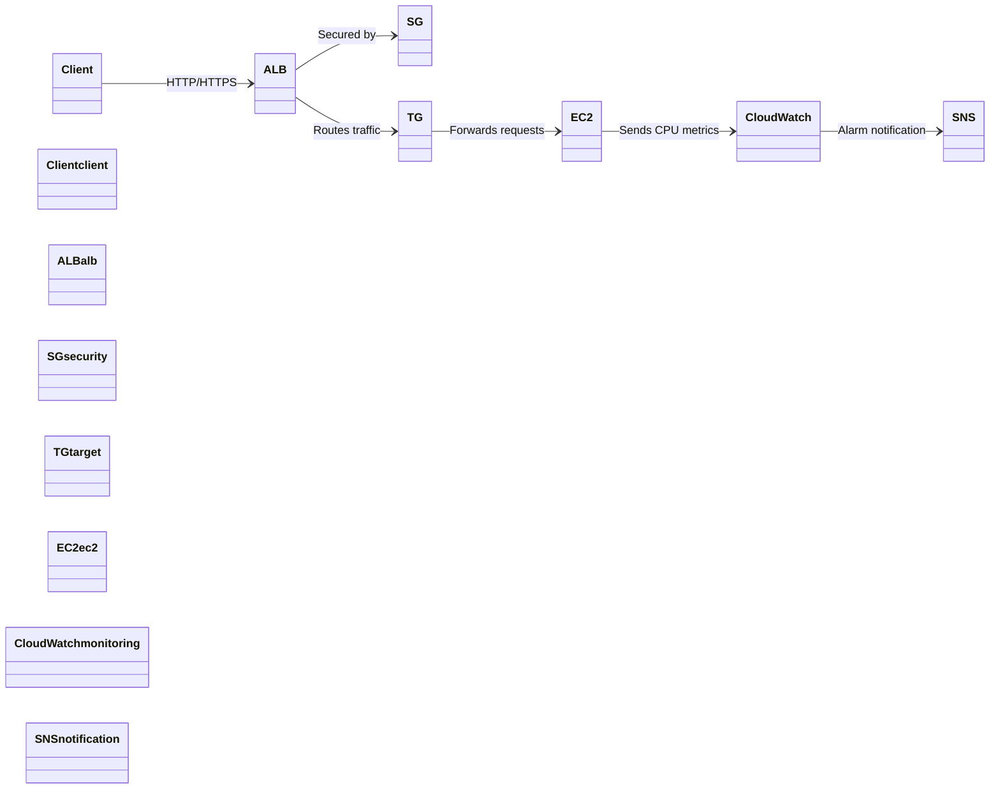
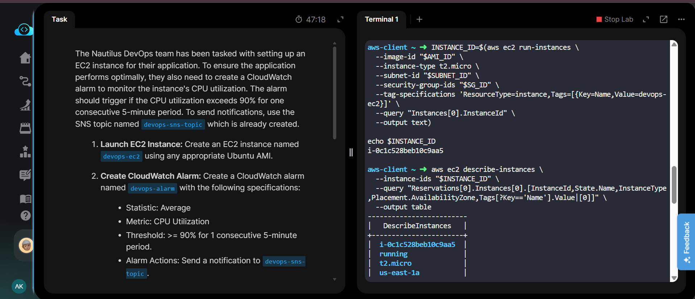
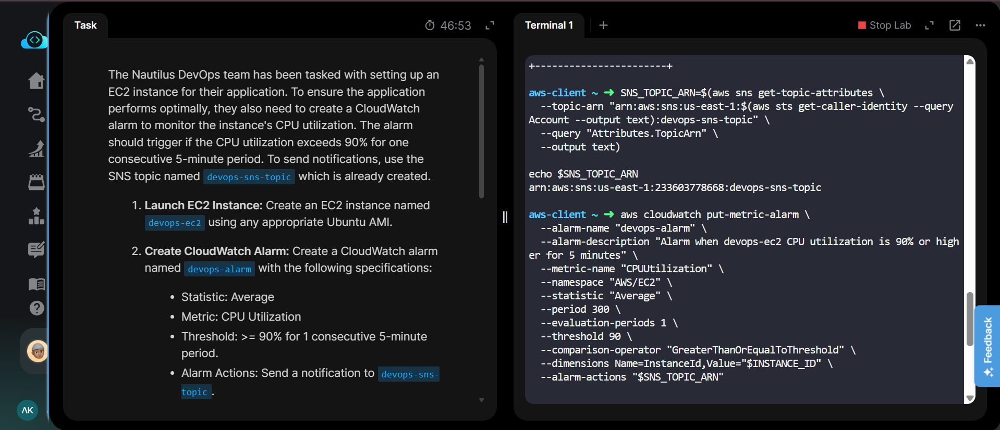
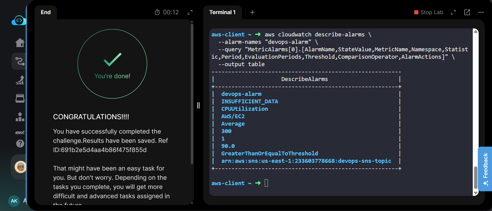

# AWS CloudWatch Alarm for EC2 Instance

[](https://aws.amazon.com/)
[](https://aws.amazon.com/about-aws/global-infrastructure/regions/)
[](#result)

## Project Information

| Field | Details |
|---|---|
| **Project Name** | Create CloudWatch Alarm for EC2 |
| **Task Number** | 25 |
| **Cloud Platform** | AWS |
| **Category** | Monitoring & Compute |
| **Primary Services** | Amazon EC2, Amazon CloudWatch, Amazon SNS |
| **Difficulty** | Easy |
| **Region** | `us-east-1` |
| **Implementation** | AWS CLI |

---

## Overview

The Nautilus DevOps team required an EC2 instance for their application along with monitoring for CPU utilization.

In this task, an Ubuntu-based EC2 instance named `devops-ec2` was launched and a CloudWatch alarm named `devops-alarm` was configured to monitor its CPU utilization.

The alarm uses the **Average** statistic and triggers when CPU utilization is **greater than or equal to 90%** for **one consecutive 5-minute period**. Notifications are configured to use the existing SNS topic `devops-sns-topic`.

---

## Objective

- Launch an Ubuntu EC2 instance named `devops-ec2`.
- Use the `t2.micro` instance type.
- Create a CloudWatch alarm named `devops-alarm`.
- Monitor the EC2 `CPUUtilization` metric.
- Use the `Average` statistic.
- Configure a 5-minute evaluation period.
- Trigger the alarm when CPU utilization is `>= 90%`.
- Use one consecutive evaluation period.
- Send alarm notifications to the existing `devops-sns-topic` SNS topic.
- Verify the final alarm configuration.

---

## Skills Demonstrated

- Amazon EC2 instance provisioning
- AWS CLI
- AWS Systems Manager Parameter Store
- Amazon CloudWatch monitoring
- CloudWatch alarm configuration
- Amazon SNS integration
- EC2 metric monitoring
- AWS resource verification
- Troubleshooting AWS resource creation

---

## Services Used

| Service | Purpose |
|---|---|
| **Amazon EC2** | Hosted the `devops-ec2` instance |
| **Amazon CloudWatch** | Monitored EC2 CPU utilization and created the alarm |
| **Amazon SNS** | Provided the notification destination |
| **AWS Systems Manager Parameter Store** | Retrieved the current Ubuntu 24.04 AMI ID |
| **Amazon VPC** | Provided the default VPC and subnet for the EC2 instance |

---

## Architecture Diagram



---

## Steps Performed

### 1. Retrieved the Ubuntu AMI

The official Ubuntu 24.04 LTS AMI was retrieved from AWS Systems Manager Parameter Store.

The resolved AMI was:

```text
ami-0d7f022123f8ff19d
```

---

### 2. Identified the Default VPC and Subnet

The default VPC and an available subnet were identified for launching the EC2 instance.

```text
VPC:    vpc-0464d33d26f4efa38
Subnet: subnet-01cfacccecd2db7b6
```

The default security group was also identified:

```text
Security Group: sg-0f5aa845787cf933b
```

---

### 3. Launched the EC2 Instance

An EC2 instance named `devops-ec2` was launched using the Ubuntu 24.04 AMI and `t2.micro` instance type.

The first launch attempt encountered an `InsufficientInstanceCapacity` error because `t2.micro` capacity was unavailable in the selected Availability Zone.

The instance was subsequently launched successfully in `us-east-1a`.

```text
Instance ID:       i-0c1c528beb10c9aa5
Instance Type:     t2.micro
Availability Zone: us-east-1a
State:             running
Name:              devops-ec2
```

---

### 4. Retrieved the Existing SNS Topic

The existing SNS topic `devops-sns-topic` was located and its ARN was retrieved.

```text
arn:aws:sns:us-east-1:233603778668:devops-sns-topic
```

---

### 5. Created the CloudWatch Alarm

A CloudWatch alarm named `devops-alarm` was created for the EC2 instance.

The alarm configuration was:

| Setting | Value |
|---|---|
| **Alarm Name** | `devops-alarm` |
| **Metric** | `CPUUtilization` |
| **Namespace** | `AWS/EC2` |
| **Statistic** | `Average` |
| **Period** | `300 seconds` / 5 minutes |
| **Evaluation Periods** | `1` |
| **Threshold** | `90%` |
| **Comparison Operator** | `GreaterThanOrEqualToThreshold` |
| **Alarm Action** | `devops-sns-topic` |

---

### 6. Verified the Alarm

The CloudWatch alarm was verified using `describe-alarms`.

The final configuration showed:

```text
Alarm Name:          devops-alarm
State:               INSUFFICIENT_DATA
Metric:              CPUUtilization
Namespace:           AWS/EC2
Statistic:           Average
Period:              300
Evaluation Periods:  1
Threshold:           90.0
Comparison Operator: GreaterThanOrEqualToThreshold
Alarm Action:        devops-sns-topic
```

`INSUFFICIENT_DATA` is expected immediately after creating an alarm when CloudWatch does not yet have enough metric data to determine the alarm state. The task itself was successfully completed and validated by the lab.

---

## Commands Used

All AWS CLI commands used during this lab are documented here:

[View Commands →](Commands/commands.md)

---

## Troubleshooting

### Issue: InsufficientInstanceCapacity

During the initial EC2 launch attempt, AWS returned:

```text
InsufficientInstanceCapacity
```

The error indicated that `t2.micro` capacity was temporarily unavailable in the selected Availability Zone.

The instance was successfully launched after retrying, and AWS placed it in:

```text
us-east-1a
```

### Issue: CloudWatch Alarm Shows INSUFFICIENT_DATA

Immediately after alarm creation, the alarm state was:

```text
INSUFFICIENT_DATA
```

This is normal for a newly created CloudWatch alarm because CloudWatch needs metric data before it can transition the alarm to `OK` or `ALARM`.

The alarm configuration was verified successfully.

---

## Debugging Notes

- Confirmed that the EC2 instance was in the `running` state.
- Verified the instance ID before creating the alarm.
- Confirmed that the SNS topic existed in `us-east-1`.
- Verified that the alarm monitors the correct EC2 instance using the `InstanceId` dimension.
- Confirmed the metric namespace as `AWS/EC2`.
- Confirmed the metric name as `CPUUtilization`.
- Confirmed the statistic as `Average`.
- Confirmed the period as `300` seconds.
- Confirmed one evaluation period.
- Confirmed the threshold as `90`.
- Confirmed the comparison operator as `GreaterThanOrEqualToThreshold`.
- Confirmed the SNS topic ARN was configured as the alarm action.

---

## Best Practices

- Use AWS Systems Manager Parameter Store to retrieve current AWS-managed AMI IDs instead of hardcoding outdated AMIs.
- Always verify the Availability Zone and subnet when launching EC2 instances.
- Use CloudWatch alarms to monitor important EC2 performance metrics.
- Keep alarm thresholds aligned with application requirements.
- Use SNS for centralized alarm notifications.
- Verify alarm configuration after creation using AWS CLI or the AWS Console.
- Use descriptive resource names such as `devops-ec2` and `devops-alarm`.

---

## Key Learnings

- Learned how to retrieve an Ubuntu AMI dynamically using AWS Systems Manager Parameter Store.
- Learned how to launch an EC2 instance using AWS CLI.
- Learned how to handle EC2 Availability Zone capacity issues.
- Learned how CloudWatch monitors EC2 metrics.
- Learned how to create a CloudWatch alarm using `put-metric-alarm`.
- Learned how to configure an SNS topic as a CloudWatch alarm action.
- Learned the meaning of the `INSUFFICIENT_DATA` CloudWatch alarm state.
- Learned how to verify CloudWatch alarm configuration using AWS CLI.

---

## Related Concepts

- Amazon EC2
- Amazon CloudWatch
- CloudWatch Metrics
- CloudWatch Alarms
- CPU Utilization
- Amazon SNS
- AWS Systems Manager Parameter Store
- AWS CLI
- EC2 Availability Zones
- EC2 Instance Monitoring
- Event-driven Notifications

---

## Screenshots

### 01 — EC2 Instance Created

Shows the successfully launched `devops-ec2` instance with its instance ID, running state, instance type, and Availability Zone.

[](screenshots/01-ec2-instance-created.png)

---

### 02 — CloudWatch Alarm Created

Shows the CloudWatch alarm creation command with the configured CPU utilization metric, Average statistic, 5-minute period, 90% threshold, one evaluation period, and SNS alarm action.

[](screenshots/02-cloudwatch-alarm-created.png)

---

### 03 — Alarm Verification and Lab Completion

Shows the final `describe-alarms` verification output and the successful KodeKloud lab completion screen.

[](screenshots/03-alarm-verification-success.png)

---

## Result

Successfully completed the task by:

- Launching the `devops-ec2` EC2 instance.
- Running the instance in `us-east-1a`.
- Creating the `devops-alarm` CloudWatch alarm.
- Monitoring `CPUUtilization`.
- Configuring the `Average` statistic.
- Setting a 5-minute period.
- Setting the threshold to `>= 90%`.
- Configuring one evaluation period.
- Connecting the alarm to the existing `devops-sns-topic` SNS topic.
- Verifying the final CloudWatch alarm configuration.
- Successfully completing the KodeKloud lab.

**Status: Completed successfully.** ✅