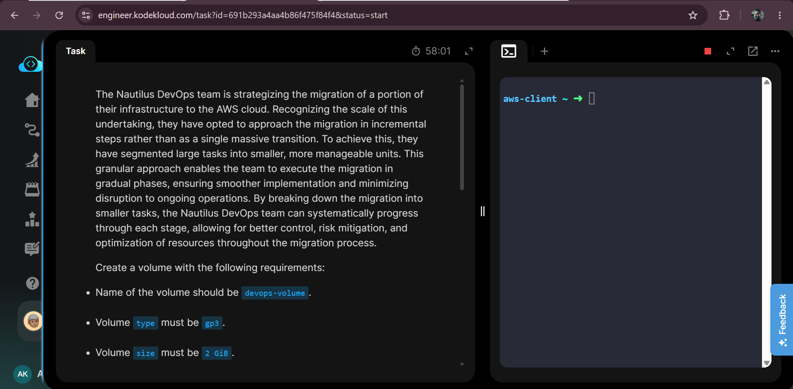
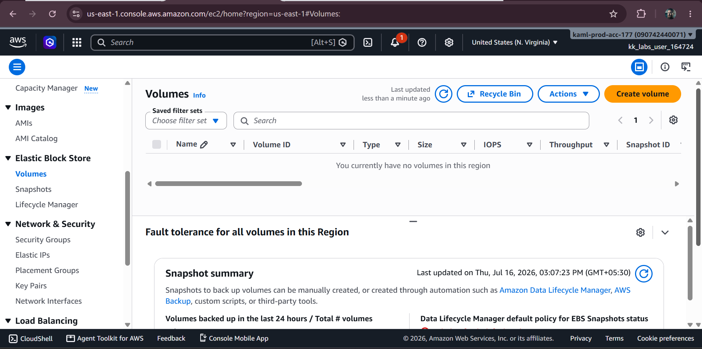
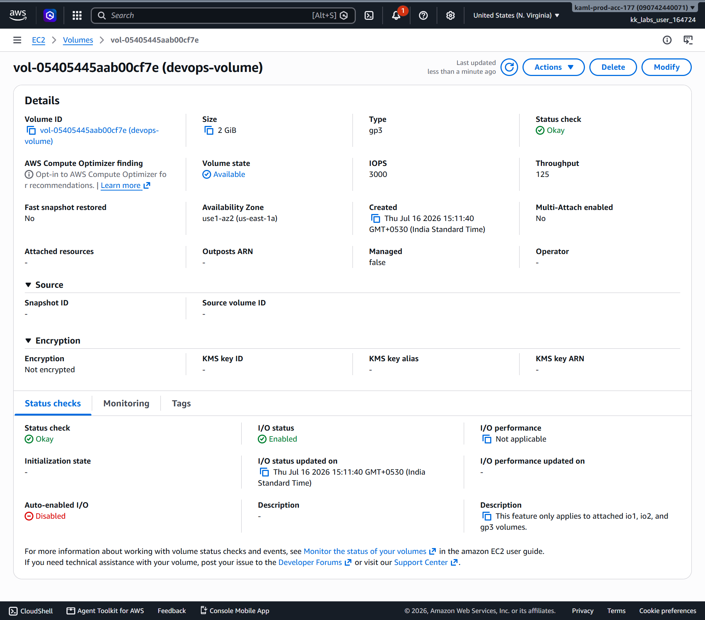
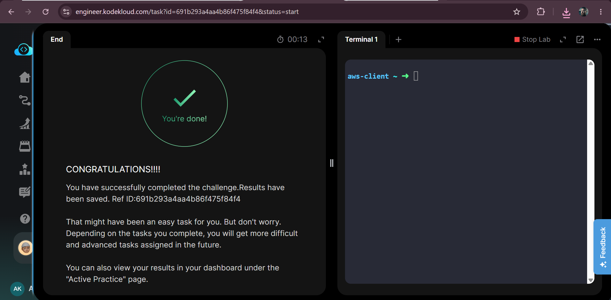

# Create GP3 EBS Volume

---

## Overview

This lab demonstrates how to create an Amazon Elastic Block Store (Amazon EBS) General Purpose SSD (gp3) volume in AWS. Amazon EBS provides persistent block storage that can be attached to Amazon EC2 instances for storing operating systems, applications, and data.

---

## Objective

Create an Amazon EBS volume with the following configuration:

- **Volume Name:** `devops-volume`
- **Volume Type:** `gp3`
- **Volume Size:** `2 GiB`
- **Region:** `us-east-1`

---

## AWS Services Used

- Amazon EC2
- Amazon Elastic Block Store (EBS)

---

## Steps Performed

1. Logged in to the AWS Management Console.
2. Switched to the **US East (N. Virginia) - us-east-1** region.
3. Opened the **EC2 Dashboard**.
4. Navigated to **Elastic Block Store → Volumes**.
5. Clicked **Create Volume**.
6. Configured the volume:
   - **Volume Type:** gp3
   - **Volume Size:** 2 GiB
   - Added the **Name** tag with the value **devops-volume**.
7. Created the EBS volume.
8. Verified that the volume status changed to **Available**.

---

## Result

Successfully created a **2 GiB General Purpose SSD (gp3) Amazon EBS volume** named **devops-volume** in the **us-east-1** region.

---

## Key Learnings

- Learned how to create an Amazon EBS volume.
- Understood the purpose of **gp3** volumes.
- Learned how to assign resource tags during creation.
- Verified the volume status after provisioning.
- Understood that EBS volumes provide persistent block storage for Amazon EC2 instances.

---

## Troubleshooting

- Ensure the correct AWS Region (**us-east-1**) is selected.
- Verify the volume type is set to **gp3**.
- Confirm the volume size is **2 GiB** before creating the volume.
- Make sure the selected Availability Zone belongs to the same region.
- Refresh the EC2 Volumes page if the newly created volume is not immediately visible.
- Verify that your IAM user has permission to create EBS volumes.

---

## Screenshots

  
  

  
  

