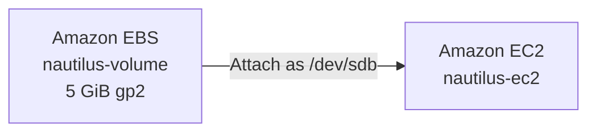
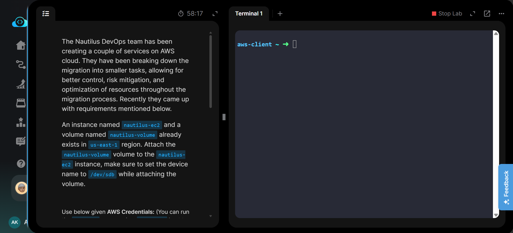
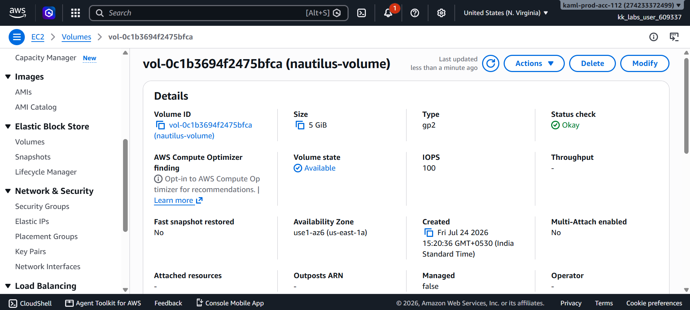
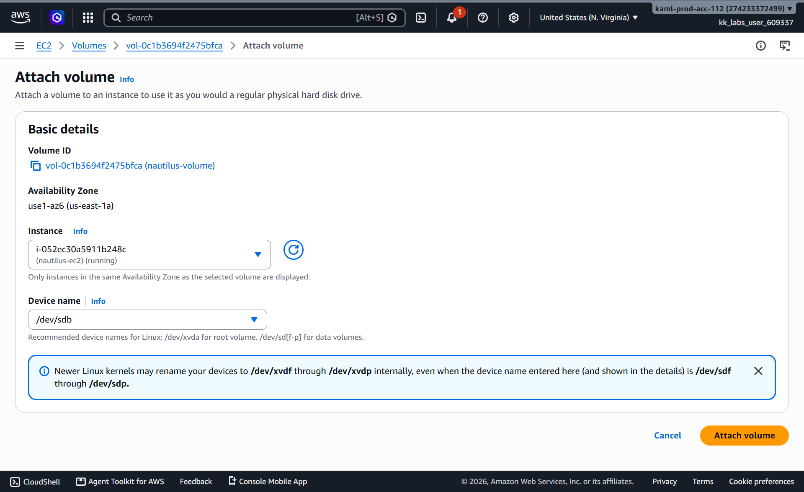
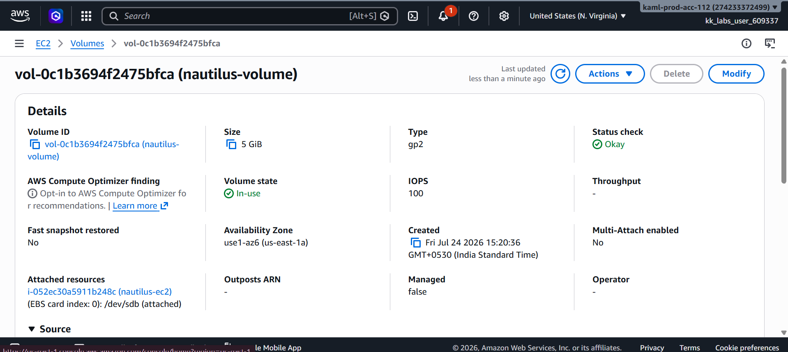
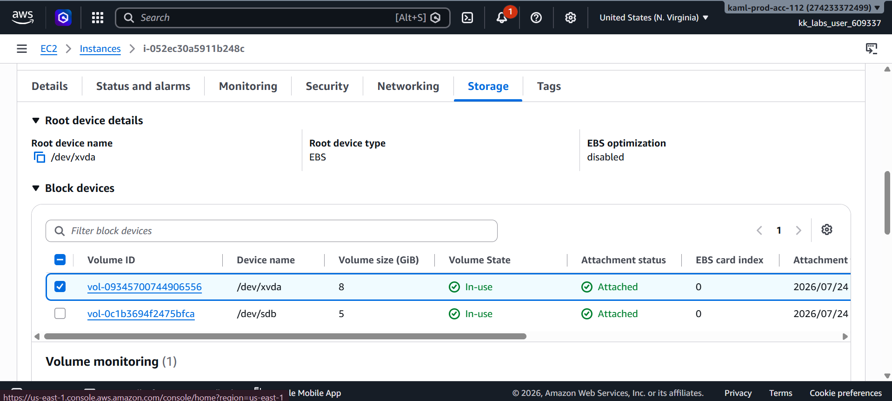
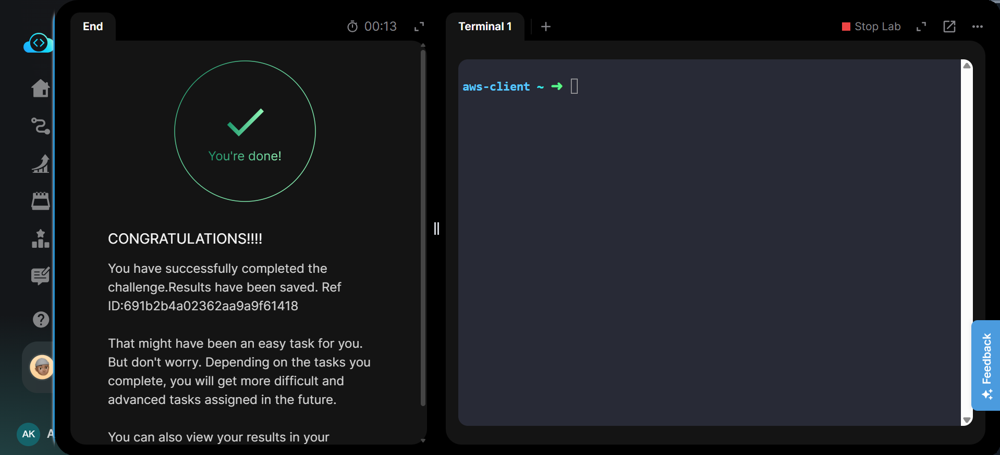

# Attach an EBS Volume to an EC2 Instance

## Project Information

| Attribute | Details |
|---|---|
| Project | Attach EBS Volume to EC2 Instance |
| Platform | AWS |
| Region | us-east-1 (N. Virginia) |
| Services | Amazon EC2, Amazon EBS |
| Purpose | Attach an existing EBS volume to an EC2 instance using a specified device name |

## Overview

This project demonstrates how to attach an existing Amazon Elastic Block Store (EBS) volume to an existing Amazon EC2 instance.

The `nautilus-volume` EBS volume was attached to the `nautilus-ec2` instance in the `us-east-1` region using `/dev/sdb` as the requested device name. After attachment, the configuration was verified from both the EBS volume details and the EC2 instance storage configuration.

The task was performed using the AWS Management Console. Equivalent AWS CLI commands are documented separately in [`Commands/commands.md`](Commands/commands.md) for future reference and automation.

## Objective

- Locate the existing `nautilus-volume` EBS volume.
- Locate the existing `nautilus-ec2` EC2 instance.
- Attach `nautilus-volume` to `nautilus-ec2`.
- Configure the device name as `/dev/sdb`.
- Verify that the volume state changes to `In-use`.
- Verify the attachment from the EC2 instance storage configuration.
- Perform all operations in the `us-east-1` region.

## Skills Demonstrated

- Amazon EC2 resource management
- Amazon EBS volume management
- Attaching EBS volumes to EC2 instances
- Configuring block device mappings
- Verifying EBS attachment status
- Working with AWS Availability Zones
- Navigating the AWS Management Console
- Understanding AWS CLI equivalents for console operations

## Services Used

- Amazon EC2
- Amazon Elastic Block Store (EBS)
- AWS Management Console
- AWS CLI (equivalent commands documented)

## Architecture Diagram

## Steps Performed

### 1. Review Task Requirements

Reviewed the task requirements and confirmed that:

- EC2 instance: `nautilus-ec2`
- EBS volume: `nautilus-volume`
- Region: `us-east-1`
- Required device name: `/dev/sdb`

### 2. Locate the EBS Volume

Navigated to:

**EC2 → Elastic Block Store → Volumes**

Selected the existing `nautilus-volume` and confirmed that the volume was available for attachment.

### 3. Configure Volume Attachment

Selected:

**Actions → Attach volume**

Configured:

- **Instance:** `nautilus-ec2`
- **Device name:** `/dev/sdb`

The attachment was then initiated from the AWS Management Console.

### 4. Verify EBS Volume Attachment

After attachment, the EBS volume state changed from:

`Available` → `In-use`

The volume details confirmed that `nautilus-volume` was attached to `nautilus-ec2` using `/dev/sdb`.

### 5. Verify from EC2 Instance

Opened the `nautilus-ec2` instance and navigated to the **Storage** tab.

The block device list showed the additional EBS volume with:

- Device name: `/dev/sdb`
- Volume size: `5 GiB`
- Volume state: `In-use`
- Attachment status: `Attached`

This confirmed that the volume was successfully attached to the instance.

## Commands Used

The task was completed using the **AWS Management Console**.

Equivalent AWS CLI commands for locating the resources, attaching the volume, and verifying the attachment are available here:

[`Commands/commands.md`](Commands/commands.md)

## Troubleshooting

### Volume Does Not Appear for the Instance

An EBS volume can only be attached to an EC2 instance located in the same Availability Zone.

Verify the Availability Zone of both resources before attempting the attachment.

### Volume Remains in Available State

Refresh the volume details after initiating the attachment and confirm that the attachment request completed successfully.

The expected state after attachment is:

`In-use`

### Incorrect Device Name

The task specifically requires the device name:

`/dev/sdb`

Always verify the requested device name before attaching the volume.

## Debugging Notes

- Confirmed that the EBS volume was initially in the `Available` state.
- Confirmed that the target EC2 instance was selectable during attachment.
- Configured `/dev/sdb` as the requested device name.
- Verified that the volume transitioned to `In-use`.
- Verified the attachment from both the EBS volume details and the EC2 instance Storage tab.

> Note: On some Linux EC2 instance types, the operating system may expose an attached EBS volume using a different NVMe device name even when `/dev/sdb` is specified in the AWS attachment configuration.

## Best Practices

- Keep the EC2 instance and EBS volume in the same Availability Zone.
- Verify the target instance before attaching a volume.
- Use meaningful tags and names for EBS volumes.
- Verify the attachment status before using the volume.
- Take snapshots before modifying volumes containing important data.
- Avoid detaching volumes while they are actively being written to by the operating system.
- Use AWS CLI or infrastructure automation for repeatable production workflows.

## Key Learnings

- EBS volumes provide persistent block storage for EC2 instances.
- An EBS volume must be in the same Availability Zone as the EC2 instance to which it is attached.
- An available EBS volume changes to the `In-use` state after successful attachment.
- AWS allows a device name such as `/dev/sdb` to be specified during attachment.
- Volume attachment can be verified from both the EBS and EC2 interfaces.
- Attaching an EBS volume makes the block device available to the instance, but additional operating-system steps may be required to format and mount a new filesystem.

## Related Concepts

- Amazon Elastic Block Store (EBS)
- EC2 Block Device Mapping
- EBS Volume Types
- Availability Zones
- EBS Snapshots
- Linux Block Devices
- Filesystems and Mount Points
- Persistent Storage
- AWS CLI

## Screenshots

### Task Requirements

### EBS Volume Selected

### Volume Attachment Configuration

### EBS Volume Attached

### EC2 Storage Verification

### Task Completed

## Result

The existing `nautilus-volume` EBS volume was successfully attached to the `nautilus-ec2` EC2 instance in the `us-east-1` region.

The volume was configured with the required `/dev/sdb` device name and successfully transitioned to the `In-use` state. The attachment was also verified from the EC2 instance Storage tab, confirming successful completion of the task.