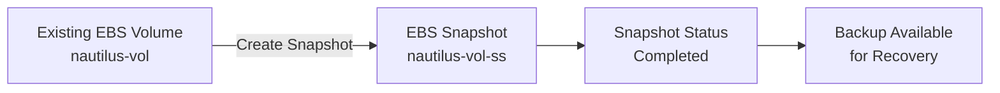
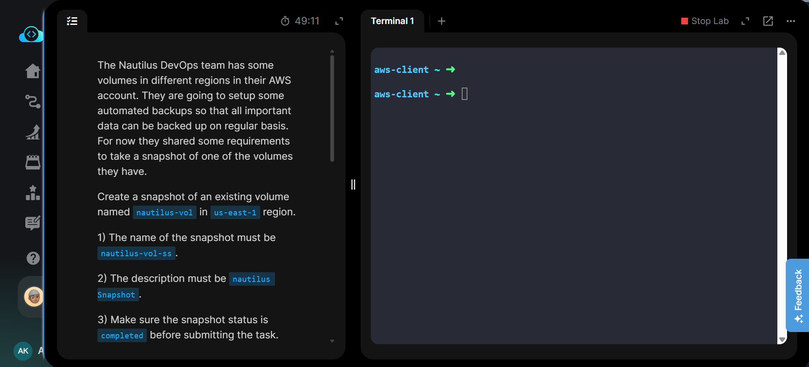
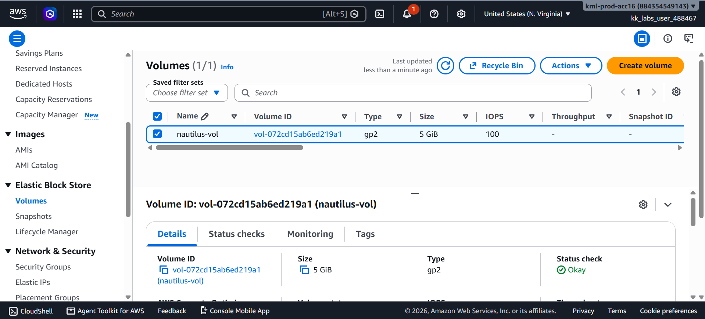
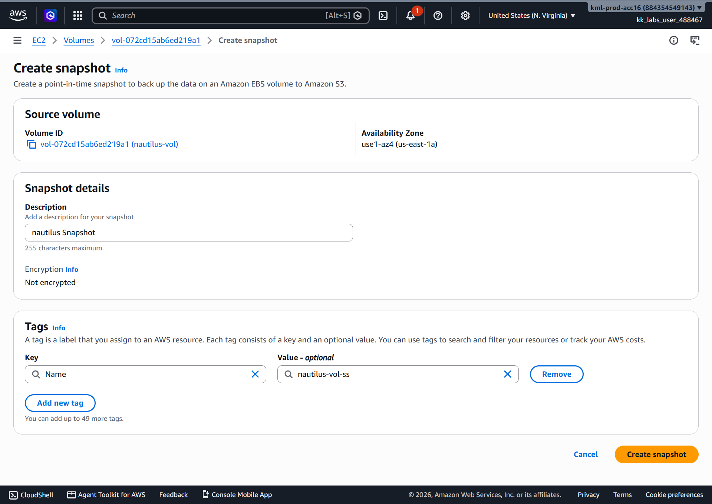
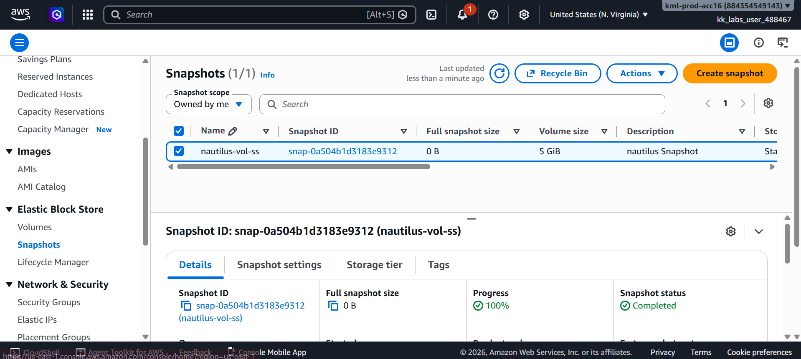
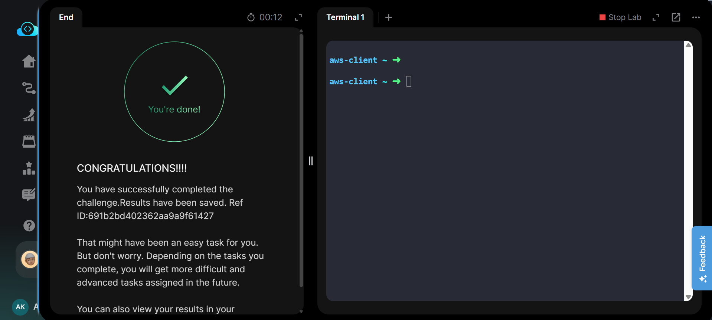

# Create an EBS Snapshot from an Existing Volume

## Project Information

| Field | Details |
|---|---|
| **Project** | Create an EBS Snapshot |
| **Platform** | KodeKloud Engineer |
| **Cloud Provider** | AWS |
| **Region** | us-east-1 (N. Virginia) |
| **Service** | Amazon EC2 / Elastic Block Store (EBS) |
| **Resource** | EBS Snapshot |
| **Purpose** | Create a point-in-time snapshot of an existing EBS volume for backup and recovery |

## Overview

This project demonstrates how to create an Amazon EBS snapshot from an existing EBS volume using the AWS Management Console. EBS snapshots provide point-in-time backups of EBS volumes and can be used for data protection, disaster recovery, volume restoration, and infrastructure migration.

An existing EBS volume named `nautilus-vol` was identified in the `us-east-1` region. A snapshot named `nautilus-vol-ss` was created with the required description `nautilus Snapshot`.

The snapshot creation process was monitored until its status changed to `Completed`, confirming that the backup was successfully created and ready for future recovery operations.

## Objective

The objective of this task was to:

- Locate the existing EBS volume named `nautilus-vol`.
- Create a snapshot from the existing volume.
- Assign the snapshot name `nautilus-vol-ss`.
- Set the description to `nautilus Snapshot`.
- Ensure all operations were performed in the `us-east-1` region.
- Verify that the snapshot reached the `Completed` state before submitting the task.

## Skills Demonstrated

- Navigating Amazon EC2 and Elastic Block Store resources
- Identifying existing EBS volumes
- Creating point-in-time EBS snapshots
- Applying resource tags
- Managing snapshot metadata
- Monitoring snapshot creation status
- Verifying successful backup completion
- Understanding basic AWS storage backup operations

## Services Used

- **Amazon EC2** — Provides access to EC2-related compute and storage resources.
- **Amazon Elastic Block Store (EBS)** — Provides persistent block storage volumes and snapshot functionality.
- **AWS Management Console** — Used to perform and verify the task.

## Architecture Diagram

The existing `nautilus-vol` EBS volume serves as the source resource. AWS creates a point-in-time snapshot of the volume, which becomes available for backup and recovery operations after reaching the `Completed` state.

## Steps Performed

### 1. Accessed the EC2 Console

Logged in to the AWS Management Console and confirmed that the selected region was:

`us-east-1 (N. Virginia)`

Navigated to:

**EC2 → Elastic Block Store → Volumes**

### 2. Located the Existing EBS Volume

Located and selected the existing volume:

`nautilus-vol`

The volume details were reviewed to ensure that the correct source volume was selected before creating the snapshot.

### 3. Started Snapshot Creation

With the volume selected, navigated to:

**Actions → Create snapshot**

Configured the snapshot with the required description:

`nautilus Snapshot`

A `Name` tag was added with the value:

`nautilus-vol-ss`

### 4. Created the Snapshot

Submitted the snapshot creation request through the AWS Management Console.

AWS began creating a point-in-time snapshot from the selected EBS volume.

### 5. Verified Snapshot Completion

Navigated to:

**EC2 → Elastic Block Store → Snapshots**

Located the newly created snapshot and monitored its status until it reached:

`Completed`

The snapshot name and description were also verified.

### 6. Validated Task Completion

After confirming that the snapshot was successfully created and its status was `Completed`, the task was submitted and successfully validated by KodeKloud.

## Commands Used

This task was performed using the **AWS Management Console**.

Equivalent AWS CLI commands are documented separately for future reference and automation practice:

➡️ [`Commands/commands.md`](Commands/commands.md)

## Troubleshooting

### Snapshot remains in Pending state

EBS snapshots may initially display a `Pending` status while AWS copies the volume data to the snapshot storage system.

**Resolution:** Wait for the snapshot operation to complete and refresh the Snapshots page until the status changes to `Completed`.

### Incorrect snapshot name

The snapshot name displayed in the AWS Console is based on the `Name` resource tag.

**Resolution:** Ensure the following tag is configured:

- Key: `Name`
- Value: `nautilus-vol-ss`

### Snapshot created in the wrong region

EBS volumes and their snapshots are regional resources.

**Resolution:** Confirm that the AWS Console region is set to `us-east-1` before locating the volume and creating the snapshot.

### Wrong source volume selected

Creating a snapshot from the wrong volume would result in backing up the incorrect data.

**Resolution:** Verify that the selected volume has the `Name` tag `nautilus-vol` before starting snapshot creation.

## Debugging Notes

- Confirmed the AWS region before performing the task.
- Verified the source EBS volume name before creating the snapshot.
- Verified the required snapshot description.
- Applied the required `Name` tag to the snapshot.
- Waited for the snapshot status to change from `Pending` to `Completed`.
- Verified the final snapshot before submitting the task.

## Best Practices

- Use meaningful `Name` tags for snapshots to simplify identification.
- Add descriptive metadata explaining the purpose of each snapshot.
- Monitor snapshot status before relying on it for recovery.
- Use consistent tagging standards across EBS volumes and snapshots.
- Automate recurring snapshots using services such as Amazon Data Lifecycle Manager when regular backups are required.
- Define retention policies to prevent unnecessary snapshots from increasing storage costs.
- Regularly test restoration procedures rather than relying only on successful snapshot creation.

## Key Learnings

- EBS snapshots provide point-in-time backups of EBS volumes.
- Snapshots can be created without manually copying volume data.
- Snapshot creation is asynchronous and may initially show a `Pending` state.
- A snapshot should reach the `Completed` state before it is considered ready for normal recovery operations.
- The snapshot name displayed in the AWS Console is implemented through the `Name` tag.
- EBS snapshots can later be used to create new EBS volumes.
- AWS CLI can automate the same snapshot workflow performed through the Management Console.

## Related Concepts

- Amazon Elastic Block Store (EBS)
- EBS Volumes
- EBS Snapshots
- Point-in-Time Backups
- Data Backup and Recovery
- Disaster Recovery
- AWS Resource Tagging
- Snapshot Lifecycle Management
- Amazon Data Lifecycle Manager
- AWS CLI Automation

## Screenshots

### 1. Task Requirements

*Task requirements for creating a snapshot from the existing `nautilus-vol` EBS volume.*

### 2. Existing EBS Volume Selected

*Existing `nautilus-vol` EBS volume selected in the AWS Management Console.*

### 3. Snapshot Configuration

*Snapshot creation configuration with the required description and `Name` tag.*

### 4. Snapshot Completed

*The `nautilus-vol-ss` snapshot successfully reached the `Completed` state.*

### 5. Task Completed

*KodeKloud validation confirming successful completion of the task.*

## Result

The existing EBS volume `nautilus-vol` was successfully backed up by creating an EBS snapshot named `nautilus-vol-ss` in the `us-east-1` region.

The required description `nautilus Snapshot` was configured, and the snapshot was verified to be in the `Completed` state before task submission.

**Final Status:** ✅ Successfully Completed