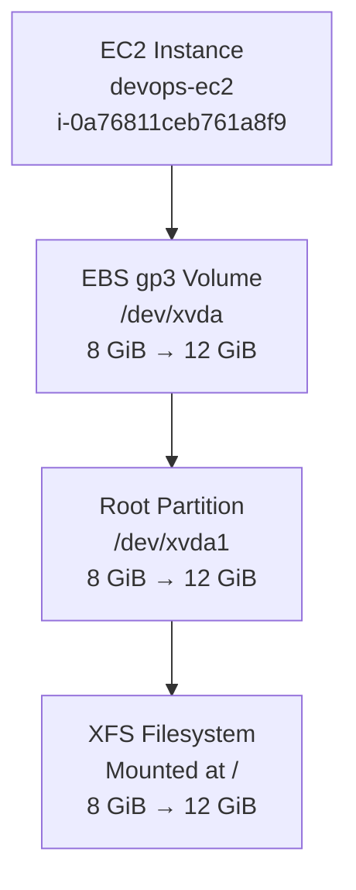
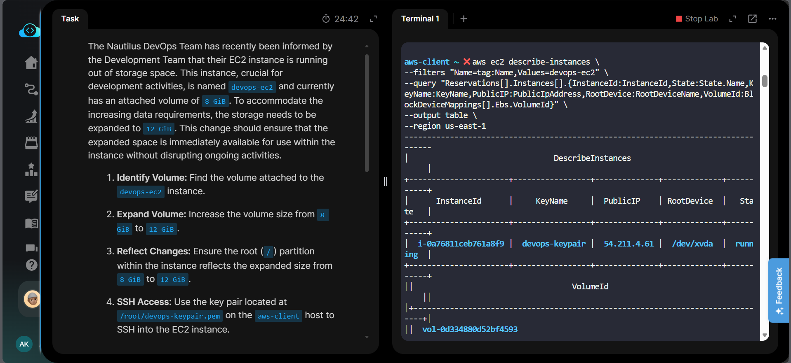
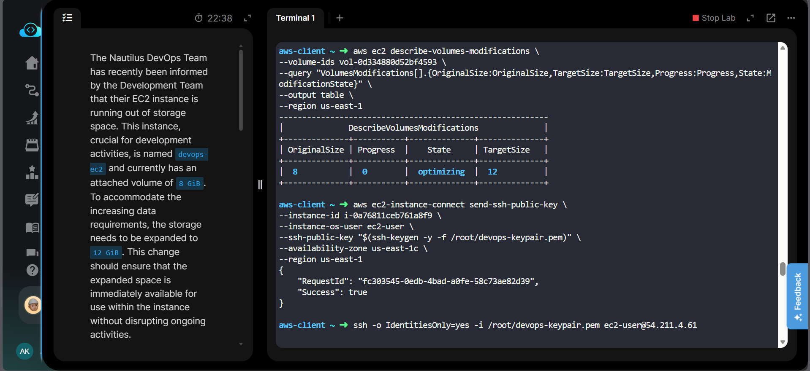
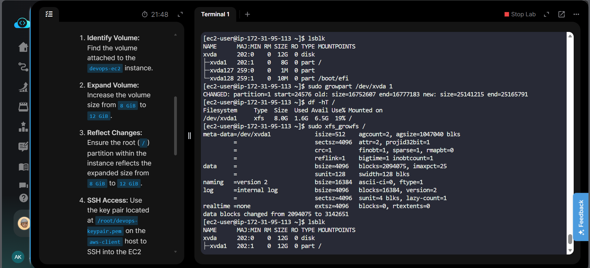
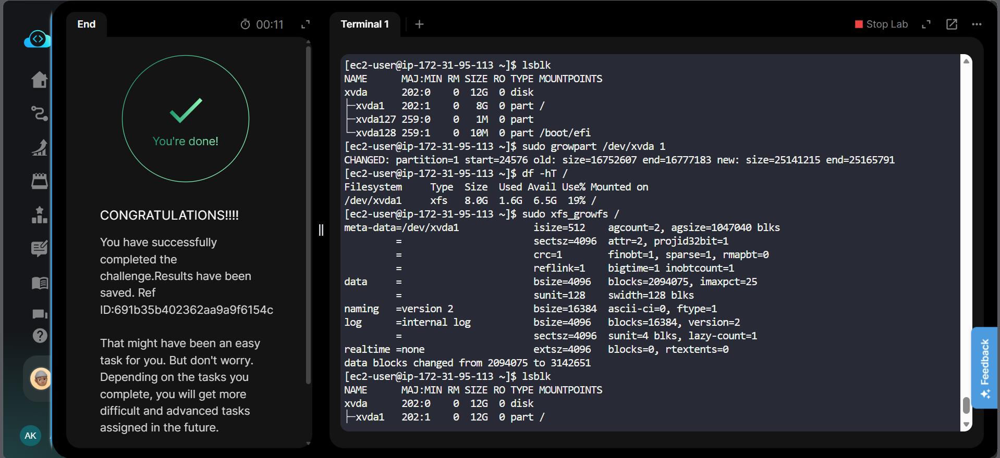

# AWS EBS Volume Expansion

## Badges


## Project Information

| Item | Details |
|---|---|
| Project | EBS Volume Expansion |
| Platform | Amazon Web Services (AWS) |
| Region | `us-east-1` |
| EC2 Instance | `devops-ec2` |
| Instance ID | `i-0a76811ceb761a8f9` |
| Root Device | `/dev/xvda` |
| EBS Volume | `vol-0d334880d52bf4593` |
| Volume Type | `gp3` |
| Original Size | `8 GiB` |
| Target Size | `12 GiB` |
| Root Partition | `/dev/xvda1` |
| Filesystem | `XFS` |
| Final Root Size | `12 GiB` |
| Status | Completed |

## Overview

This project demonstrates how to expand an existing Amazon EBS root volume attached to an EC2 instance without stopping the running workload.

The storage was increased from **8 GiB to 12 GiB** at the AWS EBS layer, then the Linux root partition and XFS filesystem were expanded so the operating system could immediately use the additional capacity.

## Objective

- Identify the root EBS volume attached to `devops-ec2`.
- Increase the EBS volume from `8 GiB` to `12 GiB`.
- Extend the root partition to consume the new space.
- Expand the XFS filesystem.
- Verify that `/` reflects the new `12 GiB` capacity.
- Perform the change without stopping the EC2 instance.

## Skills Demonstrated

- Amazon EBS volume management
- EC2 root-volume identification
- Online EBS volume modification
- Linux partition expansion
- `growpart`
- XFS filesystem expansion
- `xfs_growfs`
- `lsblk`
- `df -hT`
- AWS CLI
- EC2 Instance Connect / SSH troubleshooting

## AWS Services Used

- **Amazon EC2** — compute instance hosting the root filesystem
- **Amazon EBS** — persistent block storage attached to the EC2 instance
- **EC2 Instance Connect** — temporary SSH public-key injection used during troubleshooting/access

## Architecture Diagram



## Implementation Steps

### 1. Identified the EC2 Instance and Root Volume

The `devops-ec2` instance was located and its root device mapping was inspected.

- Root device: `/dev/xvda`
- EBS volume: `vol-0d334880d52bf4593`
- Initial size: `8 GiB`
- Volume type: `gp3`
- State: `in-use`

### 2. Expanded the EBS Volume

The EBS volume was modified from:

```text
8 GiB → 12 GiB
```

The volume modification entered the `optimizing` state with a target size of `12 GiB`.

The modification was performed while the instance remained running.

### 3. Verified the Root Disk Inside Linux

After accessing the EC2 instance, `lsblk` showed:

```text
xvda   12G disk
└─xvda1  8G part /
```

This confirmed that the EBS disk had already grown to `12 GiB`, while the root partition still needed expansion.

### 4. Expanded the Root Partition

The root partition was expanded with:

```bash
sudo growpart /dev/xvda 1
```

After this step:

```text
xvda   12G disk
└─xvda1  12G part /
```

### 5. Expanded the XFS Filesystem

The filesystem was identified as XFS using:

```bash
df -hT /
```

The XFS filesystem was then expanded in place:

```bash
sudo xfs_growfs /
```

The filesystem reported that the data blocks were increased to match the expanded partition.

### 6. Final Verification

The final filesystem check showed:

```text
Filesystem     Type  Size  Used  Avail  Use%  Mounted on
/dev/xvda1     xfs   12G   1.6G  11G    13%   /
```

This confirms that the additional EBS capacity was fully available to the root filesystem.

## Commands Used

All AWS CLI and Linux commands used in this lab are documented here:

➡️ [`Commands/commands.md`](Commands/commands.md)

## Troubleshooting

### SSH key mismatch

During the lab, the AWS-registered key pair fingerprint and the initially provided private key fingerprint did not match. Normal SSH authentication therefore failed.

The instance was successfully accessed using **EC2 Instance Connect** by injecting the corresponding public key temporarily, then connecting with the `ec2-user` account.

### AWS EBS size vs Linux filesystem size

Increasing the EBS volume size does **not** automatically enlarge the Linux partition or filesystem.

The required sequence was:

```text
EBS volume
   ↓
Root partition
   ↓
Filesystem
```

For this instance:

- EBS volume: `8 → 12 GiB`
- Partition: `8 → 12 GiB`
- XFS filesystem: `8 → 12 GiB`

### Why `resize2fs` was not used

The root filesystem was **XFS**, not ext4.

Therefore:

```bash
sudo xfs_growfs /
```

was used instead of:

```bash
sudo resize2fs /dev/xvda1
```

## Key Learnings

- EBS volumes can be expanded while attached to a running EC2 instance.
- Increasing an EBS volume size is only the first part of the process.
- The root partition must be extended to consume the new disk space.
- The filesystem must also be expanded before the operating system can use the additional capacity.
- `lsblk` verifies block devices and partition sizes.
- `df -hT` verifies the mounted filesystem and filesystem type.
- `growpart` expands the partition.
- `xfs_growfs` expands an XFS filesystem online.
- The correct filesystem-specific expansion command should be selected only after identifying the filesystem type.

## Related Concepts

- Amazon EBS
- EC2 root volumes
- Online storage expansion
- Partition tables
- XFS
- Filesystem management
- Linux block devices
- EC2 Instance Connect
- AWS CLI

## Clickable Screenshots

### 1. Volume Identification

[](Screenshots/01-volume-identified.png)

### 2. EBS Volume Resized

[](Screenshots/02-volume-resized.png)

### 3. Root Partition and XFS Filesystem Expanded

[](Screenshots/03-root-partition-filesystem-expanded.png)

### 4. Task Completed

[](Screenshots/04-task-completed.png)

## Result

The `devops-ec2` root storage was successfully expanded from **8 GiB to 12 GiB**.

Final state:

```text
EBS Volume:      12 GiB
Root Partition:  12 GiB
Filesystem:      XFS
Mounted at:      /
Usable Space:    12 GiB
```

**Task Status: COMPLETED ✅**
