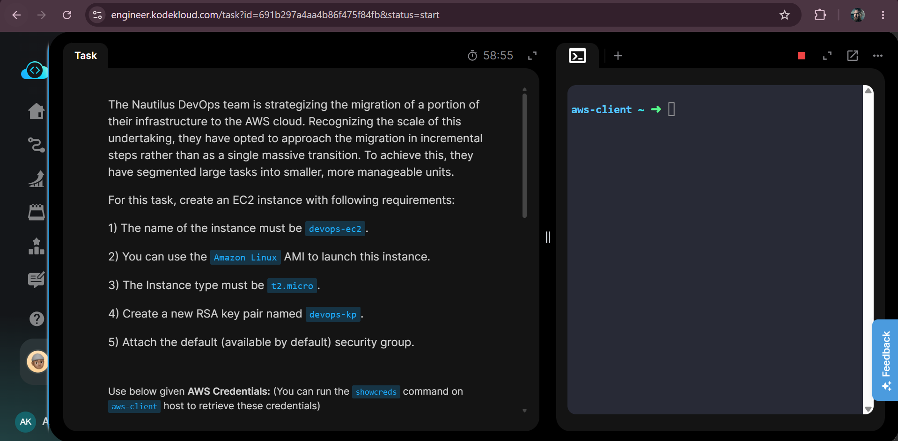
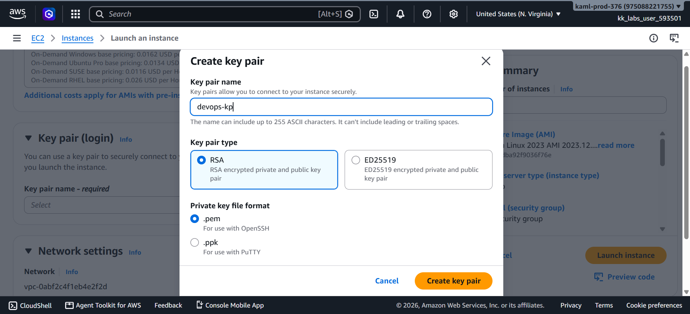
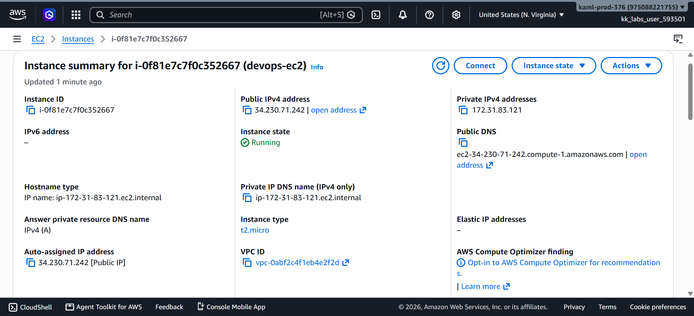
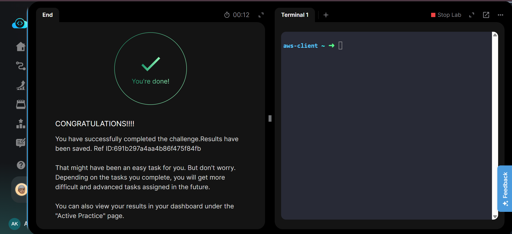

# Launch EC2 Instance


---

# 📋 Project Information

| Property | Value |
|----------|-------|
| Project Name | Launch EC2 Instance |
| Task Number | 06 |
| Cloud Platform | AWS |
| Category | Compute |
| Primary Services | Amazon EC2 |
| Difficulty | Beginner |
| Region | us-east-1 |
| Implementation | AWS Management Console |
| Completion Status | ✅ Completed |

---

# 📖 Overview

Amazon EC2 (Elastic Compute Cloud) is a scalable virtual server service provided by AWS that enables users to deploy applications quickly in the cloud.

In this lab, an Amazon Linux EC2 instance named **devops-ec2** was launched using a **t2.micro** instance type. A new RSA key pair named **devops-kp** was created for secure SSH authentication, and the default security group was attached to allow the instance to operate with the default network security configuration.

---

# 🎯 Objective

- Launch an EC2 instance.
- Use Amazon Linux AMI.
- Create a new RSA key pair.
- Attach the default security group.
- Verify that the instance reaches the Running state.

---

# 🚀 Skills Demonstrated

- Amazon EC2
- Amazon Linux AMI
- EC2 Instance Launch
- SSH Key Pair Creation
- Security Groups
- AWS Console Navigation
- Basic Cloud Compute Deployment

---

# ☁️ AWS Services Used

- Amazon EC2
- EC2 Key Pairs
- Security Groups
- Amazon VPC (Default)

---

# 🏗️ Architecture Diagram

```text
            Internet
                │
                │
        Default Security Group
                │
        ┌─────────────────┐
        │   EC2 Instance  │
        │   devops-ec2    │
        │ Amazon Linux    │
        └─────────────────┘
                │
          RSA Key Pair
          (devops-kp)
```

---

# 📝 Implementation Steps

1. Opened the AWS Management Console.
2. Selected the **us-east-1** region.
3. Started the Launch Instance wizard.
4. Entered **devops-ec2** as the instance name.
5. Selected the Amazon Linux AMI.
6. Selected **t2.micro** as the instance type.
7. Created a new RSA key pair named **devops-kp**.
8. Attached the default security group.
9. Launched the EC2 instance.
10. Verified that the instance entered the Running state.

---

# 💻 Commands Used

See:

`Commands/commands.md`

---

# ⚠️ Troubleshooting

No issues were encountered during implementation.

---

# 📚 Key Learnings

- Learned how to launch an EC2 instance.
- Understood the purpose of Amazon Linux AMIs.
- Learned how RSA key pairs provide secure SSH authentication.
- Understood the purpose of security groups.
- Learned how to verify instance status.
- Identified the relationship between EC2 and the default VPC.
- Learned basic AWS compute deployment workflow.
- Understood how instance types affect compute resources.

---

# 🔗 Related Concepts

- Amazon EC2
- Amazon Linux
- VPC
- Security Groups
- SSH
- Key Pair
- Elastic IP
- IAM

---

# 📸 Screenshots

## 01. Task Details

[](Screenshots/01-task-details.png)

---

## 02. RSA Key Pair Created

[](Screenshots/02-key-pair-created.png)

---

## 03. EC2 Instance Running

[](Screenshots/03-ec2-instance-running.png)

---

## 04. Task Completed

[](Screenshots/04-task-completed.png)

---

# ✅ Result

The EC2 instance **devops-ec2** was successfully launched in the **us-east-1** region using the Amazon Linux AMI and the **t2.micro** instance type. A new RSA key pair named **devops-kp** was created and associated with the instance.

The instance reached the **Running** state successfully with the default security group attached, meeting all the requirements of the task.