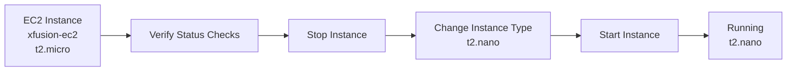
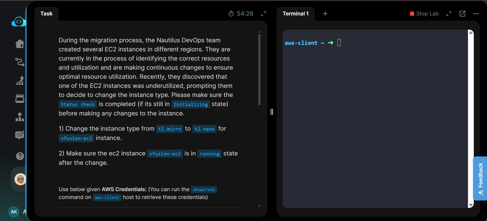
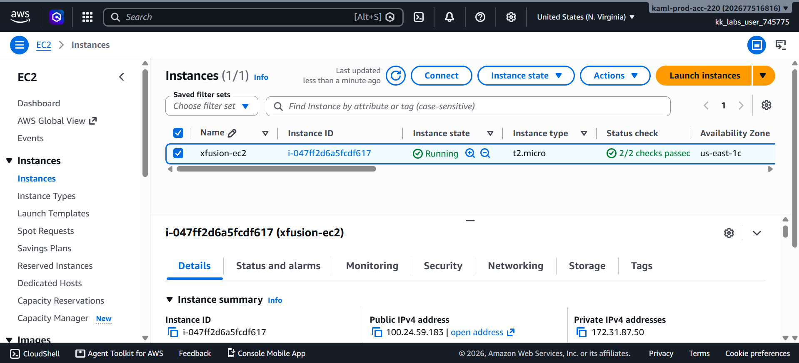
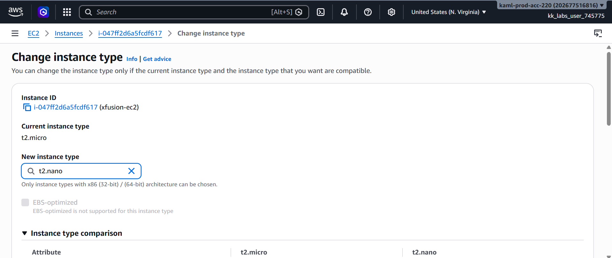
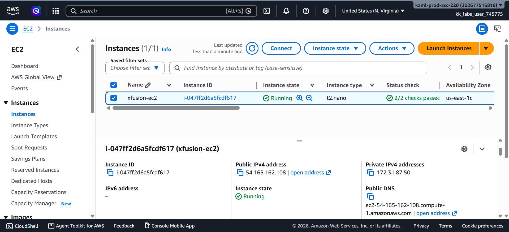
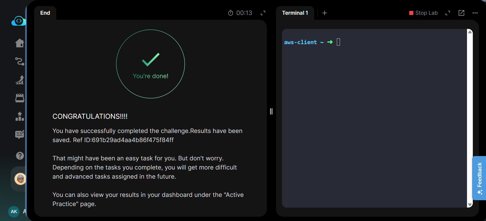

# Change EC2 Instance Type

---

# 📋 Project Information

| Property | Value |
|----------|-------|
| Project Name | Change EC2 Instance Type |
| Task Number | 07 |
| Cloud Platform | AWS |
| Category | Compute |
| Primary Services | Amazon EC2 |
| Difficulty | Beginner |
| Region | us-east-1 |
| Implementation | AWS Management Console |
| Completion Status | ✅ Completed |

---

# 📖 Overview

Amazon EC2 allows instance types to be modified after deployment, enabling organizations to optimize resource utilization and reduce infrastructure costs based on workload requirements.

In this lab, the existing EC2 instance **xfusion-ec2** was resized from **t2.micro** to **t2.nano**. Before making the change, the instance status checks were verified to ensure the instance was healthy. After modifying the instance type, the instance was restarted and confirmed to be running successfully.

---

# 🎯 Objective

- Verify EC2 status checks.
- Stop the EC2 instance safely.
- Change the instance type.
- Restart the instance.
- Verify the instance is running with the new instance type.

---

# 🚀 Skills Demonstrated

- Amazon EC2
- EC2 Instance Management
- Instance Type Modification
- EC2 Stop & Start Operations
- Status Check Verification
- AWS Compute Optimization
- AWS Management Console

---

# ☁️ AWS Services Used

- Amazon EC2

---

# 🏗️ Architecture Diagram

---

# 📝 Implementation Steps

1. Logged in to the AWS Management Console.
2. Selected the **us-east-1** region.
3. Opened the EC2 Instances page.
4. Verified that the instance status checks were complete.
5. Stopped the **xfusion-ec2** instance.
6. Changed the instance type from **t2.micro** to **t2.nano**.
7. Started the instance again.
8. Verified the instance was running successfully with the new instance type.
9. Confirmed task completion in KodeKloud.

---

# 💻 Commands Used

See:

`Commands/commands.md`

---

# ⚠️ Troubleshooting

No issues were encountered during implementation.

---

# 📚 Key Learnings

- Learned how to resize an EC2 instance.
- Understood why an instance must be stopped before changing its type.
- Learned to verify EC2 status checks before performing maintenance.
- Understood how AWS optimizes compute resources.
- Learned the lifecycle of an EC2 instance during maintenance.
- Verified successful instance restart after modification.
- Improved familiarity with EC2 instance management.
- Understood how different instance sizes affect cost and resource utilization.

---

# 🔗 Related Concepts

- Amazon EC2
- Instance Types
- Status Checks
- Stop & Start Instance
- Amazon Linux
- Security Groups
- Elastic IP
- AWS Cost Optimization

---

# 📸 Screenshots

## 01. Task Details

---

## 02. Status Checks Passed

---

## 03. Change Instance Type

---

## 04. Instance Running (t2.nano)

---

## 05. Task Completed

---

# ✅ Result

The EC2 instance **xfusion-ec2** was successfully resized from **t2.micro** to **t2.nano** in the **us-east-1** region. The required status checks were completed before the modification, ensuring a safe instance type change.

After restarting, the instance returned to the **Running** state with the updated configuration, successfully fulfilling all task requirements.