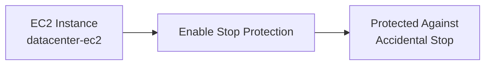

# Enable EC2 Stop Protection

---

# 📋 Project Information

| Property | Value |
|----------|-------|
| Project | Enable EC2 Stop Protection |
| Platform | AWS |
| Region | us-east-1 |
| Services | Amazon EC2 |
| Purpose | Protect an EC2 instance from accidental stop operations |

---

# 📖 Overview

Amazon EC2 provides **Stop Protection**, a safety feature that helps prevent accidental stopping of critical instances. This protection is useful for production workloads where an unexpected stop operation could lead to downtime.

In this lab, Stop Protection was enabled for the existing EC2 instance **datacenter-ec2** in the **us-east-1** region. After enabling the protection, the configuration was verified to ensure the instance was safeguarded against accidental stop actions.

---

# 🎯 Objective

- Locate the existing EC2 instance **datacenter-ec2**.
- Enable **Stop Protection**.
- Verify the configuration.
- Complete the task successfully.

---

# 🚀 Skills Demonstrated

- Amazon EC2 Administration
- EC2 Instance Protection
- AWS Management Console
- EC2 Configuration Management
- Infrastructure Protection
- AWS Compute Services

---

# ☁️ Services Used

- Amazon EC2

---

# 🏗️ Architecture Diagram

---

# 📝 Steps Performed

1. Logged in to the AWS Management Console.
2. Selected the **us-east-1** region.
3. Opened the EC2 Instances page.
4. Selected **datacenter-ec2**.
5. Opened **Actions → Instance Settings → Change Stop Protection**.
6. Enabled Stop Protection.
7. Verified the protection was enabled.
8. Confirmed successful task completion.

---

# 💻 Commands Used

See:

`Commands/commands.md`

---

# ⚠️ Troubleshooting

No issues were encountered during implementation.

---

# 🐞 Debugging Notes

- Verified the correct AWS region (**us-east-1**) before making changes.
- Confirmed the correct EC2 instance (**datacenter-ec2**) was selected.
- Verified Stop Protection after applying the configuration.

---

# 💡 Best Practices

- Enable Stop Protection for critical production EC2 instances.
- Use IAM permissions to restrict stop and terminate actions.
- Regularly review instance protection settings during infrastructure audits.

---

# 📚 Key Learnings

- Learned how Stop Protection prevents accidental instance stops.
- Understood where instance protection settings are configured.
- Learned the difference between Stop Protection and Termination Protection.
- Improved familiarity with EC2 instance management.
- Learned how AWS provides safeguards for production workloads.
- Verified infrastructure protection using the AWS Management Console.

---

# 🔗 Related Concepts

- Amazon EC2
- Stop Protection
- Termination Protection
- IAM
- Security Groups
- Amazon VPC
- EC2 Instance Lifecycle

---

# 📸 Screenshots

## 01. EC2 Instance Selected

---

## 02. Enable Stop Protection

---

## 03. Stop Protection Enabled

---

## 04. Task Completed

---

# ✅ Result

Stop Protection was successfully enabled for the **datacenter-ec2** instance in the **us-east-1** region. The configuration was verified successfully, ensuring the instance is protected from accidental stop operations and all task requirements were met.