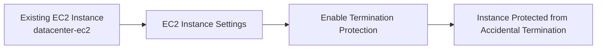
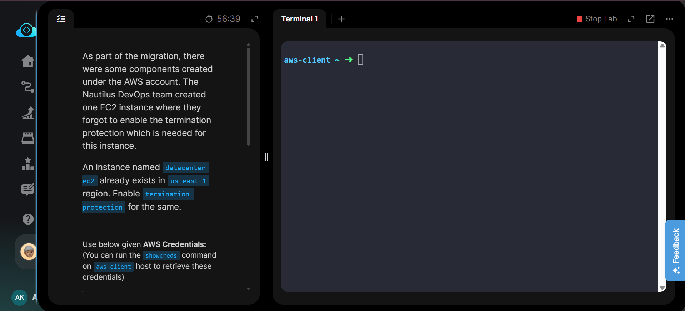
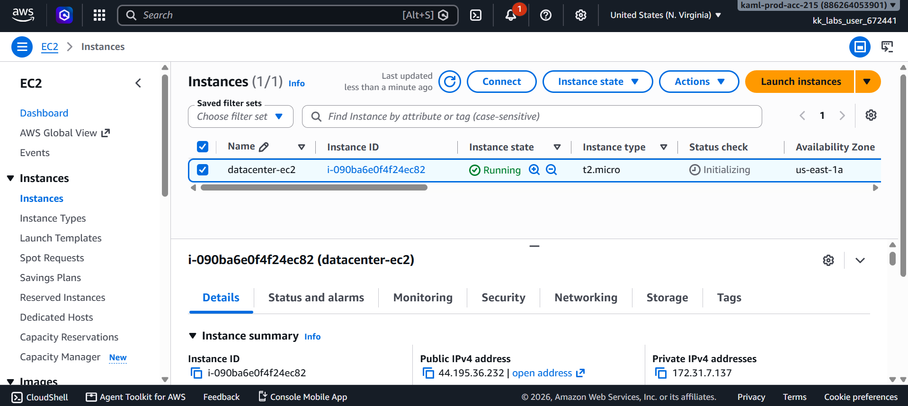
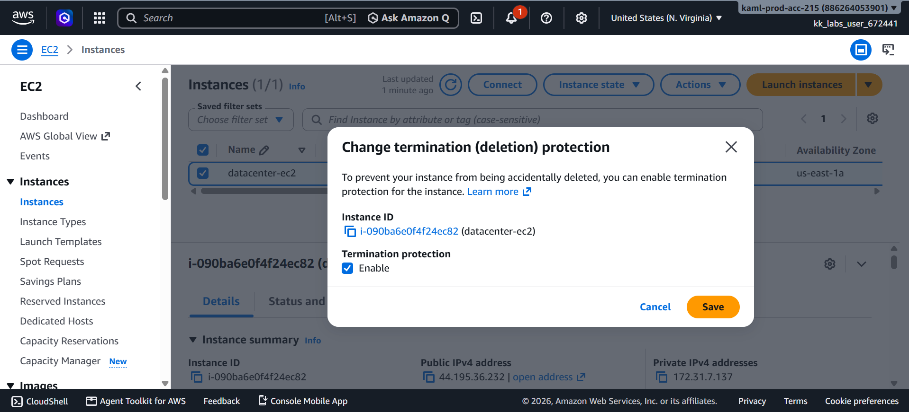
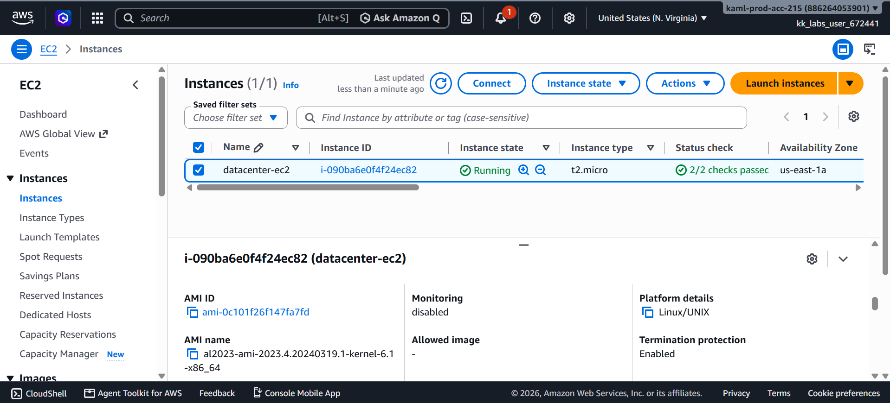
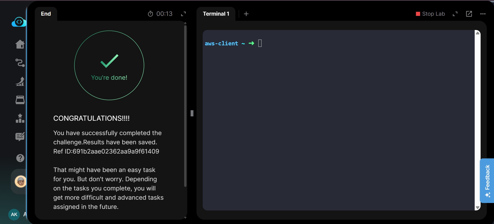

# 🛡️ Enable EC2 Termination Protection

---

# 📋 Project Information

| Property | Value |
|----------|-------|
| **Project Name** | Enable EC2 Termination Protection |
| **Task Number** | 09 |
| **Cloud Platform** | AWS |
| **Category** | Compute |
| **Primary Service** | Amazon EC2 |
| **Difficulty** | Beginner |
| **Region** | us-east-1 |
| **Implementation** | AWS Management Console |
| **Completion Status** | ✅ Completed |

---

# 📖 Overview

Amazon EC2 provides **Termination Protection** to prevent accidental deletion of critical instances. When enabled, users cannot terminate the instance until this protection is disabled.

In this lab, an existing EC2 instance named **datacenter-ec2** was identified in the **us-east-1** region, and termination protection was enabled using the AWS Management Console to safeguard the instance from accidental termination.

---

# 🎯 Objective

- Enable termination protection on an existing EC2 instance.
- Prevent accidental instance deletion.
- Verify that termination protection is successfully enabled.
- Complete the task using the AWS Management Console.

---

# 🚀 Skills Demonstrated

- Amazon EC2 Management
- EC2 Instance Protection
- AWS Console Navigation
- Instance Configuration
- Resource Verification
- Cloud Infrastructure Security

---

# ☁️ AWS Services Used

- Amazon EC2

---

# 🏗️ Architecture Diagram

---

# 📝 Steps Performed

### Step 1 — Review the Task

Reviewed the lab requirements and confirmed that the existing EC2 instance **datacenter-ec2** in the **us-east-1** region required termination protection.

📷 Screenshot: `01-task-details.png`

---

### Step 2 — Select the EC2 Instance

Opened the Amazon EC2 console, navigated to **Instances**, and selected the existing **datacenter-ec2** instance.

📷 Screenshot: `02-ec2-instance-selected.png`

---

### Step 3 — Enable Termination Protection

Navigated to:

**Actions → Instance Settings → Change Termination Protection**

Enabled **Termination Protection** and saved the configuration.

📷 Screenshot: `03-enable-termination-protection.png`

---

### Step 4 — Verify Protection Status

Verified that the instance details displayed:

**Termination Protection → Enabled**

📷 Screenshot: `04-termination-protection-enabled.png`

---

### Step 5 — Validate the Task

Ran the task validation and confirmed successful completion.

📷 Screenshot: `05-task-completed.png`

---

# 💻 Commands Used

This task was completed entirely through the **AWS Management Console**.

No AWS CLI commands were required.

For reference, see:

`Commands/commands.md`

---

# ⚠️ Troubleshooting

| Issue | Resolution |
|--------|------------|
| Instance not found | Verified the selected AWS region was **us-east-1**. |
| Option unavailable | Confirmed the EC2 instance was selected before opening **Instance Settings**. |
| Validation failed | Rechecked that termination protection was enabled before running the task validation. |

---

# 📚 Key Learnings

- Learned how to enable EC2 termination protection.
- Understood the purpose of preventing accidental instance deletion.
- Practiced modifying EC2 instance settings.
- Verified security-related instance configuration using the AWS Console.

---

# 📸 Screenshots

## 01. Task Details

---

## 02. EC2 Instance Selected

---

## 03. Enable Termination Protection

---

## 04. Termination Protection Enabled

---

## 05. Task Completed

---

# ✅ Result

Successfully enabled **Termination Protection** for the existing EC2 instance **datacenter-ec2** in the **us-east-1** region. The instance is now protected against accidental termination, and the lab validation completed successfully.