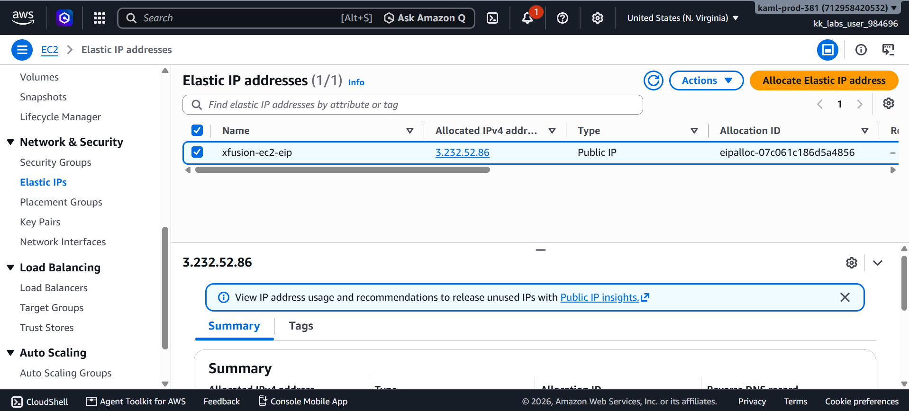
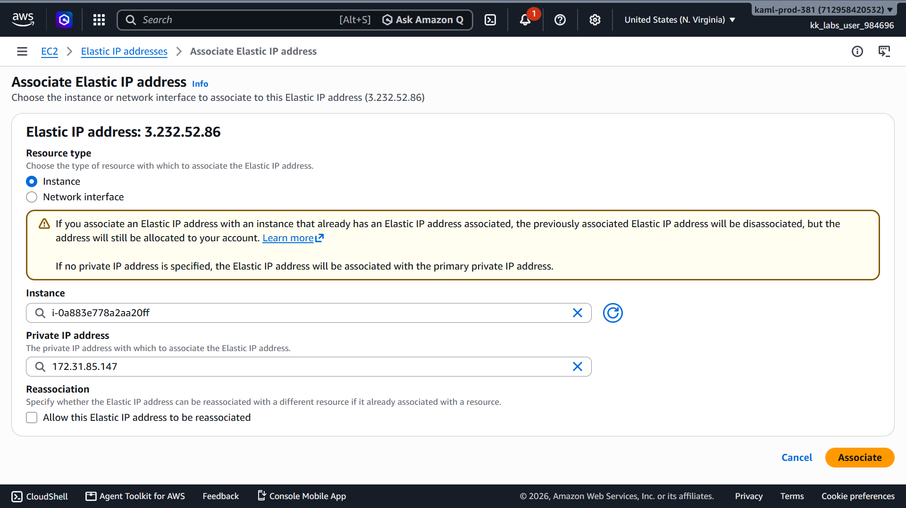
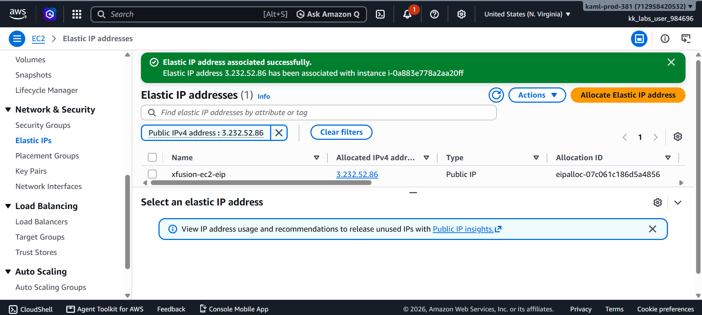
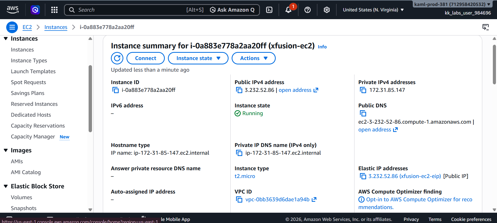
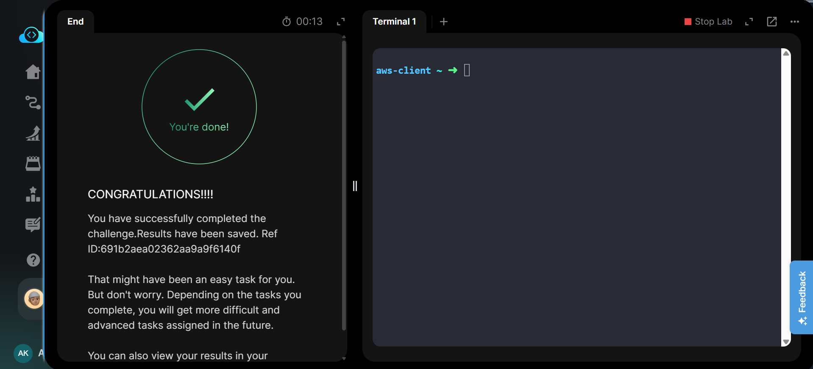

# 🌐 Attach Elastic IP to EC2 Instance

---

# 📋 Project Information

| Property | Value |
|----------|-------|
| **Project Name** | Attach Elastic IP to EC2 Instance |
| **Task Number** | 10 |
| **Cloud Platform** | AWS |
| **Category** | Networking |
| **Primary Service** | Amazon EC2 & Elastic IP |
| **Difficulty** | Beginner |
| **Region** | us-east-1 |
| **Implementation** | AWS Management Console |
| **Completion Status** | ✅ Completed |

---

# 📖 Overview

Amazon Elastic IP (EIP) is a static public IPv4 address designed for dynamic cloud computing. It provides a fixed public IP address that can be associated with an EC2 instance, ensuring consistent connectivity even if the instance is restarted.

In this lab, an existing Elastic IP named **xfusion-ec2-eip** was associated with the existing EC2 instance **xfusion-ec2** in the **us-east-1** region using the AWS Management Console.

---

# 🎯 Objective

- Attach an existing Elastic IP to an existing EC2 instance.
- Verify that the Elastic IP is successfully associated.
- Confirm the public IP appears on the EC2 instance.
- Complete the task using the AWS Management Console.

---

# 🚀 Skills Demonstrated

- Amazon EC2 Management
- Elastic IP Management
- Public IP Association
- AWS Networking
- AWS Console Navigation
- Resource Verification

---

# ☁️ AWS Services Used

- Amazon EC2
- Amazon Elastic IP

---

# 🏗️ Architecture Diagram

---

# 📝 Steps Performed

### Step 1 — Open Elastic IP Addresses

Opened the Amazon EC2 console and navigated to **Network & Security → Elastic IPs**.

---

### Step 2 — Select the Existing Elastic IP

Selected the existing Elastic IP **xfusion-ec2-eip** that needed to be attached.

---

### Step 3 — Associate the Elastic IP

Clicked **Actions → Associate Elastic IP address**, selected the **xfusion-ec2** instance, kept the default private IP address, and associated the Elastic IP.

---

### Step 4 — Verify the Association

Verified that the Elastic IP was successfully associated and appeared as the public IPv4 address of the EC2 instance.

---

### Step 5 — Validate the Task

Ran the lab validation and confirmed successful completion.

---

# 💻 Commands Used

This task was completed entirely through the **AWS Management Console**.

No AWS CLI commands were required.

For reference, see:

`Commands/commands.md`

---

# ⚠️ Troubleshooting

| Issue | Resolution |
|--------|------------|
| Elastic IP not visible | Confirmed the correct AWS region (**us-east-1**) was selected. |
| Unable to associate Elastic IP | Verified the correct EC2 instance was selected. |
| Validation failed | Confirmed the Elastic IP was successfully attached before validating the task. |

---

# 🐞 Debugging Notes

- Verified that the Elastic IP existed before attempting the association.
- Confirmed the correct EC2 instance (**xfusion-ec2**) was selected.
- Verified the public IPv4 address after the association.

---

# ✅ Best Practices

- Use Elastic IPs only when a static public IP is required.
- Release unused Elastic IPs to avoid unnecessary AWS charges.
- Verify the Elastic IP association after configuration changes.

---

# 📚 Key Learnings

- Learned how to associate an Elastic IP with an EC2 instance.
- Understood the purpose of Elastic IP addresses.
- Verified public IP assignment using the EC2 console.
- Practiced basic AWS networking operations.

---

# 🔗 Related Concepts

- Public IPv4 Address
- Private IPv4 Address
- Elastic Network Interface (ENI)
- Amazon EC2 Networking
- Static IP Address

---

# 📸 Screenshots

## 01. Elastic IP Selected

---

## 02. Associate Elastic IP

---

## 03. Elastic IP Associated

---

## 04. EC2 Instance with Elastic IP

---

## 05. Task Completed

---

# ✅ Result

Successfully associated the existing **xfusion-ec2-eip** Elastic IP with the **xfusion-ec2** EC2 instance in the **us-east-1** region. The instance now has a static public IPv4 address, and the task validation completed successfully.