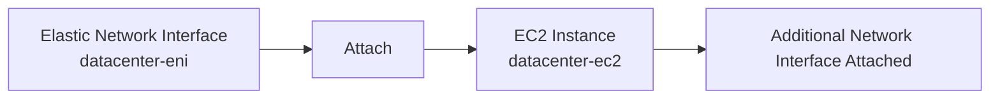
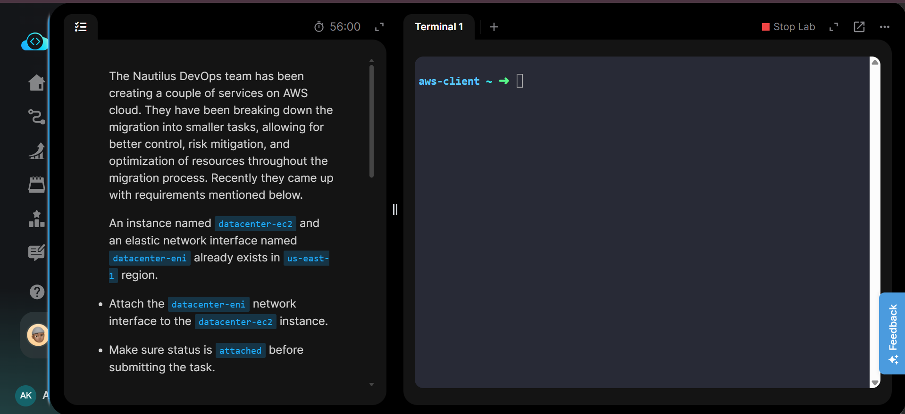
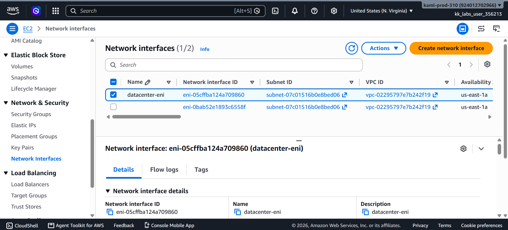
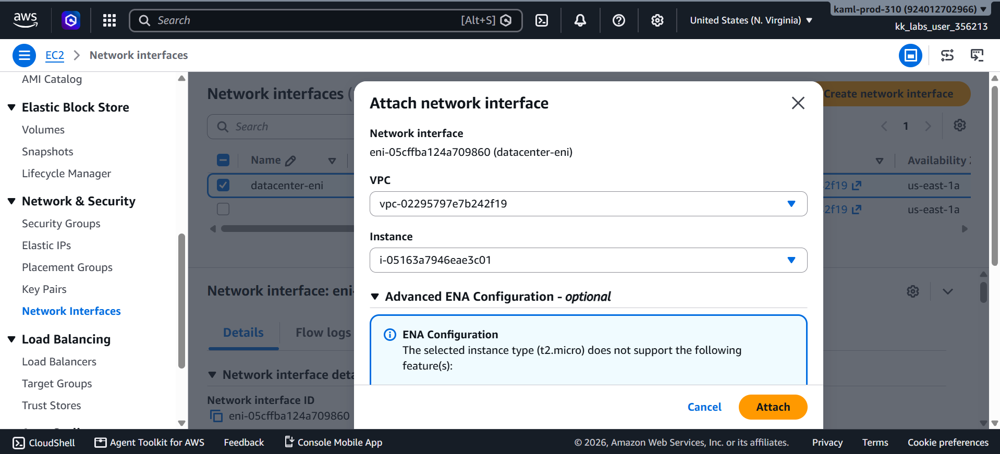
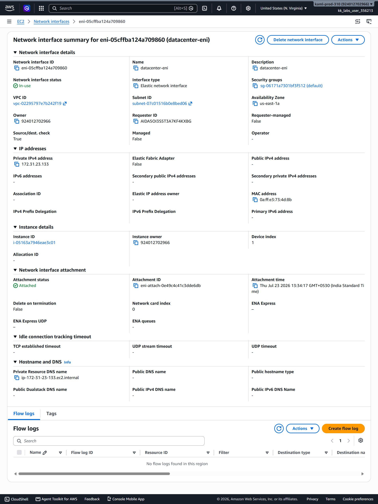
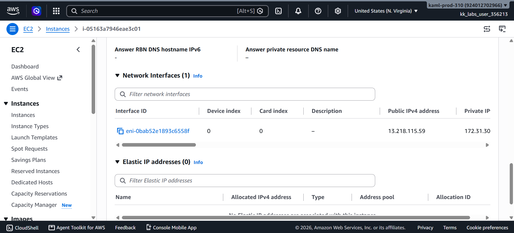
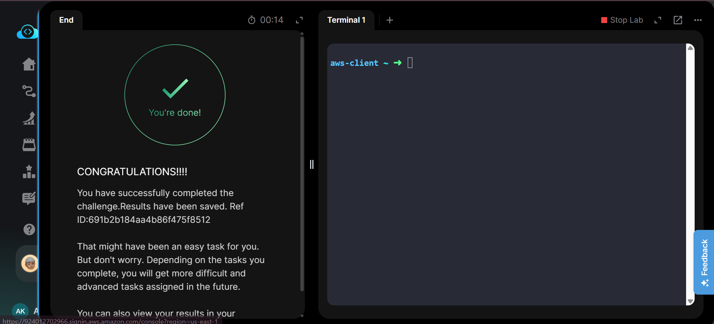

# 🔌 Attach Elastic Network Interface to EC2 Instance

---

# 📋 Project Information

| Property | Value |
|----------|-------|
| **Project Name** | Attach Elastic Network Interface to EC2 Instance |
| **Task Number** | 11 |
| **Cloud Platform** | AWS |
| **Category** | Networking |
| **Primary Service** | Amazon EC2 & Elastic Network Interface (ENI) |
| **Difficulty** | Beginner |
| **Region** | us-east-1 |
| **Implementation** | AWS Management Console |
| **Completion Status** | ✅ Completed |

---

# 📖 Overview

An Elastic Network Interface (ENI) is a virtual network card that can be attached to an Amazon EC2 instance. It provides flexible networking capabilities such as additional private IP addresses, security groups, and network interfaces without replacing the primary network interface.

In this lab, an existing Elastic Network Interface named **datacenter-eni** was attached to the existing EC2 instance **datacenter-ec2** in the **us-east-1** region. After the attachment, the interface status was verified to ensure it was successfully attached before validating the task.

---

# 🎯 Objective

- Attach an existing Elastic Network Interface to an existing EC2 instance.
- Verify that the attachment status is **Attached**.
- Ensure the network interface is in use before task validation.
- Complete the task using the AWS Management Console.

---

# 🚀 Skills Demonstrated

- Amazon EC2 Management
- Elastic Network Interface (ENI)
- AWS Networking
- AWS Console Navigation
- Resource Verification
- Network Interface Attachment

---

# ☁️ AWS Services Used

- Amazon EC2
- Elastic Network Interface (ENI)

---

# 🏗️ Architecture Diagram

---

# 📝 Steps Performed

### Step 1 — Open Network Interfaces

Opened the Amazon EC2 console and navigated to **Network Interfaces**.

---

### Step 2 — Select the Existing Network Interface

Selected the existing network interface **datacenter-eni**.

---

### Step 3 — Attach the Network Interface

Clicked **Actions → Attach**, selected the **datacenter-ec2** instance, and attached the network interface.

---

### Step 4 — Verify the Attachment

Verified that the network interface status changed to **In-use** and the attachment status was **Attached**.

---

### Step 5 — Verify from the EC2 Instance

Opened the EC2 instance details and confirmed that the attached network interface was visible under the **Network Interfaces** section.

---

### Step 6 — Validate the Task

Completed the task validation successfully.

---

# 💻 Commands Used

This task was completed entirely through the **AWS Management Console**.

No AWS CLI commands were required.

For reference, see:

`Commands/commands.md`

---

# ⚠️ Troubleshooting

| Issue | Resolution |
|--------|------------|
| Network interface not attachable | Confirmed the instance was fully initialized and running. |
| Network interface not visible | Verified the selected AWS region was **us-east-1**. |
| Validation failed | Confirmed the ENI status was **Attached** before validating the task. |

---

# 🐞 Debugging Notes

- Verified the correct ENI (**datacenter-eni**) before attachment.
- Confirmed the attachment status changed to **Attached**.
- Verified the ENI appeared under the EC2 instance's network interfaces.

---

# ✅ Best Practices

- Attach additional ENIs only when multiple network interfaces are required.
- Verify ENI attachment before making application-level network changes.
- Use meaningful names for network interfaces to simplify management.

---

# 📚 Key Learnings

- Learned how to attach an Elastic Network Interface to an EC2 instance.
- Understood the purpose of secondary network interfaces.
- Verified ENI attachment from both the ENI and EC2 instance views.
- Practiced AWS networking resource management.

---

# 🔗 Related Concepts

- Elastic Network Interface (ENI)
- Primary Network Interface
- Secondary Network Interface
- Amazon EC2 Networking
- Security Groups

---

# 📸 Screenshots

## 01. Task Details

---

## 02. Network Interface Selected

---

## 03. Attach Network Interface

---

## 04. Network Interface Attached

---

## 05. EC2 Instance with Attached ENI

---

## 06. Task Completed

---

# ✅ Result

Successfully attached the existing **datacenter-eni** Elastic Network Interface to the **datacenter-ec2** instance in the **us-east-1** region. The attachment status was verified as **Attached**, and the lab validation completed successfully.