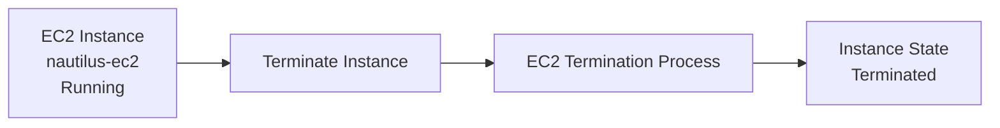
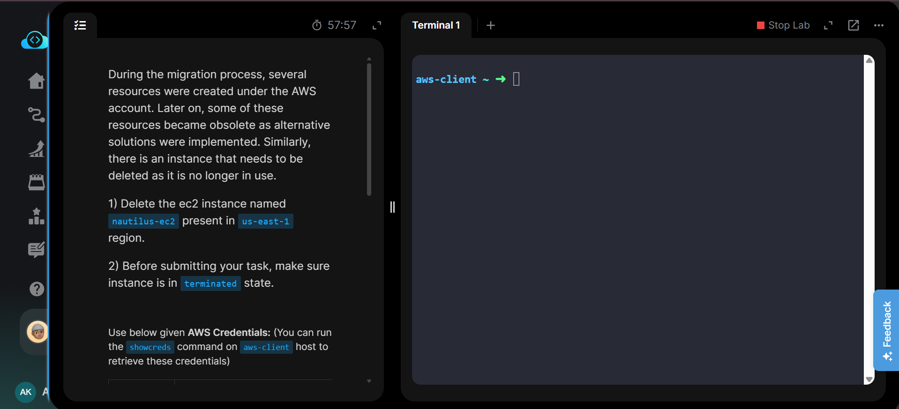
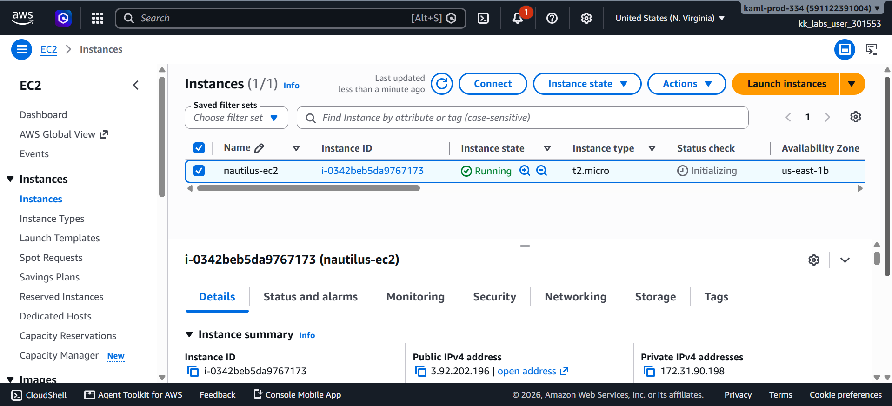
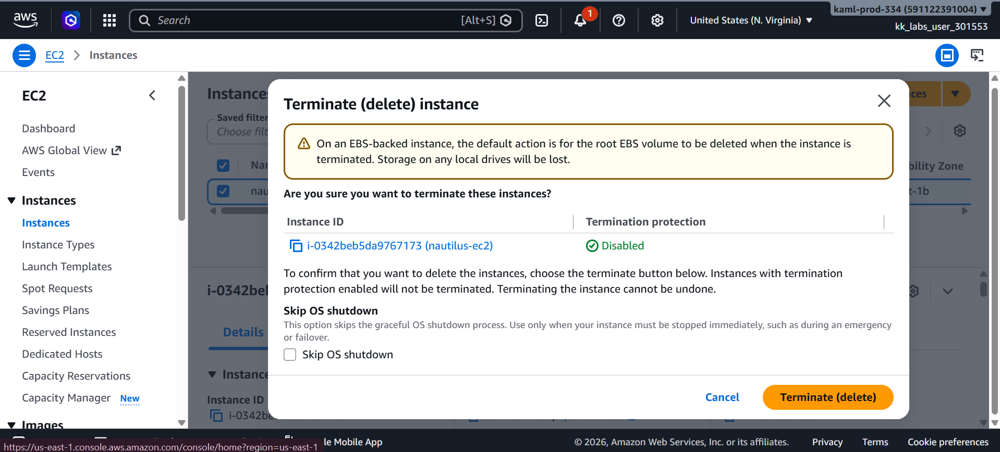
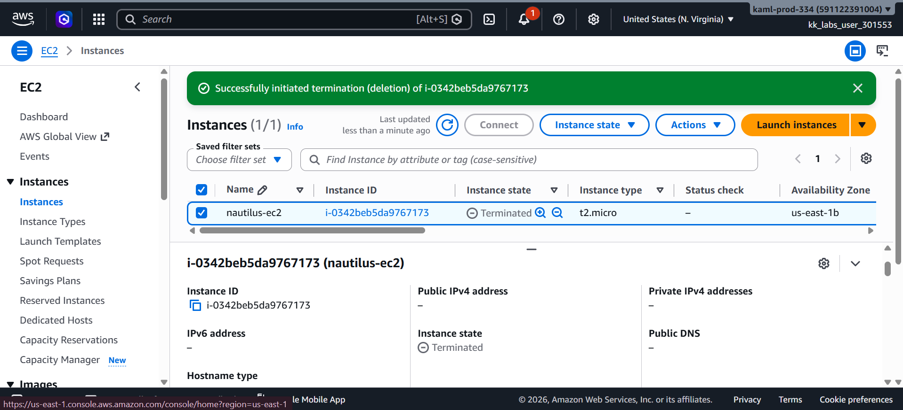
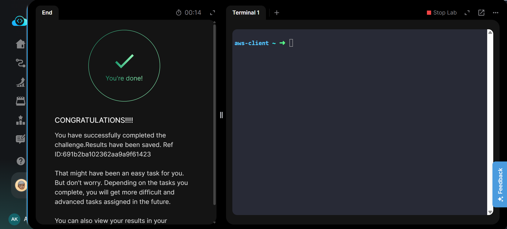

# Terminate an EC2 Instance

## Project Information

| Field | Details |
|---|---|
| Project | Terminate an EC2 Instance |
| Platform | AWS |
| Region | us-east-1 (N. Virginia) |
| Service | Amazon EC2 |
| Instance | nautilus-ec2 |
| Purpose | Remove an obsolete EC2 instance by permanently terminating it |

## Overview

This project demonstrates how to permanently terminate an existing Amazon EC2 instance using the AWS Management Console.

The `nautilus-ec2` instance was no longer required and needed to be removed from the AWS environment. The instance was selected, the termination action was confirmed, and its final state was verified as `Terminated`.

This task was performed using the AWS Management Console. Equivalent AWS CLI commands are documented in [`Commands/commands.md`](Commands/commands.md) for reference and future automation.

## Objective

The objective of this task was to:

- Locate the existing EC2 instance named `nautilus-ec2`.
- Terminate the instance in the `us-east-1` region.
- Verify that the instance reaches the `Terminated` state before completing the task.

## Skills Demonstrated

- Amazon EC2 instance management
- AWS Management Console navigation
- EC2 instance lifecycle management
- Safe resource termination
- Resource state verification
- AWS resource cleanup
- Understanding termination protection
- AWS CLI equivalent operations

## Services Used

- Amazon EC2
- AWS Management Console
- AWS CLI (documented equivalent)

## Architecture Diagram

The existing `nautilus-ec2` instance transitioned from the `Running` state to the final `Terminated` state.

## Steps Performed

### Step 1: Review Task Requirements

Reviewed the task requirements and confirmed that the target resource was the `nautilus-ec2` instance located in the `us-east-1` region.

### Step 2: Locate the EC2 Instance

1. Opened the AWS Management Console.
2. Confirmed the selected region was **US East (N. Virginia) — us-east-1**.
3. Navigated to **EC2 → Instances**.
4. Located and selected the instance named `nautilus-ec2`.
5. Verified that the instance was in the `Running` state.

### Step 3: Initiate Instance Termination

1. With `nautilus-ec2` selected, opened **Instance state**.
2. Selected **Terminate (delete) instance**.
3. Reviewed the termination confirmation dialog.
4. Confirmed that termination protection was disabled.
5. Left **Skip OS shutdown** unchecked.
6. Clicked **Terminate (delete)**.

### Step 4: Verify Instance Termination

Waited for the EC2 lifecycle transition to complete and verified that:

- Instance name remained identifiable as `nautilus-ec2`.
- Instance state changed to `Terminated`.
- The AWS Console displayed successful initiation of the termination process.

### Step 5: Validate Task Completion

Submitted the task after confirming the required final state and verified successful completion through the lab environment.

## Commands Used

The task was completed using the **AWS Management Console**.

Equivalent AWS CLI commands for locating, terminating, and verifying the EC2 instance are available here:

[`Commands/commands.md`](Commands/commands.md)

## Troubleshooting

### Instance cannot be terminated

If termination fails, check whether **termination protection** is enabled.

An EC2 instance with termination protection enabled cannot be terminated until the protection setting is disabled.

### Instance remains in `shutting-down`

Termination is not always instantaneous. The instance may temporarily remain in the `shutting-down` state before reaching `terminated`.

Wait for the lifecycle transition to complete before validating the task.

### Wrong instance selected

Always verify the instance name and Instance ID before performing a destructive operation such as termination.

## Debugging Notes

- Confirmed that the AWS region was `us-east-1`.
- Verified the target instance name before termination.
- Confirmed termination protection was disabled.
- Did not enable **Skip OS shutdown**.
- Waited until the final instance state displayed `Terminated`.
- Verified successful completion before ending the lab.

## Best Practices

- Verify the instance name and ID before termination.
- Check whether important data exists on attached storage before deleting resources.
- Create an AMI or EBS snapshot before termination when recovery may be required.
- Understand the `DeleteOnTermination` configuration of attached EBS volumes.
- Use termination protection for production or critical EC2 instances.
- Apply least-privilege IAM permissions for destructive operations.
- Verify resource state after performing lifecycle operations.

## Key Learnings

- EC2 termination permanently removes an instance.
- EC2 instances transition through lifecycle states during termination.
- Termination protection can prevent accidental deletion.
- EBS-backed root volumes may be configured for automatic deletion when an instance is terminated.
- Resource cleanup helps prevent unnecessary cloud resource usage and cost.
- Destructive operations should always be verified before confirmation.

## Related Concepts

- EC2 Instance Lifecycle
- EC2 Instance States
- EC2 Termination Protection
- Amazon EBS
- DeleteOnTermination
- AMI Backups
- EBS Snapshots
- AWS Resource Cleanup
- AWS CLI EC2 Commands

## Screenshots

### 1. Task Requirements

Original task requiring the `nautilus-ec2` instance to be terminated in `us-east-1`.

### 2. EC2 Instance Selected

The running `nautilus-ec2` instance was located and selected in the EC2 console.

### 3. Termination Confirmation

AWS termination confirmation screen showing the target instance and disabled termination protection.

### 4. Instance Terminated

The `nautilus-ec2` instance successfully reached the `Terminated` state.

### 5. Task Completed

Successful completion of the lab task.

## Result

The `nautilus-ec2` EC2 instance in the `us-east-1` region was successfully terminated.

The final instance state was verified as **Terminated**, satisfying the task requirements.