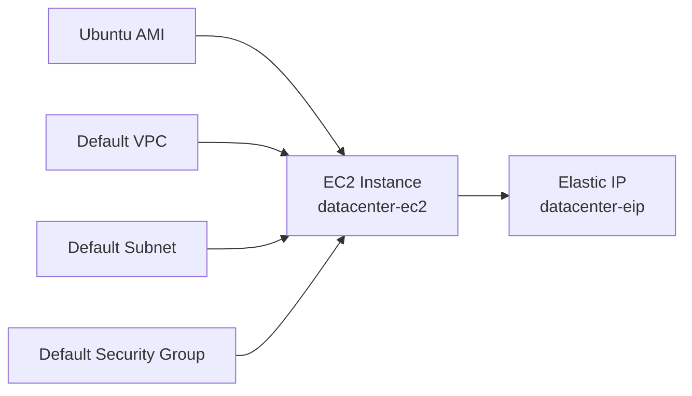
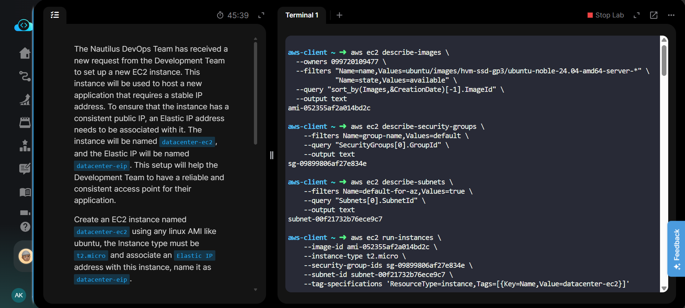
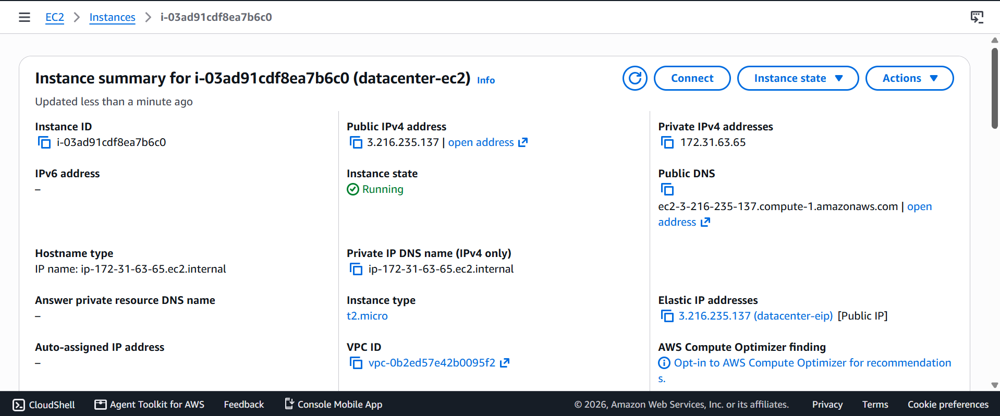
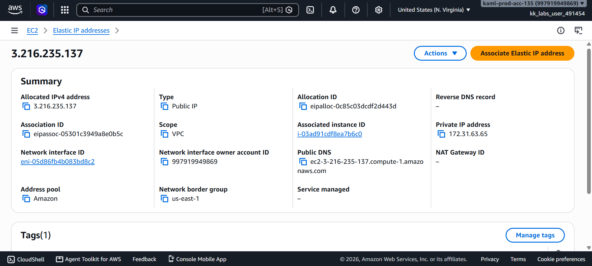
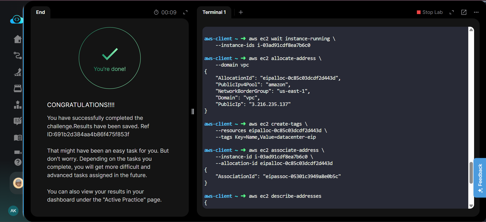

# Attach Elastic IP to EC2 Instance

---

## Project Information

| Property | Value |
|----------|-------|
| **Project** | Attach Elastic IP to EC2 Instance |
| **Platform** | AWS |
| **Region** | us-east-1 |
| **Services Used** | Amazon EC2, Elastic IP |
| **CLI Used** | AWS CLI |
| **Purpose** | Launch an EC2 instance and associate a static public IP using an Elastic IP |

---

# Overview

This project demonstrates how to launch an Amazon EC2 instance using the AWS CLI and assign a static public IP address by associating an Elastic IP.

An Ubuntu Linux EC2 instance named **datacenter-ec2** was created using the **t2.micro** instance type. After the instance reached the **Running** state, an Elastic IP named **datacenter-eip** was allocated, tagged, and associated with the instance.

The task was performed primarily using the **AWS CLI**. Equivalent CLI commands are provided in **Commands/commands.md**.

---

# Objective

- Launch an EC2 instance.
- Use any Linux AMI (Ubuntu used).
- Instance type must be **t2.micro**.
- Name the instance **datacenter-ec2**.
- Allocate an Elastic IP.
- Name the Elastic IP **datacenter-eip**.
- Associate the Elastic IP with the EC2 instance.

---

# Skills Demonstrated

- Launching EC2 instances using AWS CLI
- Working with Ubuntu AMIs
- Discovering default networking resources
- Allocating Elastic IPs
- Tagging AWS resources
- Associating Elastic IP with EC2
- Verifying AWS resources using CLI

---

# Services Used

- Amazon EC2
- Elastic IP
- AWS CLI

---

# Architecture Diagram

---

# Steps Performed

1. Retrieved the latest Ubuntu Linux AMI ID.
2. Retrieved the default Security Group.
3. Retrieved the default Subnet.
4. Launched an EC2 instance named **datacenter-ec2**.
5. Waited until the instance reached the **Running** state.
6. Allocated an Elastic IP.
7. Tagged the Elastic IP as **datacenter-eip**.
8. Associated the Elastic IP with the EC2 instance.
9. Verified the association.

---

# Commands Used

The task was completed using the **AWS CLI**.

See:

**Commands/commands.md**

---

# Troubleshooting

- Incorrect Ubuntu AMI selected.
- Wrong subnet or security group.
- Attempting to associate an Elastic IP before the instance reached the Running state.
- Using the Public IP instead of the Allocation ID.

---

# Debugging Notes

- Used `describe-images` to retrieve the latest Ubuntu AMI.
- Used default networking resources.
- Waited for the EC2 instance to become available before associating the Elastic IP.
- Tagged the Elastic IP immediately after allocation.

---

# Best Practices

- Tag all AWS resources.
- Prefer automation using AWS CLI.
- Wait for resource readiness before dependent operations.
- Use Elastic IP only when a static public IP is required.

---

# Key Learnings

- Difference between Public IP and Elastic IP.
- Elastic IP remains allocated until released.
- EC2 launch requires an AMI, subnet, and security group.
- AWS CLI simplifies infrastructure automation.

---

# Related Concepts

- Amazon EC2
- Elastic IP
- VPC
- Subnet
- Security Groups
- Ubuntu AMI
- Resource Tagging

---

# Screenshots

| Preview | Description |
|---------|-------------|
|  | Task requirements |
|  | EC2 instance with associated Elastic IP |
|  | Elastic IP details |
|  | Task completed successfully |

---

# Result

Successfully launched the EC2 instance **datacenter-ec2** and associated the Elastic IP **datacenter-eip** using the AWS CLI. The instance now has a persistent public IP address for reliable access.