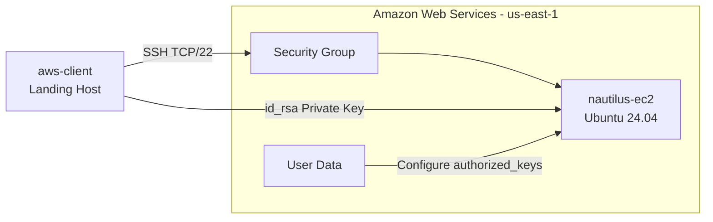
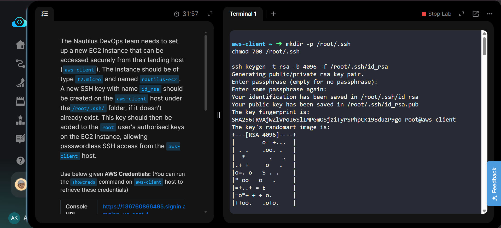
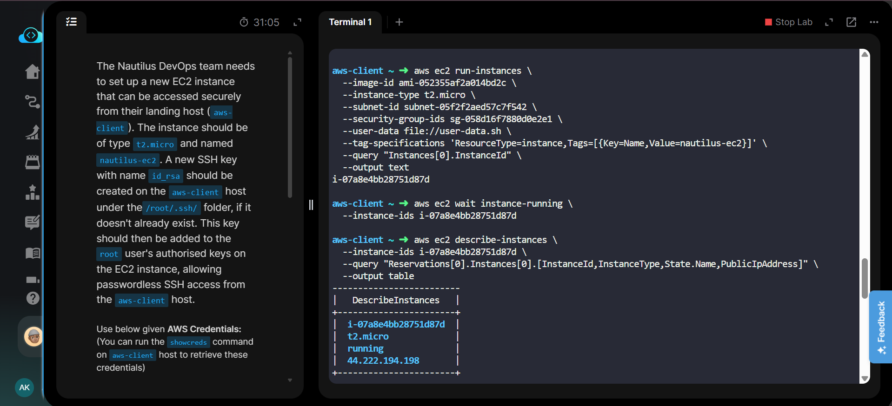
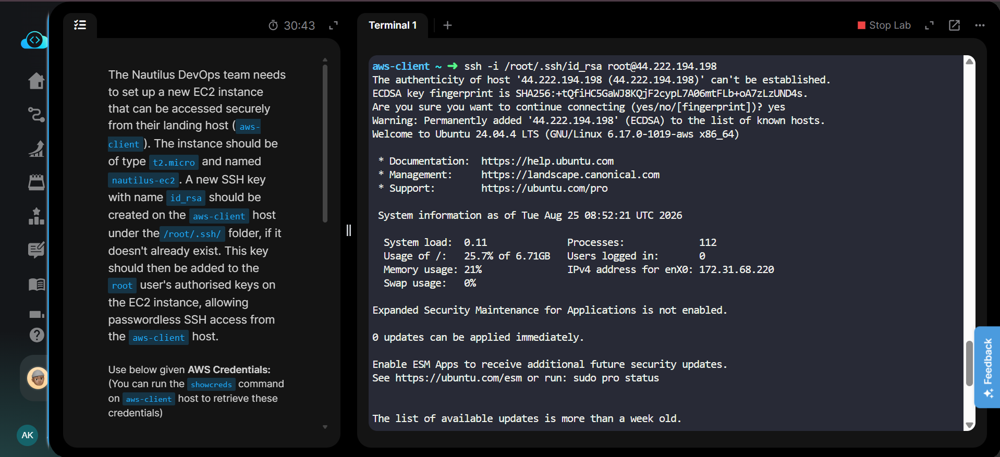
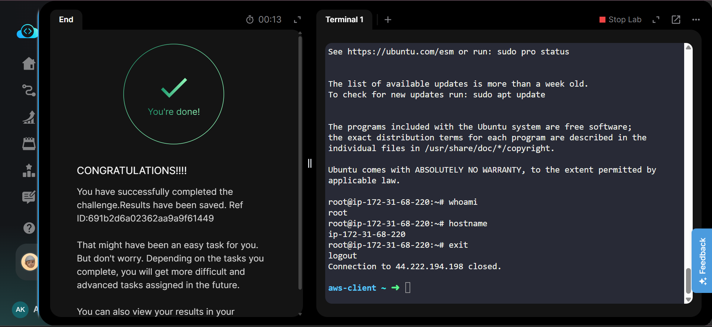

````
# Task 22 — Create EC2 Instance with SSH Root Access


## Project Information

| Field | Details |
|---|---|
| Project Name | Create EC2 Instance with SSH Root Access |
| Task Number | 22 |
| Cloud Platform | AWS |
| Category | Compute / EC2 / SSH |
| Primary Services | Amazon EC2, Security Groups |
| Instance Name | `nautilus-ec2` |
| Instance Type | `t2.micro` |
| Operating System | Ubuntu 24.04 LTS |
| SSH Key | `id_rsa` |
| SSH Key Location | `/root/.ssh/id_rsa` |
| SSH User | `root` |
| Region | `us-east-1` |
| Implementation | AWS CLI + SSH |
| Access Method | Passwordless SSH from `aws-client` |

---

## Overview

The Nautilus DevOps team required a new EC2 instance that could be securely accessed from the `aws-client` landing host.

The requirement was to:

- Create an EC2 instance named `nautilus-ec2`.
- Use instance type `t2.micro`.
- Create or use an SSH key named `id_rsa` on the `aws-client` host.
- Store the SSH key under `/root/.ssh/`.
- Configure the EC2 instance to allow the `root` user to authenticate using the public key.
- Allow SSH access from the `aws-client` host.
- Verify passwordless SSH connectivity.

The implementation was performed primarily using AWS CLI, with the AWS Console used only for final verification.

---

## Objective

The objective of this task was to deploy a Linux EC2 instance and establish secure passwordless SSH access from the `aws-client` host using an RSA SSH key.

---

## Skills Demonstrated

- Amazon EC2 provisioning
- AWS CLI
- AMI discovery
- VPC and subnet discovery
- Security Group configuration
- SSH key generation
- RSA key-pair management
- EC2 User Data
- Linux file permissions
- Root SSH authentication
- SSH connectivity testing
- AWS resource tagging
- CLI-based infrastructure deployment
- Basic AWS troubleshooting

---

## Services Used

- Amazon EC2
- Amazon VPC
- EC2 Security Groups
- AWS CLI
- OpenSSH
- Ubuntu Linux

---

## Architecture Diagram



---

## Steps Performed

### 1. Verified the SSH Key

Checked whether the required SSH key already existed on the `aws-client` host.

```bash
cat /root/.ssh/id_rsa.pub
```

The existing RSA public key was available and was used for SSH authentication.

---

### 2. Generated the SSH Key if Required

If the key does not already exist, it can be created using:

```bash
mkdir -p /root/.ssh
chmod 700 /root/.ssh

ssh-keygen -t rsa -b 4096 -f /root/.ssh/id_rsa
```

The generated files are:

```text
/root/.ssh/id_rsa
/root/.ssh/id_rsa.pub
```

The private key remains on the `aws-client` host, while the public key is configured on the EC2 instance.

---

### 3. Discovered the Latest Ubuntu AMI

The latest available Ubuntu 24.04 LTS AMI was identified using AWS CLI.

```bash
aws ec2 describe-images \
  --owners 099720109477 \
  --filters \
    "Name=name,Values=ubuntu/images/hvm-ssd-gp3/ubuntu-noble-24.04-amd64-server-*" \
    "Name=state,Values=available" \
  --query "sort_by(Images,&CreationDate)[-1].ImageId" \
  --output text
```

AMI used:

```text
ami-052355af2a014bd2c
```

---

### 4. Discovered the Default VPC

```bash
aws ec2 describe-vpcs \
  --filters Name=is-default,Values=true \
  --query "Vpcs[0].VpcId" \
  --output text
```

---

### 5. Discovered the Default Subnet

```bash
aws ec2 describe-subnets \
  --filters Name=default-for-az,Values=true \
  --query "Subnets[0].SubnetId" \
  --output text
```

Subnet used:

```text
subnet-05f2f2aed57c7f542
```

---

### 6. Configured SSH Access

The public IP address of the `aws-client` host was obtained:

```bash
curl -s https://checkip.amazonaws.com
```

SSH access was then restricted to the `aws-client` public IP:

```bash
aws ec2 authorize-security-group-ingress \
  --group-id sg-058d16f7880d0e2e1 \
  --protocol tcp \
  --port 22 \
  --cidr 65.108.255.62/32
```

The Security Group configuration was verified using:

```bash
aws ec2 describe-security-groups \
  --group-ids sg-058d16f7880d0e2e1 \
  --query "SecurityGroups[0].IpPermissions"
```

---

### 7. Configured EC2 User Data

A User Data script was used during instance creation to configure the SSH public key for the `root` user.

The public key was added to:

```text
/root/.ssh/authorized_keys
```

The required SSH directory and file permissions were also configured.

This allowed the `root` user to authenticate using the private key stored on the `aws-client` host.

---

### 8. Created the EC2 Instance

The EC2 instance was created using AWS CLI.

```bash
aws ec2 run-instances \
  --image-id ami-052355af2a014bd2c \
  --instance-type t2.micro \
  --subnet-id subnet-05f2f2aed57c7f542 \
  --security-group-ids sg-058d16f7880d0e2e1 \
  --user-data file://user-data.sh \
  --tag-specifications 'ResourceType=instance,Tags=[{Key=Name,Value=nautilus-ec2}]' \
  --query "Instances[0].InstanceId" \
  --output text
```

Instance created:

```text
i-07a8e4bb28751d87d
```

---

### 9. Waited for the Instance

```bash
aws ec2 wait instance-running \
  --instance-ids i-07a8e4bb28751d87d
```

---

### 10. Verified the EC2 Instance

```bash
aws ec2 describe-instances \
  --instance-ids i-07a8e4bb28751d87d \
  --query "Reservations[0].Instances[0].[InstanceId,InstanceType,State.Name,PublicIpAddress]" \
  --output table
```

Result:

```text
Instance ID    : i-07a8e4bb28751d87d
Instance Type  : t2.micro
State          : running
Public IP      : 44.222.194.198
```

---

### 11. Tested Passwordless SSH Access

Connected from the `aws-client` host using the private key:

```bash
ssh -i /root/.ssh/id_rsa root@44.222.194.198
```

After connecting, the login was verified:

```bash
whoami
hostname
```

Output confirmed:

```text
root
ip-172-31-68-220
```

This confirmed successful passwordless SSH access as the `root` user.

---

## Commands Used

All commands used during this task are documented separately:

[Commands/commands.md](Commands/commands.md)

---

## Troubleshooting

### SSH Connection Refused

If SSH returns:

```text
Connection refused
```

Verify that TCP port 22 is allowed in the Security Group:

```bash
aws ec2 describe-security-groups \
  --group-ids sg-058d16f7880d0e2e1 \
  --query "SecurityGroups[0].IpPermissions"
```

---

### SSH Timeout

Check:

- EC2 instance is running.
- EC2 instance has a public IP.
- Security Group allows TCP/22.
- The source IP matches the current public IP of `aws-client`.
- The subnet provides internet connectivity.

---

### Permission Denied

Verify the SSH private key permissions:

```bash
chmod 600 /root/.ssh/id_rsa
```

On the EC2 instance, verify:

```bash
chmod 700 /root/.ssh
chmod 600 /root/.ssh/authorized_keys
```

Also verify that the correct public key exists inside:

```text
/root/.ssh/authorized_keys
```

---

## Debugging Notes

- The task required SSH access from the `aws-client` landing host.
- The existing `/root/.ssh/id_rsa` key was verified and used.
- SSH access was restricted to the `aws-client` public IP instead of allowing `0.0.0.0/0`.
- User Data was used to automate SSH key configuration during EC2 initialization.
- The EC2 instance was verified using AWS CLI.
- Actual SSH connectivity was tested from `aws-client`.
- `whoami` returning `root` confirmed that root SSH authentication was working correctly.

---

## Best Practices

- Restrict SSH access to trusted source IPs.
- Avoid allowing SSH from `0.0.0.0/0`.
- Use SSH key-based authentication instead of passwords.
- Protect private keys with appropriate permissions.
- Never commit private SSH keys to Git repositories.
- Use tags for identifying AWS resources.
- Use User Data for repeatable instance initialization.
- Use AWS CLI queries to verify deployed infrastructure.
- Follow the principle of least privilege for network access.

---

## Key Learnings

- EC2 instances can be created completely using AWS CLI.
- AMIs can be discovered dynamically using `describe-images`.
- Security Groups control network access to EC2 instances.
- SSH keys enable secure passwordless authentication.
- EC2 User Data can automate Linux instance configuration.
- SSH access can be restricted to a specific source IP.
- AWS CLI can be used to verify EC2 configuration without depending on the AWS Console.

---

## Related Concepts

- Amazon EC2
- Amazon VPC
- Security Groups
- Ubuntu Linux
- SSH
- RSA Key Pairs
- EC2 User Data
- AWS CLI
- Linux File Permissions
- Passwordless Authentication
- Network Security
- Public IP Address

---

## Screenshots

### 01 — Task Details

<a href="Screenshots/01-task-details.png">
  
</a>

### 02 — SSH Key Generation

<a href="Screenshots/02-ssh-key-generation.png">
  
</a>

### 03 — EC2 Instance Created Using AWS CLI

<a href="Screenshots/03-cli-instance-created.png">
  
</a>

### 04 — Successful Root SSH Login

<a href="Screenshots/04-ssh-root-login.png">
  
</a>

---

## Result

Successfully completed **Task 22**.

- ✅ Created EC2 instance `nautilus-ec2`
- ✅ Used Ubuntu Linux
- ✅ Used `t2.micro` instance type
- ✅ Configured SSH access from `aws-client`
- ✅ Used `/root/.ssh/id_rsa`
- ✅ Configured the root user's `authorized_keys`
- ✅ Restricted SSH access to the `aws-client` public IP
- ✅ Successfully connected using passwordless SSH
- ✅ Verified `whoami` returned `root`
- ✅ Verified the instance was running
- ✅ Completed the Nautilus DevOps challenge successfully
````
