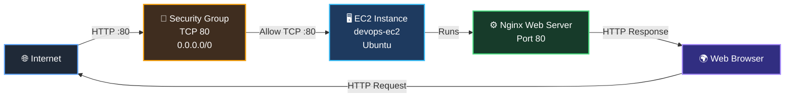
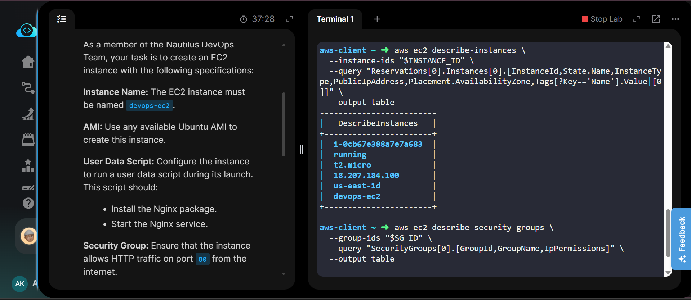
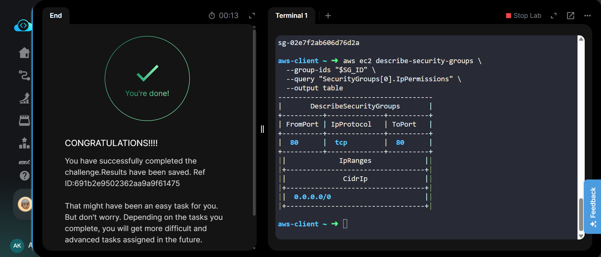
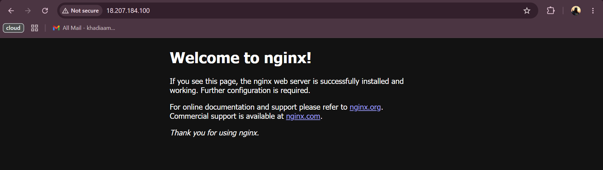
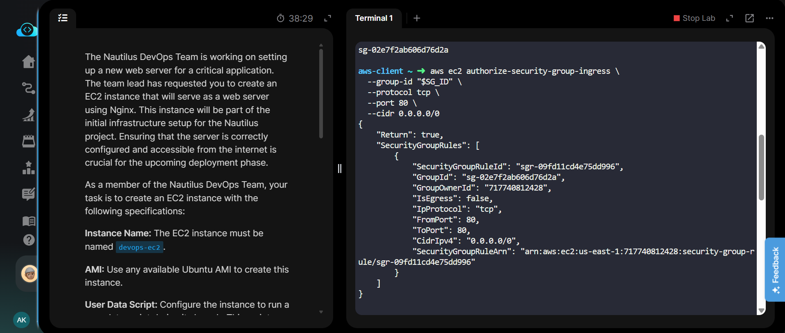

# 🚀 Create EC2 Instance with Nginx


## 📋 Project Information

| Field | Details |
|---|---|
| **Project Name** | Create EC2 Instance with Nginx |
| **Task Number** | 26 |
| **Cloud Platform** | AWS |
| **Category** | Compute / Web Server |
| **Primary Services** | Amazon EC2, Amazon VPC |
| **Difficulty** | Beginner |
| **Region** | `us-east-1` |
| **Implementation** | AWS CLI |

---

## 📖 Overview

In this task, an Ubuntu-based Amazon EC2 instance was launched to serve as a web server for the Nautilus project.

The EC2 instance was configured with a **User Data script** that automatically installed and started the **Nginx web server** during instance launch.

A dedicated Security Group was also configured to allow **HTTP traffic on port 80 from the internet**, making the Nginx web server publicly accessible.

---

## 🎯 Objective

The objectives of this task were:

- Launch an Ubuntu EC2 instance.
- Name the instance `devops-ec2`.
- Configure User Data during instance launch.
- Automatically install Nginx.
- Start the Nginx service.
- Create/configure a Security Group for HTTP traffic.
- Allow TCP port `80` from `0.0.0.0/0`.
- Verify that the Nginx web server is accessible through the instance's public IP.

---

## 🛠️ Skills Demonstrated

- Amazon EC2 instance provisioning
- AWS CLI usage
- Amazon VPC and subnet selection
- Security Group configuration
- User Data automation
- Nginx installation
- Linux web server deployment
- HTTP networking
- Public IP verification
- AWS resource validation

---

## ☁️ Services Used

- **Amazon EC2** – Compute instance hosting the Nginx web server
- **Amazon VPC** – Networking environment for the EC2 instance
- **Security Group** – Controls inbound HTTP traffic
- **Ubuntu** – Operating system for the EC2 instance
- **Nginx** – Web server installed through User Data

---

## 🏗️ Architecture Diagram



---

## 🔧 Steps Performed

### 1. Selected an Ubuntu AMI

An available Ubuntu 24.04 AMI was selected for the EC2 instance.

```text
AMI ID: ami-0d7f022123f8ff19d
```

The AMI was used as the operating system image for the web server.

---

### 2. Identified the VPC and Subnet

The default VPC and an available subnet in the `us-east-1` region were selected.

```text
VPC ID: vpc-059e02771fbd8eb09
Subnet ID: subnet-0b424752cf18e80b0
```

---

### 3. Created the Security Group

A Security Group named:

```text
devops-web-sg
```

was created for the web server.

An inbound HTTP rule was configured with:

```text
Protocol: TCP
Port: 80
Source: 0.0.0.0/0
```

This allows HTTP requests from the internet.

---

### 4. Configured User Data

A User Data script was provided during EC2 instance launch.

The script performs two main actions:

```bash
#!/bin/bash
apt-get update -y
apt-get install -y nginx
systemctl start nginx
systemctl enable nginx
```

This automatically installs Nginx and starts the Nginx service when the instance boots.

---

### 5. Launched the EC2 Instance

The EC2 instance was launched with the following configuration:

```text
Instance Name: devops-ec2
Instance Type: t2.micro
Operating System: Ubuntu
Region: us-east-1
Availability Zone: us-east-1d
```

The instance received the following public IP:

```text
18.207.184.100
```

---

### 6. Verified the EC2 Instance

The instance was verified using AWS CLI.

The instance was confirmed to be:

```text
Instance State: running
Instance Type: t2.micro
Name: devops-ec2
Availability Zone: us-east-1d
```

---

### 7. Verified HTTP Security Group Rule

The Security Group was checked to confirm that HTTP traffic was allowed.

The resulting rule was:

```text
Protocol: TCP
From Port: 80
To Port: 80
CIDR: 0.0.0.0/0
```

---

### 8. Verified Nginx Web Server

The EC2 instance's public IP was opened in a web browser:

```text
http://18.207.184.100
```

The **Welcome to nginx!** page was displayed successfully.

This confirmed that:

- The EC2 instance was running.
- Nginx was installed successfully.
- Nginx was running.
- Port 80 was accessible.
- The web server was reachable from the internet.

---

## 💻 Commands Used

All AWS CLI commands used during this task are documented separately.

👉 [View Commands](Commands/commands.md)

---

## 🐛 Troubleshooting

### Issue: Security Group ID returned empty

The Security Group had to be queried using the correct VPC ID and Security Group name.

```bash
aws ec2 describe-security-groups \
  --filters "Name=vpc-id,Values=$VPC_ID" \
            "Name=group-name,Values=devops-web-sg"
```

### Issue: HTTP page not accessible

The Security Group was checked to ensure TCP port `80` was allowed from:

```text
0.0.0.0/0
```

After confirming the rule, the instance public IP was accessed again.

### Issue: Nginx not available immediately

User Data runs during instance initialization. A short wait may be required before testing the web server.

---

## 🧪 Debugging Notes

The following checks were used to validate the deployment:

1. Confirmed the EC2 instance state was `running`.
2. Confirmed the instance had a public IPv4 address.
3. Confirmed the correct Security Group was attached.
4. Confirmed TCP port `80` was allowed.
5. Opened the public IP in a browser.
6. Verified the Nginx default welcome page.

---

## ✅ Best Practices

- Use User Data to automate initial EC2 configuration.
- Restrict Security Group rules to only the ports required by the application.
- Use HTTPS in production environments instead of plain HTTP.
- Avoid exposing unnecessary ports to `0.0.0.0/0`.
- Use IAM roles instead of hard-coded AWS credentials on EC2 instances.
- Use a production-ready Nginx configuration instead of the default configuration.
- Keep operating system packages updated.

---

## 📚 Key Learnings

- How to launch an EC2 instance using AWS CLI.
- How to select an Ubuntu AMI.
- How VPCs and subnets are associated with EC2 instances.
- How Security Groups control inbound network traffic.
- How to allow HTTP traffic on port 80.
- How EC2 User Data can automate server configuration.
- How Nginx can be installed automatically during instance launch.
- How to verify a publicly accessible web server.
- How to troubleshoot basic EC2 networking issues.

---

## 🔗 Related Concepts

- Amazon EC2
- Amazon VPC
- Security Groups
- Subnets
- Public IPv4 Address
- User Data
- Cloud-Init
- Nginx
- HTTP
- TCP Port 80
- Linux Package Management
- AWS CLI

---

## 📸 Screenshots

### 1. EC2 Instance Details

Shows the running `devops-ec2` instance, instance ID, instance type, public IP address, and Availability Zone.

[](screenshots/01-ec2-instance-details.png)

---

### 2. Security Group HTTP Rule

Shows the Security Group allowing TCP port `80` from `0.0.0.0/0`.

[](screenshots/02-security-group-http-rule.png)

---

### 3. Nginx Web Server

Shows the Nginx default **Welcome to nginx!** page accessed through the EC2 public IP.

[](screenshots/03-nginx-web-server.png)

---

### 4. Task Completed

Shows the successful task completion screen and final Security Group verification.

[](screenshots/04-task-completed.png)

---

## 🏁 Result

The EC2 web server was successfully deployed and configured.

The final environment consists of:

```text
EC2 Instance
└── devops-ec2
    ├── Ubuntu
    ├── t2.micro
    ├── Public IP: 18.207.184.100
    ├── Security Group: devops-web-sg
    │   └── HTTP :80 → 0.0.0.0/0
    └── Nginx
        └── Running and accessible from the internet
```

The Nginx welcome page was successfully accessed through the EC2 public IP, confirming that the web server was deployed and accessible as required.

**Task 26 completed successfully. ✅**