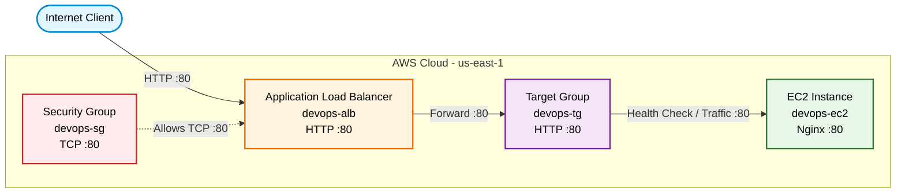
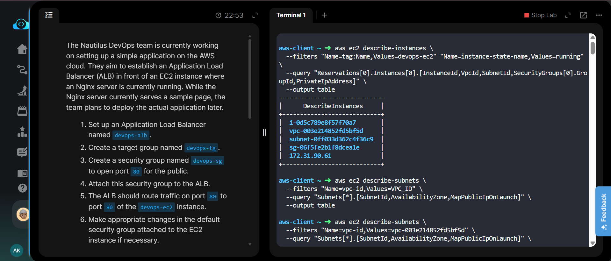
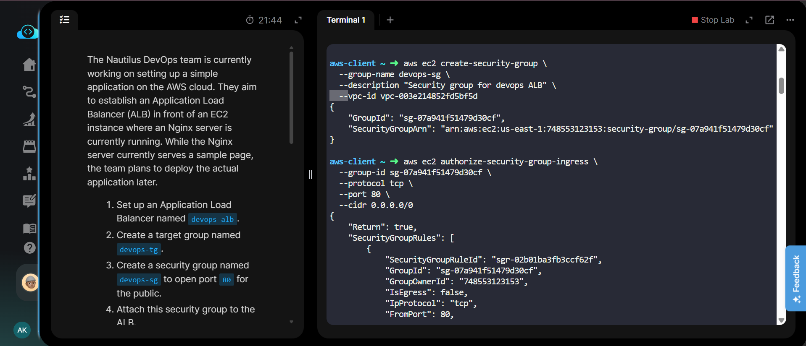
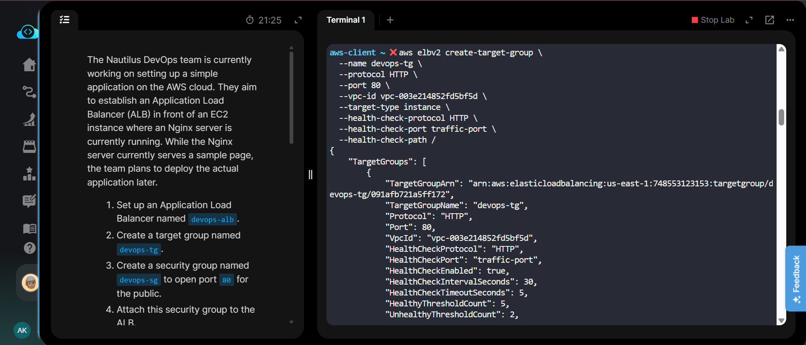
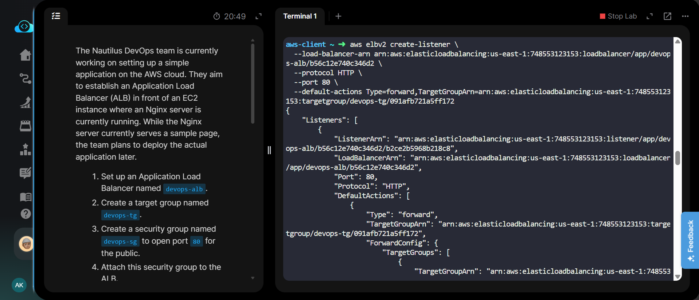
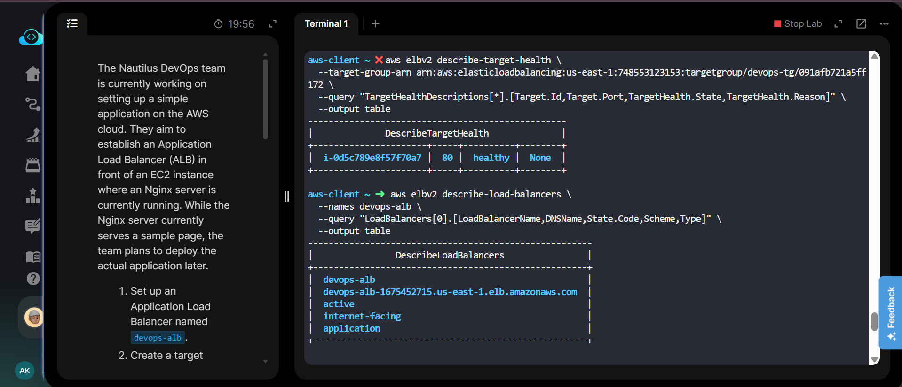
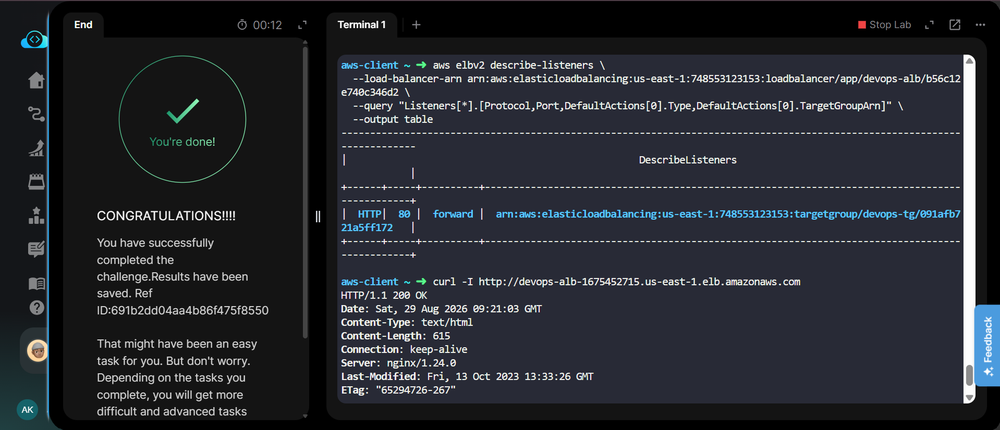

# AWS Application Load Balancer (ALB) Setup


---

## Project Information

| Field | Details |
|---|---|
| **Project Name** | Setup an Application Load Balancer |
| **Task Number** | Task 24 |
| **Cloud Platform** | Amazon Web Services (AWS) |
| **Category** | Elastic Load Balancing |
| **Primary Services** | Application Load Balancer, Target Group, EC2, Security Groups |
| **Difficulty** | Intermediate |
| **Region** | `us-east-1` |
| **Implementation** | AWS CLI |

---

## Overview

The Nautilus DevOps team is setting up a simple application on AWS. The objective is to place an **Application Load Balancer (ALB)** in front of an existing EC2 instance running an Nginx web server.

The ALB is configured to receive public HTTP traffic on port `80` and forward requests to the EC2 instance through an HTTP target group.

The EC2 instance is already running Nginx and serving a sample web page. The ALB provides a public entry point while the target group manages the backend EC2 instance and its health status.

---

## Objective

The objective of this lab was to:

- Create an Application Load Balancer named `devops-alb`.
- Create a target group named `devops-tg`.
- Create a security group named `devops-sg`.
- Allow public HTTP traffic on port `80`.
- Attach the security group to the ALB.
- Register the existing `devops-ec2` instance with the target group.
- Configure an HTTP listener on port `80`.
- Forward ALB traffic to the target group on port `80`.
- Verify that the EC2 target is healthy.
- Verify the ALB using its DNS name and HTTP response.

---

## Skills Demonstrated

- AWS Elastic Load Balancing
- Application Load Balancer configuration
- Target group creation and configuration
- EC2 target registration
- Security group configuration
- HTTP listener configuration
- ALB health checks
- AWS CLI administration
- Troubleshooting load balancer connectivity
- Verifying backend target health
- Testing HTTP endpoints with `curl`

---

## Services Used

- **Amazon EC2** – Existing Nginx web server
- **Application Load Balancer (ALB)** – Public entry point for application traffic
- **Elastic Load Balancing Target Group** – Routes traffic to the EC2 instance
- **Amazon VPC** – Provides the networking environment
- **Security Groups** – Controls inbound HTTP traffic
- **AWS CLI** – Used to create and verify AWS resources

---

## Architecture Diagram



---

## Steps Performed

### 1. Verified the Existing EC2 Instance

The existing `devops-ec2` instance was located using its Name tag and verified to be in the `running` state.

The EC2 instance information was retrieved using AWS CLI, including:

- Instance ID
- VPC ID
- Subnet ID
- Security Group ID
- Private IP address

The verified configuration was:

- **Instance ID:** `i-0d5c789e8f57f70a7`
- **VPC ID:** `vpc-003e214852fd5bf5d`
- **Subnet ID:** `subnet-0ff033d362c4f36c9`
- **Private IP:** `172.31.90.61`

---

### 2. Verified the VPC Subnets

The VPC subnets were checked to identify the available Availability Zones and public subnet configuration required for the internet-facing ALB.

---

### 3. Created the ALB Security Group

A new security group named `devops-sg` was created in the existing VPC.

The security group was configured to allow:

- **Protocol:** TCP
- **Port:** `80`
- **Source:** `0.0.0.0/0`

This allows public HTTP traffic to reach the Application Load Balancer.

---

### 4. Created the Target Group

A target group named `devops-tg` was created with the following configuration:

- **Protocol:** HTTP
- **Port:** `80`
- **Target Type:** Instance
- **VPC:** `vpc-003e214852fd5bf5d`
- **Health Check Protocol:** HTTP
- **Health Check Port:** Traffic port
- **Health Check Path:** `/`

The target group is responsible for routing traffic from the ALB to the EC2 instance.

---

### 5. Registered the EC2 Instance

The existing `devops-ec2` instance was registered with the `devops-tg` target group.

The instance was configured as an HTTP backend on port `80`.

---

### 6. Created the Application Load Balancer

An internet-facing Application Load Balancer named `devops-alb` was created.

The ALB was configured with:

- **Name:** `devops-alb`
- **Scheme:** Internet-facing
- **Type:** Application
- **Security Group:** `devops-sg`
- **Listener Port:** `80`

The ALB was deployed across the required VPC subnets.

---

### 7. Created the HTTP Listener

An HTTP listener was created on port `80`.

The default listener action was configured to forward incoming requests to the `devops-tg` target group.

The traffic flow was:

**Client → ALB :80 → Target Group → EC2 :80**

---

### 8. Verified Target Health

The target health was checked using AWS CLI.

The result showed:

- **Target:** `i-0d5c789e8f57f70a7`
- **Port:** `80`
- **Health:** `healthy`
- **Reason:** `None`

This confirmed that the ALB could successfully communicate with the Nginx server running on the EC2 instance.

---

### 9. Verified the Load Balancer

The ALB configuration was verified using AWS CLI.

The load balancer showed:

- **Name:** `devops-alb`
- **State:** `active`
- **Scheme:** `internet-facing`
- **Type:** `application`

The ALB DNS name was:

`devops-alb-1675452715.us-east-1.elb.amazonaws.com`

---

### 10. Tested HTTP Connectivity

The ALB endpoint was tested using `curl`.

The request returned:

- **HTTP Status:** `200 OK`
- **Content-Type:** `text/html`
- **Server:** `nginx/1.24.0`

This confirmed successful end-to-end communication through the Application Load Balancer.

---

## Commands Used

All AWS CLI commands used during this lab are documented here:

[View Commands →](Commands/commands.md)

---

## Troubleshooting

### Target Showing Unhealthy

If the EC2 target is reported as unhealthy:

- Verify that Nginx is running on the EC2 instance.
- Confirm that the application is listening on port `80`.
- Verify the target group health check path `/`.
- Check the EC2 security group's inbound rules.
- Ensure traffic from the ALB can reach port `80` on the EC2 instance.

### ALB Not Reachable

If the ALB DNS name does not respond:

- Verify the ALB state is `active`.
- Confirm the ALB is internet-facing.
- Verify that the ALB is attached to appropriate subnets.
- Check the `devops-sg` inbound rule for TCP port `80`.
- Confirm the listener is configured on port `80`.

### HTTP 5xx Response

If the ALB returns a `5xx` error:

- Check target health.
- Verify the EC2 instance is running.
- Confirm Nginx is listening on port `80`.
- Verify the target group is associated with the listener.
- Check EC2 security group rules.

---

## Debugging Notes

During verification, the existing EC2 instance and its networking configuration were first identified.

The target group was then created and the EC2 instance was registered as a target.

After configuring the ALB listener, target health was checked and reported as **healthy**.

Finally, the ALB DNS endpoint was tested using `curl`, which returned `HTTP/1.1 200 OK`.

This confirmed that the complete request path was working correctly:

**Internet → ALB → Listener → Target Group → EC2 → Nginx**

---

## Best Practices

- Use dedicated security groups for load balancers.
- Expose only required ports.
- Use target groups to manage backend instances.
- Configure health checks for backend availability.
- Avoid exposing backend instances unnecessarily to the public internet.
- Use descriptive and consistent resource names.
- Verify target health before testing application traffic.
- Use AWS CLI queries to validate resource configuration.
- Prefer HTTPS listeners with TLS certificates for production workloads.

---

## Key Learnings

- Learned how an Application Load Balancer distributes HTTP traffic.
- Learned how to create and configure an ALB using AWS CLI.
- Learned how target groups connect load balancers with EC2 instances.
- Learned how ALB health checks determine backend availability.
- Learned how listeners control incoming traffic.
- Learned how security groups affect ALB and EC2 communication.
- Learned how to verify ALB configuration using AWS CLI.
- Learned how to test an ALB endpoint using `curl`.

---

## Related Concepts

- Application Load Balancer
- Elastic Load Balancing
- Target Groups
- ALB Listeners
- Health Checks
- EC2
- VPC
- Security Groups
- Public and Private Subnets
- Internet-Facing Load Balancers
- HTTP Traffic Routing
- High Availability
- Load Balancing

---

## Screenshots

### 01 - Verify EC2 and Subnet

[](screenshots/01-verify-ec2-and-subnet.png)

### 02 - Create ALB Security Group

[](screenshots/02-create-alb-security-group.png)

### 03 - Create Target Group

[](screenshots/03-create-target-group.png)

### 04 - Create ALB Listener

[](screenshots/04-create-alb-listener.png)

### 05 - Verify Target Health and ALB

[](screenshots/05-verify-target-health-and-alb.png)

### 06 - Verify ALB Listener and HTTP Response

[](screenshots/06-verify-alb-listener-and-http-response.png)

---

## Result

The Application Load Balancer `devops-alb` was successfully configured and placed in front of the existing `devops-ec2` instance.

The `devops-tg` target group successfully registered the EC2 instance and reported it as **healthy**.

The HTTP listener on port `80` successfully forwarded traffic to the target group, and the ALB DNS endpoint returned:

**HTTP/1.1 200 OK**

This confirmed successful end-to-end application access through the AWS Application Load Balancer.

**Lab Status: Completed ✅**
````
