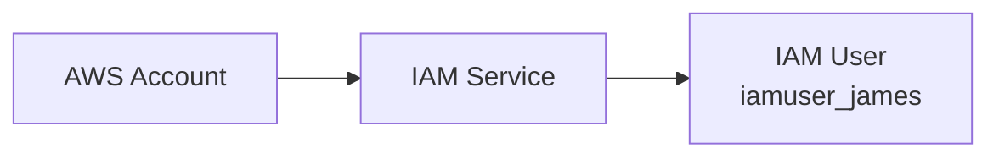
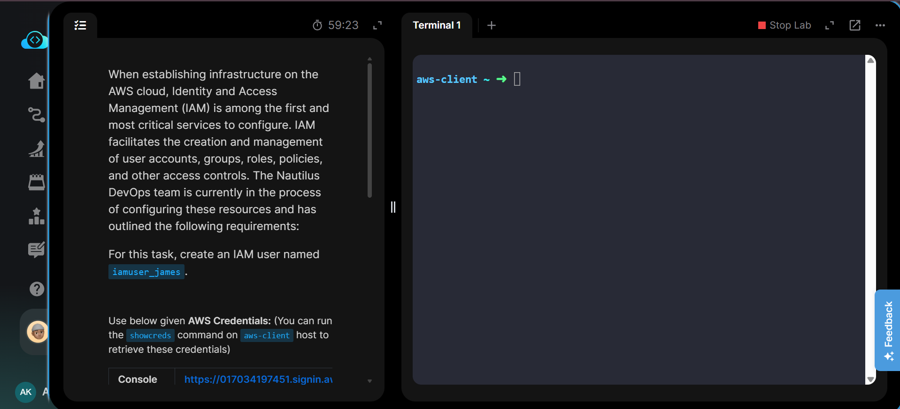
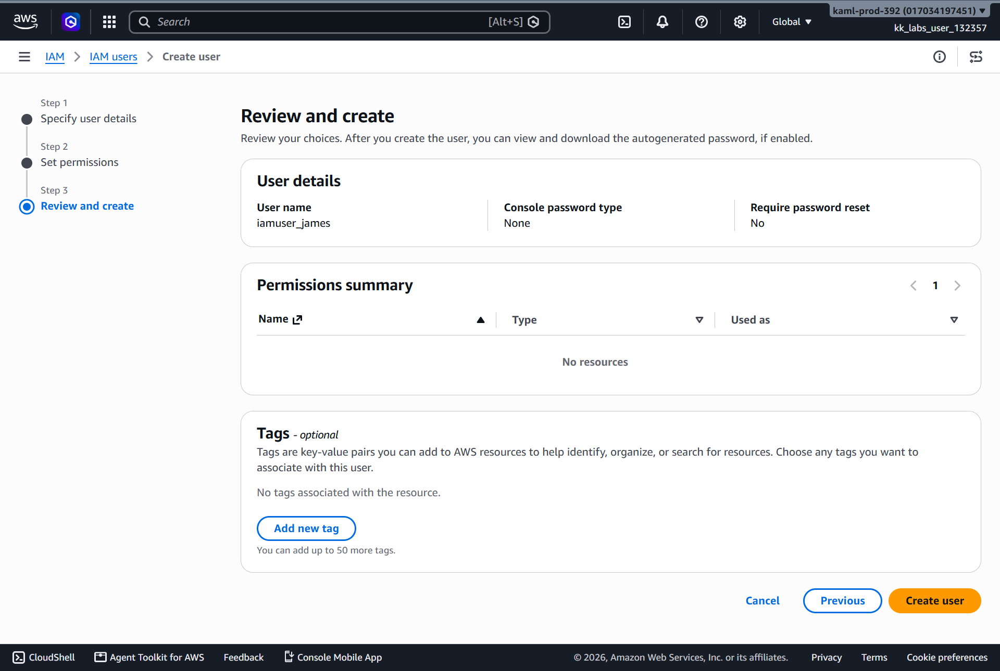
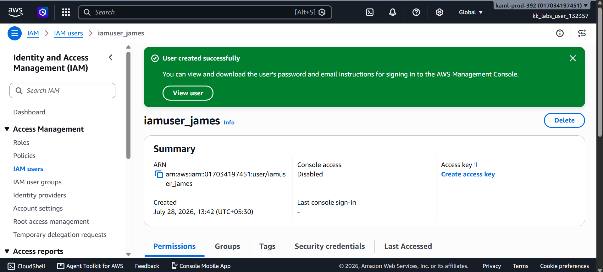
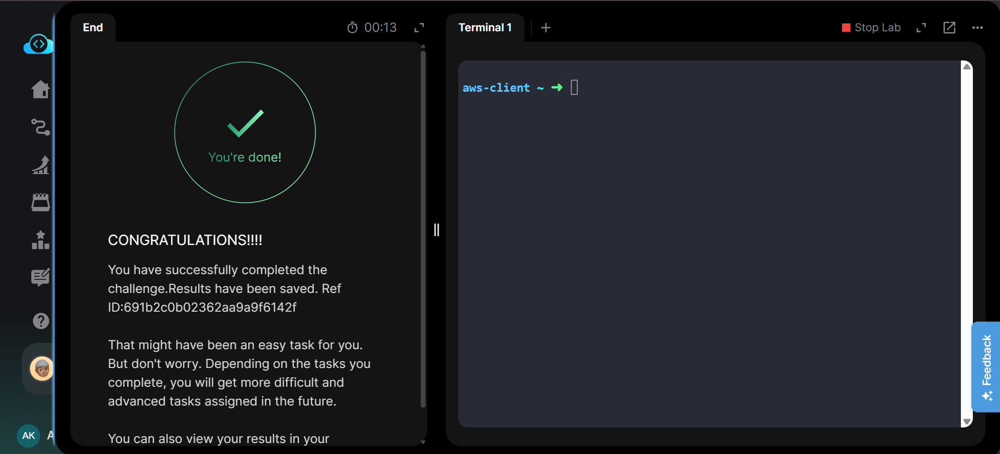

# Create an IAM User

---

# Project Information

| Field | Details |
|-------|---------|
| Project | Create IAM User |
| Platform | AWS |
| Region | Global (IAM) |
| Service | AWS Identity and Access Management (IAM) |
| User Name | iamuser_james |
| Purpose | Create a new IAM user for identity management |

---

# Overview

This project demonstrates how to create a new IAM user using the AWS Management Console.

AWS Identity and Access Management (IAM) enables secure management of users, groups, roles, and permissions within an AWS account. In this task, a new IAM user named **iamuser_james** was created without assigning permissions or console access.

The task was completed using the AWS Management Console. Equivalent AWS CLI commands are provided in **Commands/commands.md** for automation practice.

---

# Objective

The objective of this task was to:

- Open the IAM service.
- Create an IAM user named **iamuser_james**.
- Verify that the user was successfully created.

---

# Skills Demonstrated

- AWS IAM basics
- User creation
- Identity management
- AWS Management Console navigation
- IAM resource verification
- AWS CLI equivalent operations

---

# Services Used

- AWS Identity and Access Management (IAM)
- AWS Management Console
- AWS CLI (Equivalent)

---

# Architecture Diagram

The IAM service manages identities within an AWS account. In this task, a new IAM user named **iamuser_james** was created.

---

# Steps Performed

## Step 1 – Review Task Requirements

Reviewed the KodeKloud task instructions to identify the required IAM user name.

---

## Step 2 – Open IAM

- Logged in to the AWS Management Console.
- Searched for **IAM**.
- Opened **IAM → Users**.
- Clicked **Create user**.

---

## Step 3 – Configure User

Configured the following:

- User name:
  - `iamuser_james`

No console password or permissions were configured because they were not required for this task.

Reviewed the configuration and clicked **Create user**.

---

## Step 4 – Verify User

Verified that the IAM user:

`iamuser_james`

appeared successfully in the IAM Users list.

---

## Step 5 – Validate Task

Returned to the KodeKloud lab and successfully completed the task validation.

---

# Commands Used

This task was completed using the **AWS Management Console**.

Equivalent AWS CLI commands are available in:

**Commands/commands.md**

---

# Troubleshooting

## User already exists

If the username already exists, IAM returns an error because usernames must be unique within an AWS account.

---

## Incorrect IAM Service

Ensure the user is created under **IAM → Users**, not IAM Identity Center.

---

## Missing Permissions

If the Create User button is unavailable, verify that the logged-in account has IAM permissions.

---

# Debugging Notes

- Verified the IAM service was opened successfully.
- Confirmed the username before creation.
- Verified the success message after user creation.
- Confirmed the user existed in the IAM Users list.

---

# Best Practices

- Use meaningful usernames.
- Grant only required permissions.
- Follow the Principle of Least Privilege.
- Enable MFA for users requiring console access.
- Organize users into IAM Groups instead of assigning permissions individually.

---

# Key Learnings

- IAM manages identities within AWS.
- IAM is a global service.
- IAM users can exist without permissions.
- IAM users can later receive policies, groups, roles, console access, and access keys.

---

# Related Concepts

- IAM Users
- IAM Groups
- IAM Roles
- IAM Policies
- Least Privilege
- MFA
- AWS Identity Management

---

# Screenshots

### 1. Task Details

Task requirements for creating the IAM user.

---

### 2. Review and Create User

Review page showing the IAM user configuration before creation.

---

### 3. IAM User Created

Successfully created IAM user **iamuser_james**.

---

### 4. Task Completed

KodeKloud validation confirming successful completion.

---

# Result

Successfully created the IAM user **iamuser_james** using AWS IAM and verified the resource in the AWS Management Console.

**Status:** ✅ Completed