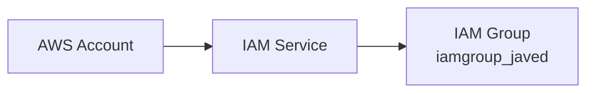
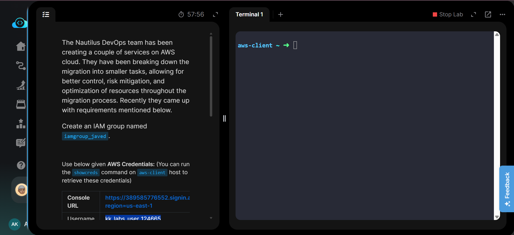
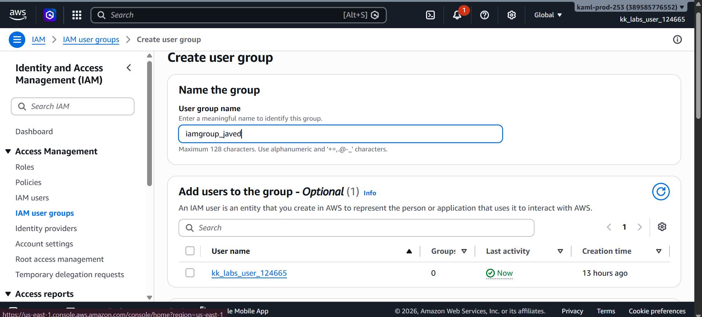
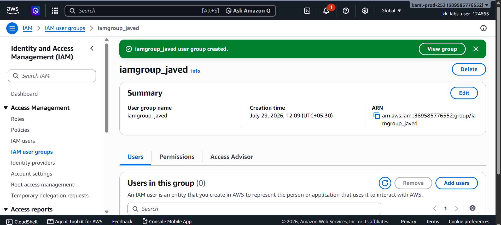
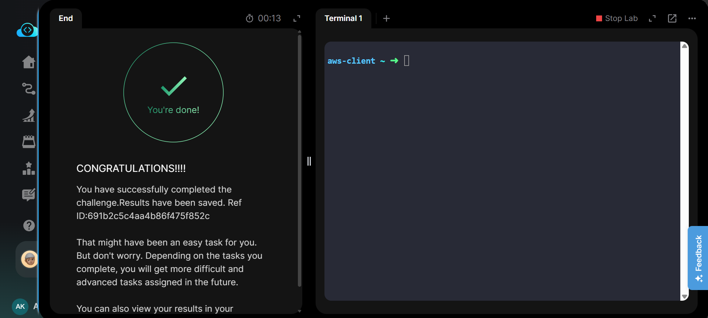

# Create an IAM Group

---

# Project Information

| Field | Details |
|-------|---------|
| Project | Create IAM Group |
| Platform | AWS |
| Region | Global (IAM) |
| Service | AWS Identity and Access Management (IAM) |
| Group Name | iamgroup_javed |
| Purpose | Create a new IAM group for managing user permissions |

---

# Overview

This project demonstrates how to create an AWS Identity and Access Management (IAM) group using the AWS Management Console.

IAM groups simplify permission management by allowing administrators to assign permissions to a group instead of configuring each user individually. Any IAM user added to the group automatically inherits the permissions attached to that group.

In this task, a new IAM group named **iamgroup_javed** was created. The task was completed using the AWS Management Console, and equivalent AWS CLI commands are provided in **Commands/commands.md** for automation practice.

---

# Objective

The objective of this task was to:

- Open the IAM service.
- Create an IAM group named **iamgroup_javed**.
- Verify that the group was successfully created.

---

# Skills Demonstrated

- AWS IAM basics
- IAM Group creation
- Identity management
- AWS Management Console navigation
- Resource verification
- AWS CLI equivalent operations

---

# Services Used

- AWS Identity and Access Management (IAM)
- AWS Management Console
- AWS CLI (Equivalent)

---

# Architecture Diagram

The IAM service manages identities and permissions within an AWS account. In this task, a new IAM group named **iamgroup_javed** was created for future permission management.

---

# Steps Performed

## Step 1 – Review Task Requirements

Reviewed the KodeKloud task instructions and identified the required IAM group name.

---

## Step 2 – Open IAM

- Logged in to the AWS Management Console.
- Opened **IAM**.
- Navigated to **User groups**.
- Clicked **Create group**.

---

## Step 3 – Configure Group

Entered the following group name:

`iamgroup_javed`

Reviewed the configuration and clicked **Create group**.

---

## Step 4 – Verify Group

Verified that the IAM group:

`iamgroup_javed`

appeared successfully in the IAM User Groups list.

---

## Step 5 – Validate Task

Returned to the KodeKloud lab and successfully completed task validation.

---

# Commands Used

This task was completed using the **AWS Management Console**.

Equivalent AWS CLI commands are available in:

**Commands/commands.md**

---

# Troubleshooting

## Group already exists

IAM group names must be unique within an AWS account.

---

## Wrong IAM Section

Ensure the group is created under:

**IAM → User groups**

and not under IAM Identity Center.

---

## Insufficient Permissions

If the Create Group button is unavailable, verify that the current IAM identity has permissions to manage IAM groups.

---

# Debugging Notes

- Verified the IAM service before creating the group.
- Confirmed the required group name.
- Verified successful creation.
- Confirmed the group appeared in the User Groups list.

---

# Best Practices

- Use meaningful group names.
- Assign permissions to groups rather than individual users.
- Follow the Principle of Least Privilege.
- Organize users based on job roles.
- Regularly review group memberships and permissions.

---

# Key Learnings

- IAM groups simplify permission management.
- Groups cannot directly sign in to AWS.
- Users inherit permissions from the groups they belong to.
- IAM is a global AWS service.

---

# Related Concepts

- IAM Users
- IAM Groups
- IAM Policies
- IAM Roles
- Least Privilege
- Identity Management

---

# Screenshots

### 1. Task Details

Task requirements for creating the IAM group.

---

### 2. Create IAM Group

Review page showing the IAM group configuration before creation.

---

### 3. IAM Group Created

Successfully created the IAM group **iamgroup_javed**.

---

### 4. Task Completed

KodeKloud validation confirming successful completion.

---

# Result

Successfully created the IAM group **iamgroup_javed** using AWS IAM and verified it in the AWS Management Console.

**Status:** ✅ Completed