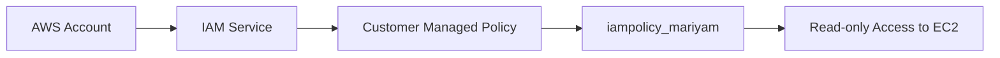
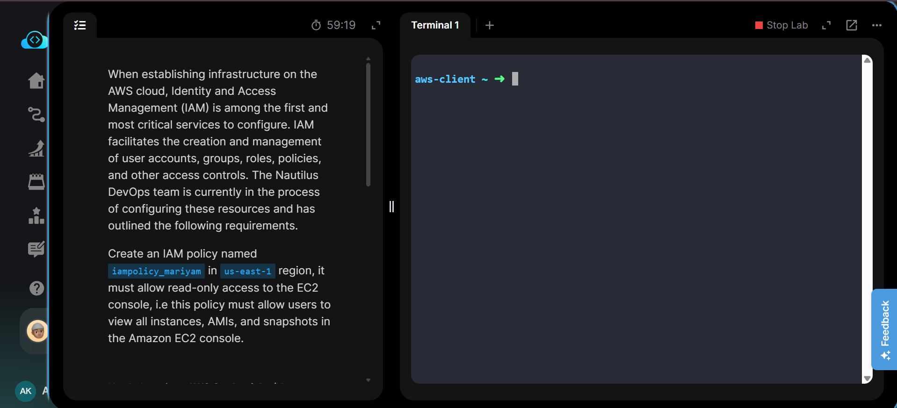
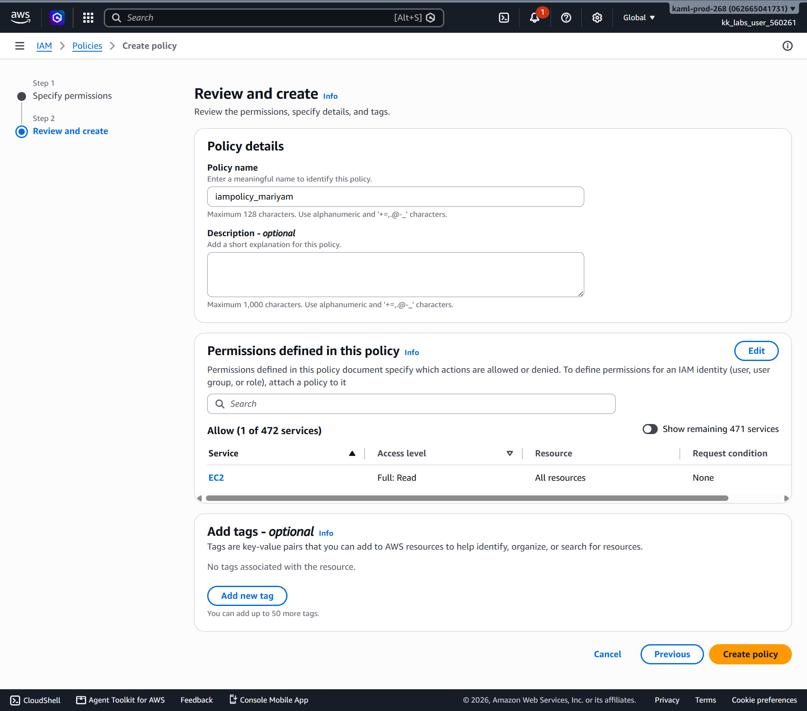
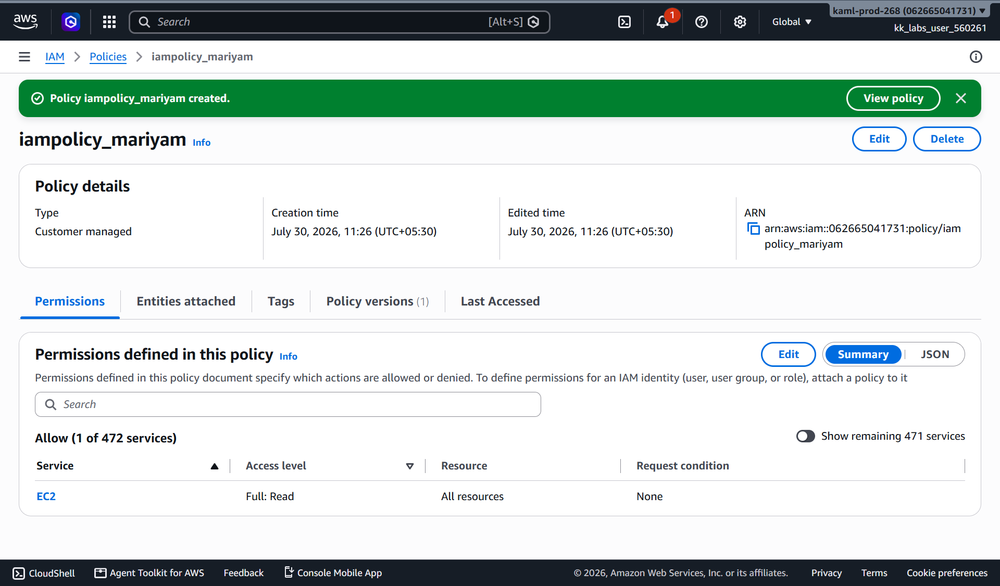
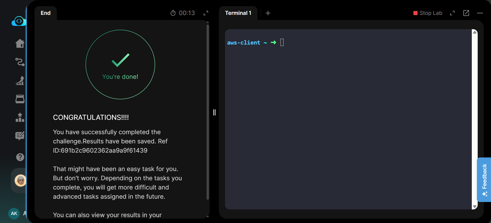

# Create an IAM Policy

---

# Project Information

| Field | Details |
|-------|---------|
| Project | Create IAM Policy |
| Platform | AWS |
| Region | Global (IAM) |
| Service | AWS Identity and Access Management (IAM) |
| Policy Name | iampolicy_mariyam |
| Purpose | Create a customer-managed IAM policy that provides read-only access to Amazon EC2 resources |

---

# Overview

This project demonstrates how to create a customer-managed IAM policy using the AWS Management Console.

AWS Identity and Access Management (IAM) policies define what actions users, groups, and roles are allowed or denied within an AWS account. In this task, a custom IAM policy named **iampolicy_mariyam** was created to provide **read-only access** to Amazon EC2 resources.

The policy allows users to view EC2 instances, Amazon Machine Images (AMIs), and EBS snapshots through the Amazon EC2 console without granting permission to modify or delete resources.

The task was completed using the AWS Management Console. Equivalent AWS CLI commands are included in **Commands/commands.md**.

---

# Objective

The objective of this task was to:

- Open the IAM service.
- Create a customer-managed IAM policy named **iampolicy_mariyam**.
- Grant read-only access to Amazon EC2 resources.
- Verify that the policy was successfully created.

---

# Skills Demonstrated

- AWS IAM policy creation
- Customer-managed policies
- Identity and access management
- EC2 read-only permissions
- AWS Management Console navigation
- IAM resource verification
- AWS CLI equivalent operations

---

# Services Used

- AWS Identity and Access Management (IAM)
- Amazon EC2
- AWS Management Console
- AWS CLI (Equivalent)

---

# Architecture Diagram

The IAM service stores a customer-managed policy named **iampolicy_mariyam**, which grants read-only permissions for Amazon EC2 resources such as instances, AMIs, and snapshots.

---

# Steps Performed

## Step 1 – Review Task Requirements

Reviewed the KodeKloud task instructions and identified the required policy name and permissions.

---

## Step 2 – Open IAM

- Logged in to the AWS Management Console.
- Opened **IAM**.
- Navigated to **Policies**.
- Clicked **Create policy**.

---

## Step 3 – Configure Policy

Configured the policy with the following settings:

- Service: **Amazon EC2**
- Access level: **Read**
- Policy name: **iampolicy_mariyam**

Reviewed the configuration and created the policy.

---

## Step 4 – Verify Policy

Verified that the customer-managed policy:

`iampolicy_mariyam`

appeared successfully in the IAM Policies list.

---

## Step 5 – Validate Task

Returned to the KodeKloud lab and successfully completed task validation.

---

# Commands Used

This task was completed using the **AWS Management Console**.

Equivalent AWS CLI commands are available in:

**Commands/commands.md**

---

# Troubleshooting

## Policy name already exists

IAM customer-managed policy names must be unique within an AWS account.

---

## Wrong Permission Level

Ensure the EC2 service is selected with **Read** access only.

---

## Insufficient IAM Permissions

If policy creation fails, verify that the logged-in IAM identity has permission to create customer-managed policies.

---

# Debugging Notes

- Verified IAM service before creating the policy.
- Confirmed the EC2 service was selected.
- Applied only Read-level permissions.
- Verified the policy name before creation.
- Confirmed successful creation in the IAM Policies list.

---

# Best Practices

- Use descriptive policy names.
- Grant only the minimum permissions required.
- Prefer customer-managed policies for reusable permission sets.
- Review policies periodically.
- Attach policies to groups or roles whenever possible instead of individual users.

---

# Key Learnings

- IAM policies define permissions within AWS.
- Customer-managed policies are reusable and editable.
- Read-only policies allow viewing resources without modification.
- IAM is a global AWS service.

---

# Related Concepts

- IAM Policies
- Customer Managed Policies
- AWS Managed Policies
- IAM Users
- IAM Groups
- IAM Roles
- Amazon EC2 Permissions
- Least Privilege

---

# Screenshots

### 1. Task Details

Task requirements for creating the IAM policy.

---

### 2. Create IAM Policy

Review page showing the customer-managed IAM policy configuration before creation.

---

### 3. IAM Policy Created

Successfully created the IAM policy **iampolicy_mariyam**.

---

### 4. Task Completed

KodeKloud validation confirming successful completion.

---

# Result

Successfully created the customer-managed IAM policy **iampolicy_mariyam**, providing read-only access to Amazon EC2 resources including instances, AMIs, and EBS snapshots.

**Status:** ✅ Completed