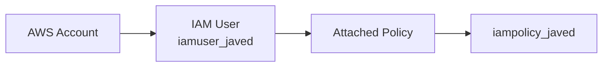
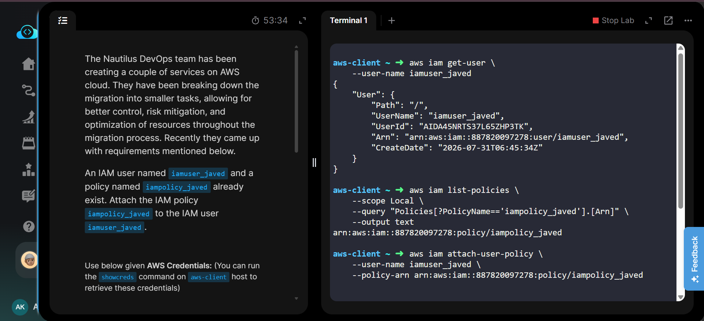
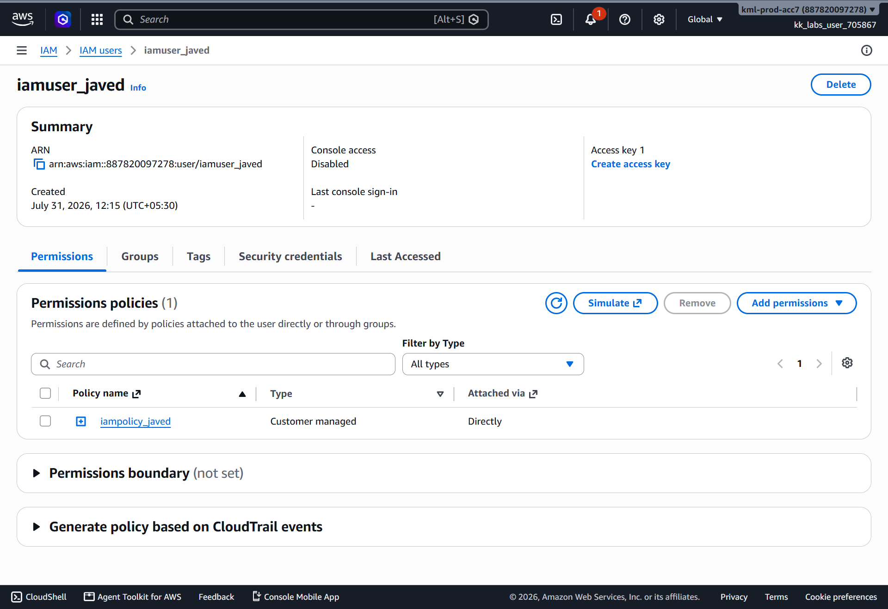
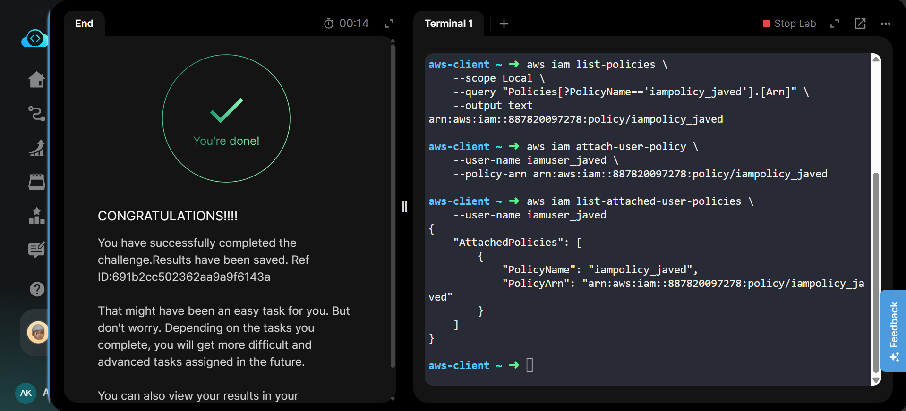

# Attach IAM Policy to IAM User


---

# Project Information

| Field | Details |
|-------|---------|
| Project | Attach IAM Policy to IAM User |
| Platform | AWS |
| Region | Global (IAM) |
| Service | AWS Identity and Access Management (IAM) |
| IAM User | iamuser_javed |
| IAM Policy | iampolicy_javed |
| Purpose | Attach an existing customer-managed IAM policy to an existing IAM user |

---

# Overview

This project demonstrates how to attach an existing customer-managed IAM policy to an existing IAM user using the AWS CLI.

Instead of using the AWS Management Console for the complete task, the AWS CLI was used to verify the resources, retrieve the policy ARN, attach the policy, and verify the attachment. The AWS Management Console was used only for final verification and screenshots.

Attaching policies directly to IAM users grants the permissions defined within the policy. In this task, the existing policy **iampolicy_javed** was attached directly to the IAM user **iamuser_javed**.

---

# Objective

The objective of this task was to:

- Verify the IAM user exists.
- Retrieve the policy ARN.
- Attach the IAM policy to the IAM user.
- Verify the policy attachment.

---

# Skills Demonstrated

- AWS CLI
- IAM User Management
- IAM Policy Management
- Policy Attachment
- AWS CLI Query
- Resource Verification
- AWS Management Console Verification

---

# Services Used

- AWS Identity and Access Management (IAM)
- AWS CLI
- AWS Management Console (Verification Only)

---

# Architecture Diagram



The IAM user **iamuser_javed** has the customer-managed policy **iampolicy_javed** attached directly, allowing the user to inherit the permissions defined by the policy.

---

# Steps Performed

## Step 1 – Review Task Requirements

Reviewed the KodeKloud task requirements and identified the existing IAM user and IAM policy.

---

## Step 2 – Verify the IAM User

Verified that the IAM user already existed.

```bash
aws iam get-user \
    --user-name iamuser_javed
```

---

## Step 3 – Retrieve the Policy ARN

Retrieved the ARN of the customer-managed IAM policy.

```bash
aws iam list-policies \
    --scope Local \
    --query "Policies[?PolicyName=='iampolicy_javed'].[Arn]" \
    --output text
```

---

## Step 4 – Attach the Policy

Attached the IAM policy to the IAM user.

```bash
aws iam attach-user-policy \
    --user-name iamuser_javed \
    --policy-arn arn:aws:iam::<ACCOUNT_ID>:policy/iampolicy_javed
```

---

## Step 5 – Verify the Attachment

Verified that the policy was successfully attached.

```bash
aws iam list-attached-user-policies \
    --user-name iamuser_javed
```

The AWS Management Console was then used to visually confirm the attached policy.

---

## Step 6 – Validate Task

Returned to the KodeKloud lab and successfully completed task validation.

---

# Commands Used

This task was completed primarily using the **AWS CLI**.

The commands executed are available in:

**Commands/commands.md**

---

# Troubleshooting

## User Not Found

Verify the IAM user exists before attaching a policy.

---

## Policy Not Found

Ensure the policy ARN belongs to the correct AWS account.

---

## Incorrect Policy ARN

Retrieve the policy ARN using `list-policies` instead of typing it manually.

---

## Access Denied

Verify that the executing IAM identity has permissions to attach IAM policies.

---

# Debugging Notes

- Verified the IAM user before performing any changes.
- Retrieved the policy ARN dynamically.
- Attached the policy using the AWS CLI.
- Verified the attached policy using both the CLI and the AWS Management Console.

---

# Best Practices

- Prefer AWS CLI for repeatable infrastructure tasks.
- Avoid hardcoding policy ARNs whenever possible.
- Verify resources before modifying them.
- Follow the Principle of Least Privilege.
- Use the AWS Console only for verification when appropriate.

---

# Key Learnings

- Existing IAM policies can be attached without recreation.
- Policy ARNs uniquely identify IAM policies.
- AWS CLI enables fast and repeatable IAM administration.
- IAM is a global AWS service.

---

# Related Concepts

- IAM Users
- IAM Policies
- Customer Managed Policies
- Policy ARN
- AWS CLI
- Identity and Access Management

---

# Screenshots

### 1. Task Details

[](Screenshots/01-task-details.png)

Task requirements and CLI commands executed during the lab.

---

### 2. Policy Attached

[](Screenshots/02-policy-attached.png)

The IAM user showing **iampolicy_javed** attached successfully.

---

### 3. Task Completed

[](Screenshots/03-task-completed.png)

KodeKloud validation confirming successful completion.

---

# Result

Successfully attached the existing customer-managed IAM policy **iampolicy_javed** to the existing IAM user **iamuser_javed** using the AWS CLI and verified the attachment through both the CLI and AWS Management Console.

**Status:** ✅ Completed