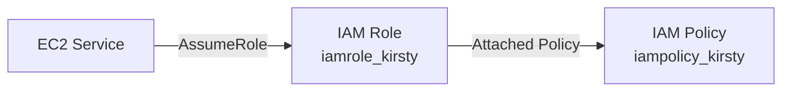
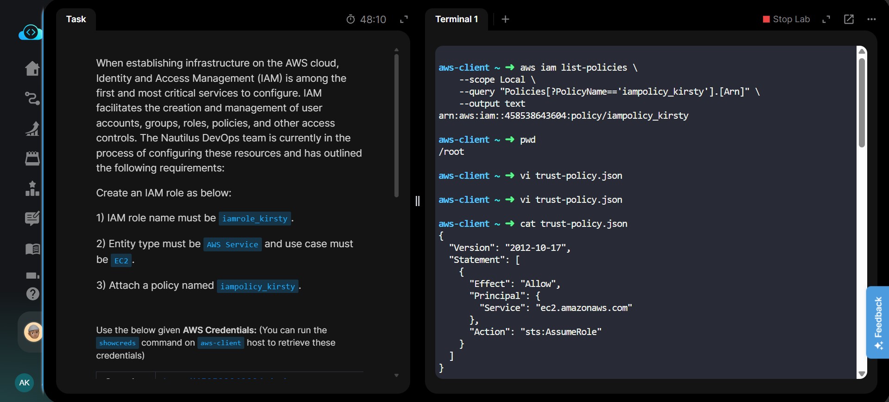

# AWS IAM Role for EC2

---

# Project Information

| Property | Value |
|----------|-------|
| **Project Name** | Create IAM Role for EC2 |
| **Platform** | AWS |
| **Region** | Global (IAM) |
| **Services Used** | IAM |
| **CLI Used** | AWS CLI |
| **Purpose** | Create an IAM Role for EC2 and attach an existing IAM Policy |

---

# Overview

This lab demonstrates how to create an AWS IAM Role that can be assumed by the EC2 service. Instead of using the AWS Management Console, the role is created using the AWS CLI along with a trust policy JSON document.

After creating the role, an existing customer-managed IAM policy named **iampolicy_kirsty** is attached to the role. Finally, the role configuration and attached policy are verified using AWS CLI commands.

---

# Objective

- Create an IAM Role named **iamrole_kirsty**
- Configure the trusted entity as **AWS Service**
- Set the use case to **EC2**
- Attach the existing policy **iampolicy_kirsty**
- Verify that the role and policy attachment were successful

---

# Skills Demonstrated

- Creating IAM Roles using AWS CLI
- Working with Trust Policies
- Using JSON policy documents
- Attaching IAM Policies
- Verifying IAM resources using CLI
- Managing IAM security resources

---

# Services Used

- AWS Identity and Access Management (IAM)
- AWS CLI

---

# Architecture Diagram

---

# Steps Performed

1. Retrieved AWS credentials.
2. Verified the existing IAM policy.
3. Created a Trust Policy JSON document.
4. Created the IAM Role using AWS CLI.
5. Attached the existing IAM policy to the role.
6. Verified the role configuration.
7. Verified the attached policy.
8. Confirmed successful task completion.

---

# Commands Used

AWS CLI commands used in this lab are available here:

➡️ **[Commands/commands.md](Commands/commands.md)**

---

# Troubleshooting

| Issue | Solution |
|--------|----------|
| Policy not found | Verify the policy exists before attaching it |
| Invalid trust policy | Check JSON syntax using `cat trust-policy.json` |
| Access denied | Ensure AWS credentials are configured correctly |
| Role already exists | Use a different role name or delete the existing role |

---

# Debugging Notes

- Used `aws iam list-policies` to retrieve the policy ARN.
- Verified the Trust Policy before creating the role.
- Confirmed the role using `aws iam get-role`.
- Verified policy attachment using `aws iam list-attached-role-policies`.

---

# Best Practices

- Use IAM Roles instead of storing long-term credentials.
- Grant only the minimum required permissions.
- Keep trust policies simple and secure.
- Verify IAM resources after creation.
- Prefer AWS CLI for repeatable infrastructure tasks.

---

# Key Learnings

- Difference between IAM Users and IAM Roles.
- Purpose of a Trust Policy.
- How EC2 assumes an IAM Role.
- How to attach customer-managed policies using AWS CLI.
- Methods to verify IAM configurations from the command line.

---

# Related Concepts

- IAM Users
- IAM Groups
- IAM Roles
- Trust Policy
- Identity Policy
- Principle of Least Privilege
- EC2 IAM Roles

---

# Screenshots

### 01 - Task Details

---

### 02 - Create Trust Policy using VI Editor

---

### 03 - Create IAM Role using AWS CLI

---

### 04 - Verify Attached Policy

---

### 05 - Task Completed

---

# Result

Successfully created the IAM Role **iamrole_kirsty** for the **EC2** service using the AWS CLI, attached the existing customer-managed policy **iampolicy_kirsty**, verified the role configuration and policy attachment, and completed the lab successfully.