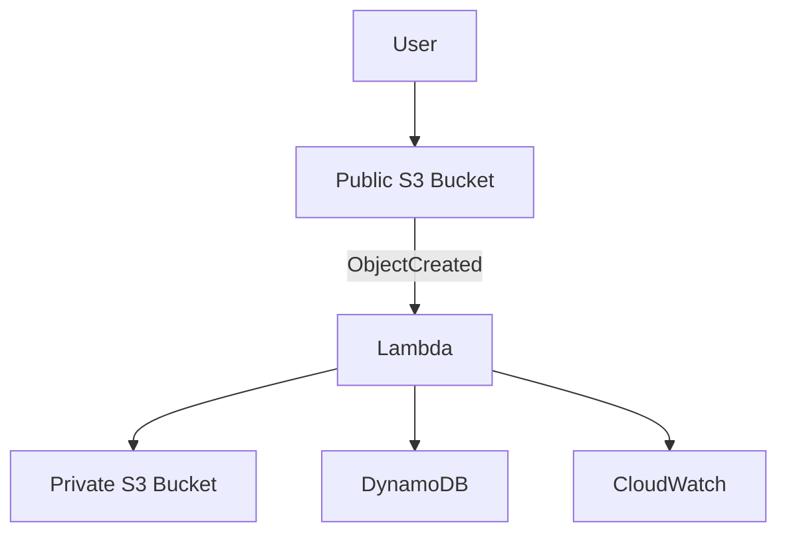
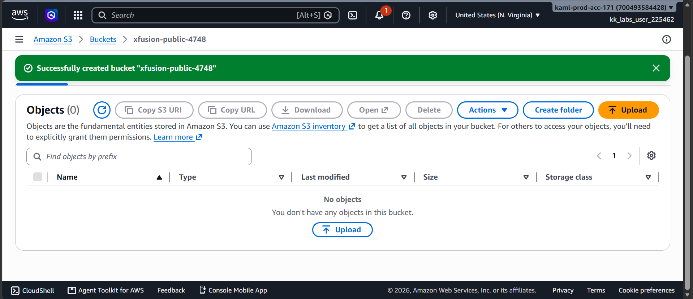
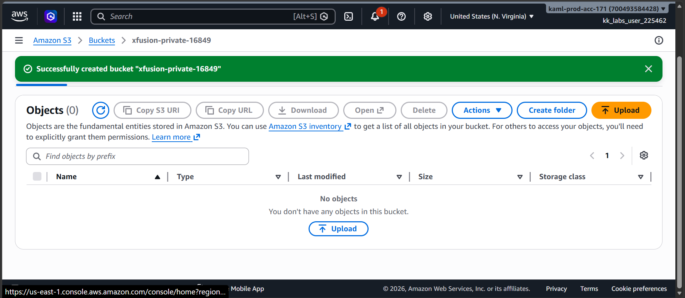
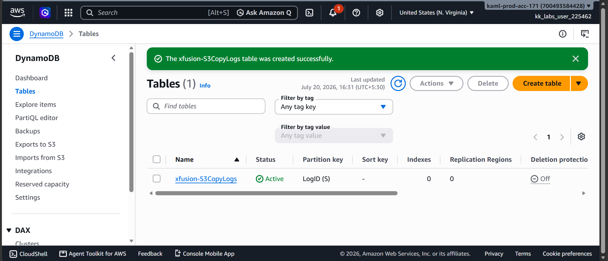
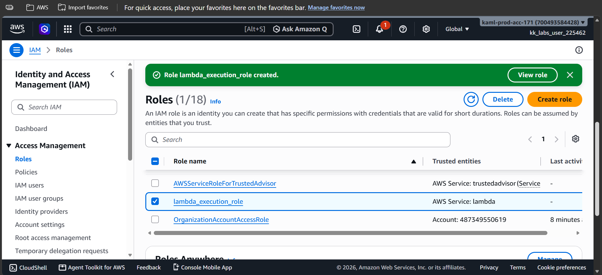
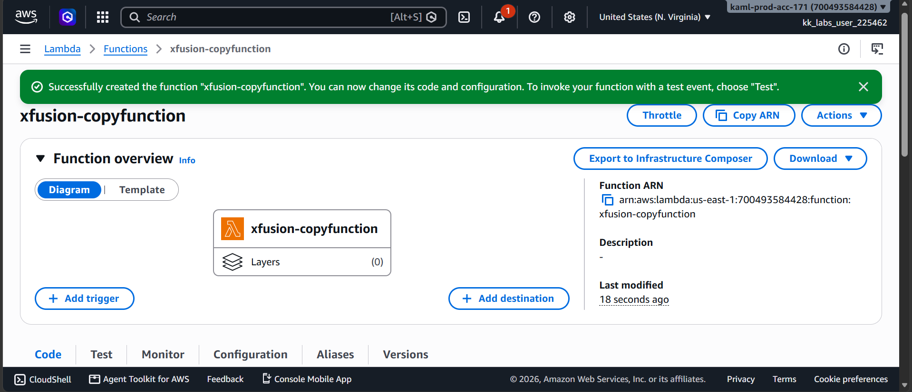
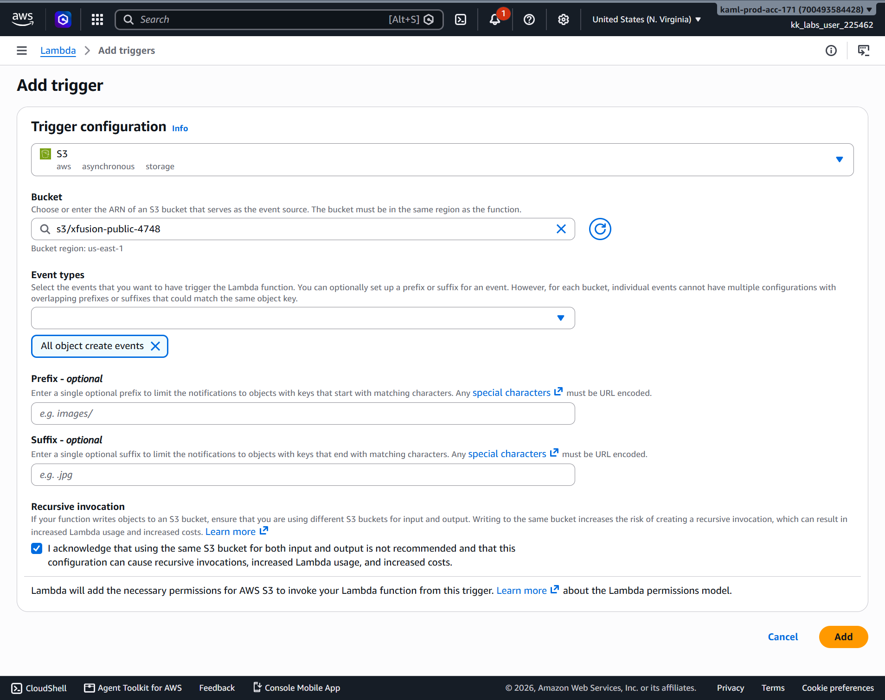
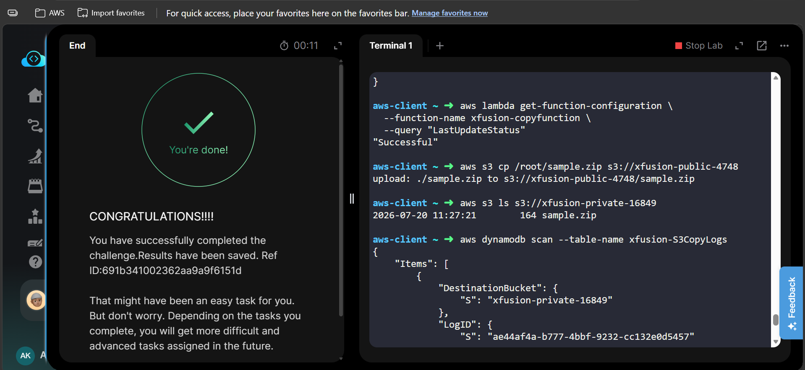

# 🚀 AWS Task 46 - S3 File Copy Automation Using AWS Lambda


---

# 📋 Project Information

| Property | Value |
|----------|-------|
| **Project Name** | S3 File Copy Automation Using AWS Lambda |
| **Task Number** | 46 |
| **Cloud Platform** | Amazon Web Services (AWS) |
| **Category** | Serverless Automation |
| **Primary Services** | Amazon S3, AWS Lambda, Amazon DynamoDB, AWS IAM |
| **Difficulty** | Intermediate |
| **Region** | us-east-1 |
| **Implementation** | AWS Management Console + AWS CLI |
| **Completion Status** | ✅ Completed |

---

# 📖 Overview

This project demonstrates an event-driven serverless architecture using AWS managed services.

Whenever a file is uploaded to a public Amazon S3 bucket, an S3 Event Notification automatically triggers an AWS Lambda function. The Lambda function copies the uploaded object to a private S3 bucket and records the operation inside an Amazon DynamoDB table. This architecture provides secure file storage, automation, and centralized auditing.

---

# 🎯 Objective

- Create a Public S3 Bucket.
- Create a Private S3 Bucket.
- Create a DynamoDB table.
- Create an IAM Role for Lambda.
- Configure an AWS Lambda function.
- Trigger Lambda automatically on S3 uploads.
- Copy uploaded objects into a private bucket.
- Log every file copy operation into DynamoDB.
- Verify the complete workflow.

---

# 🚀 Skills Demonstrated

- Amazon S3 Bucket Management
- Event-Driven Architecture
- AWS Lambda Deployment
- IAM Role Configuration
- DynamoDB Integration
- AWS CLI Automation
- CloudWatch Log Analysis
- Lambda Handler Debugging
- Serverless File Processing

---

# ☁️ AWS Services Used

- Amazon S3
- AWS Lambda
- Amazon DynamoDB
- AWS IAM
- Amazon CloudWatch
- AWS CLI

---

# 🏗️ Architecture Diagram



---

# 📝 Steps Performed

1. Created a Public S3 bucket.
2. Created a Private S3 bucket.
3. Created a DynamoDB table for logging.
4. Created an IAM execution role for Lambda.
5. Updated the provided Lambda source code.
6. Packaged the Lambda function using AWS CLI.
7. Deployed the Lambda package using AWS CLI.
8. Configured the S3 Event Trigger.
9. Uploaded a sample file.
10. Verified the copied object in the Private Bucket.
11. Verified the DynamoDB log entry.
12. Successfully completed task validation.

---

# 💻 Commands Used

See:

```text
Commands/commands.md
```

---

# ⚠️ Troubleshooting

## Issue Encountered

During the first implementation attempt, the Lambda function failed with the following error:

```
Runtime.ImportModuleError

Unable to import module 'lambda_function'
```

### Cause

The provided source file was named:

```
lambda-function.py
```

while the Lambda handler expected

```
lambda_function.lambda_handler
```

Python module names cannot contain a hyphen (`-`), so Lambda could not import the module.

### Resolution

A correctly named copy of the file was created.

The deployment package was rebuilt and uploaded using AWS CLI.

The Lambda function executed successfully after updating the deployment package.

---

# 🐞 Debugging Notes

The issue was investigated using Amazon CloudWatch Logs.

The following AWS CLI commands were used during troubleshooting.

- Describe Lambda log streams.
- Retrieve Lambda log events.
- Verify Lambda deployment status.
- Verify S3 file copy.
- Verify DynamoDB log entry.

CloudWatch identified the exact issue:

```
Runtime.ImportModuleError

Unable to import module 'lambda_function'
```

The Lambda package was rebuilt with the correct Python module name and redeployed successfully.

---

# 💡 Best Practices

- Follow the Principle of Least Privilege for IAM roles in production.
- Avoid using FullAccess policies outside lab environments.
- Enable CloudWatch Logs for every Lambda function.
- Verify Lambda handlers before deployment.
- Test the complete event-driven workflow before production deployment.
- Use AWS CLI for repeatable deployments.

---

# 📚 Key Learnings

- Event-driven serverless architecture.
- Amazon S3 Event Notifications.
- AWS Lambda deployment using AWS CLI.
- Lambda Handler naming conventions.
- IAM execution roles.
- DynamoDB logging.
- CloudWatch debugging.
- Python module naming requirements.
- End-to-end AWS automation.

---

# 🔗 Related Concepts

- Amazon S3
- AWS Lambda
- Amazon DynamoDB
- AWS IAM
- CloudWatch Logs
- AWS CLI
- Event Notifications
- Serverless Computing

---

# 📸 Screenshots

## 01. Public S3 Bucket

[](Screenshots/01-public-bucket.png)

---

## 02. Private S3 Bucket

[](Screenshots/02-private-bucket.png)

---

## 03. DynamoDB Table

[](Screenshots/03-dynamodb-table.png)

---

## 04. IAM Role

[](Screenshots/04-lambda-role.png)

---

## 05. Lambda Function

[](Screenshots/05-lambda-function.png)

---

## 06. S3 Trigger

[](Screenshots/06-s3-trigger.png)

---

## 07. Task Completed

[](Screenshots/07-task-completed.png)

---

# ✅ Result

Successfully implemented an event-driven file automation workflow using Amazon S3, AWS Lambda, Amazon DynamoDB, IAM, and CloudWatch.

Whenever a file is uploaded to the Public S3 Bucket, the Lambda function is automatically triggered, copies the file to the Private S3 Bucket, records the operation inside DynamoDB, and logs execution details in CloudWatch.

During implementation, a Lambda handler naming issue was identified, investigated through CloudWatch Logs, resolved using AWS CLI, and successfully validated. This project demonstrates practical experience with AWS serverless automation, event-driven architectures, IAM permissions, debugging, and production-style troubleshooting.