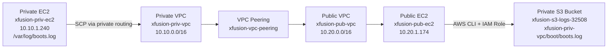
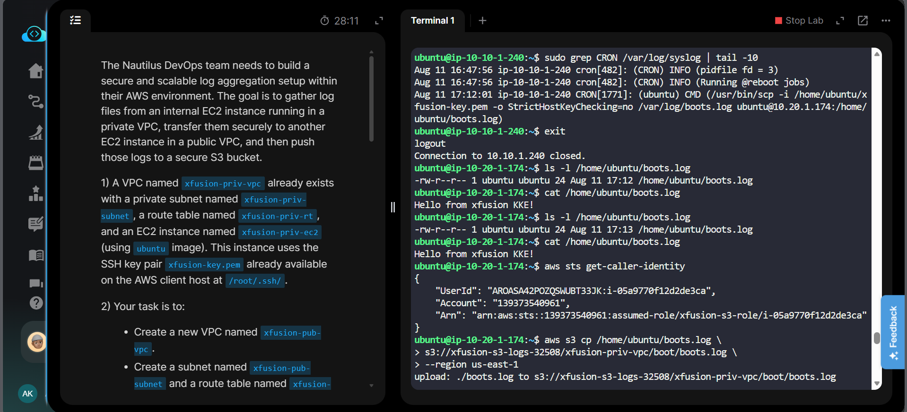
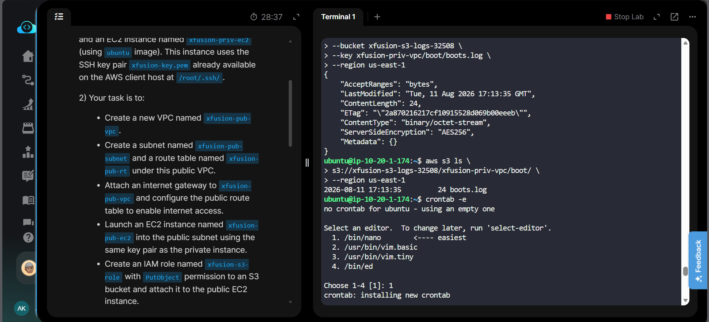
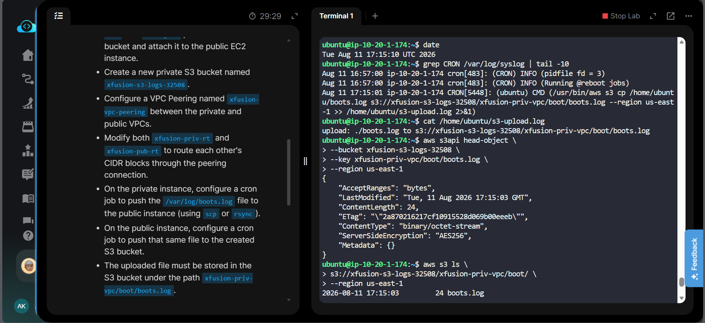
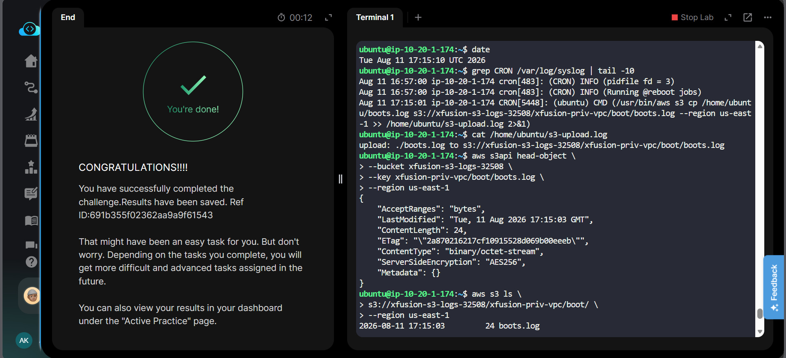

# AWS VPC-to-S3 Log Aggregation

## Badges


## Project Information

| Item | Details |
|---|---|
| Project | VPC-to-S3 Log Aggregation |
| Platform | Amazon Web Services (AWS) |
| Region | `us-east-1` |
| Private VPC | `xfusion-priv-vpc` |
| Public VPC | `xfusion-pub-vpc` |
| Private EC2 | `xfusion-priv-ec2` |
| Public EC2 | `xfusion-pub-ec2` |
| S3 Bucket | `xfusion-s3-logs-32508` |
| VPC Peering | `xfusion-vpc-peering` |
| IAM Role | `xfusion-s3-role` |
| Log File | `/var/log/boots.log` |
| S3 Object Key | `xfusion-priv-vpc/boot/boots.log` |
| Status | Completed |

## Overview

This project implements a multi-stage AWS log aggregation workflow. A log file is collected from an EC2 instance inside a private VPC, transferred to an EC2 instance in a separate public VPC through VPC Peering, and then uploaded from the public EC2 instance to a private Amazon S3 bucket. Linux `cron` jobs automate both transfer stages.

## Objective

- Create a separate public VPC for log aggregation.
- Establish private-to-public VPC connectivity using VPC Peering.
- Route each VPC's CIDR block through the peering connection.
- Transfer `/var/log/boots.log` from the private EC2 instance to the public EC2 instance using `scp`.
- Attach an IAM role to the public EC2 instance for S3 access.
- Upload the received log file to a private S3 bucket.
- Store the object at `xfusion-priv-vpc/boot/boots.log`.
- Automate both transfer stages with cron.
- Verify the complete workflow end-to-end.

## Skills Demonstrated

- AWS VPC design and routing
- Subnet and route table configuration
- Internet Gateway configuration
- VPC Peering
- EC2 provisioning
- Security Group configuration
- IAM roles and instance profiles
- Amazon S3 object storage
- Linux SSH/SCP
- Linux cron automation
- AWS CLI
- End-to-end cloud troubleshooting and verification

## Services Used

- **Amazon VPC** — isolated networking for private and public workloads
- **Amazon EC2** — private log source and public log aggregation host
- **Amazon S3** — private durable log storage
- **AWS IAM** — EC2 role-based access to S3
- **Internet Gateway** — internet connectivity for the public subnet
- **VPC Peering** — private connectivity between the two VPCs

## Architecture Diagram



## Implementation Steps

### 1. Verified Existing Private Environment

- Private VPC: `xfusion-priv-vpc`
- CIDR: `10.10.0.0/16`
- Private EC2: `xfusion-priv-ec2`
- Private EC2 IP: `10.10.1.240`
- Private route table: `xfusion-priv-rt`

### 2. Created Public VPC

Created `xfusion-pub-vpc` with CIDR `10.20.0.0/16`, subnet `xfusion-pub-subnet` (`10.20.1.0/24`), route table `xfusion-pub-rt`, and Internet Gateway `xfusion-pub-igw`. The public subnet was configured to assign public IPv4 addresses on launch and the route table received `0.0.0.0/0` through the Internet Gateway.

### 3. Created Security Group and Public EC2

Created a security group allowing SSH on TCP port 22 and launched `xfusion-pub-ec2` in the public subnet using the same `xfusion-key` key pair.

### 4. Created S3 Bucket

Created the private bucket `xfusion-s3-logs-32508`. The required object path is `xfusion-priv-vpc/boot/boots.log`.

### 5. Created IAM Role and Attached It to EC2

Created `xfusion-s3-role`, trusted by EC2, and attached it to the public EC2 through an instance profile.

During the lab, the training IAM user was not authorized to use `iam:PutRolePolicy`. Therefore the bucket-specific inline policy could not be created. The available AWS managed `AmazonS3FullAccess` policy was attached instead so the lab workflow could complete successfully.

> **Production note:** Replace this broad managed policy with a least-privilege policy granting only the required `s3:PutObject` permission on the target bucket/prefix.

### 6. Created VPC Peering

Created and accepted `xfusion-vpc-peering` between the private and public VPCs. The peering connection was verified as `active`.

### 7. Added Peering Routes

- Private route table: `10.20.0.0/16` → VPC Peering
- Public route table: `10.10.0.0/16` → VPC Peering

Both routes were verified as active.

### 8. Configured Private-to-Public Log Transfer

The private EC2 transfers `/var/log/boots.log` to `/home/ubuntu/boots.log` on the public EC2 using `scp`. A cron job runs the transfer every minute.

### 9. Configured Public-to-S3 Upload

The public EC2 uploads `/home/ubuntu/boots.log` to `s3://xfusion-s3-logs-32508/xfusion-priv-vpc/boot/boots.log`. A cron job runs the upload every minute.

### 10. End-to-End Verification

The workflow was verified using cron logs, `s3-upload.log`, `aws sts get-caller-identity`, `aws s3api head-object`, and `aws s3 ls`. The final object was confirmed with `ContentLength: 24` and `ServerSideEncryption: AES256`.

## Commands Used

All AWS CLI, SSH, SCP, and cron commands are documented separately:

➡️ [`Commands/commands.md`](Commands/commands.md)

## Troubleshooting

### IAM `PutRolePolicy` AccessDenied

The training IAM user returned `AccessDenied` for `iam:PutRolePolicy`. The available managed `AmazonS3FullAccess` policy was used for the lab completion. In production, use a bucket-scoped least-privilege policy.

### SCP Permission Denied

Initially the private EC2 did not contain `xfusion-key.pem`. The key was transferred to the required host and its permissions were restricted with `chmod 400 ~/xfusion-key.pem`. SCP then worked successfully.

### S3 Object Not Found

An earlier attempt used a `*/5` cron schedule, so the object could be absent when the lab validator checked it. In the successful attempt both cron jobs were configured with `* * * * *`, allowing the object to be recreated every minute.

### VPC Peering Verification

The public EC2 IAM role was intentionally limited to S3 access and could not run EC2 describe APIs. Peering and route verification was therefore performed from the AWS client host.

## Key Learnings

- VPC Peering provides private connectivity but does not automatically add routes.
- Both sides of a peering connection require appropriate route-table entries.
- An EC2 IAM role is delivered through an instance profile.
- IAM permissions should follow least privilege in production.
- SSH keys used by `scp` must exist on the source host and have secure permissions.
- Cron jobs should use absolute paths because cron has a limited environment.
- `aws s3api head-object` verifies an exact S3 object key.
- `aws s3 ls` confirms the expected object exists.
- End-to-end verification is more reliable than checking individual resources only.

## Related Concepts

- VPC routing
- Public vs private subnets
- Internet Gateway
- VPC Peering
- Security Groups
- EC2 IAM roles
- Instance Profiles
- S3 object keys
- S3 server-side encryption
- SSH public-key authentication
- SCP
- Cron scheduling
- AWS CLI

## Clickable Screenshots

### Private EC2 → Public EC2 Log Transfer

[](Screenshots/01-private-to-public-log-transfer.png)

### Public EC2 S3 Cron Setup

[](Screenshots/02-public-s3-cron-setup.png)

### S3 Cron Upload Verification

[](Screenshots/03-s3-cron-verification.png)

### Task Completed

[](Screenshots/04-task-completed.png)

## Result

Successfully implemented and verified the complete AWS log aggregation workflow:

```text
Private EC2
    ↓
SCP over VPC Peering
    ↓
Public EC2
    ↓
IAM Role
    ↓
Private S3 Bucket
    ↓
xfusion-priv-vpc/boot/boots.log
```

**Task Status: COMPLETED ✅**
