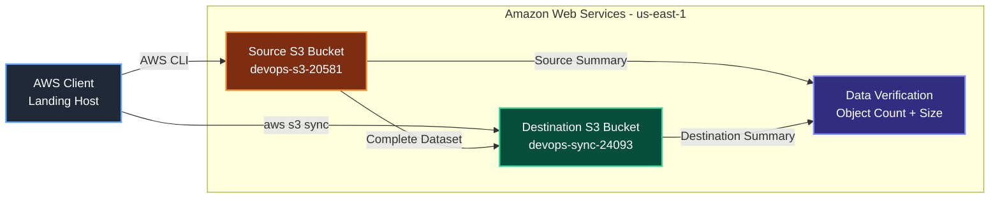
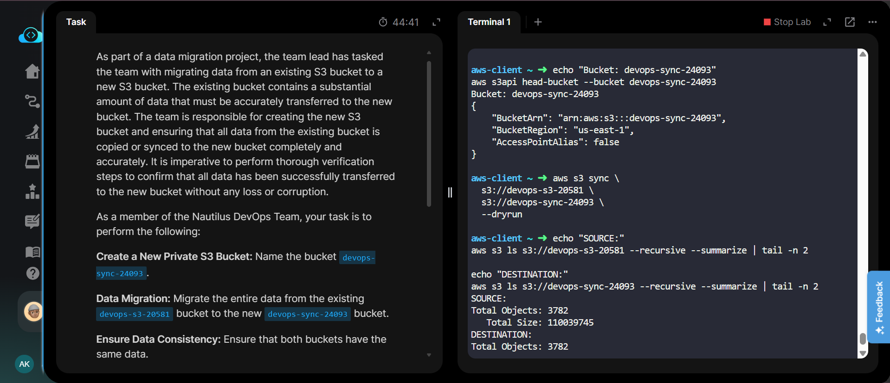
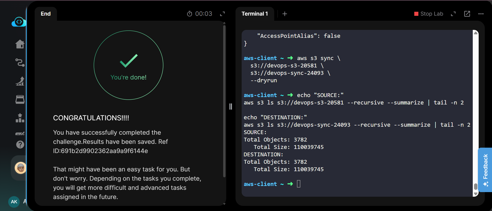

# AWS S3 Bucket Data Migration


---

## Project Information

| Field | Details |
|---|---|
| **Project Name** | S3 Bucket Data Migration |
| **Task Number** | 23 |
| **Cloud Platform** | AWS |
| **Category** | Storage / Data Migration |
| **Primary Service** | Amazon S3 |
| **Source Bucket** | `devops-s3-20581` |
| **Destination Bucket** | `devops-sync-24093` |
| **Region** | `us-east-1` |
| **Difficulty** | Easy |
| **Implementation** | AWS CLI |
| **Status** | Completed |

---

## Overview

The Nautilus DevOps team required the migration of the complete dataset from an existing Amazon S3 bucket to a newly created private S3 bucket.

The source bucket was `devops-s3-20581`, and the required destination bucket was `devops-sync-24093`.

The destination bucket was created using the AWS CLI, followed by a complete data migration using the `aws s3 sync` command. The migration was then verified by comparing the total number of objects and total data size between the source and destination buckets.

---

## Objective

- Create a new private S3 bucket named `devops-sync-24093`.
- Create the bucket in the `us-east-1` region.
- Migrate all data from `devops-s3-20581` to `devops-sync-24093`.
- Use AWS CLI for bucket creation and data migration.
- Verify that both buckets contain the same data.
- Confirm that no objects or data were lost during migration.

---

## Skills Demonstrated

- Amazon S3 bucket management
- AWS CLI
- S3 data migration
- `aws s3 sync`
- S3 bucket verification
- Data consistency validation
- Object count and size comparison
- AWS resource management

---

## Services Used

- **Amazon S3** — Object storage and data migration
- **AWS CLI** — Resource creation, migration, and verification

---

## Architecture Diagram



---

## Steps Performed

### 1. Created the Destination S3 Bucket

Created the new private S3 bucket `devops-sync-24093` in the required `us-east-1` region.

```bash
aws s3api create-bucket \
  --bucket devops-sync-24093 \
  --region us-east-1
```

The bucket was successfully created.

---

### 2. Verified the Destination Bucket

Verified that the newly created bucket exists and is located in the correct region.

```bash
aws s3api head-bucket \
  --bucket devops-sync-24093
```

The verification confirmed:

```text
BucketArn: arn:aws:s3:::devops-sync-24093
BucketRegion: us-east-1
```

---

### 3. Migrated the Complete Dataset

Used the AWS CLI `aws s3 sync` command to synchronize all objects from the existing source bucket to the new destination bucket.

```bash
aws s3 sync \
  s3://devops-s3-20581 \
  s3://devops-sync-24093
```

The complete dataset was successfully migrated.

---

### 4. Performed a Dry-Run Verification

Performed a dry run to verify whether any additional files would need to be synchronized.

```bash
aws s3 sync \
  s3://devops-s3-20581 \
  s3://devops-sync-24093 \
  --dryrun
```

The dry-run verification showed no pending migration changes.

---

### 5. Compared Source and Destination Data

The contents of both buckets were summarized recursively to verify data consistency.

**Source Bucket:**

```text
Total Objects: 3782
Total Size:    110039745
```

**Destination Bucket:**

```text
Total Objects: 3782
Total Size:    110039745
```

Both the object count and total data size matched exactly.

---

## Commands Used

All AWS CLI commands used during this task are documented in:

[**Commands → `Commands/commands.md`**](Commands/commands.md)

---

## Troubleshooting

### Large Dataset

The source bucket contained a large number of objects, causing earlier terminal commands to scroll out of the terminal history.

**Resolution:**  
The migration was verified using recursive bucket summaries instead of relying on the complete terminal history.

### Data Verification

Manually checking thousands of individual objects would be inefficient.

**Resolution:**  
Compared the total number of objects and total data size between both buckets.

---

## Debugging Notes

- Verified the destination bucket after creation.
- Confirmed the destination bucket region was `us-east-1`.
- Used `aws s3 sync` for bulk data migration.
- Performed a `--dryrun` verification.
- Compared source and destination object counts.
- Compared source and destination total sizes.
- Source contained **3,782 objects**.
- Destination contained **3,782 objects**.
- Both buckets reported **110,039,745 bytes** of data.
- KodeKloud displayed the successful task completion screen.

---

## Best Practices

- Use `aws s3 sync` for efficient bulk S3 data migration.
- Use `--dryrun` to preview synchronization changes.
- Verify object counts after migration.
- Verify total data size after migration.
- For critical production migrations, consider additional checksum-level validation.
- Use least-privilege IAM permissions for S3 operations.
- Keep the source bucket unchanged until migration verification is complete.

---

## Key Learnings

- Learned how to create S3 buckets using AWS CLI.
- Learned how to migrate objects between S3 buckets using `aws s3 sync`.
- Learned how to perform a synchronization dry run.
- Learned how to verify S3 bucket contents using recursive summaries.
- Learned how object count and total size can be used for migration validation.
- Learned the importance of verifying data consistency after migration.

---

## Related Concepts

- Amazon S3
- S3 Buckets
- S3 Objects
- AWS CLI
- `aws s3 sync`
- Data Migration
- Data Consistency
- Object Storage
- S3 Security
- AWS Regions

---

## Screenshots

### 01 - Bucket Created and Migration

Shows the destination bucket creation/verification and the S3 synchronization process.

[](screenshots/01-bucket-created-and-migration.png)

---

### 02 - Data Verification and Task Completion

Shows the final verification where both source and destination contain **3,782 objects** with the same total size of **110,039,745 bytes**, along with the successful task completion message.

[](screenshots/02-data-verification-and-task-complete.png)

---

## Result

- ✅ Created private S3 bucket `devops-sync-24093`.
- ✅ Created the bucket in `us-east-1`.
- ✅ Migrated the complete dataset from `devops-s3-20581`.
- ✅ Verified **3,782 objects** in both buckets.
- ✅ Verified matching total size of **110,039,745 bytes**.
- ✅ Confirmed data consistency between source and destination.
- ✅ Successfully completed the KodeKloud task.

**Task completed successfully.**