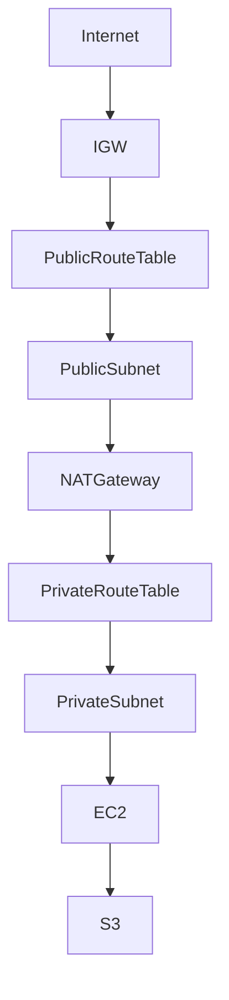
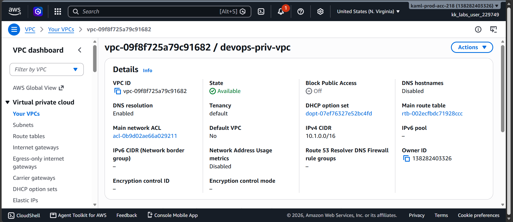
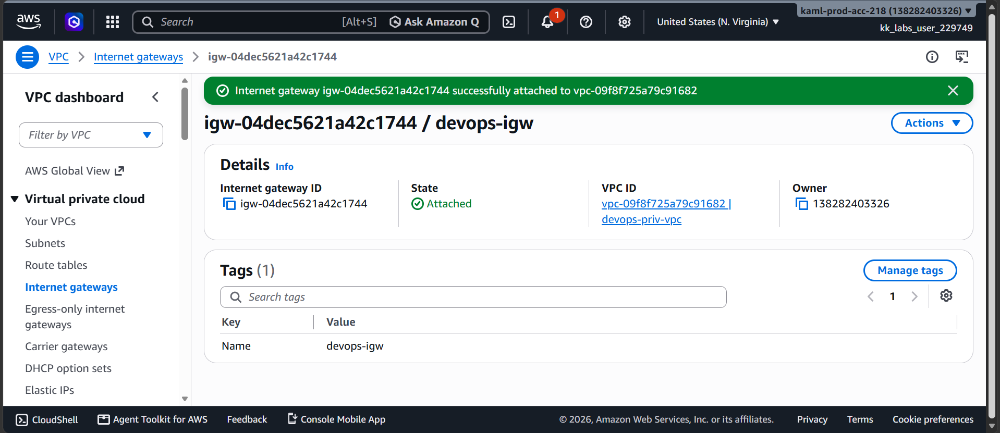
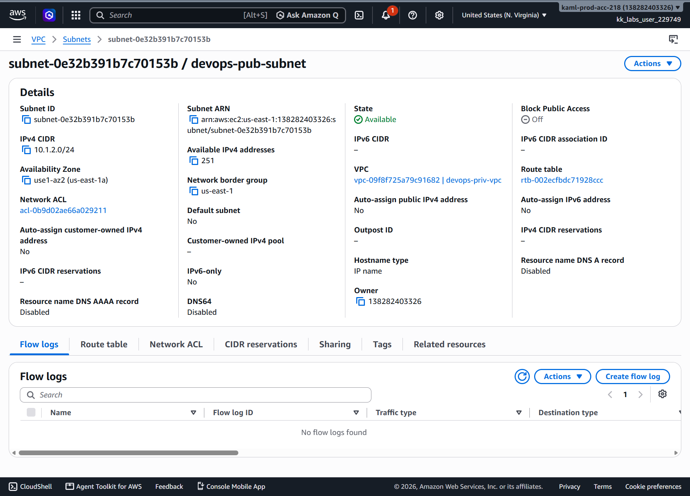
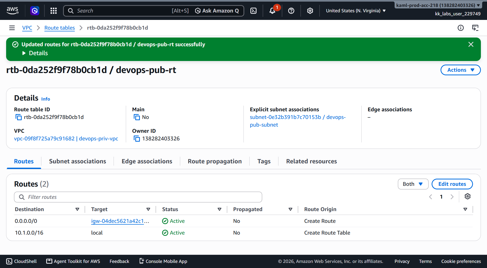
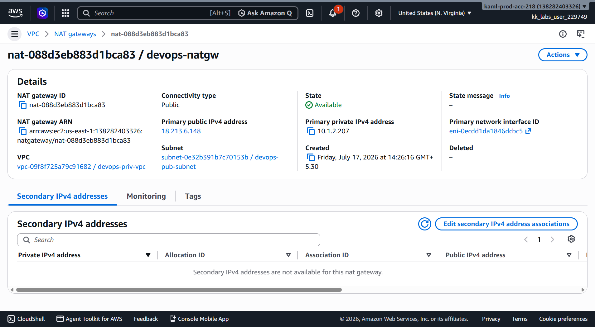
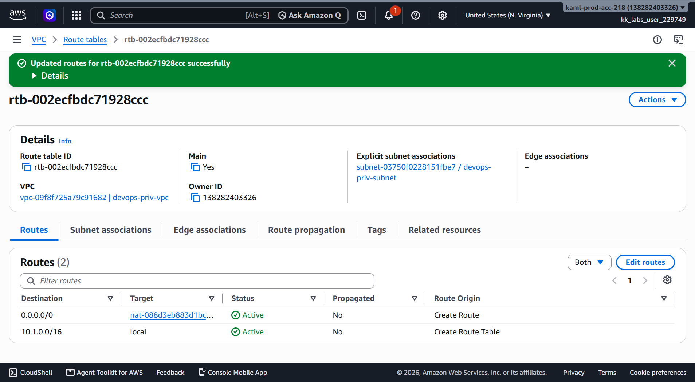
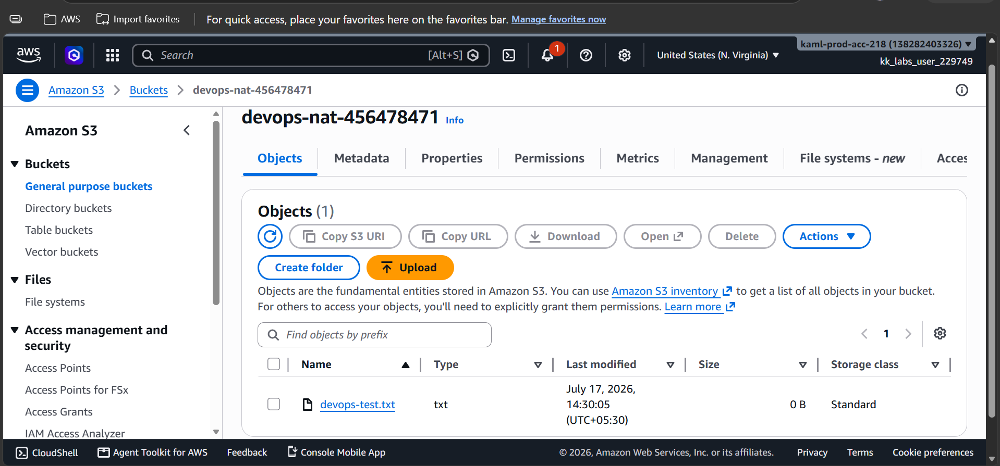
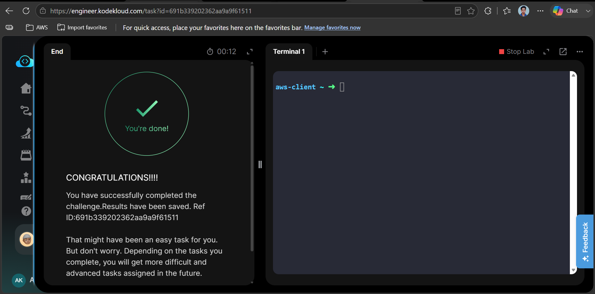

# 🌐 AWS Task 45 - Private Subnet Internet Access Using NAT Gateway


---

# 📋 Project Information

| Property | Value |
|----------|-------|
| **Project Name** | Private Subnet Internet Access Using NAT Gateway |
| **Task Number** | 45 |
| **Cloud Platform** | Amazon Web Services (AWS) |
| **Category** | VPC Networking |
| **Primary Services** | Amazon VPC, Public Subnet, Private Subnet, Internet Gateway, NAT Gateway, Route Tables, EC2, Amazon S3 |
| **Difficulty** | Intermediate |
| **Region** | us-east-1 |
| **Implementation** | AWS Management Console |
| **Completion Status** | ✅ Completed |

---

# 📖 Overview

This project demonstrates how to securely provide outbound internet access to an Amazon EC2 instance running inside a private subnet by deploying a NAT Gateway in a public subnet.

The solution uses a Public Subnet, Internet Gateway, Elastic IP, Route Tables, and a NAT Gateway to allow the private EC2 instance to access the internet without exposing it directly. Successful upload of a test file to Amazon S3 confirmed that outbound internet connectivity was working correctly.

---

# 🎯 Objective

- Create a Public Subnet.
- Create and attach an Internet Gateway.
- Create a Public Route Table.
- Associate the Public Subnet with the Public Route Table.
- Allocate an Elastic IP.
- Deploy a NAT Gateway.
- Configure the Private Route Table to use the NAT Gateway.
- Verify internet connectivity using Amazon S3.

---

# 🚀 Skills Demonstrated

- Amazon VPC Networking
- Public & Private Subnet Configuration
- Internet Gateway Configuration
- NAT Gateway Deployment
- Elastic IP Allocation
- Route Table Configuration
- Private EC2 Internet Connectivity
- Amazon S3 Connectivity Verification
- AWS Networking Troubleshooting

---

# ☁️ AWS Services Used

- Amazon VPC
- Public Subnet
- Private Subnet
- Route Tables
- Internet Gateway
- NAT Gateway
- Elastic IP
- Amazon EC2
- Amazon S3

---

# 🏗️ Architecture Diagram



---

# 📝 Steps Performed

1. Verified the existing VPC, Private Subnet, Route Table, and EC2 instance.
2. Created a Public Subnet in the same VPC.
3. Created and attached an Internet Gateway.
4. Created a Public Route Table.
5. Added the default route (0.0.0.0/0) pointing to the Internet Gateway.
6. Associated the Public Subnet with the Public Route Table.
7. Allocated an Elastic IP.
8. Created a Public NAT Gateway.
9. Updated the Private Route Table to use the NAT Gateway.
10. Explicitly associated the Private Subnet with the Private Route Table.
11. Verified outbound internet connectivity by confirming the uploaded test file in Amazon S3.
12. Successfully completed task validation.

---

# 💻 Commands Used

See:

```text
Commands/commands.md
```

---

# ⚠️ Troubleshooting

## Issue Encountered

During the first implementation attempt, task validation failed with the following error:

> **Private subnet is not associated with the private route table.**

### Cause

The private subnet was using the VPC Main Route Table through an implicit association. Although the EC2 instance successfully uploaded the test file to Amazon S3, the validator required the subnet to be explicitly associated with the private route table.

### Resolution

- Configured the Private Route Table with the NAT Gateway as the default route.
- Explicitly associated the Private Subnet with the Private Route Table.
- Revalidated the task successfully.

---

# 📚 Key Learnings

- Difference between Public and Private Subnets.
- Purpose of an Internet Gateway.
- Purpose of a NAT Gateway.
- Difference between Public and Private Route Tables.
- Elastic IP usage with NAT Gateway.
- Difference between implicit and explicit subnet associations.
- Secure outbound internet access for private EC2 instances.
- Using Amazon S3 to verify internet connectivity.

---

# 🔗 Related Concepts

- Amazon VPC
- Public Subnet
- Private Subnet
- Route Tables
- Internet Gateway
- NAT Gateway
- Elastic IP
- Amazon EC2
- Amazon S3

---

# 📸 Screenshots

## 01. VPC Overview

[](Screenshots/01-vpc-overview.png)

---

## 02. Internet Gateway

[](Screenshots/02-internet-gateway.png)

---

## 03. Public Subnet

[](Screenshots/03-public-subnet.png)

---

## 04. Public Route Table

[](Screenshots/04-public-route-table.png)

---

## 05. NAT Gateway

[](Screenshots/05-nat-gateway.png)

---

## 06. Private Route Table

[](Screenshots/06-private-route-table.png)

---

## 07. Amazon S3 Verification

[](Screenshots/07-s3-test-file.png)

---

## 08. Task Completed

[](Screenshots/08-task-completed.png)

---

# ✅ Result

Successfully configured outbound internet connectivity for an EC2 instance running in a private subnet using a NAT Gateway. The private EC2 instance successfully uploaded the test file to the designated Amazon S3 bucket, confirming secure outbound internet access. The implementation was successfully validated and the task was completed.