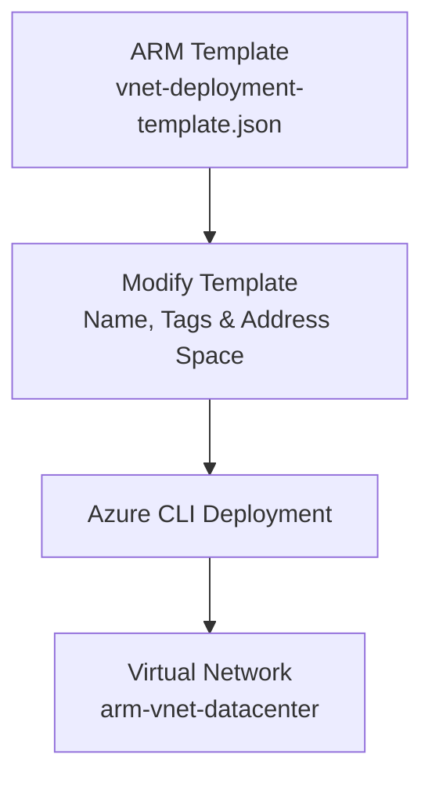
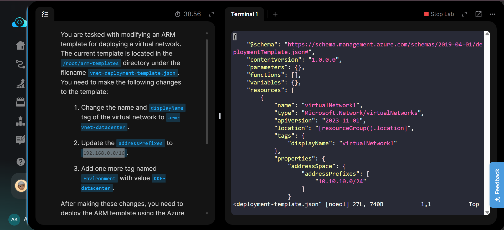
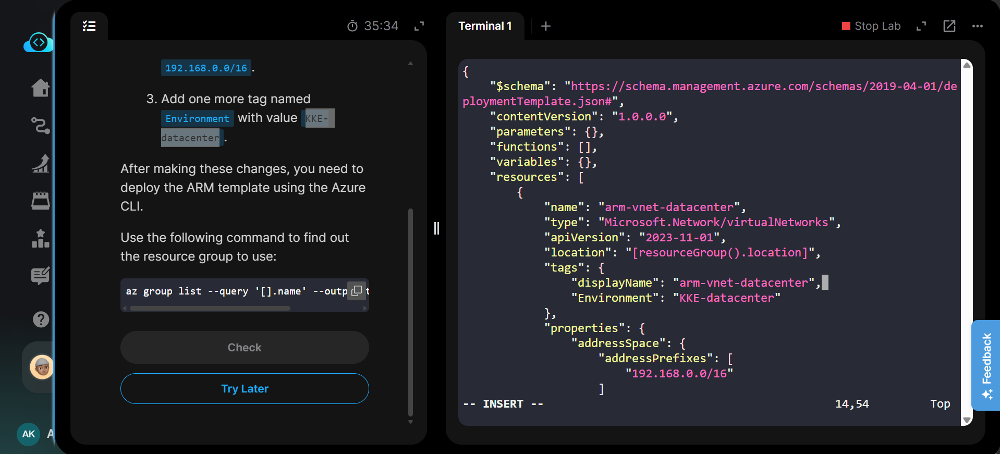
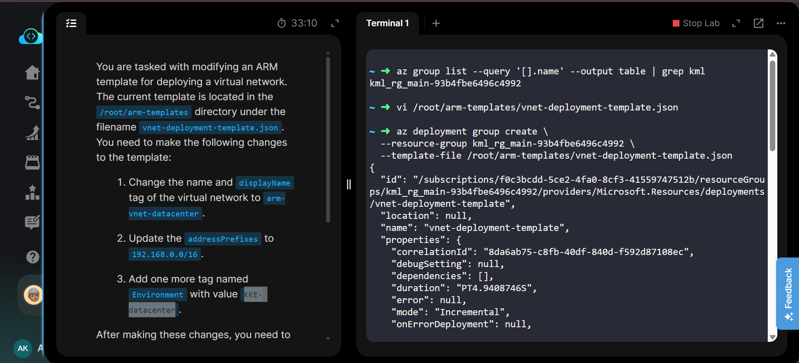
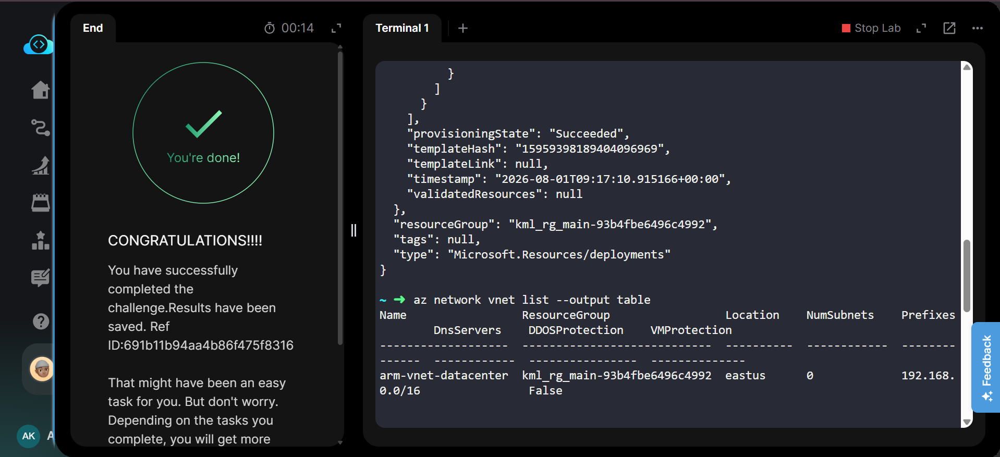

# Azure ARM Template - Modify and Deploy Virtual Network


---

# 📋 Project Information

| Property | Value |
|----------|-------|
| **Project** | Modify and Deploy Virtual Network ARM Template |
| **Platform** | Microsoft Azure |
| **Region** | East US |
| **Resource Group** | Existing Lab Resource Group |
| **Deployment Method** | Azure CLI |
| **Template File** | vnet-deployment-template.json |
| **Virtual Network** | arm-vnet-datacenter |
| **Address Space** | 192.168.0.0/16 |

---

# 📖 Overview

Azure Resource Manager (ARM) Templates provide an Infrastructure as Code (IaC) approach for deploying Azure resources in a repeatable and automated manner.

In this lab, an existing ARM template was modified by updating the virtual network name, display name tag, address space, and adding a new Environment tag. The modified template was then deployed successfully using the Azure CLI, resulting in a new virtual network named **arm-vnet-datacenter**.

---

# 🎯 Objective

- Modify an existing ARM template.
- Rename the Virtual Network.
- Update the address space.
- Add a new Environment tag.
- Deploy the template using Azure CLI.
- Verify successful deployment.

---

# 💡 Skills Demonstrated

- Azure ARM Templates
- Infrastructure as Code (IaC)
- Azure CLI Deployment
- Virtual Network Deployment
- JSON Template Editing
- Azure Resource Management

---

# ☁️ Azure Services Used

- Azure Resource Manager (ARM)
- Azure Virtual Network
- Azure CLI

---

# 🏗️ Architecture Diagram



---

# 📝 Steps Performed

1. Logged in to the Azure CLI.
2. Identified the target Resource Group.
3. Opened the ARM template using the Vim editor.
4. Updated the Virtual Network name to **arm-vnet-datacenter**.
5. Updated the **displayName** tag.
6. Changed the address space to **192.168.0.0/16**.
7. Added the **Environment = KKE-datacenter** tag.
8. Saved the modified template.
9. Deployed the ARM template using Azure CLI.
10. Verified successful deployment of the Virtual Network.

---

# 💻 Commands Used

This lab was performed primarily using the **Azure CLI** and **Vim Editor**.

Equivalent commands are available in:

```text
Commands/commands.md
```

---

# ⚠️ Troubleshooting

- Ensure the Resource Group name is correct.
- Validate JSON syntax before deployment.
- Verify all commas and brackets while editing.
- Wait for deployment completion before verification.

---

# 🐞 Debugging Notes

- Confirmed ARM template modifications before deployment.
- Verified deployment status returned **Succeeded**.
- Checked the deployed Virtual Network using Azure CLI.

---

# ✅ Best Practices

- Use ARM Templates for repeatable infrastructure deployments.
- Store templates in version control systems such as Git.
- Validate templates before deployment.
- Use descriptive resource names and tags.
- Automate deployments through Azure CLI or CI/CD pipelines.

---

# 📚 Key Learnings

- ARM Template editing
- Infrastructure as Code fundamentals
- Azure CLI deployment workflow
- Virtual Network provisioning
- Azure resource verification

---

# 🔗 Related Concepts

- Azure ARM Templates
- Azure CLI
- Azure Virtual Network
- Infrastructure as Code (IaC)
- JSON Templates

---

# 📸 Screenshots

### Task

[](Screenshots/01-task.png)

---

### Edit ARM Template

[](Screenshots/02-edit-arm-template.png)

---

### ARM Template Deployment

[](Screenshots/03-arm-template-deployment.png)

---

### Task Completed

[](Screenshots/04-task-completed.png)

---

# ✅ Result

Successfully modified the ARM template by updating the Virtual Network name, display name tag, address space, and Environment tag. The template was deployed successfully using Azure CLI, creating the **arm-vnet-datacenter** Virtual Network.