# 🚀 Azure Application Gateway - Load Balancing Between Multiple Virtual Machines


---

# 📋 Project Information

| Item | Details |
|------|---------|
| Project | Azure Application Gateway Load Balancing |
| Task No. | 50 |
| Cloud | Microsoft Azure |
| Region | East US |
| Virtual Network | devops-vnet |
| VM1 | devops-vm1 |
| VM2 | devops-vm2 |
| Application Gateway | devops-apgw |

---

# 📖 Overview

This project demonstrates how to deploy multiple Azure Virtual Machines behind an Azure Application Gateway and distribute incoming HTTP traffic across the backend virtual machines.

Each backend VM hosts a different version of a static website using Nginx. Azure Application Gateway acts as the Layer 7 Load Balancer, routing client requests to the available backend servers.

---

# 🎯 Objective

- Create an Azure Virtual Network
- Create dedicated subnets for Virtual Machines and Application Gateway
- Deploy two Ubuntu Virtual Machines
- Configure Nginx on both VMs
- Create different web pages on each VM
- Deploy Azure Application Gateway
- Configure Backend Pool
- Configure HTTP Listener
- Configure Backend HTTP Settings
- Configure Routing Rule
- Validate Layer 7 Load Balancing

---

# 💡 Skills Demonstrated

- Azure Virtual Networking
- Azure Virtual Machines
- Azure Application Gateway
- Backend Pool Configuration
- HTTP Listener
- Routing Rules
- Layer 7 Load Balancing
- Linux Administration
- SSH Authentication
- Nginx Configuration

---

# ☁️ Azure Services Used

- Azure Virtual Network
- Azure Subnet
- Azure Virtual Machine
- Azure Application Gateway
- Azure Public IP
- Azure Network Interface

---

# 🏗 Architecture Diagram

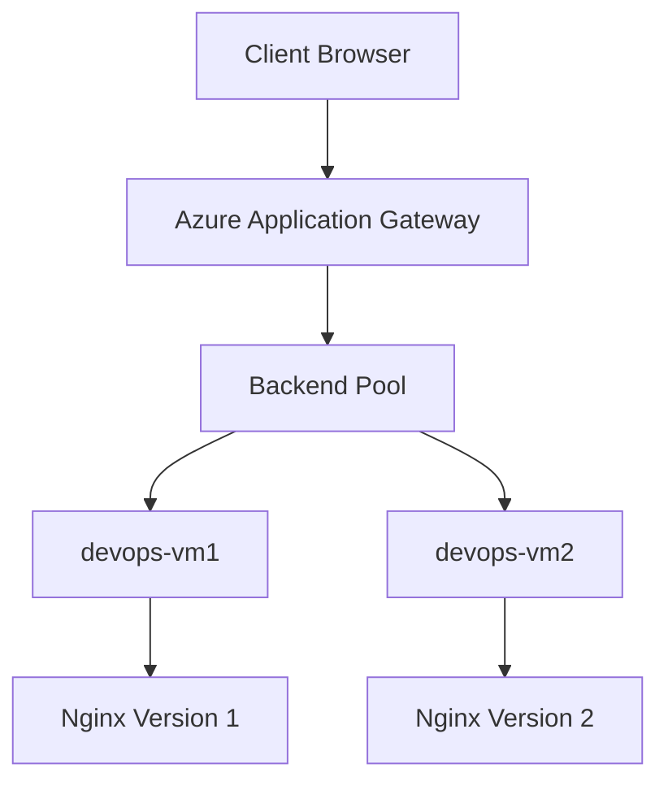

---

# ⚙️ Steps Performed

1. Generated SSH Key Pair.
2. Created Azure Virtual Network.
3. Created Virtual Machine subnet.
4. Created dedicated Application Gateway subnet.
5. Deployed Virtual Machine 1.
6. Deployed Virtual Machine 2.
7. Installed Nginx on both Virtual Machines.
8. Configured Version 1 webpage on VM1.
9. Configured Version 2 webpage on VM2.
10. Created Azure Application Gateway.
11. Created Public Frontend IP.
12. Configured Backend Pool.
13. Added both Virtual Machines.
14. Created HTTP Listener.
15. Configured Backend HTTP Settings.
16. Created Routing Rule.
17. Verified traffic distribution.
18. Validated Application Gateway Load Balancing.

---

# 💻 Commands Used

Complete command reference is available here:

```text
Commands/commands.md
```

---

# 🛠 Troubleshooting

| Issue | Resolution |
|--------|------------|
| Application Gateway SKU not allowed | Changed SKU from Standard V2 to Basic (Lab Policy) |
| Application Gateway deployment failed | Used dedicated Application Gateway subnet |
| Backend Pool not detected | Added Virtual Machines before Routing Rule |
| Incorrect web page displayed | Verified Nginx configuration and index.html |

---

# 🐞 Debugging Notes

During deployment, Azure Policy blocked the Standard V2 SKU because the Azure Free Labs environment only allows the Basic SKU for Application Gateway.

After changing the SKU to Basic, the deployment completed successfully without requiring any additional configuration changes.

---

# ✅ Best Practices

- Use a dedicated subnet for Application Gateway.
- Use SSH key authentication instead of passwords.
- Keep backend servers inside private subnets whenever possible.
- Validate backend servers before configuring the Application Gateway.
- Verify backend pool health before testing traffic.
- Use Layer 7 routing for HTTP applications.

---

# 📚 Key Learnings

- Azure Application Gateway architecture
- Backend Pool configuration
- HTTP Listener
- Backend HTTP Settings
- Routing Rules
- Layer 7 Load Balancing
- Nginx deployment
- Multi-VM architecture
- Azure networking

---

# 🔗 Related Concepts

- Azure Load Balancer
- Azure Application Gateway
- Azure Front Door
- Nginx
- Layer 7 Routing
- Virtual Network
- Subnet
- Backend Pool
- Reverse Proxy

---

# 📸 Screenshots

| Screenshot | Preview |
|------------|---------|
| VNet Created | <a href="Screenshots/01-vnet-created.png"></a> |
| VNet Subnets | <a href="Screenshots/02-vnet-subnets.png">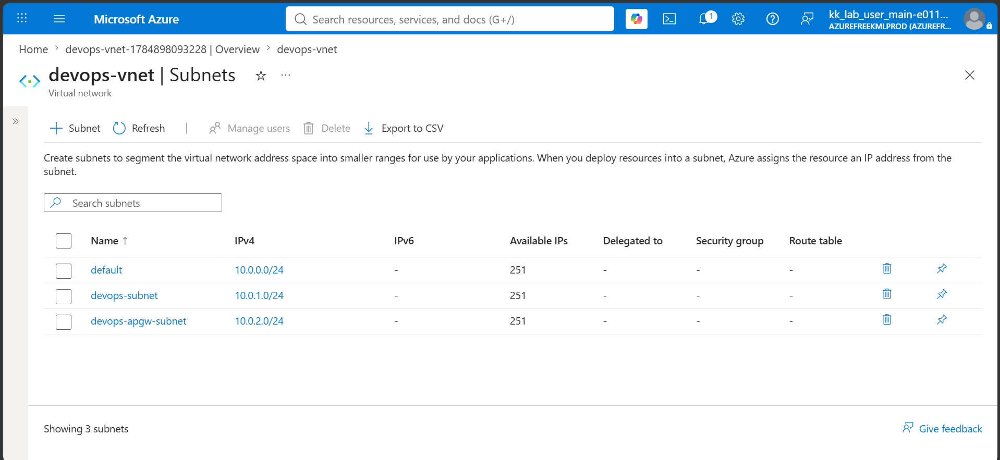</a> |
| SSH Key Generated | <a href="Screenshots/03-ssh-key-generated.png">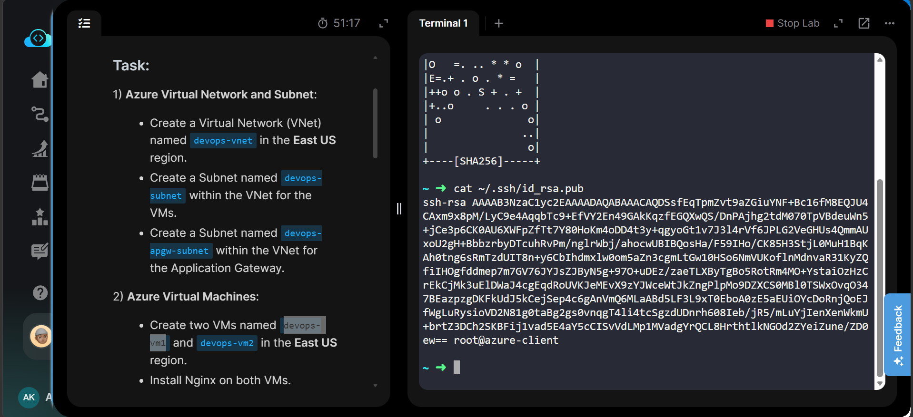</a> |
| VM1 Created | <a href="Screenshots/04-vm1-created.png">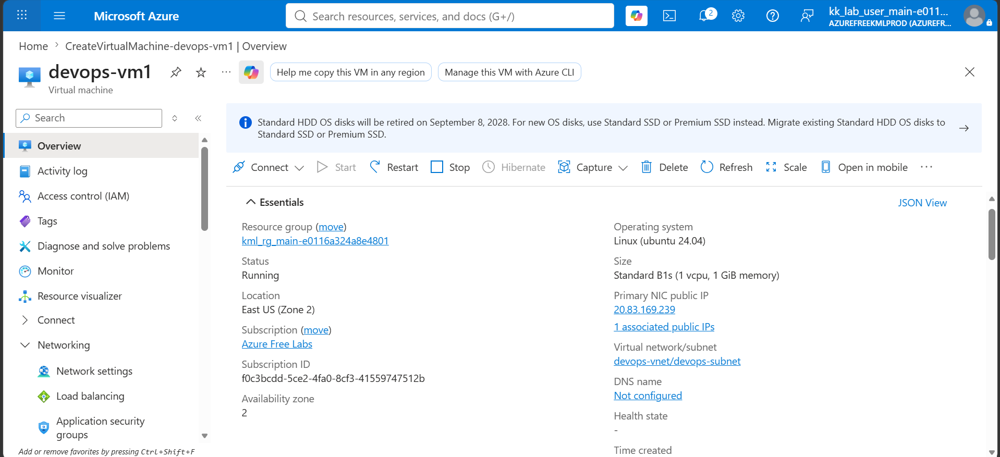</a> |
| VM2 Created | <a href="Screenshots/05-vm2-created.png">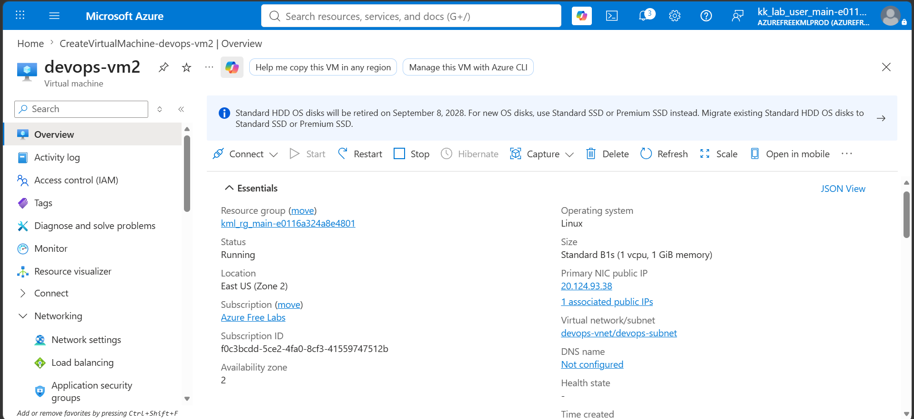</a> |
| VM1 Nginx Configured | <a href="Screenshots/06-nginx-configured-vm1.png">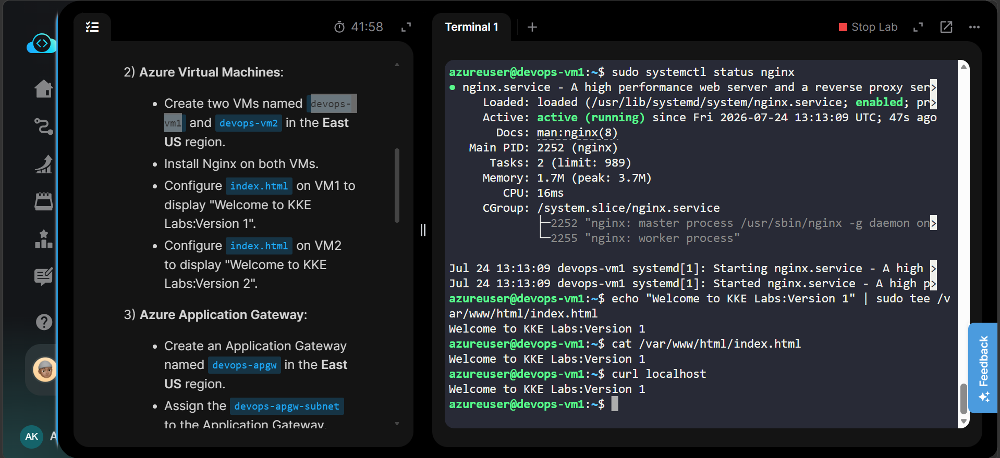</a> |
| VM2 Nginx Configured | <a href="Screenshots/07-nginx-configured-vm2.png">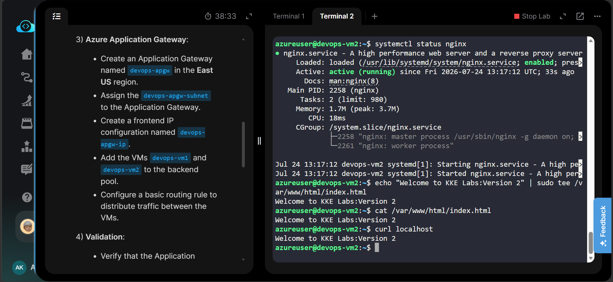</a> |
| Routing Rule Created | <a href="Screenshots/08-routing-rule-created.png"></a> |
| Application Gateway Created | <a href="Screenshots/09-application-gateway-created.png">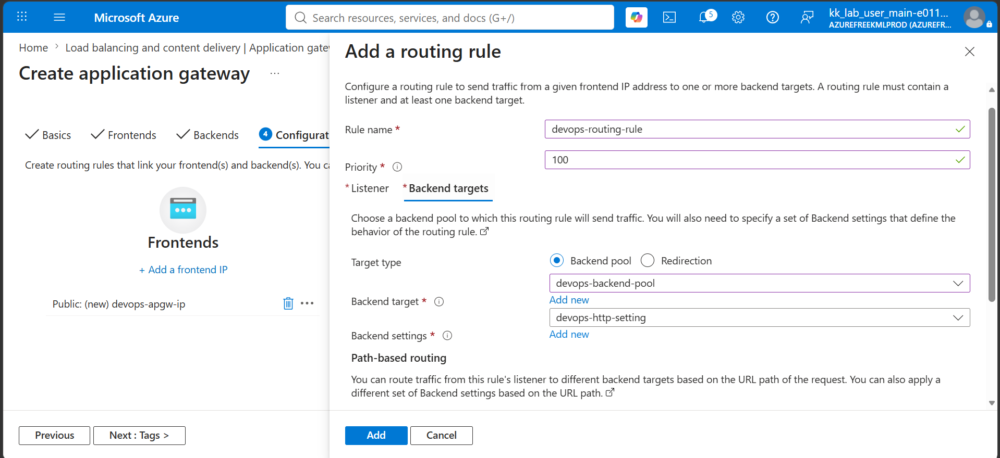</a> |
| Load Balancing - Version 1 | <a href="Screenshots/10-load-balancing-version1.png">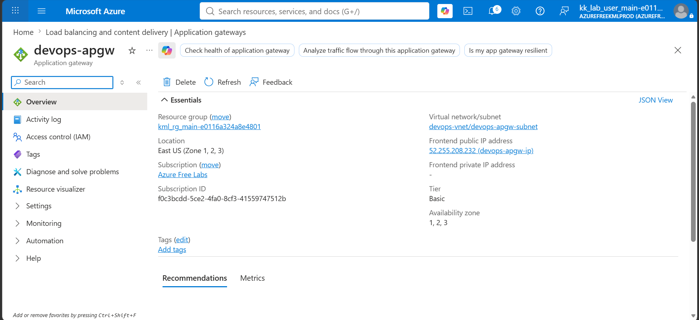</a> |
| Load Balancing - Version 2 | <a href="Screenshots/11-load-balancing-version2.png">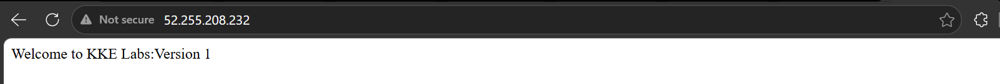</a> |
| Task Completed | <a href="Screenshots/12-task-completed.png">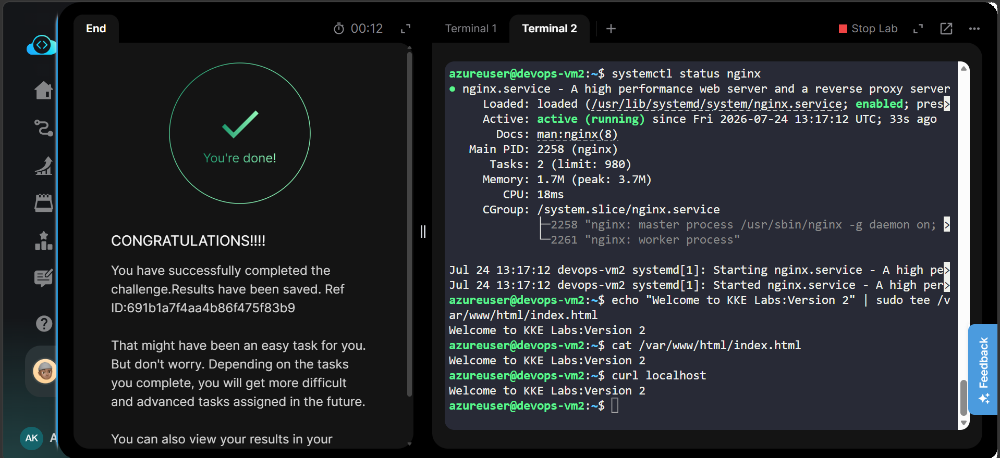</a> |

---

# 🎉 Result

Successfully deployed an Azure Application Gateway to distribute incoming HTTP traffic across two backend Ubuntu Virtual Machines. Each VM hosted a different version of a static web application using Nginx. The Application Gateway was configured with a dedicated subnet, frontend public IP, backend pool, HTTP listener, backend HTTP settings, and routing rule. Traffic distribution was successfully validated by observing alternating responses from Version 1 and Version 2 webpages.