# 🚀 Azure Container Registry (ACR) - Docker, Blob Storage & Virtual Machine Integration


---

# 📋 Project Information

| Item | Details |
|------|---------|
| Project | Azure Container Registry Docker Integration |
| Task No. | 48 |
| Cloud | Microsoft Azure |
| Region | East US |
| VM | nautilus-vm |
| ACR | nautilusacr7556 |
| Storage Account | nautilusstor7556 |
| Blob Container | nautilus-config |

---

# 📖 Overview

This project demonstrates how to build a Docker application, store it in Azure Container Registry (ACR), deploy it to an Azure Virtual Machine, and integrate it with Azure Blob Storage for application configuration.

The application image was built locally, pushed to Azure Container Registry, pulled from the VM, and successfully executed on port 80.

---

# 🎯 Objective

- Create Azure Container Registry
- Build Docker image
- Push Docker image to ACR
- Create Storage Account
- Upload configuration file to Blob Storage
- Deploy Docker container on Azure VM
- Validate application accessibility through browser

---

# 💡 Skills Demonstrated

- Azure Container Registry (ACR)
- Docker Image Build
- Docker Image Push/Pull
- Azure Blob Storage
- Azure Virtual Machine
- Azure CLI
- Linux
- SSH Authentication
- Docker Volume Mounting
- Troubleshooting

---

# ☁️ Azure Services Used

- Azure Container Registry
- Azure Virtual Machine
- Azure Storage Account
- Azure Blob Storage
- Azure CLI

---

# 🏗 Architecture Diagram

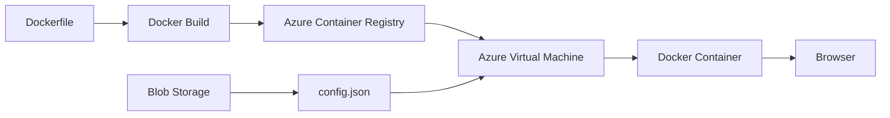

---

# ⚙️ Steps Performed

1. Created Azure Container Registry.
2. Built Docker image from Dockerfile.
3. Tagged and pushed image to Azure Container Registry.
4. Created Azure Storage Account.
5. Created Blob Container.
6. Uploaded config.json.
7. Created Azure Virtual Machine.
8. Installed Docker.
9. Installed Azure CLI.
10. Logged into Azure.
11. Logged into Azure Container Registry.
12. Pulled Docker image.
13. Ran Docker container.
14. Downloaded config.json from Blob Storage.
15. Mounted config.json inside Docker container.
16. Validated application through browser.

---

# 💻 Commands Used

All commands are available here:

```text
Commands/commands.md
```

---

# 🛠 Troubleshooting

| Issue | Resolution |
|--------|------------|
| Docker permission denied | Added user to docker group and reconnected |
| ACR login failed | Logged in using Azure CLI before ACR authentication |
| config.json missing | Downloaded file from Azure Blob Storage |
| Flask returned 500 Internal Server Error | Mounted config.json inside Docker container |

---

# 🐞 Debugging Notes

The application initially returned:

```
500 Internal Server Error
```

Docker logs revealed:

```
FileNotFoundError: config.json
```

The configuration file existed in Azure Blob Storage but not inside the container.

The issue was resolved by:

- Downloading config.json
- Mounting it into `/app/config.json`
- Restarting the container

---

# ✅ Best Practices

- Store Docker images in Azure Container Registry.
- Never hardcode configuration files inside Docker images.
- Use Azure Blob Storage for external configuration.
- Keep secrets outside Docker images.
- Validate Docker containers before deployment.

---

# 📚 Key Learnings

- Azure Container Registry workflow
- Docker image lifecycle
- Blob Storage integration
- Azure CLI authentication
- Docker troubleshooting
- Volume mounting
- Flask debugging

---

# 🔗 Related Concepts

- Docker
- Azure CLI
- Azure Storage
- Azure Blob Storage
- Azure Virtual Machine
- Azure Container Registry
- Linux

---

# 📸 Screenshots

| Screenshot | Preview |
|------------|---------|
| ACR Overview | <a href="Screenshots/01-acr-overview.png">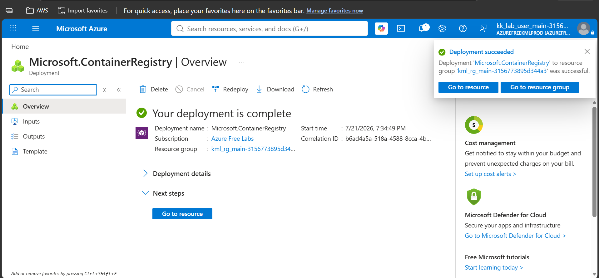</a> |
| ACR Created | <a href="Screenshots/02-acr-created.png">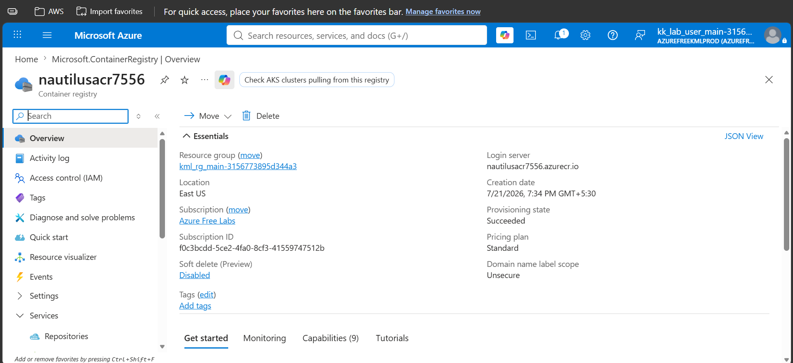</a> |
| Docker Build | <a href="Screenshots/03-docker-build.png">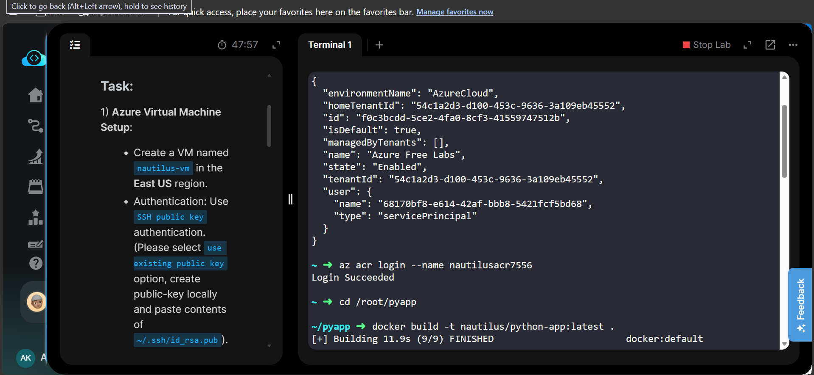</a> |
| Docker Push | <a href="Screenshots/03.1-docker-pushed.png">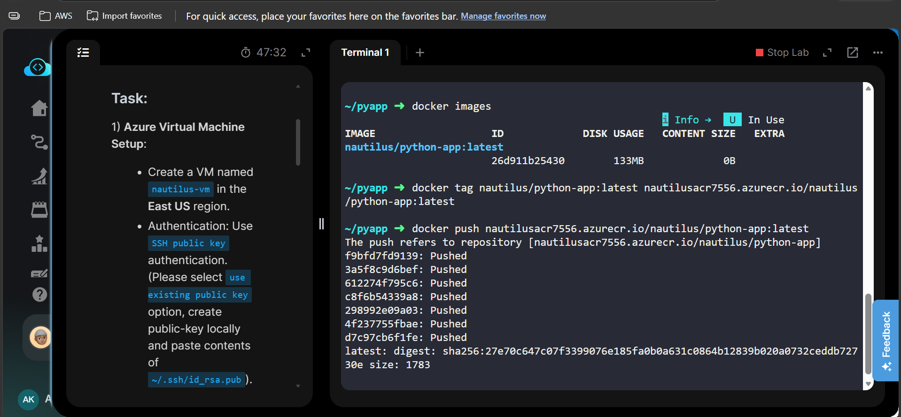</a> |
| ACR Repository | <a href="Screenshots/04-acr-repository.png">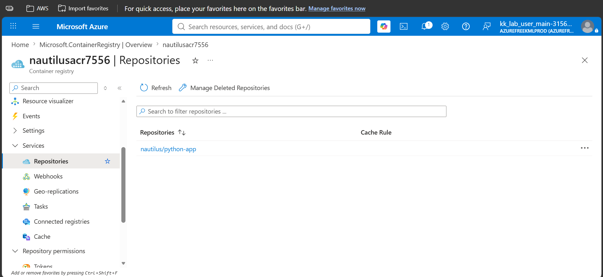</a> |
| Image Pushed | <a href="Screenshots/05-image-pushed.png">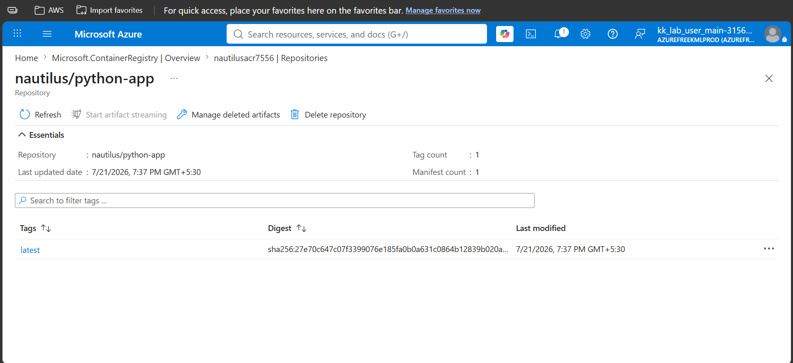</a> |
| Storage Account | <a href="Screenshots/06-storage-account-overview.png">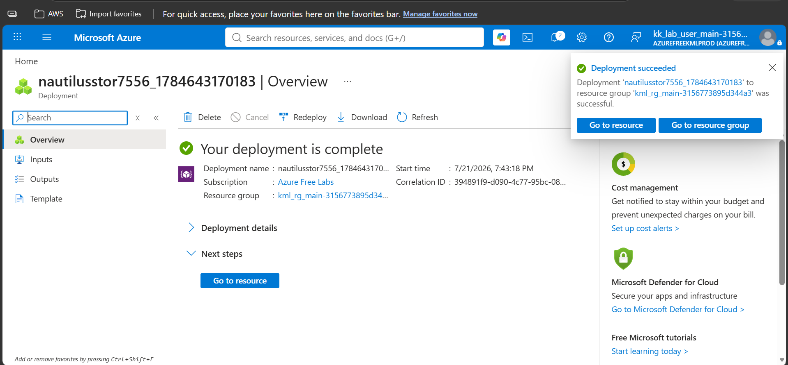</a> |
| Blob Container | <a href="Screenshots/07-blob-container-created.png">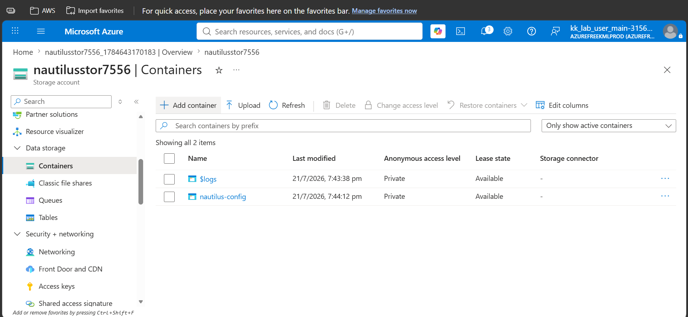</a> |
| Config Uploaded | <a href="Screenshots/08-config-uploaded.png">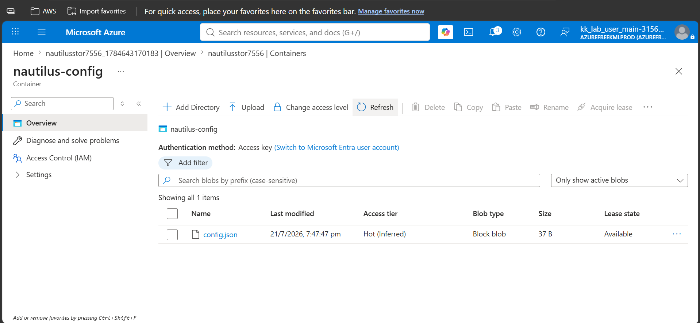</a> |
| VM Overview | <a href="Screenshots/09-vm-overview.png">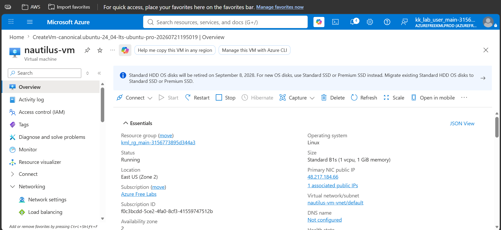</a> |
| Docker & Azure CLI | <a href="Screenshots/10-docker-and-azure-cli-installed.png">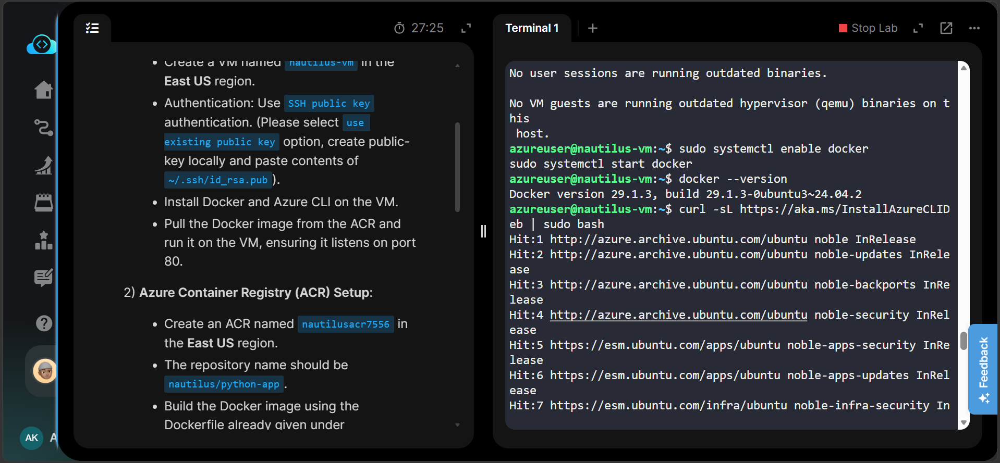</a> |
| Azure Login | <a href="Screenshots/11-azure-login.png">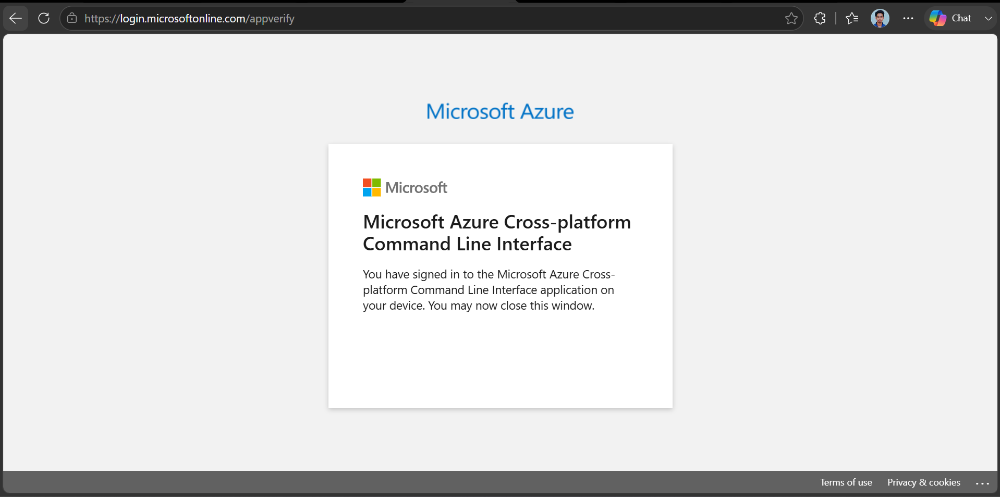</a> |
| Image Pulled | <a href="Screenshots/12-image-pulled.png">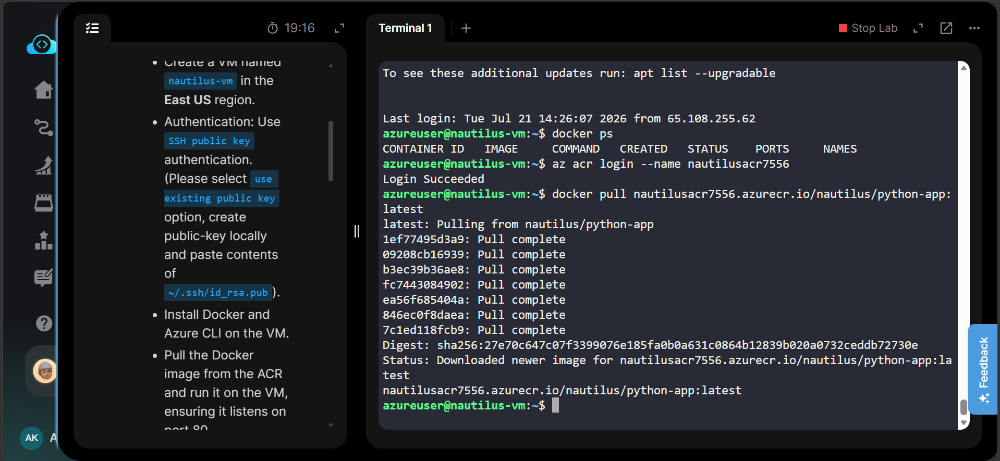</a> |
| Docker Running | <a href="Screenshots/13-docker-running.png">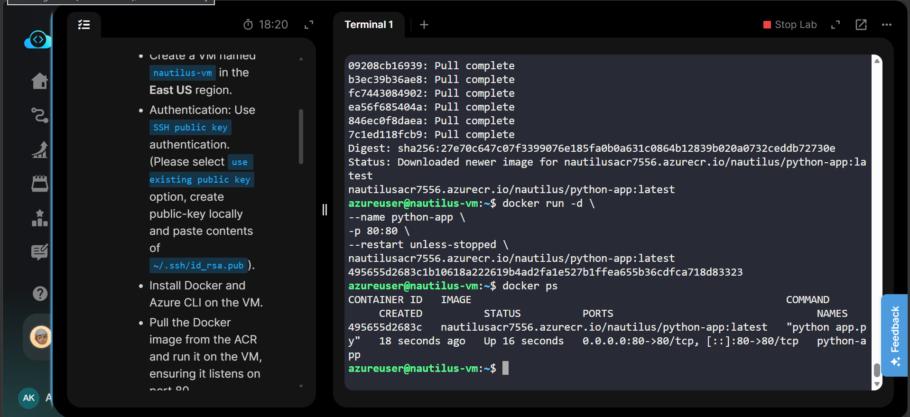</a> |
| Browser Output | <a href="Screenshots/14-browser-output.png">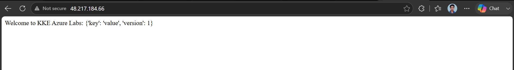</a> |
| Task Completed | <a href="Screenshots/15-task-completed.png">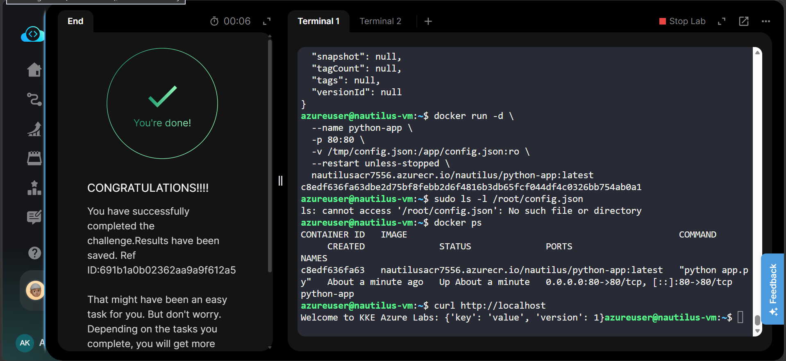</a> |

---

# 🎉 Result

Successfully deployed a Docker-based Python application on an Azure Virtual Machine using Azure Container Registry. The application was integrated with Azure Blob Storage for configuration management and successfully validated through browser access after troubleshooting and resolving configuration issues.