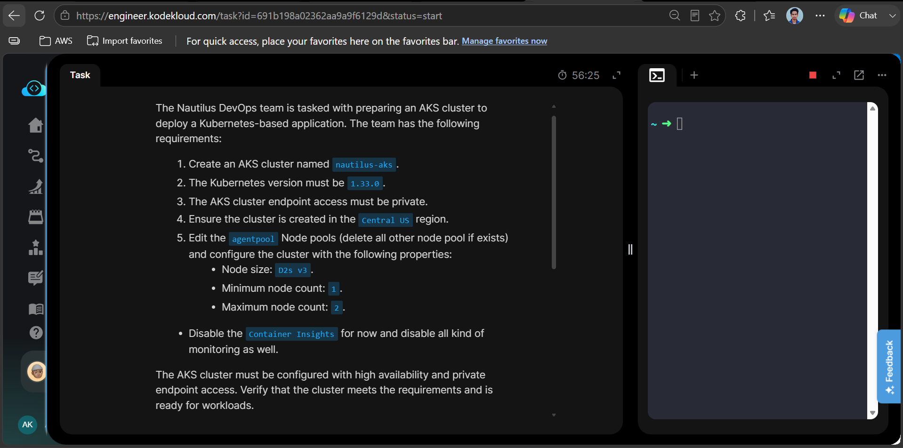
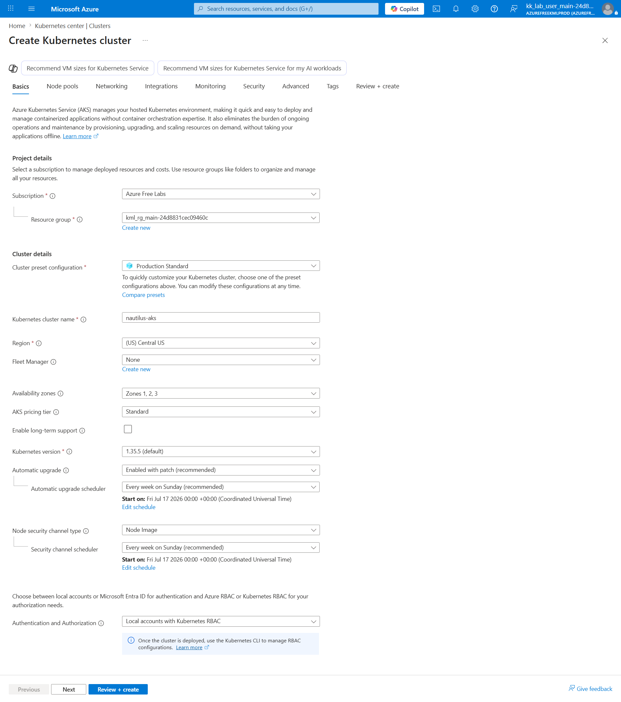
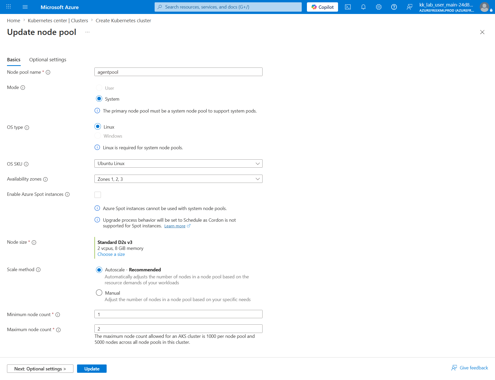
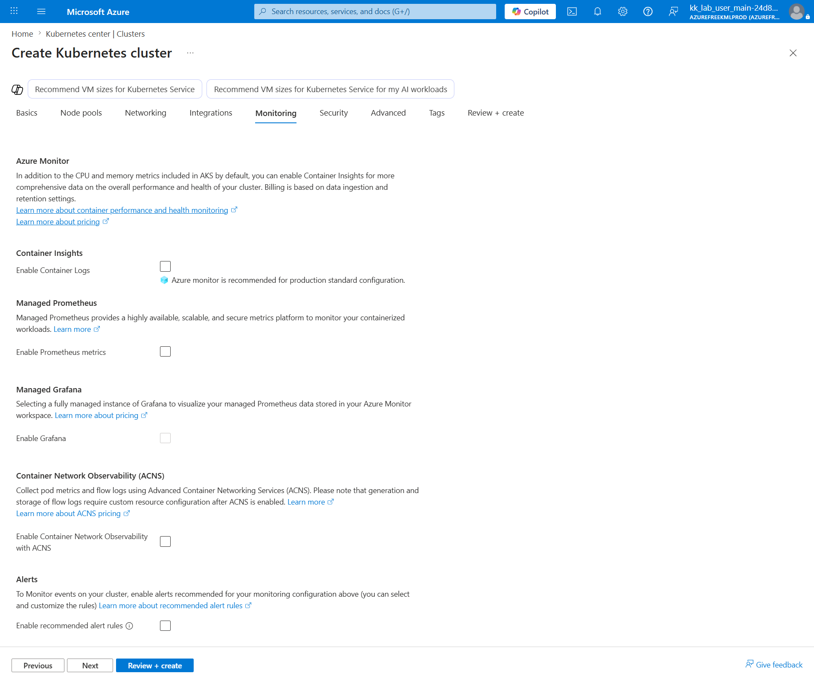
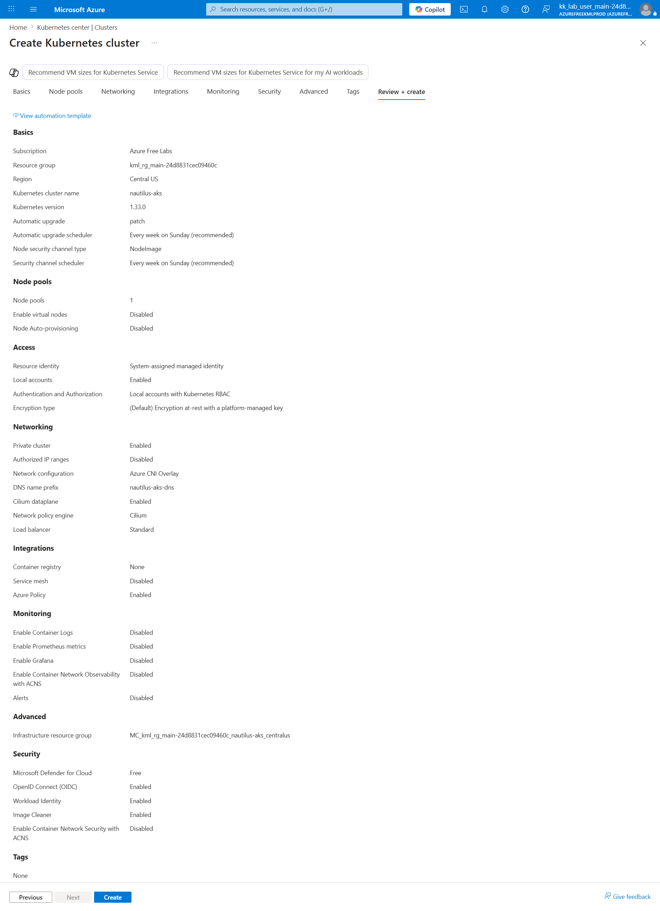
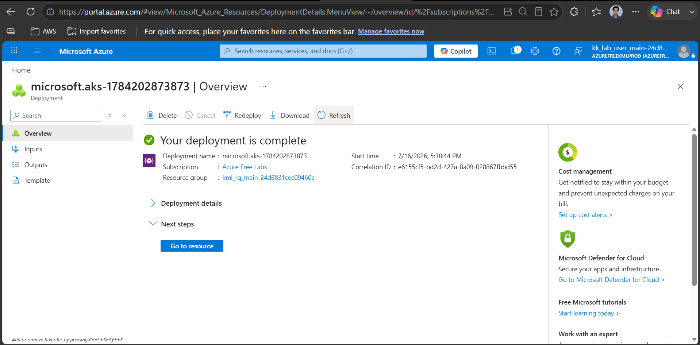
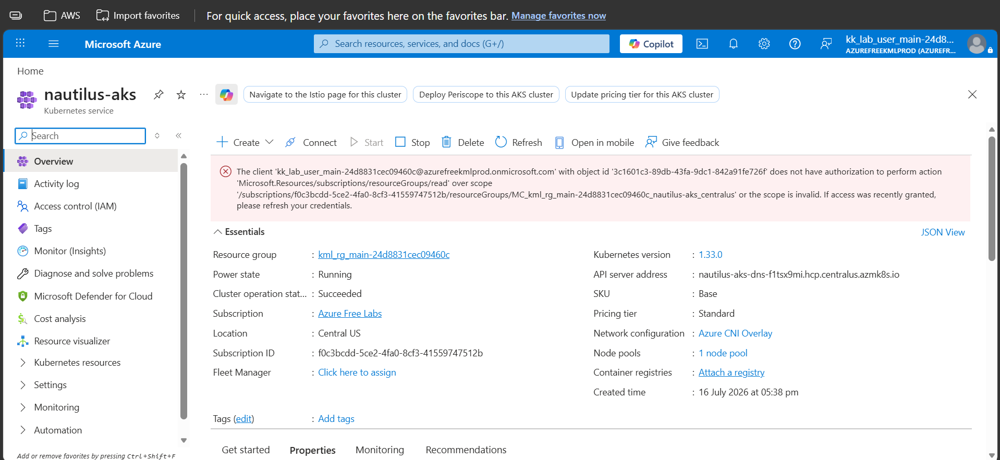
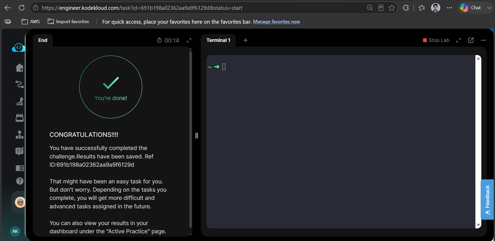

# Azure Task 45 - Azure Kubernetes Service (AKS) Private Cluster


---

# Overview

In this task, an Azure Kubernetes Service (AKS) cluster was created to host Kubernetes workloads. The cluster was configured as a private cluster with autoscaling, a single system node pool, and monitoring disabled according to the provided requirements.

---

# Objective

- Create an AKS cluster named **nautilus-aks**
- Use Kubernetes version **1.33.0**
- Deploy the cluster in **Central US**
- Configure a private API server endpoint
- Configure the node pool
- VM Size: **Standard_D2s_v3**
- Minimum Nodes: **1**
- Maximum Nodes: **2**
- Disable Container Insights
- Disable all monitoring services
- Verify the cluster deployment

---

# Azure Services Used

- Azure Kubernetes Service (AKS)
- Azure Virtual Machine Scale Sets (Managed Node Pool)
- Azure Virtual Network
- Azure Private Endpoint
- Azure Resource Group

---

# Architecture

```
                   Azure Portal
                        │
                        ▼
            Azure Kubernetes Service
                        │
          ┌─────────────┴─────────────┐
          │                           │
 Private API Server           System Node Pool
                                    │
                             Standard_D2s_v3
                               Min Nodes : 1
                               Max Nodes : 2
                                    │
                            Kubernetes Workloads
```

---

# Steps Performed

## Step 1

Opened Azure Kubernetes Service.

Created a new AKS cluster.

---

## Step 2

Configured the cluster.

- Cluster Name: nautilus-aks
- Region: Central US
- Kubernetes Version: 1.33.0

---

## Step 3

Configured the system node pool.

- VM Size: Standard_D2s_v3
- Autoscaling Enabled
- Minimum Nodes: 1
- Maximum Nodes: 2

Deleted all additional node pools if present.

---

## Step 4

Configured networking.

- Private Cluster Enabled
- Private API Server Endpoint Enabled

---

## Step 5

Disabled monitoring.

- Container Insights
- Managed Prometheus
- Managed Grafana
- Container Network Observability
- Alerts

---

## Step 6

Validated all configurations.

Created the cluster.

---

## Step 7

Verified

- Cluster Status
- Kubernetes Version
- Private Endpoint
- Node Pool Configuration

Task completed successfully.

---

# Commands

No Azure CLI commands were used.

The complete task was performed using the Azure Portal.

---

# Troubleshooting

## Long Deployment Time

AKS deployment may take several minutes because Azure provisions:

- Control Plane
- Node Pool
- Managed Identity
- Virtual Network
- Load Balancer
- Private Endpoint

---

## Private Cluster

Private API server access must remain enabled.

---

## Monitoring

Ensure all monitoring services remain disabled as required.

---

# Key Learnings

- Created an AKS cluster using Azure Portal.
- Configured a private Kubernetes API endpoint.
- Configured autoscaling node pools.
- Understood the difference between system and user node pools.
- Learned how Azure provisions a managed Kubernetes control plane.
- Learned how to disable monitoring services during deployment.

---

# Screenshots

## 01. Task Requirements

[](Screenshots/01-task-requirements.png)

---

## 02. Cluster Basics

[](Screenshots/02-cluster-basics.png)

---

## 03. Node Pool Configuration

[](Screenshots/03-node-pool-configuration.png)

---

## 04. Monitoring Disabled

[](Screenshots/04-monitoring-disabled.png)

---

## 05. Review + Create

[](Screenshots/05-review-create.png)

---

## 06. Deployment Success

[](Screenshots/06-deployment-success.png)

---

## 07. AKS Overview

[](Screenshots/07-aks-overview.png)

---

## 08. Task Completed

[](Screenshots/08-task-completed.png)

---

# Result

Successfully deployed a private Azure Kubernetes Service (AKS) cluster named **nautilus-aks** in the **Central US** region with Kubernetes version **1.33.0**, configured autoscaling node pools, disabled monitoring services, and verified the cluster was ready for Kubernetes workloads.