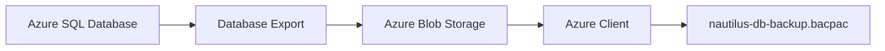
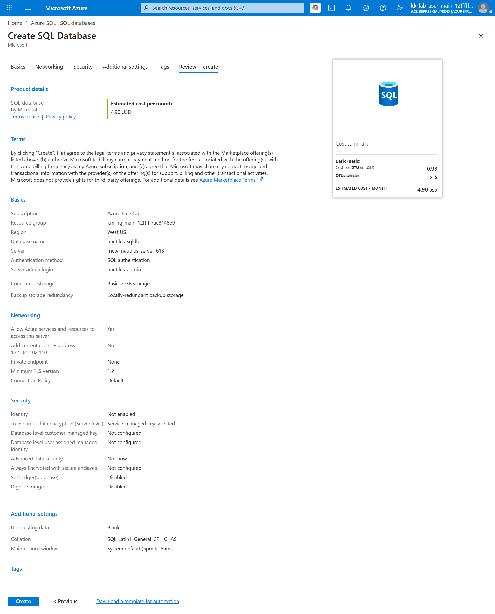
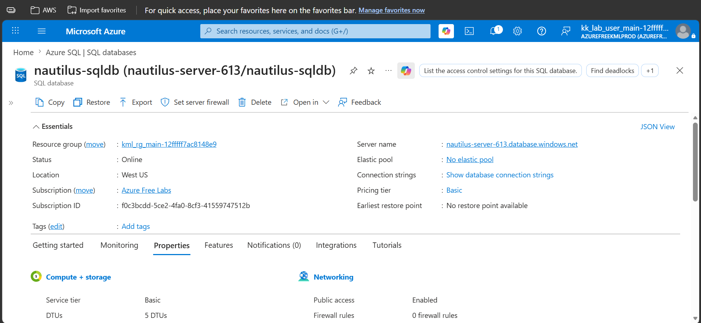
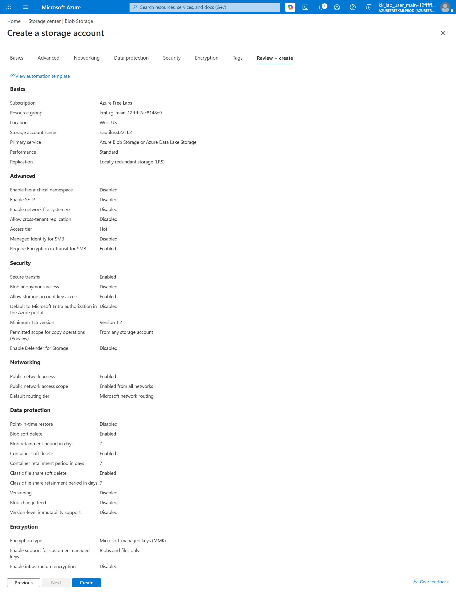
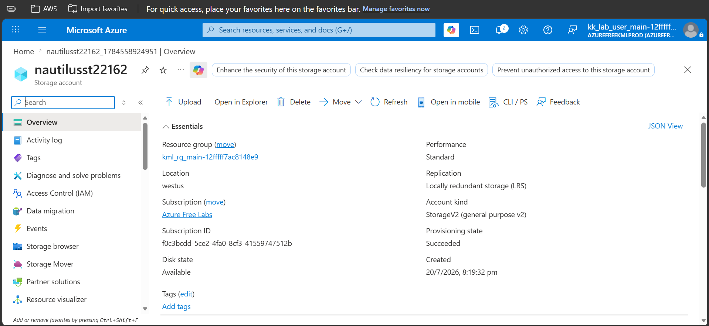
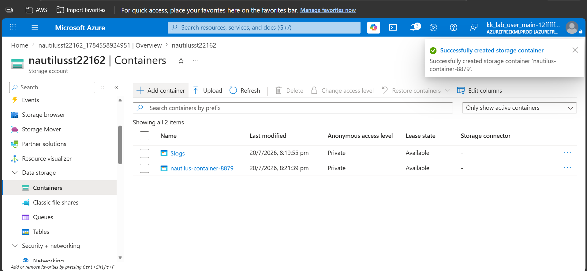
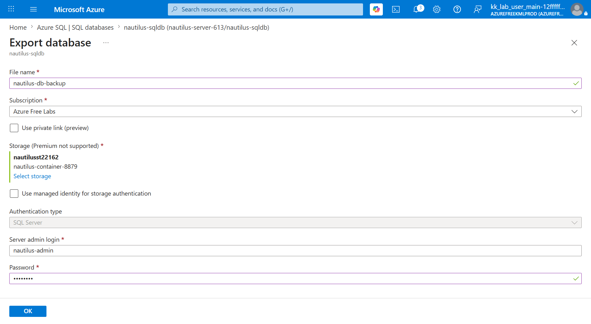
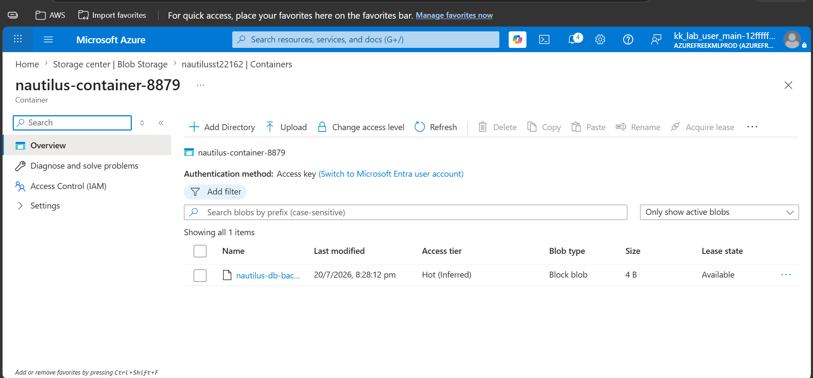
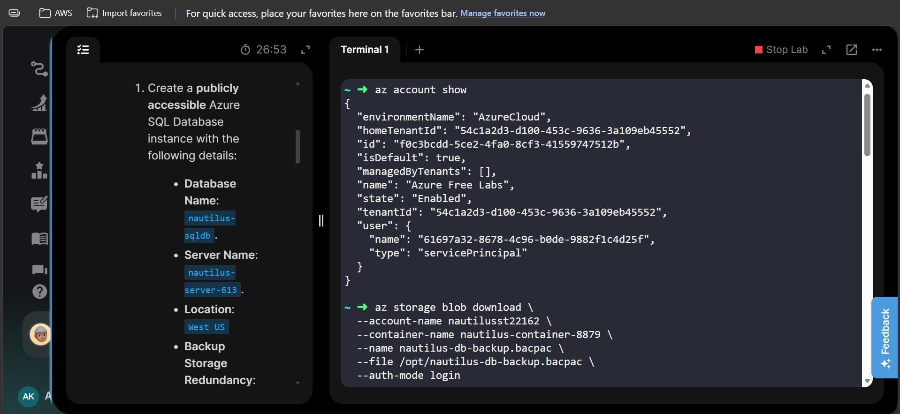
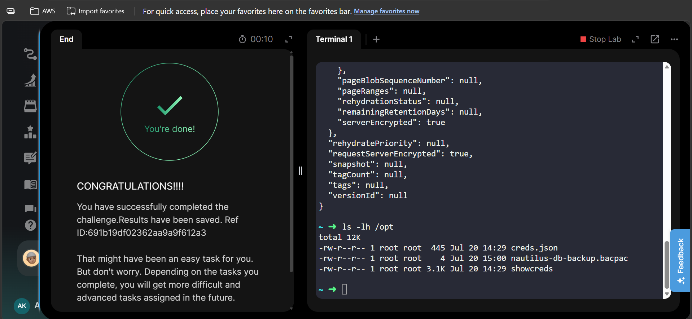

# Azure SQL Database - Backup and Recovery


---

# 📋 Project Information

| Property | Value |
|----------|-------|
| Project | Azure SQL Database Backup and Recovery |
| Platform | Microsoft Azure |
| Region | West US |
| SQL Server | nautilus-server-613 |
| SQL Database | nautilus-sqldb |
| Storage Account | nautilusst22162 |
| Blob Container | nautilus-container-8879 |
| Backup File | nautilus-db-backup.bacpac |
| Purpose | Export Azure SQL Database to Azure Blob Storage and download the backup |

---

# 📖 Overview

This project demonstrates how to deploy an Azure SQL Database, export it as a BACPAC backup into Azure Blob Storage, and download the backup file to an Azure client host. It showcases a common cloud database backup workflow used for disaster recovery, migration, and long-term archival.

---

# 🎯 Objective

- Create an Azure SQL Database.
- Create an Azure SQL Server.
- Create a Storage Account.
- Create a Blob Container.
- Export the Azure SQL Database.
- Store the backup inside Azure Blob Storage.
- Download the backup to the Azure client host.
- Verify successful backup.

---

# 🚀 Skills Demonstrated

- Azure SQL Database
- Azure SQL Server
- Azure Blob Storage
- Azure Storage Account
- Azure CLI
- Database Backup
- Database Export
- BACPAC Management
- Backup Verification

---

# ☁️ Services Used

- Azure SQL Database
- Azure SQL Server
- Azure Blob Storage
- Azure Storage Account

---

# 🏗️ Architecture Diagram



---

# 📝 Steps Performed

1. Created Azure SQL Server.
2. Created Azure SQL Database.
3. Verified database status.
4. Created Storage Account.
5. Created Blob Container.
6. Exported SQL Database as a BACPAC file.
7. Stored the backup inside Azure Blob Storage.
8. Downloaded the backup using Azure CLI.
9. Verified the downloaded file inside `/opt`.
10. Completed the task successfully.

---

# 💻 Commands Used

See:

```text
Commands/commands.md
```

---

# ⚠️ Troubleshooting

### Issue

Database export requires SQL Server authentication.

### Resolution

Configured SQL Authentication using:

- SQL Server Admin Login
- SQL Server Password

before exporting the database.

---

# 🐞 Debugging Notes

During verification:

- Confirmed SQL Database status was **Online**.
- Verified the BACPAC file was generated inside the Blob Container.
- Used Azure CLI to download the backup.
- Verified the downloaded file inside `/opt`.

---

# 💡 Best Practices

- Store database backups inside dedicated Blob Containers.
- Use Locally Redundant Storage (LRS) for cost-effective backups.
- Protect SQL credentials using Azure Key Vault in production.
- Schedule automated exports instead of manual backups.
- Restrict Storage Account access using least privilege.

---

# 📚 Key Learnings

- Azure SQL Database export creates a BACPAC file.
- Blob Storage can store SQL backups securely.
- Azure CLI simplifies backup download.
- SQL Authentication is required during export.
- Backup verification is an important recovery step.

---

# 🔗 Related Concepts

- Azure SQL Managed Instance
- Azure SQL Backup
- Azure Blob Storage
- Azure CLI
- Disaster Recovery
- Database Migration

---

# 📸 Screenshots

## 01 SQL Database Review

[](Screenshots/01-sqldb-review.png)

---

## 02 SQL Database Overview

[](Screenshots/02-sqldb-overview.png)

---

## 03 Storage Account Review

[](Screenshots/03-storage-account-review.png)

---

## 04 Storage Account Overview

[](Screenshots/04-storage-account-overview.png)

---

## 05 Blob Container Created

[](Screenshots/05-blob-container-created.png)

---

## 06 Export Review

[](Screenshots/06-export-review.png)

---

## 07 BACPAC File Created

[](Screenshots/07-bacpac-file-created.png)

---

## 08 Download Command

[](Screenshots/08-download-command.png)

---

## 09 Task Completed

[](Screenshots/09-task-completed.png)

---

# ✅ Result

Successfully created an Azure SQL Database, exported it as a BACPAC backup to Azure Blob Storage, and downloaded the backup to the Azure client host. The backup was verified successfully, demonstrating a complete Azure SQL backup and recovery workflow.