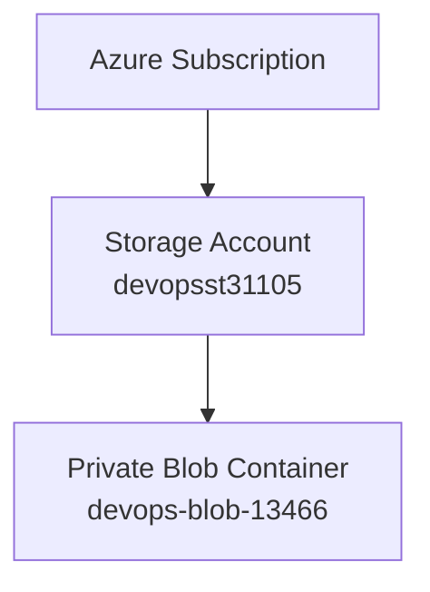
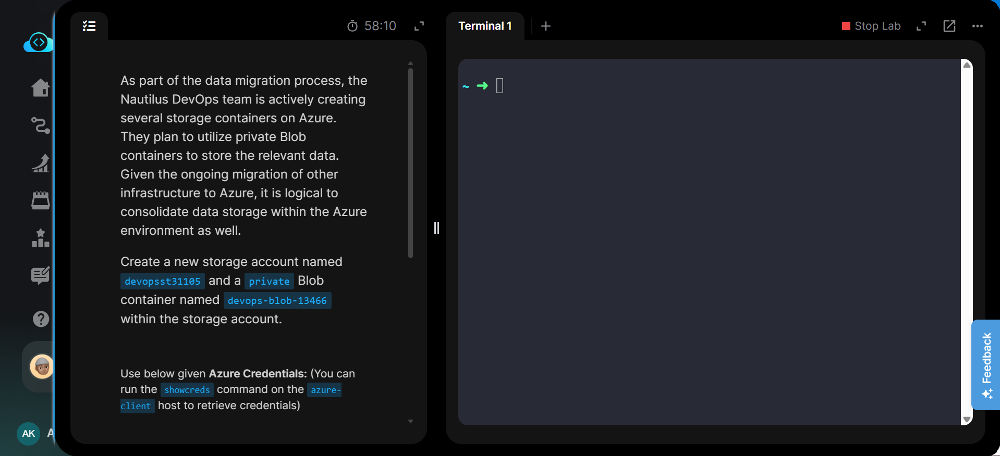
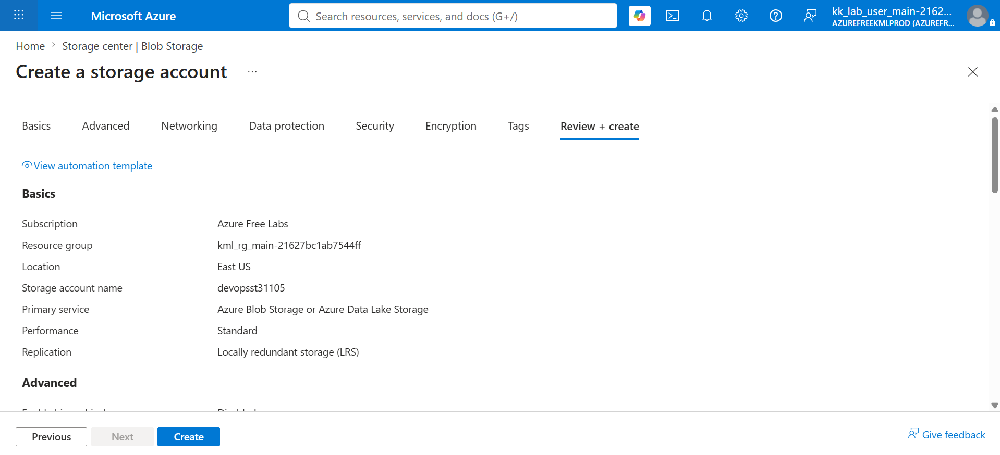
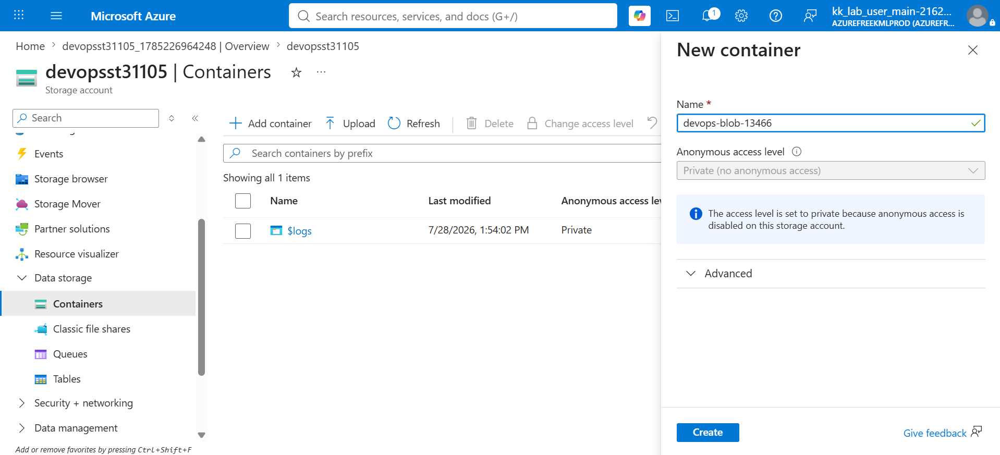
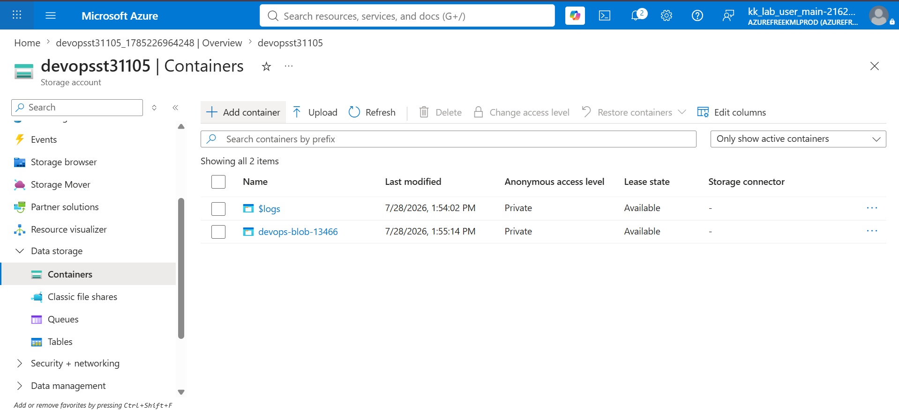
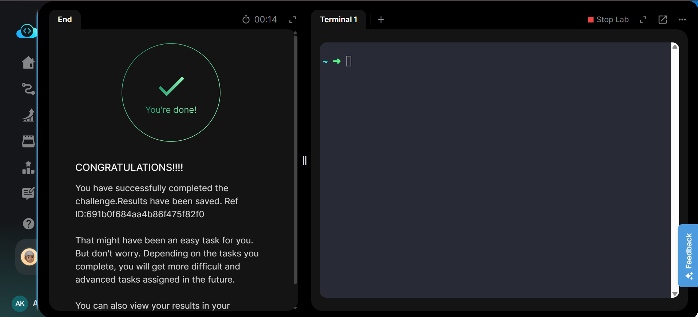

# Azure Blob Storage - Create Private Blob Container


---

# 📋 Project Information

| Property | Value |
|----------|-------|
| **Project** | Create Private Blob Container |
| **Platform** | Microsoft Azure |
| **Region** | East US |
| **Resource Group** | Existing Lab Resource Group |
| **Storage Account** | devopsst31105 |
| **Blob Container** | devops-blob-13466 |
| **Access Level** | Private (No Anonymous Access) |

---

# 📖 Overview

Azure Blob Storage is Microsoft's object storage solution designed for storing massive amounts of unstructured data such as images, videos, backups, documents, and application files.

In this lab, a new Azure Storage Account named **devopsst31105** was created. Inside the storage account, a private Blob container named **devops-blob-13466** was provisioned. The container was configured with **Private (No Anonymous Access)** to ensure secure storage access.

---

# 🎯 Objective

- Create an Azure Storage Account.
- Create a private Blob container.
- Configure the container with **Private (No Anonymous Access)**.
- Verify successful deployment.

---

# 💡 Skills Demonstrated

- Azure Storage Account creation
- Azure Blob Storage management
- Private Blob container creation
- Secure storage configuration
- Azure Portal resource management

---

# ☁️ Azure Services Used

- Azure Storage Account
- Azure Blob Storage

---

# 🏗️ Architecture Diagram



---

# 📝 Steps Performed

1. Logged in to the Azure Portal.
2. Opened **Storage Accounts**.
3. Created a Storage Account named **devopsst31105**.
4. Selected **Standard Performance** and **Locally Redundant Storage (LRS)**.
5. Reviewed the configuration and created the Storage Account.
6. Opened the Storage Account.
7. Navigated to **Data Storage → Containers**.
8. Created a new Blob container named **devops-blob-13466**.
9. Selected **Private (No Anonymous Access)**.
10. Verified successful container creation.

---

# 💻 Commands Used

This lab was performed using the **Azure Portal**.

Equivalent Azure CLI commands are available in:

```text
Commands/commands.md
```

---

# ⚠️ Troubleshooting

- Storage Account names must be globally unique.
- Use **Standard_LRS** replication.
- Ensure the Blob container access level remains **Private**.
- Wait until the Storage Account deployment completes before creating the container.

---

# 🐞 Debugging Notes

- Verified the Storage Account deployment status before creating the Blob container.
- Confirmed the Blob container access level as **Private**.
- Verified that the container was successfully listed under the Storage Account.

---

# ✅ Best Practices

- Use **Private** access unless public access is required.
- Use LRS for development and lab environments.
- Apply resource tags in production.
- Enable lifecycle management for long-term Blob storage.

---

# 📚 Key Learnings

- Azure Storage Account provisioning
- Blob Storage fundamentals
- Private container configuration
- Secure object storage management
- Azure Portal navigation

---

# 🔗 Related Concepts

- Azure Storage Account
- Azure Blob Storage
- Storage Replication (LRS)
- Container Access Levels
- Azure CLI

---

# 📸 Screenshots

### Task

[](Screenshots/01-task.png)

---

### Review and Create

[](Screenshots/02-review-create-storage-account.png)

---

### Create Blob Container

[](Screenshots/03-create-private-blob-container.png)

---

### Container Overview

[](Screenshots/04-container-overview.png)

---

### Task Completed

[](Screenshots/05-task-completed.png)

---

# ✅ Result

Successfully created the Azure Storage Account **devopsst31105** and the private Blob container **devops-blob-13466** with **Private (No Anonymous Access)**. The deployment was verified and the lab completed successfully.