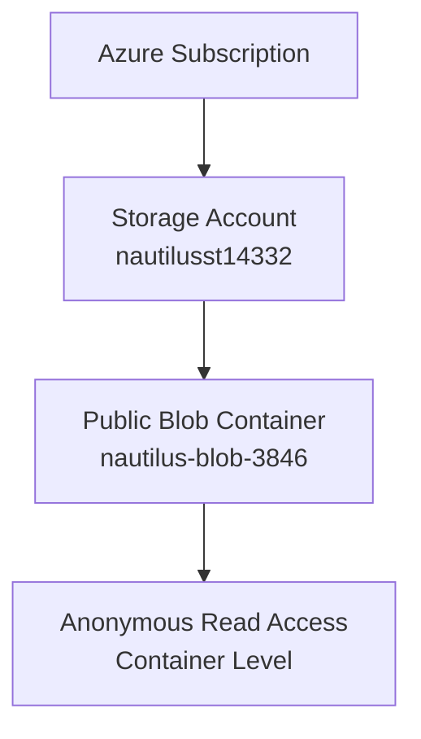
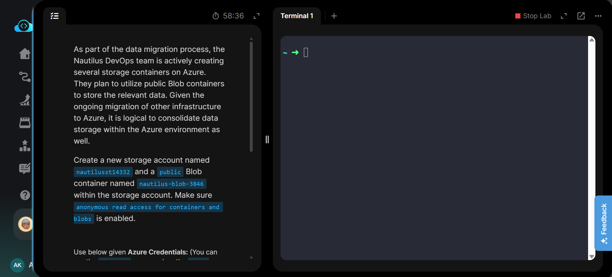
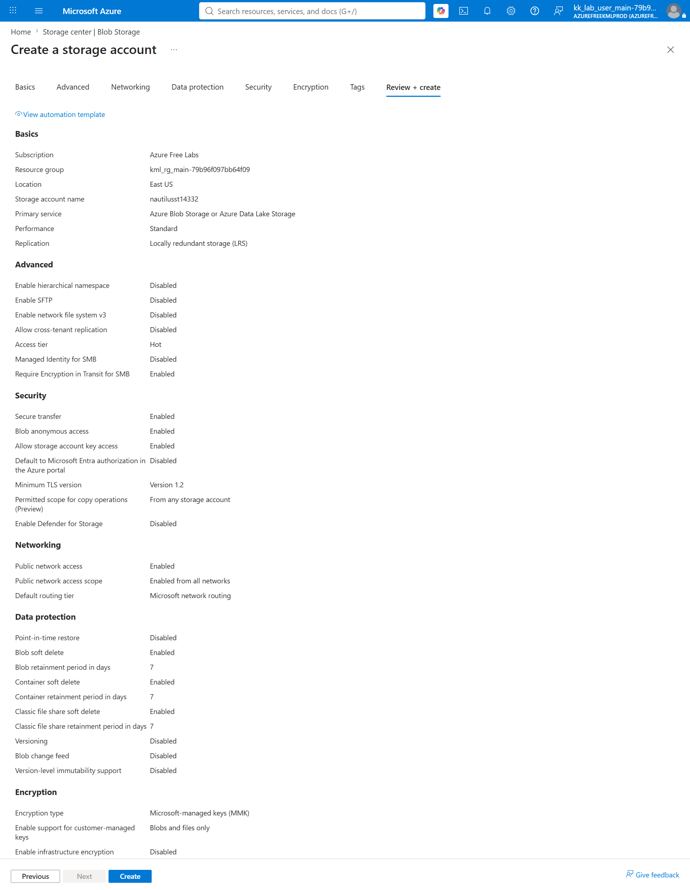
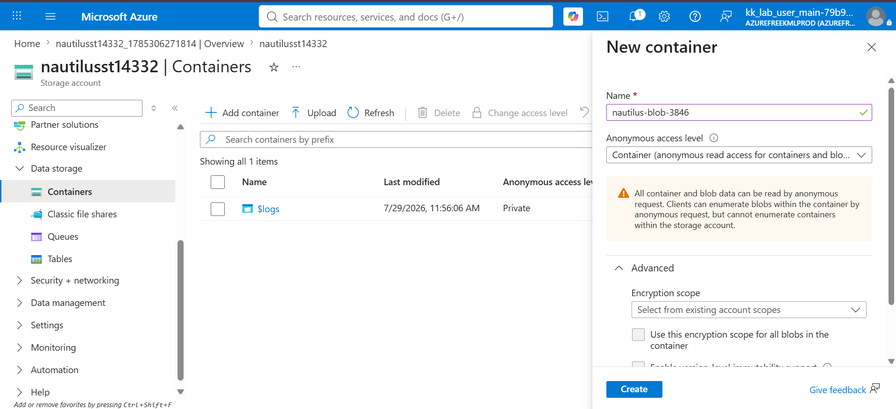
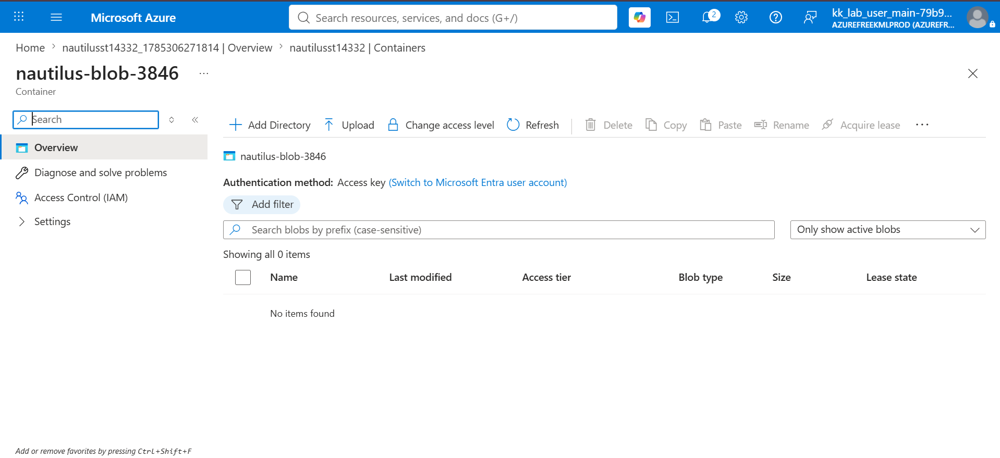
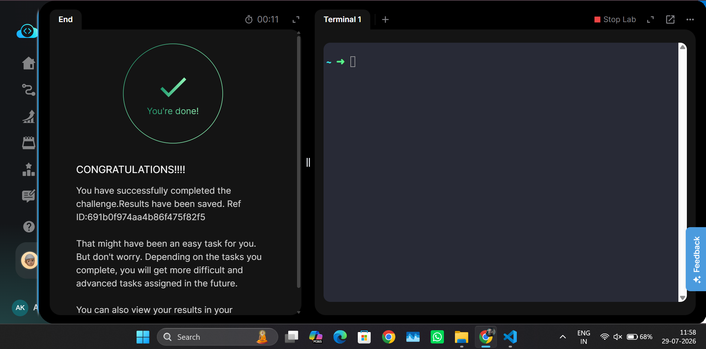

# Azure Blob Storage - Create Public Blob Container


---

# 📋 Project Information

| Property | Value |
|----------|-------|
| **Project** | Create Public Blob Container |
| **Platform** | Microsoft Azure |
| **Region** | East US |
| **Resource Group** | Existing Lab Resource Group |
| **Storage Account** | nautilusst14332 |
| **Blob Container** | nautilus-blob-3846 |
| **Access Level** | Container (Anonymous Read Access) |

---

# 📖 Overview

Azure Blob Storage is Microsoft's object storage solution designed for storing massive amounts of unstructured data such as images, videos, backups, documents, and application files.

In this lab, a new Azure Storage Account named **nautilusst14332** was created. Anonymous access was enabled for individual containers, and a public Blob container named **nautilus-blob-3846** was provisioned with **Container (Anonymous Read Access)** to allow public read access to containers and blobs.

---

# 🎯 Objective

- Create an Azure Storage Account.
- Enable anonymous access for Blob containers.
- Create a public Blob container.
- Configure the container with **Container (Anonymous Read Access)**.
- Verify successful deployment.

---

# 💡 Skills Demonstrated

- Azure Storage Account creation
- Azure Blob Storage management
- Public Blob container creation
- Anonymous access configuration
- Azure Portal resource management

---

# ☁️ Azure Services Used

- Azure Storage Account
- Azure Blob Storage

---

# 🏗️ Architecture Diagram



---

# 📝 Steps Performed

1. Logged in to the Azure Portal.
2. Opened **Storage Accounts**.
3. Created a Storage Account named **nautilusst14332**.
4. Enabled **Allow enabling anonymous access on individual containers**.
5. Reviewed the configuration and created the Storage Account.
6. Opened the Storage Account.
7. Navigated to **Data Storage → Containers**.
8. Created a new Blob container named **nautilus-blob-3846**.
9. Selected **Container (Anonymous Read Access)** as the access level.
10. Verified successful container creation.

---

# 💻 Commands Used

This lab was performed using the **Azure Portal**.

Equivalent Azure CLI commands are available in:

```text
Commands/commands.md
```

---

# ⚠️ Troubleshooting

- Storage Account names must be globally unique.
- Enable anonymous access before creating a public Blob container.
- Blob container names must be lowercase.
- Ensure the container access level is set to **Container** instead of **Private**.
- Wait until the Storage Account deployment completes before creating the Blob container.

---

# 🐞 Debugging Notes

- Verified the Storage Account deployment status before creating the Blob container.
- Confirmed anonymous access was enabled on the Storage Account.
- Verified the Blob container access level as **Container**.
- Confirmed the container was successfully listed under the Storage Account.

---

# ✅ Best Practices

- Use public containers only when anonymous access is required.
- Keep sensitive data in private containers.
- Use LRS for development and lab environments.
- Apply lifecycle management policies for long-term storage.

---

# 📚 Key Learnings

- Azure Storage Account provisioning
- Blob Storage fundamentals
- Public container configuration
- Anonymous Blob access
- Azure Portal navigation

---

# 🔗 Related Concepts

- Azure Storage Account
- Azure Blob Storage
- Storage Replication (LRS)
- Container Access Levels
- Azure CLI

---

# 📸 Screenshots

### Task

[](Screenshots/01-task.png)

---

### Review and Create Storage Account

[](Screenshots/02-review-create-storage-account.png)

---

### Create Public Blob Container

[](Screenshots/03-create-public-blob-container.png)

---

### Container Overview

[](Screenshots/04-container-overview.png)

---

### Task Completed

[](Screenshots/05-task-completed.png)

---

# ✅ Result

Successfully created the Azure Storage Account **nautilusst14332** and the public Blob container **nautilus-blob-3846** with **Container (Anonymous Read Access)**. Anonymous access was enabled, the deployment was verified, and the lab completed successfully.