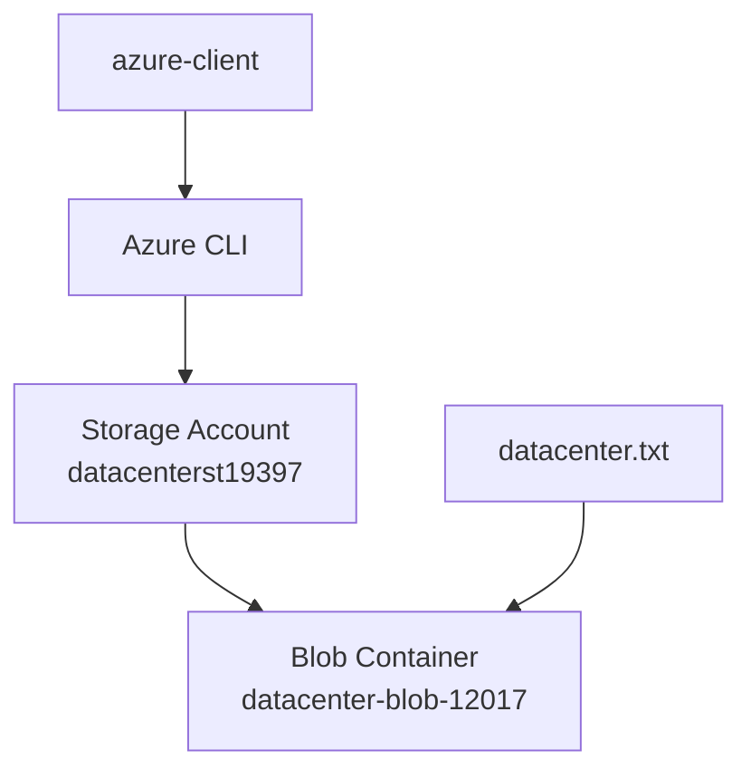
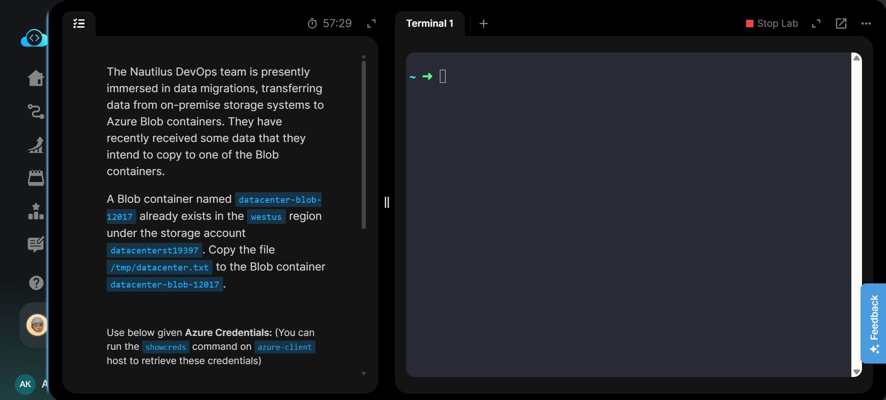
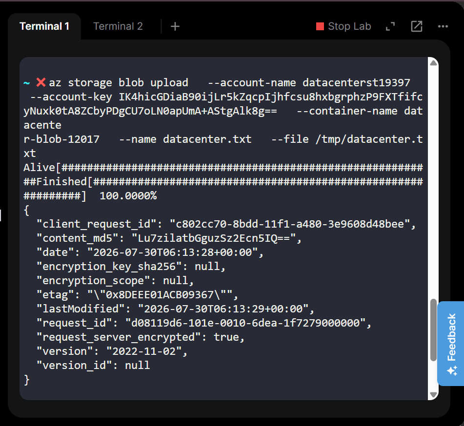
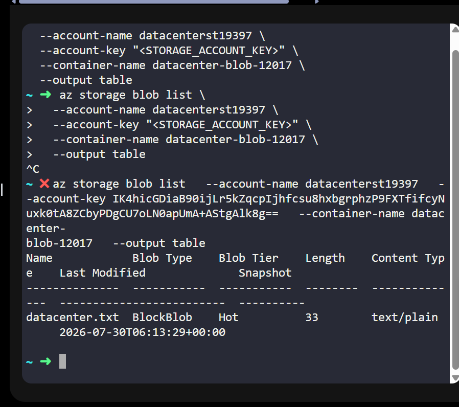
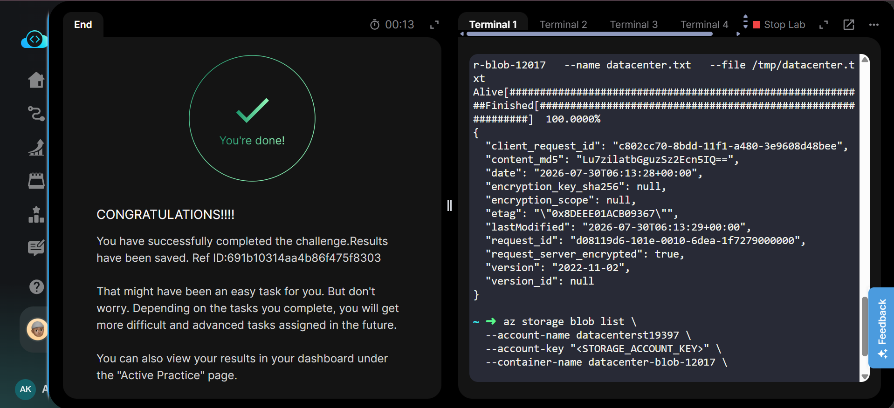

# Azure Blob Storage - Upload File to Blob Container


---

# 📋 Project Information

| Property | Value |
|----------|-------|
| **Project** | Upload File to Blob Container |
| **Platform** | Microsoft Azure |
| **Region** | West US |
| **Resource Group** | Existing Lab Resource Group |
| **Storage Account** | datacenterst19397 |
| **Blob Container** | datacenter-blob-12017 |
| **Uploaded File** | datacenter.txt |
| **Upload Method** | Azure CLI (azure-client) |

---

# 📖 Overview

Azure Blob Storage provides scalable object storage for storing unstructured data such as documents, backups, images, and application files.

In this lab, an existing Storage Account and Blob container were used. The file **/tmp/datacenter.txt** located on the **azure-client** host was uploaded directly to the Blob container using the **Azure CLI**, demonstrating command-line based storage management without using the Azure Portal for file uploads.

---

# 🎯 Objective

- Use the existing Azure Storage Account.
- Upload **/tmp/datacenter.txt** from the **azure-client** host.
- Store the file in the existing Blob container.
- Verify the upload was successful.

---

# 💡 Skills Demonstrated

- Azure CLI authentication
- Azure Blob Storage management
- Blob upload using Azure CLI
- Storage Account key management
- Blob verification using CLI

---

# ☁️ Azure Services Used

- Azure Storage Account
- Azure Blob Storage
- Azure CLI

---

# 🏗️ Architecture Diagram



---

# 📝 Steps Performed

1. Logged in to Azure from the **azure-client** host.
2. Verified that **/tmp/datacenter.txt** existed.
3. Identified the Storage Account Resource Group.
4. Retrieved the Storage Account access key.
5. Uploaded **/tmp/datacenter.txt** to the existing Blob container using the Azure CLI.
6. Listed the blobs in the container to verify the upload.
7. Submitted the completed task.

---

# 💻 Commands Used

This lab was performed using the **Azure CLI** on the **azure-client** host.

Complete Azure CLI commands are available in:

```text
Commands/commands.md
```

---

# ⚠️ Troubleshooting

- Ensure the Storage Account name is correct.
- Verify the Storage Account key before uploading.
- Confirm the Blob container already exists.
- Ensure the source file exists on the **azure-client** host.
- Use the correct container name during upload.

---

# 🐞 Debugging Notes

- Verified Azure CLI login before running storage commands.
- Confirmed the Storage Account key was valid.
- Verified the uploaded blob appeared in the container.
- Confirmed the task completed successfully.

---

# ✅ Best Practices

- Prefer Azure CLI for automation and scripting.
- Store Storage Account keys securely.
- Use Azure AD authentication when supported.
- Verify uploaded blobs after every upload operation.

---

# 📚 Key Learnings

- Uploading files using Azure CLI
- Working with existing Blob containers
- Blob verification commands
- Storage Account authentication
- CLI-based Azure storage management

---

# 🔗 Related Concepts

- Azure Blob Storage
- Azure CLI
- Storage Account Keys
- Blob Upload
- Azure Authentication

---

# 📸 Screenshots

### Task

[](Screenshots/01-task.png)

---

### Blob Upload Success

[](Screenshots/02-blob-upload-success.png)

---

### Verify Upload

[](Screenshots/03-verify-upload.png)

---

### Task Completed

[](Screenshots/04-task-completed.png)

---

# ✅ Result

Successfully uploaded **datacenter.txt** from the **azure-client** host to the existing Blob container **datacenter-blob-12017** using the **Azure CLI**. The upload was verified, and the lab was completed successfully.