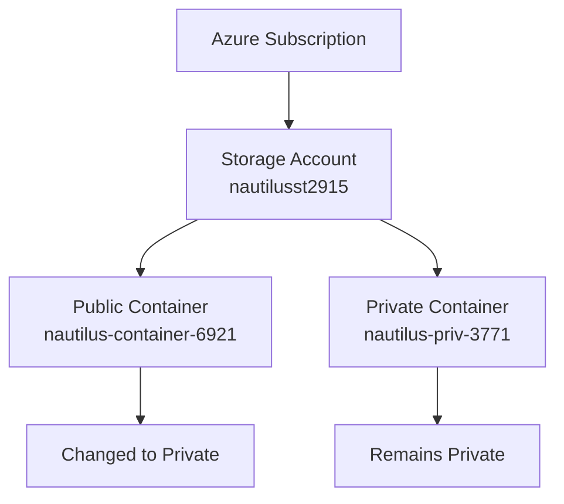
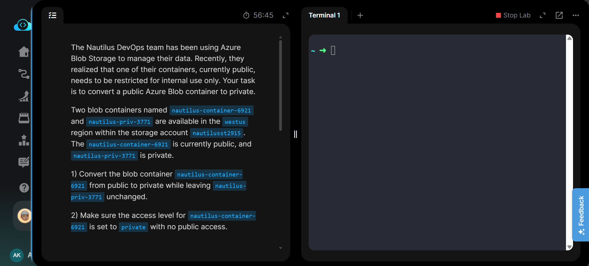
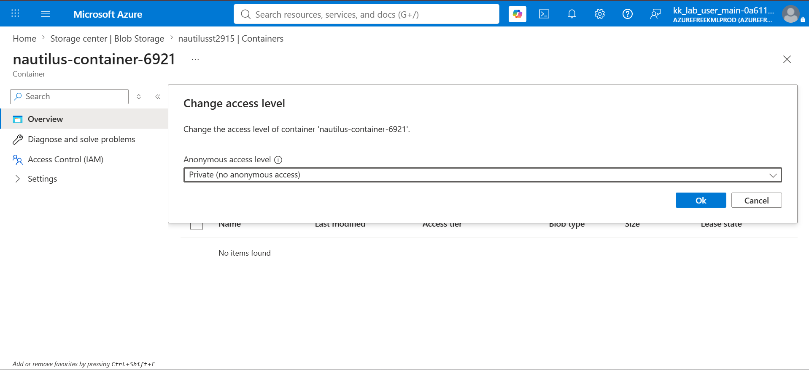
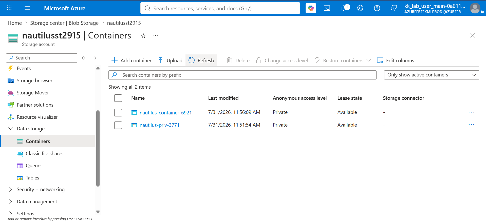
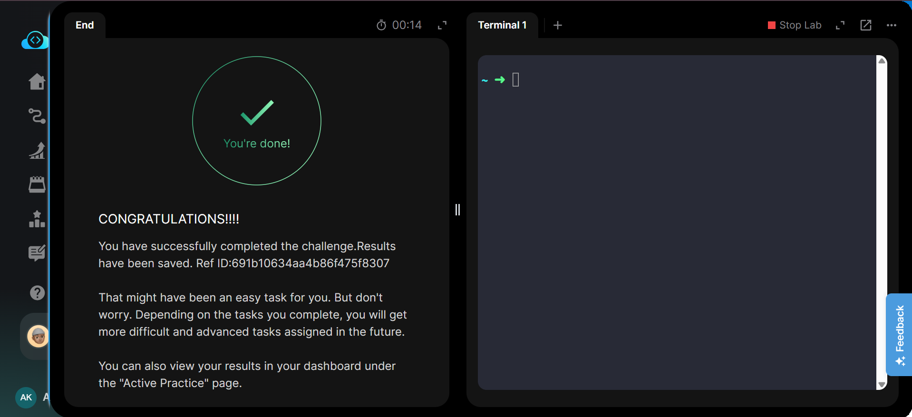

# Azure Blob Storage - Convert Public Blob Container to Private

---

# 📋 Project Information

| Property | Value |
|----------|-------|
| **Project** | Convert Public Blob Container to Private |
| **Platform** | Microsoft Azure |
| **Region** | West US |
| **Resource Group** | Existing Lab Resource Group |
| **Storage Account** | nautilusst2915 |
| **Modified Container** | nautilus-container-6921 |
| **Unchanged Container** | nautilus-priv-3771 |
| **Access Level** | Private (No Anonymous Access) |

---

# 📖 Overview

Azure Blob Storage allows containers to be configured with different anonymous access levels depending on business requirements. Public containers are useful for hosting publicly accessible content, while private containers restrict access to authenticated users only.

In this lab, an existing public Blob container named **nautilus-container-6921** was converted to **Private (No Anonymous Access)** while ensuring that the existing private container **nautilus-priv-3771** remained unchanged. This task demonstrates secure access management for Azure Blob Storage containers.

---

# 🎯 Objective

- Locate the existing Blob containers.
- Convert **nautilus-container-6921** from **Public** to **Private**.
- Leave **nautilus-priv-3771** unchanged.
- Verify that both containers have **Private (No Anonymous Access)**.

---

# 💡 Skills Demonstrated

- Azure Blob Storage management
- Blob container access control
- Anonymous access configuration
- Azure Storage security
- Azure Portal resource management

---

# ☁️ Azure Services Used

- Azure Storage Account
- Azure Blob Storage

---

# 🏗️ Architecture Diagram

---

# 📝 Steps Performed

1. Logged in to the Azure Portal.
2. Opened the Storage Account **nautilusst2915**.
3. Navigated to **Data Storage → Containers**.
4. Opened **nautilus-container-6921**.
5. Changed the anonymous access level from **Container** to **Private (No Anonymous Access)**.
6. Saved the configuration.
7. Verified that **nautilus-container-6921** was now private.
8. Confirmed **nautilus-priv-3771** remained private.
9. Submitted the completed task.

---

# 💻 Commands Used

This lab can be completed using the **Azure CLI**.

Complete Azure CLI commands are available here:

📄 **[Commands/commands.md](Commands/commands.md)**

---

# ⚠️ Troubleshooting

- Ensure the correct Storage Account is selected.
- Verify the correct Blob container before changing access.
- Save the configuration after selecting **Private (No Anonymous Access)**.
- Refresh the Containers page if the updated access level is not immediately visible.

---

# 🐞 Debugging Notes

- Verified the Storage Account before modifying the container.
- Confirmed the access level change was successfully applied.
- Verified that **nautilus-container-6921** displayed **Private**.
- Confirmed **nautilus-priv-3771** remained unchanged.

---

# ✅ Best Practices

- Use **Private** containers unless public access is explicitly required.
- Periodically audit Blob container permissions.
- Apply the principle of least privilege.
- Review anonymous access settings during security assessments.

---

# 📚 Key Learnings

- Managing Blob container permissions
- Understanding anonymous access levels
- Azure Storage security best practices
- Container access verification
- Azure Portal navigation

---

# 🔗 Related Concepts

- Azure Blob Storage
- Azure Storage Account
- Container Access Levels
- Azure RBAC
- Azure CLI

---

# 📸 Screenshots

### Task

---

### Change Access Level

---

### Private Container Overview

---

### Task Completed

---

# ✅ Result

Successfully converted the Blob container **nautilus-container-6921** from **Public** to **Private (No Anonymous Access)** while keeping **nautilus-priv-3771** unchanged. Both containers were verified to have the required access configuration, and the lab was completed successfully.