# 🚀 Azure Blob Storage to Nginx VM - Static Website Hosting


---

# 📋 Project Information

| Item | Details |
|------|---------|
| Project | Azure Blob Storage to Nginx VM |
| Task No. | 49 |
| Cloud | Microsoft Azure |
| Region | East US |
| Virtual Network | datacenter-vnet |
| Subnet | datacenter-subnet |
| Virtual Machine | datacenter-vm |
| Storage Account | datacenterstor19515 |
| Blob Container | datacenter-container |
| Web Server | Nginx |

---

# 📖 Overview

This project demonstrates hosting a static website by storing the `index.html` file in Azure Blob Storage and securely downloading it to an Azure Virtual Machine running Nginx.

Instead of exposing the complete application source code, only the required static web page is stored in Azure Blob Storage. During deployment, the VM retrieves the file and serves it locally through Nginx.

---

# 🎯 Objective

- Create Azure Virtual Network and Subnet
- Create Azure Storage Account
- Create Blob Container
- Upload `index.html`
- Create Azure Virtual Machine
- Install Nginx
- Install Azure CLI
- Download `index.html` from Blob Storage
- Serve the webpage using Nginx
- Verify website using the VM Public IP

---

# 💡 Skills Demonstrated

- Azure Virtual Network
- Azure Storage Account
- Azure Blob Storage
- Azure Virtual Machine
- Azure CLI
- Linux
- SSH Authentication
- Nginx
- Static Website Hosting

---

# ☁️ Azure Services Used

- Azure Virtual Network
- Azure Storage Account
- Azure Blob Storage
- Azure Virtual Machine
- Azure CLI

---

# 🏗 Architecture Diagram

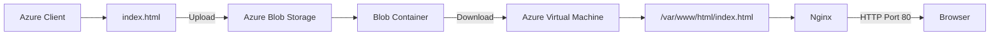

---

# ⚙️ Steps Performed

1. Created Azure Virtual Network.
2. Created Subnet.
3. Created Azure Storage Account.
4. Created Blob Container.
5. Uploaded `index.html`.
6. Created Azure Virtual Machine.
7. Connected using SSH.
8. Installed Nginx.
9. Installed Azure CLI.
10. Downloaded `index.html` from Azure Blob Storage.
11. Stored the file in `/var/www/html/`.
12. Verified Nginx locally.
13. Verified website using the VM Public IP.

---

# 💻 Commands Used

All commands are available in:

```text
Commands/commands.md
```

---

# 🛠 Troubleshooting

| Issue | Resolution |
|--------|------------|
| Azure CLI not installed | Installed Azure CLI on the VM |
| Blob download authentication | Used Storage Account Access Key |
| Default Nginx page displayed | Replaced `/var/www/html/index.html` with the downloaded file |
| Browser validation | Verified using VM Public IP |

---

# 🐞 Debugging Notes

During deployment the VM initially displayed the default Nginx page.

The required `index.html` file was downloaded from Azure Blob Storage into:

```
/var/www/html/index.html
```

After replacing the default page, Nginx served the uploaded HTML successfully.

---

# ✅ Best Practices

- Keep Storage Account private.
- Store only required static assets.
- Avoid exposing the complete application source code.
- Use SSH key authentication instead of passwords.
- Validate services before browser testing.

---

# 📚 Key Learnings

- Azure Blob Storage workflow
- Azure Virtual Network
- Nginx configuration
- Azure CLI usage
- Blob download using Storage Account Key
- Static website deployment
- Linux server management

---

# 🔗 Related Concepts

- Azure Blob Storage
- Azure Virtual Machine
- Azure CLI
- Nginx
- Linux
- Static Website Hosting

---

# 📸 Screenshots

| Screenshot | Preview |
|------------|---------|
| Virtual Network | <a href="Screenshots/01-vnet-created.png">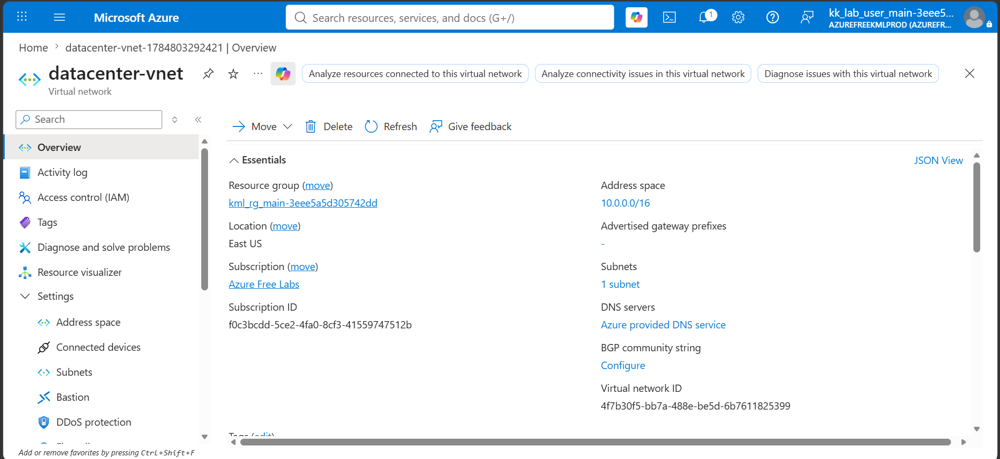</a> |
| Storage Account | <a href="Screenshots/02-storage-account-created.png">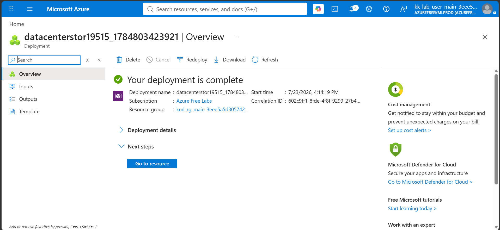</a> |
| Blob Container | <a href="Screenshots/03-container-created.png">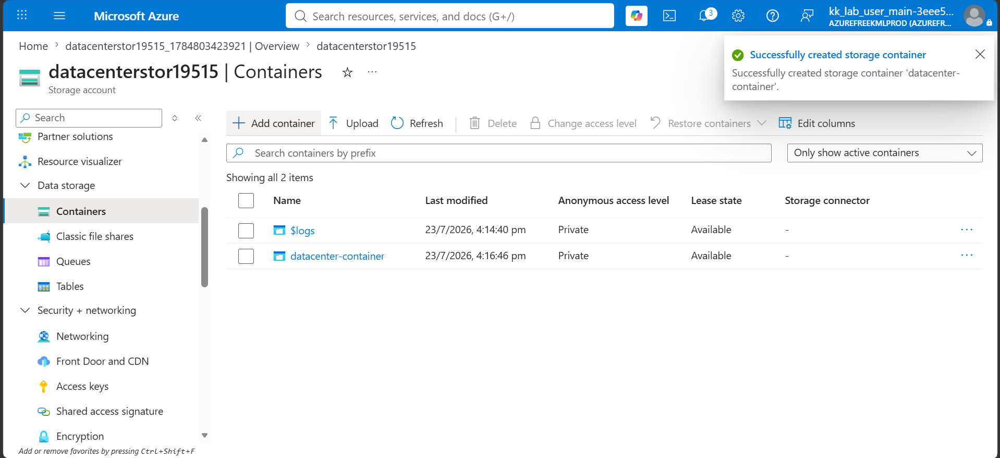</a> |
| index.html Uploaded | <a href="Screenshots/04-index-uploaded.png">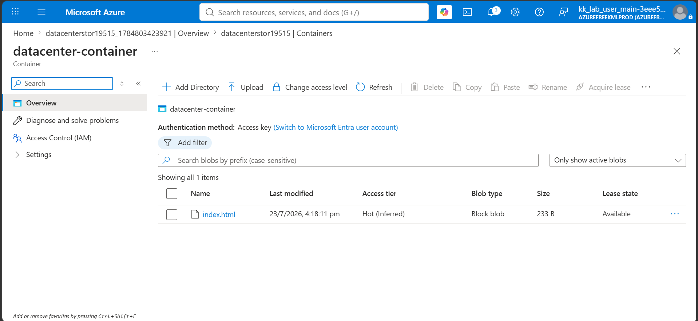</a> |
| Virtual Machine | <a href="Screenshots/05-vm-created.png">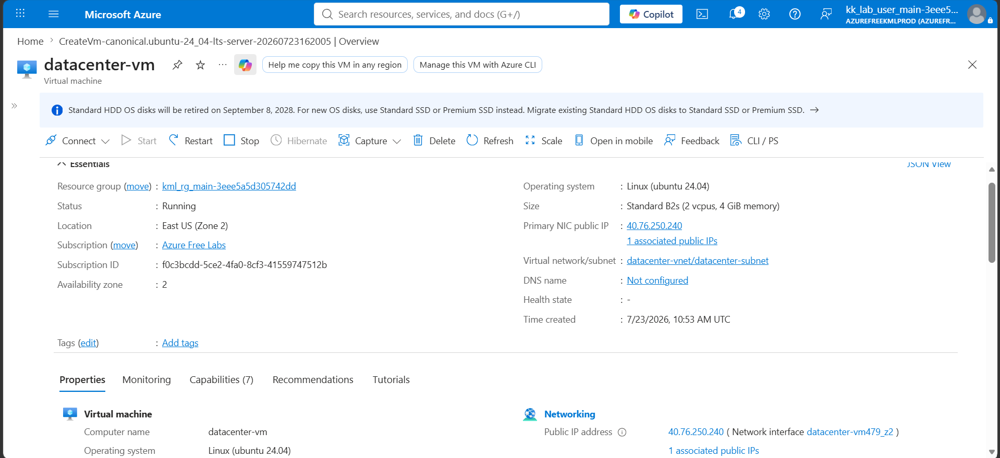</a> |
| SSH Connection | <a href="Screenshots/06-ssh-connected.png">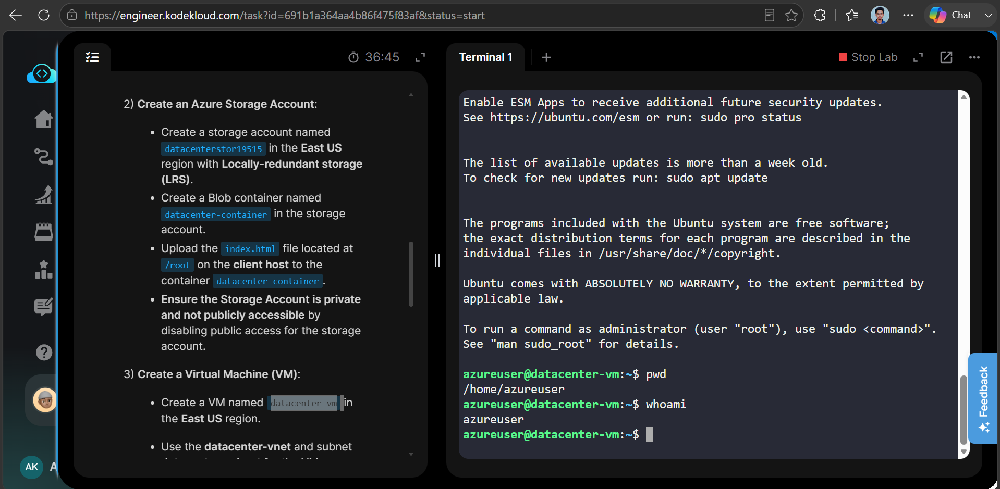</a> |
| Nginx Installed | <a href="Screenshots/07-nginx-installed.png">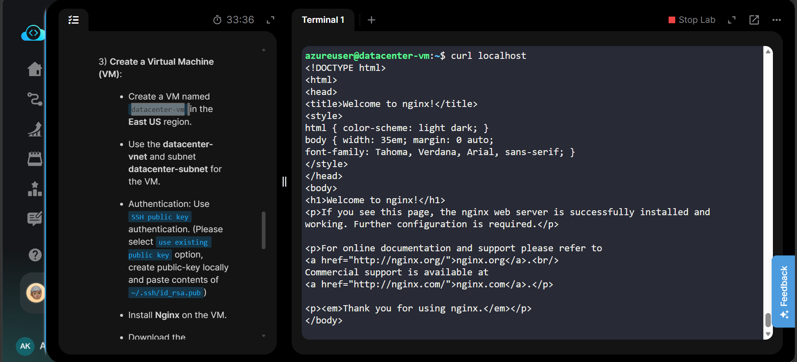</a> |
| Azure CLI Installed | <a href="Screenshots/08-azure-cli-installed.png">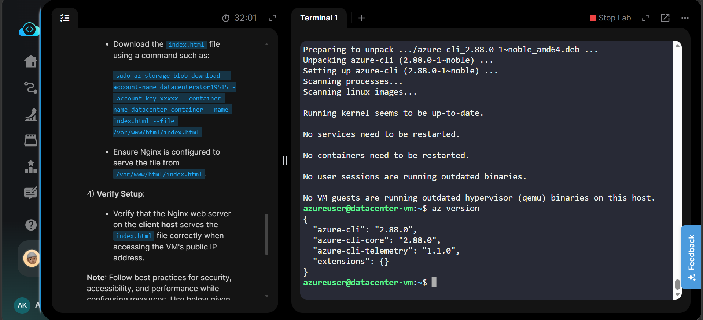</a> |
| Browser Output | <a href="Screenshots/09-browser-output.png">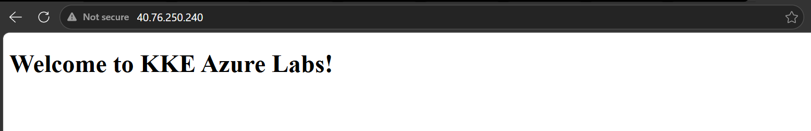</a> |
| Task Completed | <a href="Screenshots/10-task-completed.png">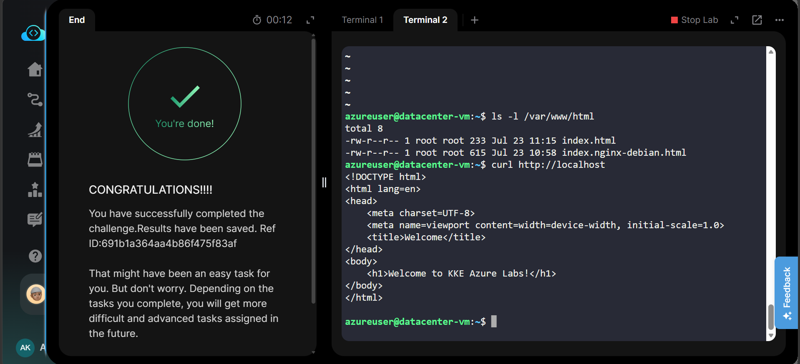</a> |

---

# 🎉 Result

Successfully hosted a static web page by securely storing `index.html` in Azure Blob Storage, downloading it to an Azure Virtual Machine, and serving it locally through Nginx. The website was successfully verified using the VM Public IP address.