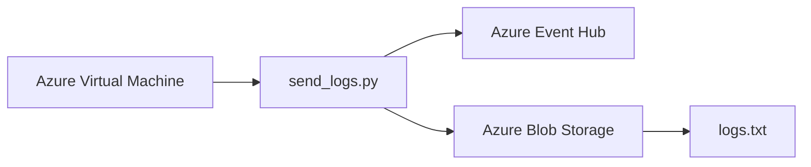

# Azure Event Hubs - Log Collection and Blob Backup


---

# Project Information

| Property | Details |
|----------|---------|
| Cloud Provider | Microsoft Azure |
| Project Name | Event Hubs Log Collection and Blob Backup |
| Task Number | 46 |
| Difficulty | Intermediate |
| Region | East US |
| VM | devops-vm |
| Event Hub | devops-hub |
| Storage Account | devopsst17911 |
| Blob Container | devops-backup-20218 |

---

# Overview

This project demonstrates centralized log collection using Azure Event Hubs and Azure Blob Storage.

A Python script running on an Azure Virtual Machine sends log messages to Azure Event Hubs while simultaneously creating a backup in Azure Blob Storage.

This architecture is commonly used for centralized logging, monitoring, and disaster recovery.

---

# Objective

- Create an Azure Event Hubs Namespace
- Create an Event Hub
- Create a Storage Account
- Create a Blob Container
- Create an Azure Virtual Machine
- Copy the provided Python script to the VM
- Modify the script to send logs to Event Hub and Blob Storage
- Verify Event Hub Metrics
- Verify Blob Storage Backup

---

# Skills Demonstrated

- Azure Event Hubs
- Azure Blob Storage
- Azure Virtual Machines
- SSH
- Python
- Azure SDK
- Event Streaming
- Log Backup
- Cloud Monitoring

---

# Azure Services Used

- Azure Event Hubs
- Azure Blob Storage
- Azure Virtual Machine

---

# Architecture Diagram



---

# Implementation Steps

1. Created an Event Hubs Namespace.
2. Enabled Auto Inflate.
3. Created an Event Hub.
4. Created a Storage Account.
5. Created a Blob Container.
6. Enabled Blob anonymous access during setup.
7. Created an Azure Virtual Machine.
8. Generated SSH key.
9. Connected to the VM using SSH.
10. Copied the Python script from the client host.
11. Updated the Event Hub connection string.
12. Updated the Blob Storage connection string.
13. Installed Python pip.
14. Installed Azure SDK packages.
15. Executed the script.
16. Verified Event Hub Metrics.
17. Verified Blob Storage backup.

---

# Commands Used

See:

```text
Commands/commands.md
```

---

# Troubleshooting

### Issue

```
ModuleNotFoundError: No module named 'azure'
```

### Solution

Installed Python pip

```bash
sudo apt install python3-pip
```

Installed Azure SDK

```bash
pip3 install --break-system-packages azure-eventhub azure-storage-blob
```

---

# Key Learnings

- Azure Event Hubs collects streaming logs.
- Blob Storage can be used for long-term backup.
- Azure SDK allows Python applications to interact with Azure services.
- Event Hub metrics help verify successful message ingestion.
- Blob Storage confirms successful backup.

---

# Related Concepts

- Event Streaming
- Log Aggregation
- Centralized Logging
- Azure Monitoring
- Blob Storage
- Cloud Automation

---

# Screenshots

### Event Hub Namespace Review

[](Screenshots/01-eventhub-namespace-review)

---

### Event Hub Review

[](Screenshots/02-eventhub-review)

---

### Storage Account Review

[](Screenshots/03-storage-account-review)

---

### Virtual Machine Review

[](Screenshots/04-vm-review)

---

### Event Hub Namespace Overview

[](Screenshots/05-eventhub-namespace-overview)

---

### Event Hub Created

[](Screenshots/06-eventhub-created)

---

### Storage Account Overview

[](Screenshots/07-storage-account-overview)

---

### Virtual Machine Overview

[](Screenshots/08-vm-overview)

---

### Script Executed Successfully

[](Screenshots/09-script-success)

---

### Event Hub Metrics

[](Screenshots/10-eventhub-metrics)

---

### Blob Storage Logs

[](Screenshots/11-blob-storage-logs)

---

### Task Completed

[](Screenshots/12-task-completed)

---

# Result

Successfully configured Azure Event Hubs and Azure Blob Storage for centralized log collection and backup.

The Python application successfully:

- Published log messages to Azure Event Hub.
- Stored backup logs in Azure Blob Storage (`logs.txt`).
- Verified successful message ingestion using Event Hub Metrics.
- Verified successful backup using Azure Blob Storage.