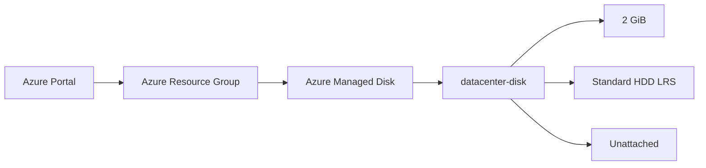
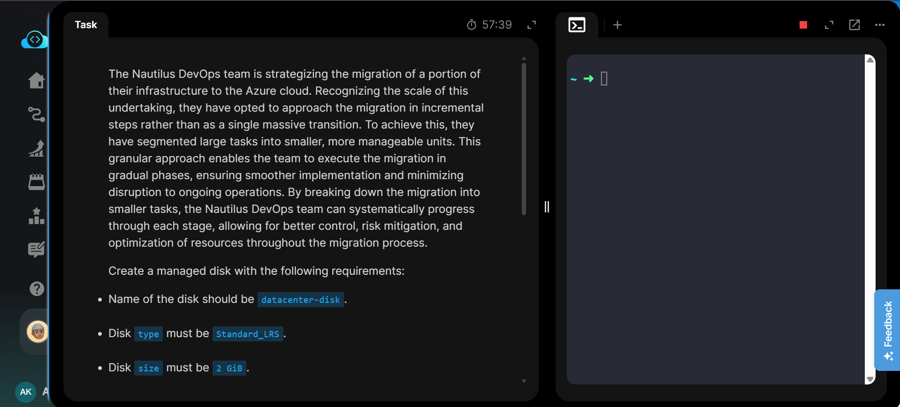
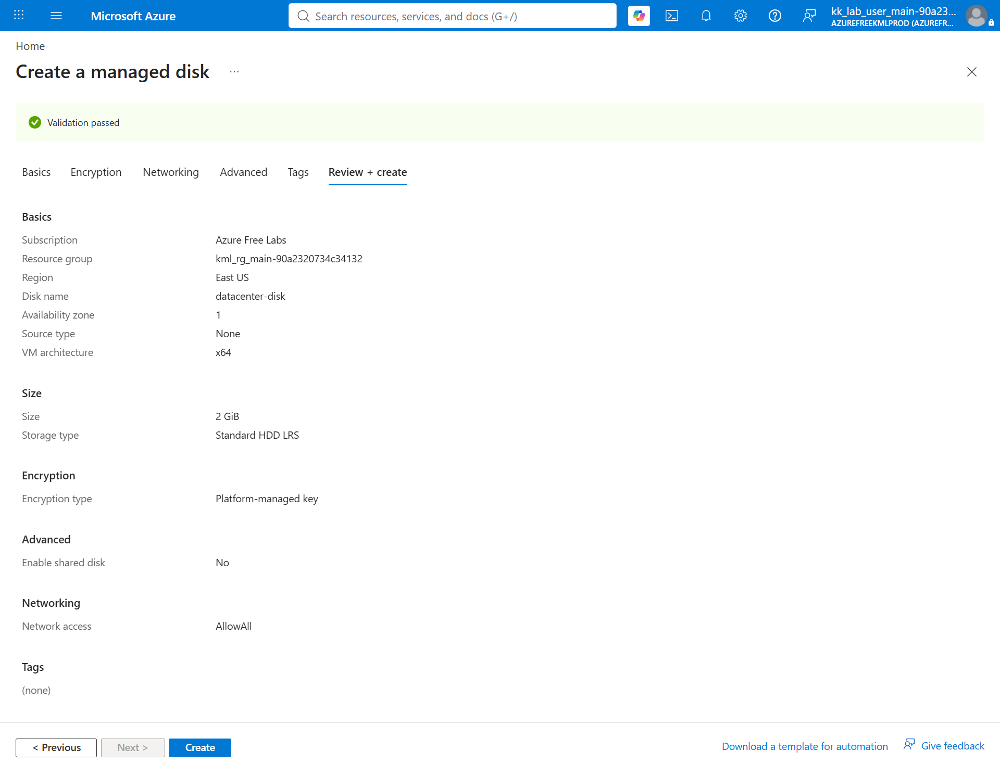
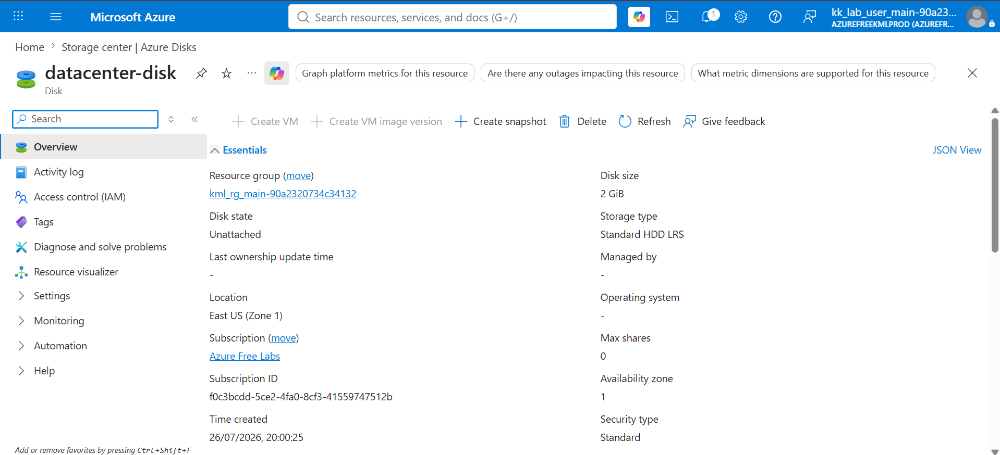
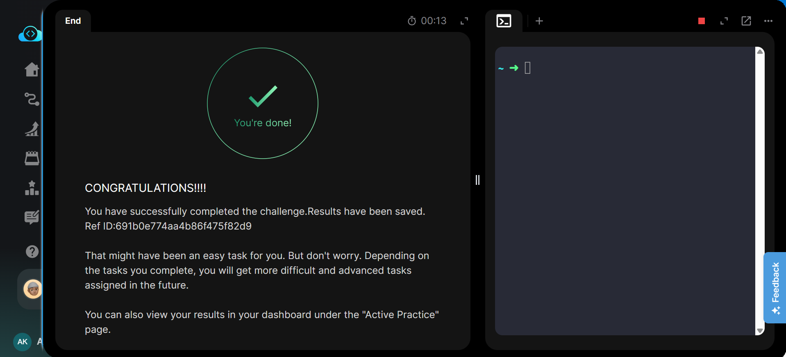

# Create an Azure Managed Disk

## Project Information

| Field | Details |
|---|---|
| Project | Create an Azure Managed Disk |
| Platform | Microsoft Azure |
| Region | East US |
| Service | Azure Managed Disks |
| Disk Name | `datacenter-disk` |
| Disk Type | Standard HDD LRS (`Standard_LRS`) |
| Disk Size | 2 GiB |
| Disk State | Unattached |
| Purpose | Provision standalone managed storage for future Azure workloads |

---

## Overview

This project demonstrates how to create a standalone **Azure Managed Disk** using the Microsoft Azure Portal.

A managed disk named `datacenter-disk` was provisioned with a capacity of **2 GiB** using **Standard HDD Locally Redundant Storage (LRS)**. After deployment, the disk configuration was verified from the Azure Portal to ensure that the required disk name, size, and storage type were correctly applied.

The task was performed through the **Azure Portal**. Equivalent Azure CLI commands are documented separately in [`Commands/commands.md`](Commands/commands.md).

---

## Objective

Create an Azure Managed Disk with the following requirements:

- Disk name: `datacenter-disk`
- Disk type: `Standard_LRS`
- Disk size: `2 GiB`
- Verify that the disk is successfully provisioned in Azure

---

## Skills Demonstrated

- Azure resource provisioning
- Azure Managed Disk configuration
- Selecting Azure disk storage SKUs
- Configuring disk capacity
- Working with standalone managed disks
- Validating Azure resources after deployment
- Navigating the Azure Portal
- Understanding Locally Redundant Storage (LRS)
- Mapping Azure Portal operations to Azure CLI commands

---

## Services Used

- Microsoft Azure
- Azure Managed Disks
- Azure Resource Manager

---

## Architecture Diagram

The managed disk is provisioned as an independent Azure resource and remains **unattached**, allowing it to be attached to a compatible virtual machine when required.

---

## Steps Performed

### 1. Reviewed the Task Requirements

Reviewed the lab requirements and identified the required managed disk configuration:

- Name: `datacenter-disk`
- Storage type: `Standard_LRS`
- Size: `2 GiB`

### 2. Opened Azure Managed Disks

Signed in to the Azure Portal and navigated to the Azure disk management interface.

Started the process to create a new managed disk.

### 3. Configured the Managed Disk

Configured the new managed disk with the required settings:

- Selected the lab subscription and resource group.
- Selected **East US** as the deployment region.
- Entered `datacenter-disk` as the disk name.
- Configured the disk size as **2 GiB**.
- Selected **Standard HDD LRS** as the storage type.

### 4. Reviewed the Configuration

Opened the **Review + create** page and confirmed that Azure validation passed.

Verified the important settings before deployment:

| Setting | Configured Value |
|---|---|
| Disk Name | `datacenter-disk` |
| Region | East US |
| Disk Size | 2 GiB |
| Storage Type | Standard HDD LRS |
| SKU | `Standard_LRS` |
| Source Type | None |
| Encryption | Platform-managed key |

### 5. Created the Managed Disk

Selected **Create** after successful validation and allowed Azure to provision the managed disk.

### 6. Verified the Disk

Opened the newly created `datacenter-disk` resource and verified:

- Disk size: **2 GiB**
- Storage type: **Standard HDD LRS**
- Disk state: **Unattached**
- Resource successfully created and accessible from the Azure Portal

The lab validation was then completed successfully.

---

## Commands Used

This task was performed using the **Microsoft Azure Portal**.

The equivalent Azure CLI commands for creating and verifying the managed disk are documented here:

[`Commands/commands.md`](Commands/commands.md)

---

## Troubleshooting

No major issues were encountered during this task.

Before creating a managed disk, it is important to verify:

- The correct Azure subscription is selected.
- The correct resource group is selected.
- The disk SKU matches the task requirement.
- The requested disk size is supported.
- The selected region supports the required resource configuration.

---

## Debugging Notes

If the disk is not created successfully:

1. Check the **Review + create** page for validation errors.
2. Confirm that `Standard HDD LRS` corresponds to the `Standard_LRS` SKU.
3. Verify that the correct resource group and region are selected.
4. Check the Azure Activity Log if the deployment fails.
5. Confirm the final disk properties from the disk's **Overview** page.

For CLI-based verification, `az disk show` can be used to inspect the deployed disk configuration.

---

## Best Practices

- Use meaningful and consistent naming conventions for managed disks.
- Select the disk SKU according to workload performance requirements.
- Use LRS only when local redundancy satisfies the workload's availability requirements.
- Avoid leaving unused managed disks provisioned unnecessarily.
- Monitor disk utilisation and performance for production workloads.
- Use tags to improve resource organisation and cost tracking.
- Use Infrastructure as Code or CLI automation for repeatable production deployments.

---

## Key Learnings

- Azure Managed Disks are independent Azure resources that can exist without being attached to a virtual machine.
- `Standard_LRS` represents the **Standard HDD LRS** managed disk SKU.
- Managed disk size and storage type can be configured during resource creation.
- Azure Portal validation helps detect configuration problems before deployment.
- An **Unattached** disk is successfully provisioned but is not currently connected to a virtual machine.
- Azure CLI can be used to automate the same provisioning workflow performed through the Azure Portal.

---

## Related Concepts

- Azure Managed Disks
- Azure Virtual Machines
- OS Disks
- Data Disks
- Standard HDD
- Standard SSD
- Premium SSD
- Locally Redundant Storage (LRS)
- Azure Resource Groups
- Azure Resource Manager
- Azure CLI
- Infrastructure as Code

---

## Screenshots

### 1. Task Requirements

The lab task specifies the required managed disk name, storage type, and disk size.

### 2. Review and Create

Azure validation passed successfully, and the final managed disk configuration was reviewed before deployment. The configuration confirms the `datacenter-disk` name, **2 GiB** disk size, and **Standard HDD LRS** storage type.

### 3. Managed Disk Overview

The Azure Portal confirms that `datacenter-disk` was successfully provisioned with **2 GiB** capacity and **Standard HDD LRS (`Standard_LRS`)** storage. The disk is currently in the **Unattached** state.

### 4. Task Completed

The lab validation confirms that the managed disk creation task was completed successfully.

---

## Result

The Azure Managed Disk was successfully created and verified.

**Final configuration:**

- **Disk:** `datacenter-disk`
- **Size:** 2 GiB
- **SKU:** `Standard_LRS`
- **Storage Type:** Standard HDD LRS
- **State:** Unattached
- **Status:** Successfully completed ✅