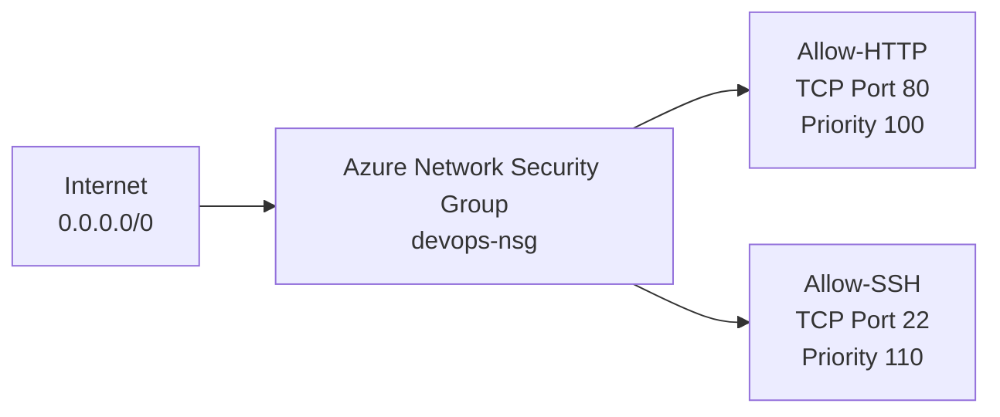
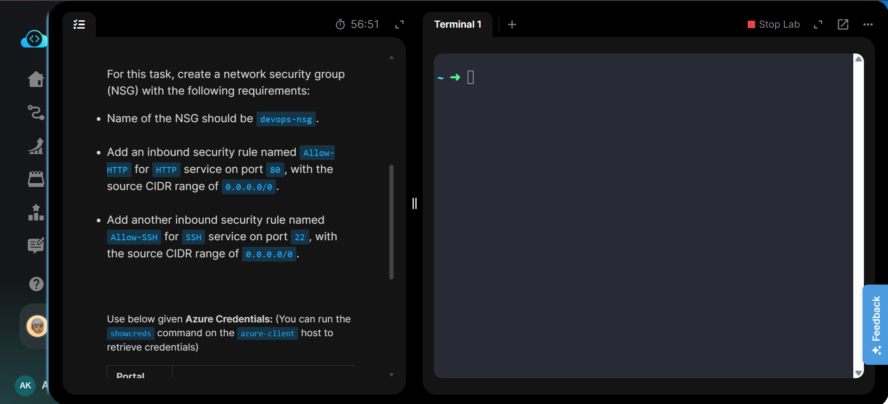
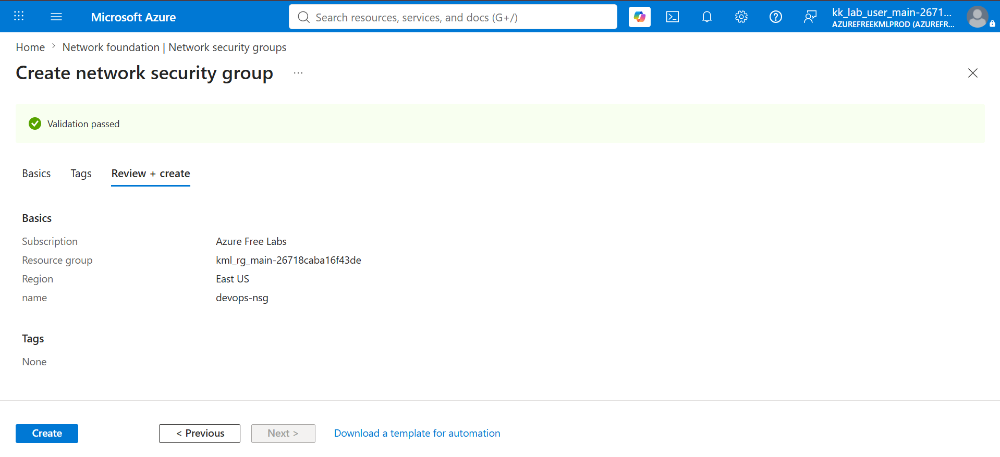
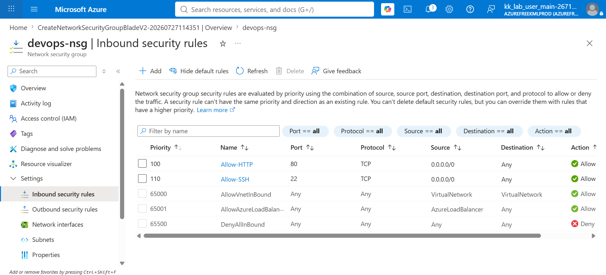
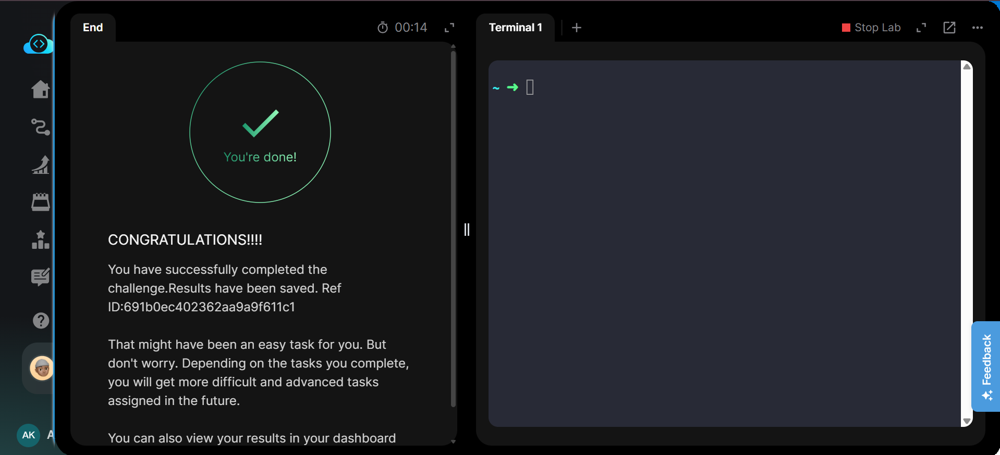

# Create Azure Network Security Group with HTTP and SSH Inbound Rules

## Project Information

| Field | Details |
|---|---|
| Project | Create NSG with HTTP and SSH Inbound Rules |
| Platform | Microsoft Azure |
| Service | Network Security Group (NSG) |
| NSG Name | `devops-nsg` |
| Region | East US |
| HTTP Port | `80` |
| SSH Port | `22` |
| Source CIDR | `0.0.0.0/0` |
| Purpose | Control inbound network traffic using NSG security rules |

## Overview

This project demonstrates how to create and configure an Azure Network Security Group (NSG) to control inbound network traffic.

A Network Security Group named `devops-nsg` was created using the Azure Portal. Two custom inbound security rules were then configured to allow HTTP traffic on TCP port `80` and SSH traffic on TCP port `22`.

Both rules allow traffic from the source CIDR range `0.0.0.0/0`, as required by the lab.

The task was performed using the Azure Portal. Azure CLI equivalent commands are available in [`Commands/commands.md`](Commands/commands.md).

## Objective

The objective of this task was to:

- Create a Network Security Group named `devops-nsg`.
- Add an inbound rule named `Allow-HTTP`.
- Allow TCP traffic on port `80`.
- Set the HTTP source CIDR to `0.0.0.0/0`.
- Add another inbound rule named `Allow-SSH`.
- Allow TCP traffic on port `22`.
- Set the SSH source CIDR to `0.0.0.0/0`.
- Verify that both inbound security rules were successfully created.

## Skills Demonstrated

- Azure Network Security Group management
- Azure network security configuration
- Inbound security rule creation
- TCP port configuration
- CIDR-based source configuration
- NSG rule priority management
- Azure Portal navigation
- Network access control fundamentals
- Azure CLI awareness

## Services Used

- Microsoft Azure
- Azure Network Security Groups
- Azure Virtual Network security
- Azure Portal
- Azure CLI

## Architecture Diagram

The `devops-nsg` Network Security Group evaluates incoming traffic and allows HTTP and SSH traffic according to the configured inbound rules.

## Steps Performed

### 1. Reviewed the Task Requirements

The task required creating an Azure Network Security Group with two inbound security rules:

- HTTP traffic on TCP port `80`
- SSH traffic on TCP port `22`

Both rules were required to accept traffic from `0.0.0.0/0`.

### 2. Created the Network Security Group

Navigated to:

`Azure Portal → Network Security Groups → Create`

Configured the NSG with:

- **Name:** `devops-nsg`
- **Region:** `East US`

The configuration was reviewed and validated before creating the resource.

### 3. Added the HTTP Inbound Rule

Opened:

`devops-nsg → Settings → Inbound security rules`

Created the following rule:

| Setting | Value |
|---|---|
| Name | `Allow-HTTP` |
| Source | IP Addresses |
| Source CIDR | `0.0.0.0/0` |
| Destination | Any |
| Service / Port | HTTP / `80` |
| Protocol | TCP |
| Action | Allow |
| Priority | `100` |
| Direction | Inbound |

### 4. Added the SSH Inbound Rule

Created another inbound security rule with:

| Setting | Value |
|---|---|
| Name | `Allow-SSH` |
| Source | IP Addresses |
| Source CIDR | `0.0.0.0/0` |
| Destination | Any |
| Service / Port | SSH / `22` |
| Protocol | TCP |
| Action | Allow |
| Priority | `110` |
| Direction | Inbound |

### 5. Verified the Inbound Rules

The inbound security rules page confirmed both custom rules:

| Priority | Rule | Port | Protocol | Source | Action |
|---:|---|---:|---|---|---|
| 100 | `Allow-HTTP` | 80 | TCP | `0.0.0.0/0` | Allow |
| 110 | `Allow-SSH` | 22 | TCP | `0.0.0.0/0` | Allow |

### 6. Completed the Lab

After verifying the configuration, the task was submitted successfully and the lab reported successful completion.

## Commands Used

This task was performed through the **Azure Portal**.

Azure CLI equivalent commands for creating the NSG and inbound security rules are documented in:

[`Commands/commands.md`](Commands/commands.md)

## Troubleshooting

No major issues were encountered during this task.

When configuring NSG rules, important points to verify include:

- Rule priorities must be unique.
- Lower priority numbers are processed before higher numbers.
- The correct protocol and destination port must be selected.
- The source CIDR must match the task requirement.
- Custom allow rules must have a higher precedence than Azure's default deny rule.

## Debugging Notes

If HTTP or SSH traffic does not work even when an NSG rule exists:

1. Confirm that the NSG is associated with the intended subnet or network interface.
2. Verify the inbound rule priority.
3. Confirm the destination port.
4. Verify the selected protocol.
5. Check whether another higher-priority rule blocks the traffic.
6. Confirm that the application or SSH service is actually listening on the required port.

## Best Practices

For production environments, unrestricted source access such as `0.0.0.0/0` should be avoided whenever possible, especially for administrative services such as SSH.

SSH access should normally be restricted to trusted IP addresses, VPN ranges, or other approved management networks.

NSG rules should also use clear names and carefully planned priorities to make network security policies easier to understand and maintain.

> `0.0.0.0/0` was used in this project because it was explicitly required by the lab.

## Key Learnings

- Azure NSGs control inbound and outbound network traffic.
- NSG rules are evaluated according to priority.
- Lower priority numbers have higher precedence.
- HTTP normally uses TCP port `80`.
- SSH normally uses TCP port `22`.
- CIDR notation can be used to define allowed source ranges.
- `0.0.0.0/0` represents all IPv4 addresses.
- Azure provides default NSG rules in addition to custom rules.
- Custom rules can be used to override default behavior when they have higher priority.

## Related Concepts

- Azure Virtual Network
- Network Security Groups
- Inbound security rules
- Outbound security rules
- CIDR notation
- TCP/IP
- HTTP
- SSH
- NSG priorities
- Network access control
- Defense in depth

## Screenshots

### Task Requirements

### NSG Review and Create

### HTTP and SSH Inbound Rules

### Task Completed

## Result

Successfully created the Azure Network Security Group `devops-nsg` and configured the required inbound security rules.

- `Allow-HTTP` allows TCP port `80` from `0.0.0.0/0`.
- `Allow-SSH` allows TCP port `22` from `0.0.0.0/0`.
- Both rules were successfully verified in the Azure Portal.
- The KodeKloud task was successfully completed.