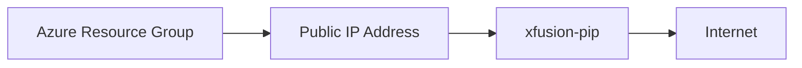
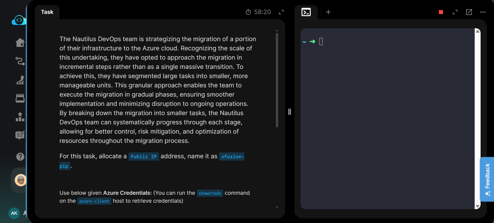
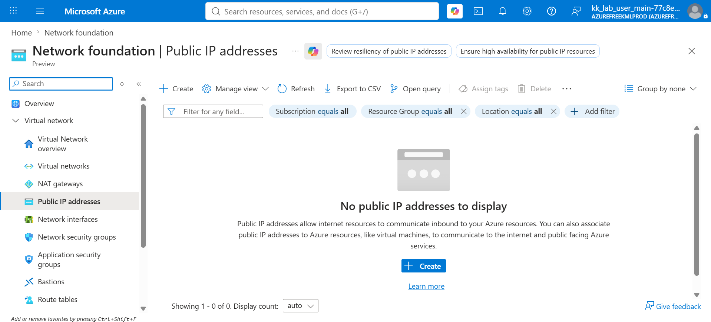
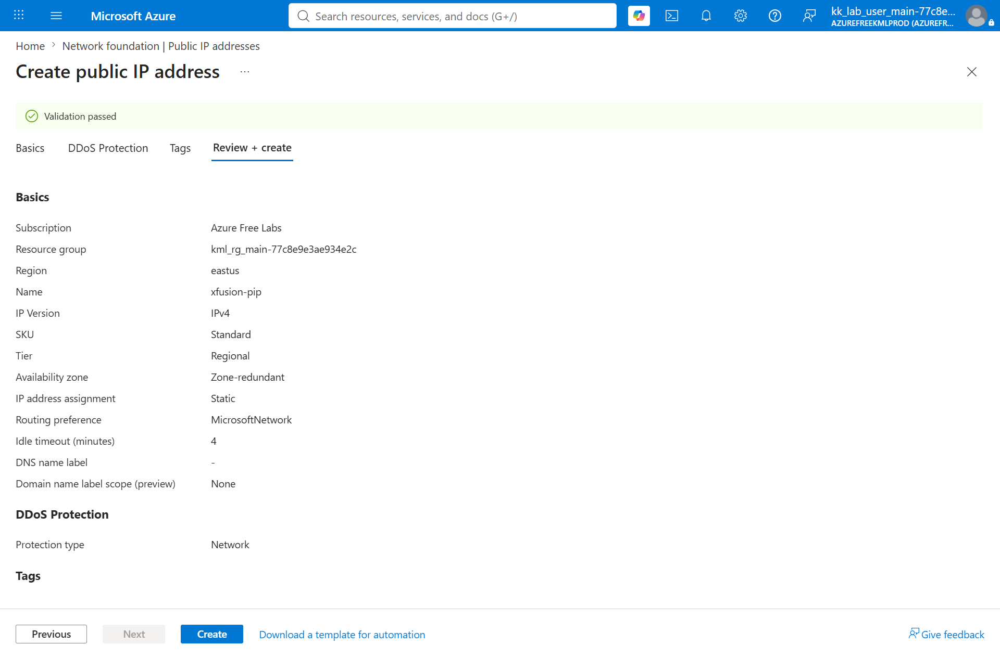
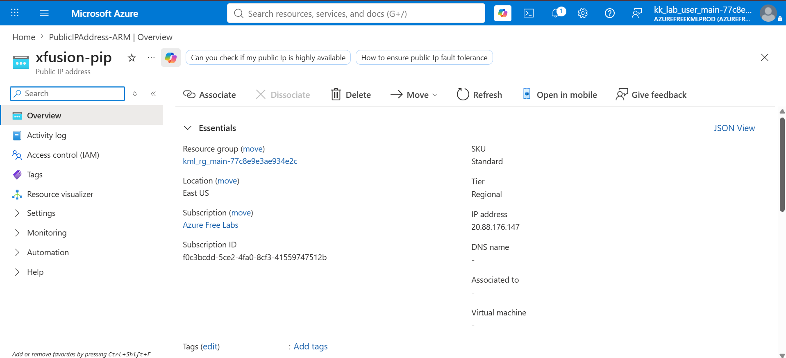
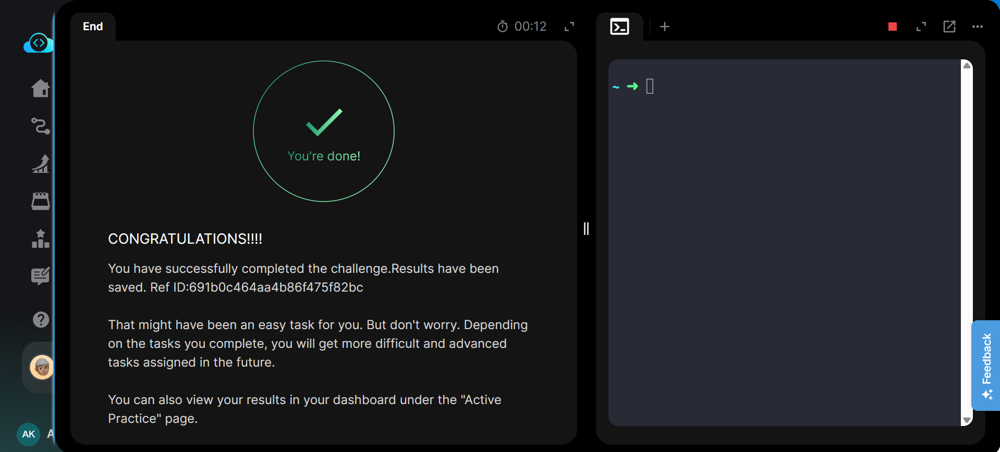

# 🏷️ Badges

---

# 📋 Project Information

| Property | Value |
|----------|-------|
| **Project Name** | Allocate Azure Public IP Address |
| **Task Number** | 07 |
| **Cloud Platform** | Azure |
| **Category** | Networking |
| **Primary Services** | Azure Public IP Address |
| **Difficulty** | Beginner |
| **Region** | East US |
| **Implementation** | Azure Portal |
| **Completion Status** | ✅ Completed |

---

# 📖 Overview

This project demonstrates how to allocate a Public IP Address in Microsoft Azure using the Azure Portal. Public IP addresses enable Azure resources to communicate with the internet and are commonly used with Virtual Machines, Load Balancers, NAT Gateways, and Application Gateways.

In this lab, a Standard SKU Public IP named **xfusion-pip** was successfully created in the **East US** region and verified through the Azure Portal.

---

# 🎯 Objective

- Allocate a Public IP Address in Azure.
- Name the Public IP **xfusion-pip**.
- Deploy the resource in the **East US** region.
- Verify successful deployment.

---

# 🚀 Skills Demonstrated

- Azure Public IP Address
- Azure Networking
- Public Network Connectivity
- Azure Resource Management
- Azure Portal Deployment
- Resource Verification

---

# ☁️ Services Used

- Azure Public IP Address
- Azure Resource Group

---

# 🏗️ Architecture Diagram

---

# 📝 Implementation Steps

1. Logged into the Azure Portal.
2. Opened **Public IP addresses**.
3. Clicked **Create**.
4. Entered the Public IP name **xfusion-pip**.
5. Kept the default networking configuration.
6. Reviewed the deployment settings.
7. Created the Public IP resource.
8. Verified successful deployment from the Overview page.

---

# 💻 Commands Used

See:

**Commands/commands.md**

---

# ⚠️ Troubleshooting

No issues were encountered during implementation.

---

# 📚 Key Learnings

- Learned how to allocate an Azure Public IP Address.
- Understood the purpose of Public IP resources.
- Learned the difference between Public and Private IP addresses.
- Practiced Azure networking deployment.
- Verified Public IP resource properties.
- Improved Azure Portal navigation.
- Learned Standard SKU Public IP deployment.
- Understood internet connectivity in Azure.

---

# 🔗 Related Concepts

- Azure Public IP
- Azure Virtual Network
- Azure Network Interface
- Azure NAT Gateway
- Azure Load Balancer
- Azure Virtual Machine

---

# 📸 Screenshots

## 01. Task

---

## 02. Public IP Page Overview

---

## 03. Review & Create

---

## 04. Public IP Created

---

## 05. Task Completed

---

# ✅ Result

A Standard SKU Azure Public IP Address named **xfusion-pip** was successfully created in the **East US** region. The deployment was verified through the Azure Portal, confirming that the resource was provisioned correctly.

This task demonstrates the basic process of provisioning a Public IP Address, which can later be associated with Azure resources to enable internet connectivity.