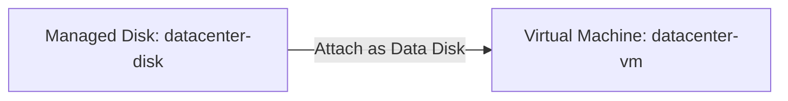
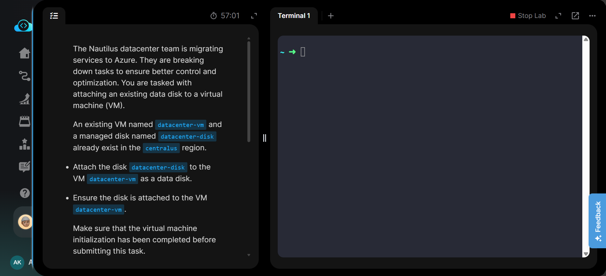
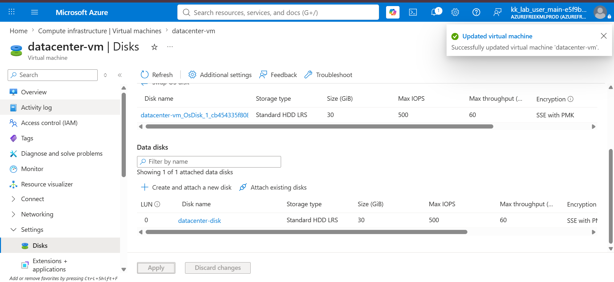
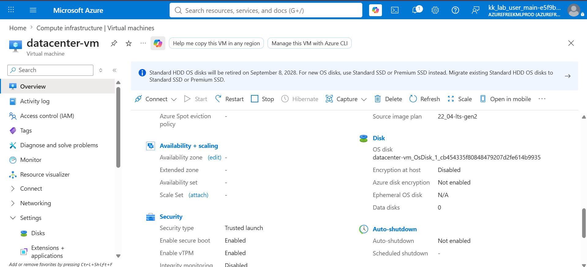
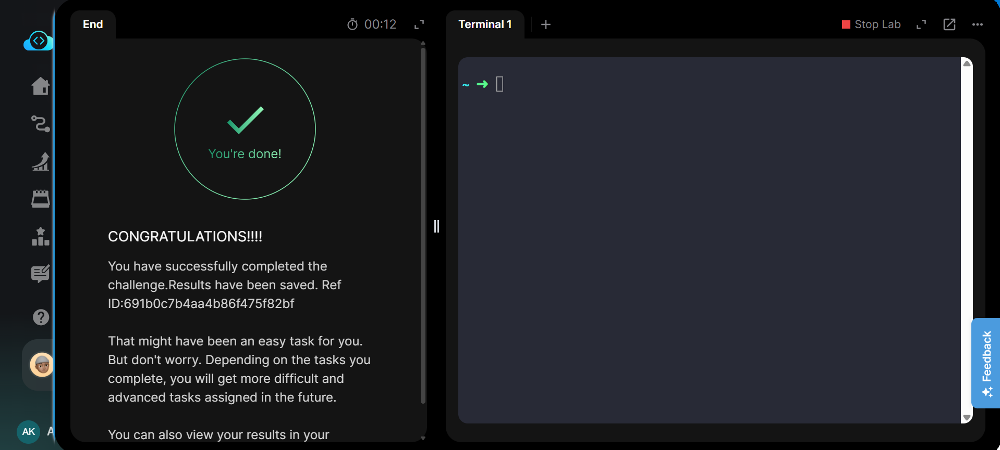

# 🏷️ Badges

---

# 📖 Overview

This project demonstrates how to attach an existing Azure Managed Disk to an existing Azure Virtual Machine using the Azure Portal.

Instead of creating a new disk, an already provisioned managed disk named **datacenter-disk** was attached to the virtual machine **datacenter-vm** as a data disk. This is a common administrative task when expanding VM storage, migrating application data, or reusing managed disks.

---

# 🎯 Objective

- Attach an existing managed disk to an Azure Virtual Machine.
- Use **datacenter-disk** as a data disk.
- Attach the disk to **datacenter-vm**.
- Verify that the managed disk is successfully attached.
- Ensure the virtual machine initialization is complete before submitting the task.

---

# ☁️ Azure Services Used

- Azure Virtual Machine
- Azure Managed Disk
- Azure Portal

---

---

# 📝 Steps Performed

1. Logged in to the Azure Portal.
2. Opened the existing Virtual Machine **datacenter-vm**.
3. Navigated to **Settings → Disks**.
4. Clicked **Attach existing disks**.
5. Selected the managed disk **datacenter-disk**.
6. Saved the configuration.
7. Waited for the VM update process to complete.
8. Verified that **datacenter-disk** appeared under **Data disks**.
9. Confirmed the VM initialization had completed successfully.
10. Submitted the task.

---

# 💻 Commands Used

See:

**Commands/commands.md**

---

# ⚠️ Troubleshooting

No issues were encountered during implementation.

---

# 📚 Key Learnings

- Learned how to attach an existing managed disk to an Azure Virtual Machine.
- Understood the difference between OS disks and Data disks.
- Practiced Azure VM storage management.
- Verified managed disk attachment from the Azure Portal.
- Learned how Azure updates a VM after storage configuration changes.
- Improved familiarity with Azure Compute resources.
- Understood common storage expansion workflows.
- Practiced validating successful disk attachment before task completion.

---

# 📸 Screenshots

## 01. Task

---

## 02. Data Disk Attached

---

## 03. VM Overview

---

## 04. Task Completed

---

# ✅ Result

The existing managed disk **datacenter-disk** was successfully attached to the virtual machine **datacenter-vm** as a data disk. The attachment was verified through the Azure Portal after the virtual machine update completed successfully.

This task demonstrates how Azure Managed Disks can be attached to existing virtual machines for storage expansion or data migration without modifying the operating system disk, while ensuring the VM remains properly configured and operational.