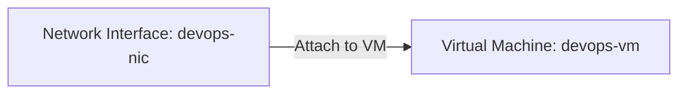

# 🏷️ Badges


---

# 📋 Project Information

| Property | Value |
|----------|-------|
| **Project** | Attach Existing Network Interface (NIC) to Azure VM |
| **Platform** | Microsoft Azure |
| **Region** | East US |
| **Category** | Azure Networking |
| **Primary Services** | Azure Virtual Machine, Network Interface |
| **Difficulty** | Beginner |
| **Implementation** | Azure Portal |
| **Completion Status** | ✅ Completed |

---

# 📖 Overview

This project demonstrates how to attach an existing Network Interface (NIC) to an Azure Virtual Machine. Since Azure requires a virtual machine to be stopped (deallocated) before attaching a secondary network interface, the VM was first stopped, the existing NIC was attached, and then the virtual machine was started again.

This lab provides hands-on experience with Azure VM networking, network interface management, and the operational workflow required when modifying VM network configurations.

---

# 🎯 Objective

- Stop (Deallocate) the existing Virtual Machine.
- Attach the existing Network Interface **devops-nic**.
- Verify the NIC is successfully attached.
- Start the Virtual Machine.
- Ensure the VM initialization is completed before submitting the task.

---

# 🚀 Skills Demonstrated

- Azure Virtual Machine Management
- Azure Network Interface (NIC) Management
- Azure Networking
- VM Lifecycle Operations
- Azure Portal Administration
- Network Configuration Verification

---

# ☁️ Azure Services Used

- Azure Virtual Machine
- Azure Network Interface (NIC)
- Azure Virtual Network (VNet)
- Azure Subnet

---

# 🏗️ Architecture Diagram



---

# 📝 Steps Performed

1. Logged in to the Azure Portal.
2. Opened the existing Virtual Machine **devops-vm**.
3. Stopped (Deallocated) the virtual machine.
4. Waited until the VM status changed to **Stopped (Deallocated)**.
5. Opened **Networking → Network settings**.
6. Clicked **Attach Network Interface**.
7. Selected the existing NIC **devops-nic**.
8. Attached the network interface to the VM.
9. Verified the NIC attachment.
10. Started the virtual machine.
11. Waited until the VM status changed to **Running**.
12. Verified the task was completed successfully.

---

# 💻 Commands Used

Azure Portal was used to complete this task.

Additional CLI commands (if using Azure CLI) are available in:

```text
Commands/commands.md
```

---

# ⚠️ Troubleshooting

| Issue | Cause | Resolution |
|------|-------|------------|
| Unable to attach NIC | VM was still running | Stop (Deallocate) the VM before attaching the NIC. |
| NIC not available | Different region or already attached | Verify the NIC belongs to the same region and is available. |
| Attachment not visible | Portal cache | Refresh the Azure Portal after the operation completes. |

---

# 🐞 Debugging Notes

- Verified the VM entered the **Stopped (Deallocated)** state before attaching the NIC.
- Confirmed the selected NIC was **devops-nic**.
- Checked the VM Network Settings page after attachment.
- Verified the VM returned to the **Running** state after startup.

---

# 💡 Best Practices

- Stop (Deallocate) Azure VMs before modifying network interfaces.
- Use descriptive names for NICs to simplify administration.
- Verify network connectivity after attaching additional interfaces.
- Attach only the required number of NICs to reduce management complexity.

---

# 📚 Key Learnings

- Azure supports multiple network interfaces on supported VM sizes.
- Secondary NIC attachment requires the VM to be stopped.
- NIC attachment can be managed using both Azure Portal and Azure CLI.
- Proper verification ensures successful network configuration.

---

# 🔗 Related Concepts

- Azure Virtual Machine
- Azure Network Interface (NIC)
- Azure Virtual Network (VNet)
- Azure Subnet
- Azure Network Security Groups (NSG)

---

# 📸 Screenshots

## 01. VM Network Settings

[](Screenshots/01-vm-network-settings.png)

---

## 02. Attach Network Interface

[](Screenshots/02-attach-network-interface.png)

---

## 03. NIC Attached Successfully

[](Screenshots/03-nic-attached.png)

---

## 04. VM Running

[](Screenshots/04-vm-overview.png)

---

## 05. Task Completed

[](Screenshots/05-task-completed.png)

---

# ✅ Result

Successfully stopped the existing Azure Virtual Machine, attached the existing Network Interface **devops-nic**, restarted the virtual machine, verified the NIC attachment, and completed the task successfully.