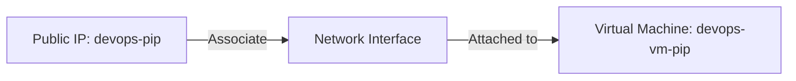
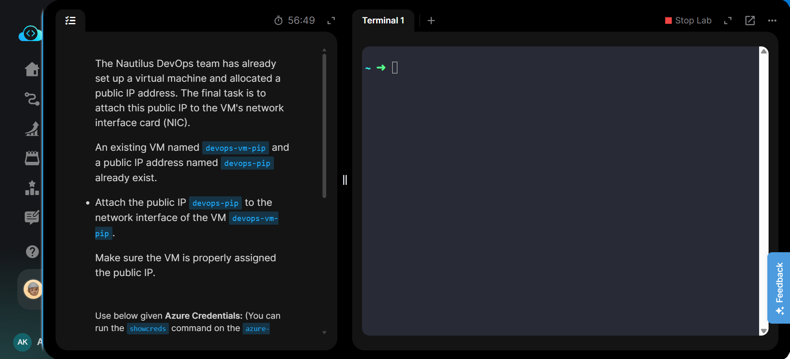
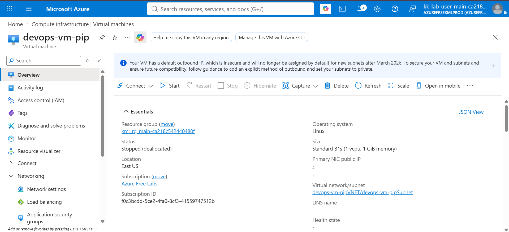
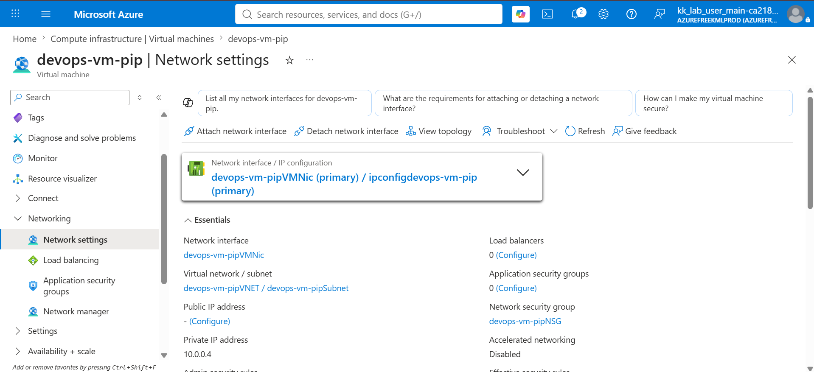
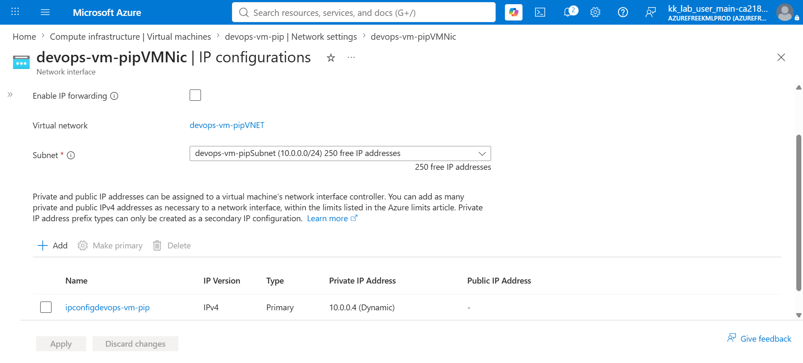
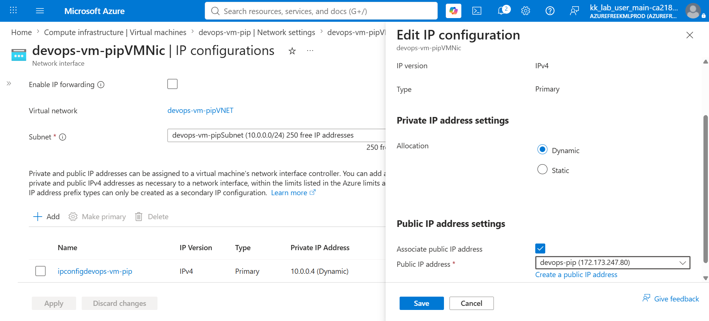
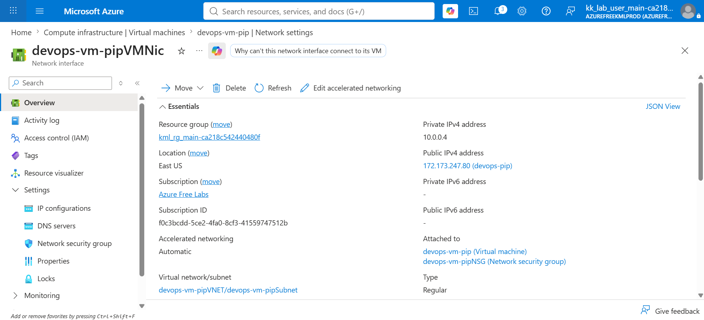
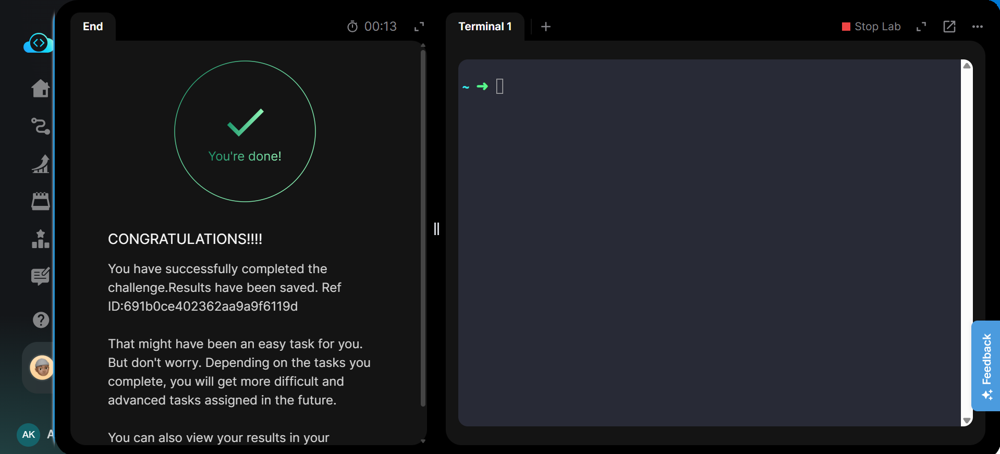

# 🏷️ Badges


---

# 📋 Project Information

| Property | Value |
|----------|-------|
| **Project** | Attach Public IP Address to Azure Virtual Machine |
| **Platform** | Microsoft Azure |
| **Region** | East US |
| **Services** | Azure Virtual Machine, Network Interface, Public IP Address |
| **Purpose** | Attach an existing Public IP Address to an existing Virtual Machine's Network Interface. |

---

# 📖 Overview

This project demonstrates how to associate an existing Azure Public IP Address with an existing Virtual Machine through its Network Interface Card (NIC). The lab focuses on Azure networking fundamentals by assigning a public endpoint to a virtual machine without creating additional resources.

By completing this task, the virtual machine becomes reachable through the assigned Public IP Address, providing practical experience in Azure networking and resource configuration.

---

# 🎯 Objective

- Locate the existing Virtual Machine **devops-vm-pip**.
- Open its Network Interface configuration.
- Associate the existing Public IP **devops-pip**.
- Save the configuration.
- Verify that the Public IP is successfully assigned.

---

# 🚀 Skills Demonstrated

- Azure Virtual Machine Administration
- Azure Network Interface (NIC) Management
- Azure Public IP Management
- Azure Networking
- Azure Portal Navigation
- Resource Configuration Verification

---

# ☁️ Services Used

- Azure Virtual Machine
- Azure Network Interface (NIC)
- Azure Public IP Address
- Azure Virtual Network (VNet)
- Azure Subnet

---

# 🏗️ Architecture Diagram



---

# 📝 Steps Performed

1. Logged in to the Azure Portal.
2. Opened the existing Virtual Machine **devops-vm-pip**.
3. Verified the VM state and existing network configuration.
4. Opened **Networking → Network settings**.
5. Selected the attached Network Interface.
6. Opened **IP Configurations**.
7. Selected the existing IP configuration.
8. Enabled **Associate Public IP Address**.
9. Selected the existing Public IP **devops-pip**.
10. Saved the configuration.
11. Verified that the Public IP Address was successfully attached.
12. Confirmed task completion.

---

# 💻 Commands Used

This task was completed using the Azure Portal.

Equivalent Azure CLI commands are available in:

```text
Commands/commands.md
```

---

# ⚠️ Troubleshooting

| Issue | Cause | Resolution |
|------|-------|------------|
| Public IP not visible | Incorrect resource selected | Verify the correct Public IP resource is selected. |
| Unable to save configuration | Public IP already assigned | Ensure the Public IP is not attached to another resource. |
| Public IP not displayed | Portal delay | Refresh the portal after saving the configuration. |

---

# 🐞 Debugging Notes

- Verified the VM existed before making changes.
- Confirmed the correct Network Interface was selected.
- Checked the IP Configuration before assigning the Public IP.
- Verified the Public IP appeared in the NIC Overview after saving.

---

# 💡 Best Practices

- Reuse existing Public IP resources whenever possible.
- Verify the assigned Public IP after every configuration change.
- Use meaningful names for networking resources.
- Validate connectivity after assigning a Public IP.

---

# 📚 Key Learnings

- Public IP Addresses are associated with Network Interfaces rather than Virtual Machines directly.
- Azure allows existing Public IP resources to be reused.
- IP Configuration is responsible for assigning Public IPs to NICs.
- Verifying configuration helps avoid networking issues.

---

# 🔗 Related Concepts

- Azure Virtual Machine
- Azure Network Interface (NIC)
- Azure Public IP Address
- Azure Virtual Network
- Azure Subnet
- Azure Network Security Group (NSG)

---

# 📸 Screenshots

## 01. Task Description

[](Screenshots/01-task.png)

---

## 02. VM Overview

[](Screenshots/02-vm-overview.png)

---

## 03. Network Settings

[](Screenshots/03-network-settings.png)

---

## 04. IP Configuration

[](Screenshots/04-ip-configuration.png)

---

## 05. Public IP Associated

[](Screenshots/05-public-ip-associated.png)

---

## 06. Public IP Attached

[](Screenshots/06-public-ip-attached.png)

---

## 07. Task Completed

[](Screenshots/07-task-completed.png)

---

# ✅ Result

Successfully associated the existing Public IP Address **devops-pip** with the Network Interface of the Azure Virtual Machine **devops-vm-pip**. Verified the Public IP assignment and completed the lab successfully.