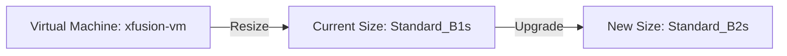
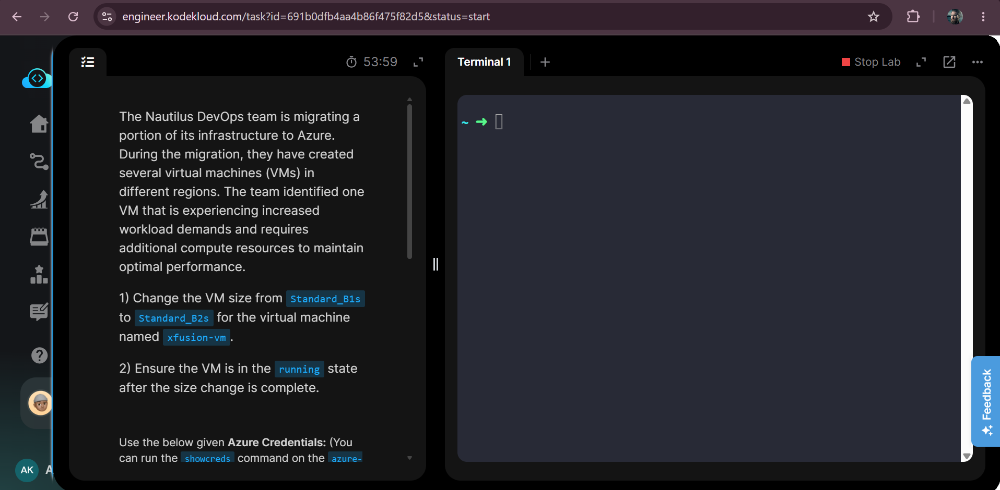
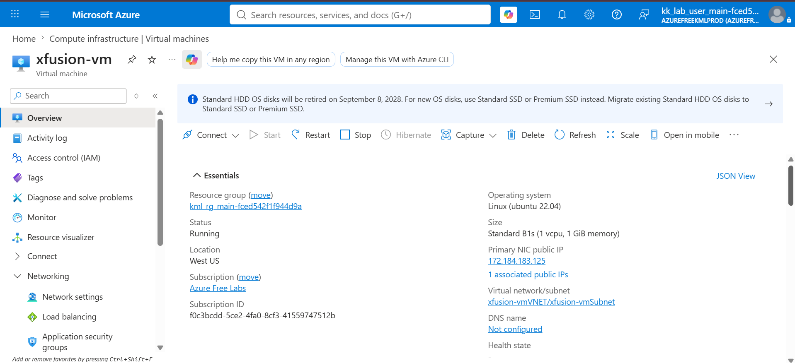
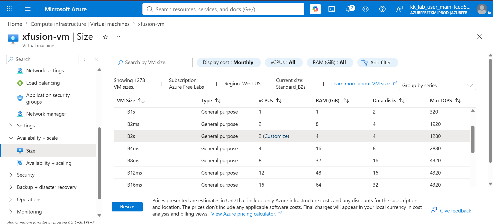
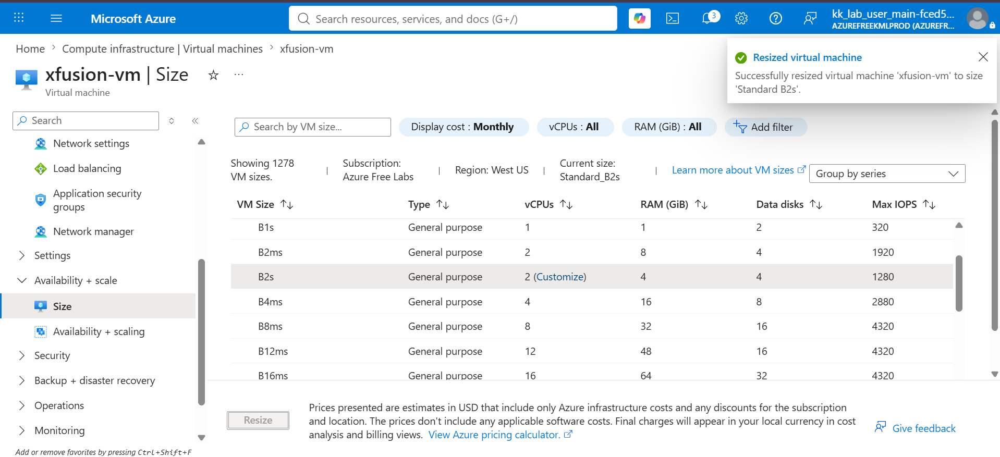
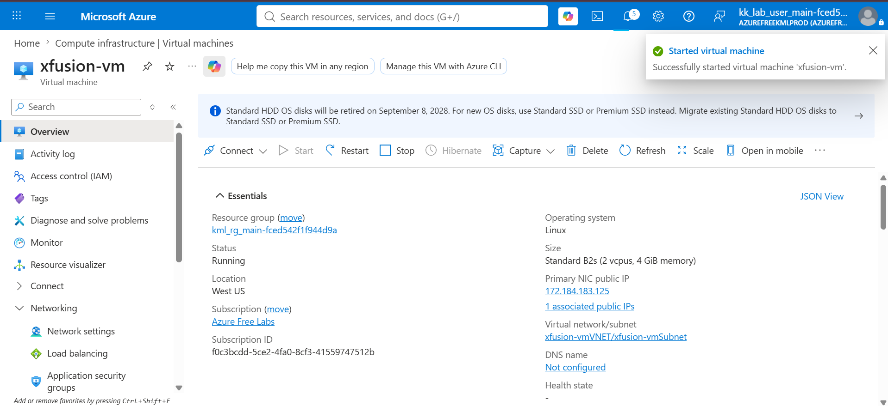
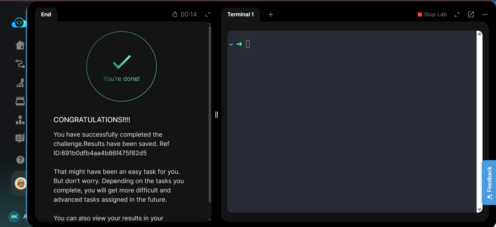

# 🏷️ Badges


---

# 📋 Project Information

| Property | Value |
|----------|-------|
| **Project** | Resize Azure Virtual Machine |
| **Platform** | Microsoft Azure |
| **Region** | West US |
| **Services** | Azure Virtual Machine |
| **Purpose** | Upgrade an existing Azure Virtual Machine from Standard_B1s to Standard_B2s and ensure it is running after the resize operation. |

---

# 📖 Overview

This project demonstrates how to resize an existing Azure Virtual Machine to accommodate increased workload requirements. The virtual machine size was upgraded from **Standard_B1s** to **Standard_B2s**, providing additional CPU and memory resources.

After the resize operation, the virtual machine was successfully started and verified to be in the **Running** state, ensuring the compute upgrade was completed successfully.

---

# 🎯 Objective

- Locate the existing virtual machine **xfusion-vm**.
- Change the VM size from **Standard_B1s** to **Standard_B2s**.
- Complete the resize operation.
- Ensure the virtual machine is in the **Running** state.
- Verify the updated VM size.

---

# 🚀 Skills Demonstrated

- Azure Virtual Machine Administration
- Azure Compute Resource Management
- Azure VM Resize Operations
- Azure Portal Management
- VM State Verification
- Resource Scaling

---

# ☁️ Services Used

- Azure Virtual Machine
- Azure Compute
- Azure Resource Group

---

# 🏗️ Architecture Diagram



---

# 📝 Steps Performed

1. Logged in to the Azure Portal.
2. Opened the existing virtual machine **xfusion-vm**.
3. Verified the VM was running with **Standard_B1s** size.
4. Opened **Availability + Scale → Size**.
5. Selected **Standard_B2s**.
6. Clicked **Resize**.
7. Waited for the resize operation to complete successfully.
8. Started the virtual machine.
9. Verified the VM was in the **Running** state.
10. Confirmed the VM size had been updated to **Standard_B2s**.

---

# 💻 Commands Used

This task was completed using the Azure Portal.

Equivalent Azure CLI commands are available in:

```text
Commands/commands.md
```

---

# ⚠️ Troubleshooting

| Issue | Cause | Resolution |
|------|-------|------------|
| Resize option unavailable | Requested size not supported | Choose an available VM size for the selected region. |
| Resize operation failed | Insufficient regional capacity | Retry later or choose another supported VM size. |
| VM not running | VM stopped after resize | Start the VM manually after the resize operation. |

---

# 🐞 Debugging Notes

- Verified the original VM size before resizing.
- Confirmed **Standard_B2s** was available in the selected region.
- Monitored the resize notification.
- Verified the VM size and running state after completion.

---

# 💡 Best Practices

- Resize VMs during maintenance windows whenever possible.
- Verify application compatibility after changing VM sizes.
- Monitor CPU and memory utilization after scaling.
- Choose VM sizes based on workload requirements.

---

# 📚 Key Learnings

- Azure Virtual Machines can be resized to meet changing workload demands.
- VM resizing changes the available compute resources.
- Some resize operations may require the VM to restart.
- Always verify the VM is running after resizing.

---

# 🔗 Related Concepts

- Azure Virtual Machine
- Azure Compute
- VM Scaling
- Availability Sets
- Azure Resource Groups

---

# 📸 Screenshots

## 01. Task Description

[](Screenshots/01-task.png)

---

## 02. VM Overview Before Resize

[](Screenshots/02-vm-overview-before-resize.png)

---

## 03. VM Size Selection

[](Screenshots/03-size-selection.png)

---

## 04. Resize Successful

[](Screenshots/04-resize-success.png)

---

## 05. VM Running After Resize

[](Screenshots/05-vm-running-after-resize.png)

---

## 06. Task Completed

[](Screenshots/06-task-completed.png)

---

# ✅ Result

Successfully resized the Azure Virtual Machine **xfusion-vm** from **Standard_B1s** to **Standard_B2s**, verified the upgraded compute configuration, ensured the virtual machine was running after the resize operation, and completed the task successfully.