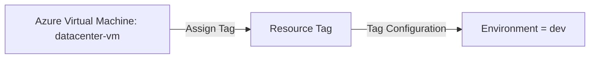
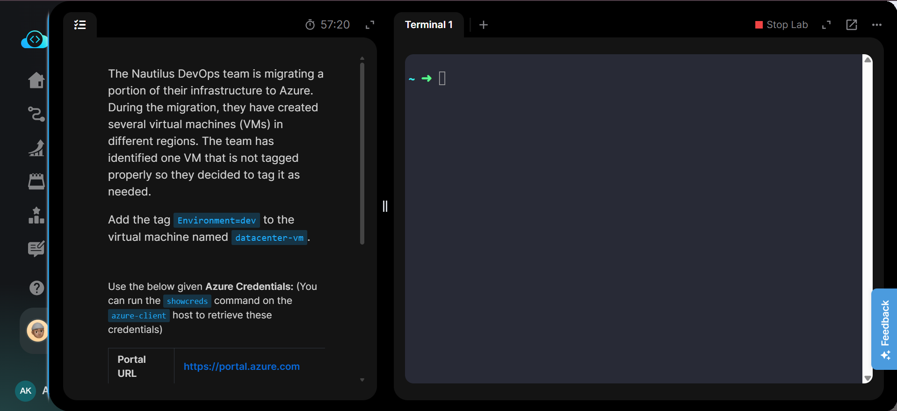
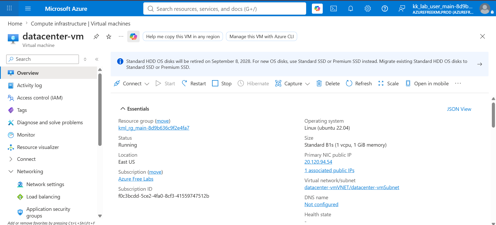
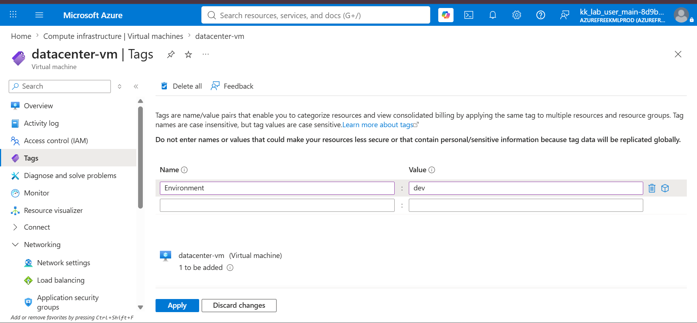
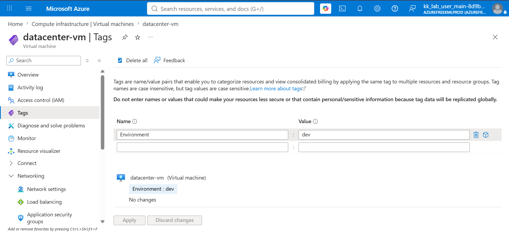
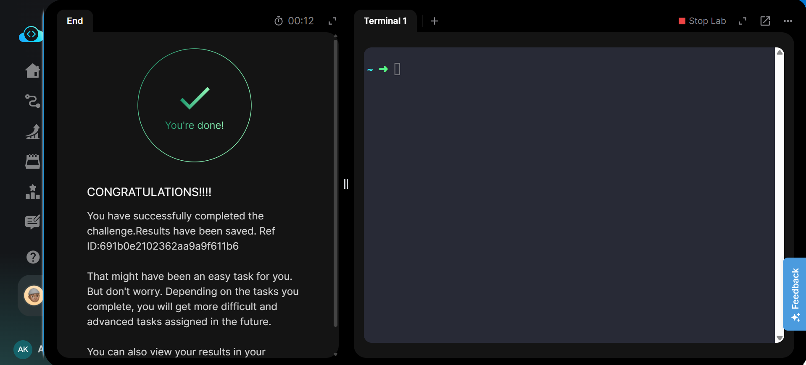

# 🏷️ Badges


---

# 📋 Project Information

| Property | Value |
|----------|-------|
| **Project** | Add Tag to Azure Virtual Machine |
| **Platform** | Microsoft Azure |
| **Resource** | `datacenter-vm` |
| **Services** | Azure Virtual Machine, Azure Resource Tags |
| **Purpose** | Add the `Environment=dev` tag to an existing Azure Virtual Machine for resource organization and identification. |

---

# 📖 Overview

This project demonstrates how to apply a resource tag to an existing Azure Virtual Machine using the Azure Portal.

The virtual machine **datacenter-vm** was updated with the tag **Environment=dev**. The tag was successfully applied and verified from the VM's Tags configuration.

Resource tags provide metadata that can be used to organize, identify, filter, manage, and track Azure resources.

---

# 🎯 Objective

- Locate the existing virtual machine **datacenter-vm**.
- Open the VM's Tags configuration.
- Add the tag:
  - **Name:** `Environment`
  - **Value:** `dev`
- Apply the configuration.
- Verify that the tag was successfully assigned to the VM.

---

# 🚀 Skills Demonstrated

- Azure Virtual Machine Management
- Azure Resource Tagging
- Resource Organization
- Azure Portal Navigation
- Resource Metadata Management
- Configuration Verification

---

# ☁️ Services Used

- Azure Virtual Machine
- Azure Resource Tags
- Azure Resource Manager

---

# 🏗️ Architecture Diagram



---

# 📝 Steps Performed

1. Logged in to the Azure Portal.
2. Navigated to **Virtual Machines**.
3. Opened the existing virtual machine **datacenter-vm**.
4. Verified the correct virtual machine from the Overview page.
5. Opened **Tags** from the VM menu.
6. Entered `Environment` as the tag name.
7. Entered `dev` as the tag value.
8. Clicked **Apply** to save the tag.
9. Verified that **Environment : dev** was successfully assigned to **datacenter-vm**.
10. Submitted the lab and confirmed successful task completion.

> The virtual machine did not need to be stopped or restarted because Azure resource tags can be modified independently of the VM's running state.

---

# 💻 Commands Used

This task was performed using the **Azure Portal**.

The Azure CLI equivalent commands are documented separately in:

```text
Commands/commands.md
```

---

# ⚠️ Troubleshooting

| Issue | Cause | Resolution |
|------|-------|------------|
| Tag not appearing | Changes were not applied | Click **Apply** after entering the tag name and value. |
| Incorrect tag value | Tag value entered incorrectly | Verify the value is exactly `dev`. |
| Wrong VM tagged | Incorrect resource selected | Verify the resource name is `datacenter-vm` before applying the tag. |

---

# 🐞 Debugging Notes

- Verified the VM name before modifying its tags.
- Confirmed the tag key was exactly `Environment`.
- Confirmed the tag value was exactly `dev`.
- Verified the applied tag from the VM's Tags page.
- No VM restart or deallocation was required.

---

# 💡 Best Practices

- Use consistent tag naming conventions across Azure resources.
- Standardize environment tags such as `dev`, `test`, `staging`, and `prod`.
- Use tags for resource organization, cost management, automation, and governance.
- Avoid storing sensitive information in resource tags.

---

# 📚 Key Learnings

- Azure tags are key-value pairs attached to resources.
- Tags provide metadata without changing the underlying resource configuration.
- Tags can be modified while a virtual machine is running.
- Resource tagging helps organize and identify infrastructure at scale.
- Tags can also support cost management and governance strategies.

---

# 🔗 Related Concepts

- Azure Resource Tags
- Azure Resource Manager
- Azure Virtual Machines
- Azure Resource Groups
- Azure Policy
- Azure Cost Management
- Resource Governance

---

# 📸 Screenshots

## 01. Task Description

[](Screenshots/01-task.png)

---

## 02. VM Overview

[](Screenshots/02-vm-overview.png)

---

## 03. Add Environment Tag

[](Screenshots/03-add-environment-tag.png)

---

## 04. Tag Applied Successfully

[](Screenshots/04-tag-applied.png)

---

## 05. Task Completed

[](Screenshots/05-task-completed.png)

---

# ✅ Result

Successfully added the **Environment=dev** tag to the existing Azure Virtual Machine **datacenter-vm**.

The tag configuration was verified in the Azure Portal, and the lab was successfully completed.