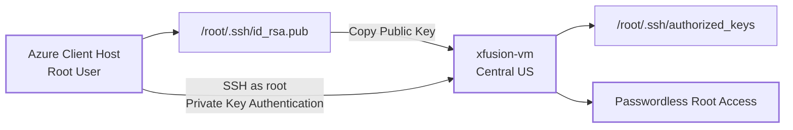
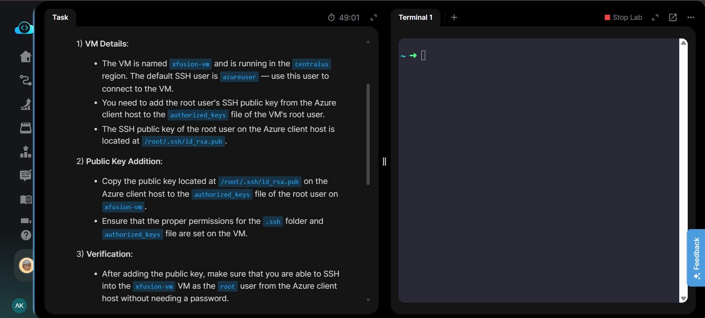
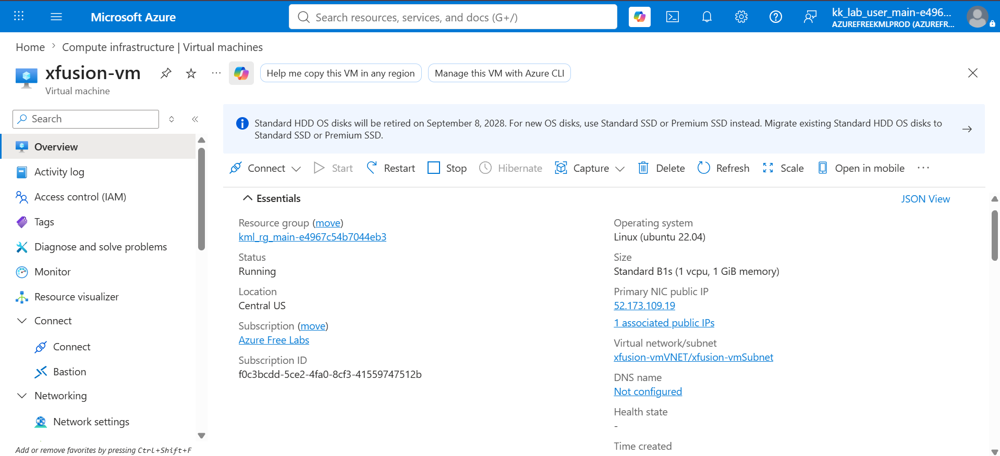
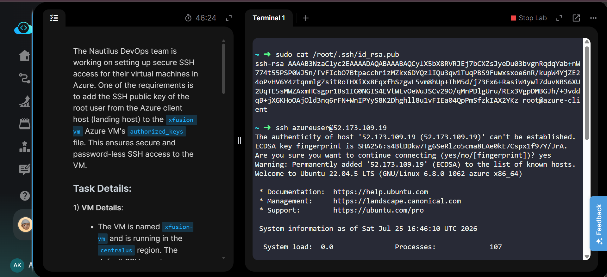
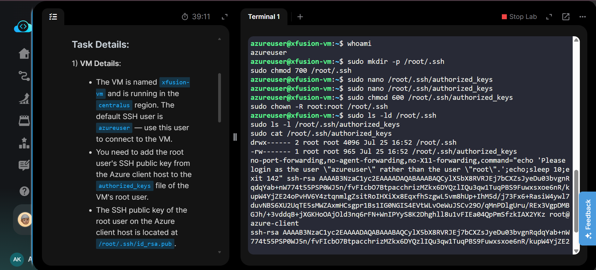
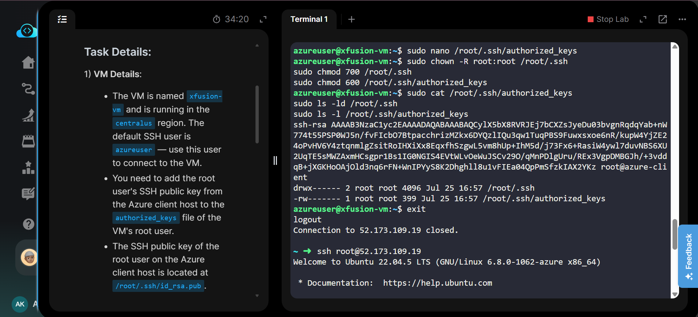
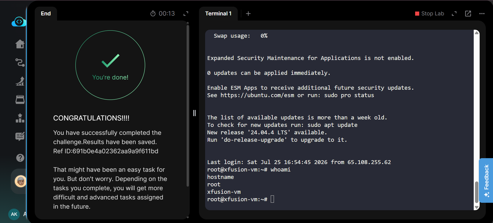

# Configure Passwordless Root SSH Access on Azure VM


## Project Information

| Field | Details |
|---|---|
| Project | Configure Passwordless Root SSH Access |
| Platform | Microsoft Azure |
| Lab Platform | KodeKloud Engineer |
| Azure Service | Virtual Machines |
| Virtual Machine | `xfusion-vm` |
| Region | Central US |
| Operating System | Ubuntu Linux |
| Default SSH User | `azureuser` |
| Target SSH User | `root` |
| Authentication Method | SSH Public Key Authentication |
| Purpose | Enable secure passwordless SSH access for the root user |

## Overview

This project demonstrates how to configure SSH public key authentication for the `root` user on an existing Microsoft Azure Linux virtual machine.

The root user's SSH public key stored on the Azure client host was retrieved and added to the `/root/.ssh/authorized_keys` file on the `xfusion-vm` virtual machine. The SSH directory and authorization file were then secured using the appropriate Linux ownership and permission settings.

After completing the configuration, passwordless SSH access from the Azure client host directly to `xfusion-vm` as the `root` user was successfully tested and verified.

> **Note:** This lab was performed using a combination of the Azure Portal and Linux/SSH commands from the Azure client host. The complete command sequence is available in [`Commands/commands.md`](Commands/commands.md).

---

## Objective

The task required the following:

- Verify that the Azure VM `xfusion-vm` was running.
- Confirm that the VM was located in the `centralus` region.
- Retrieve the root user's SSH public key from `/root/.ssh/id_rsa.pub` on the Azure client host.
- Connect to `xfusion-vm` using the default `azureuser` account.
- Add the Azure client host's root public key to `/root/.ssh/authorized_keys` on the VM.
- Configure correct ownership and permissions for the root SSH configuration.
- Verify passwordless SSH access to the VM as the `root` user.

---

## Skills Demonstrated

- Azure Virtual Machine administration
- Linux server administration
- SSH public key authentication
- Passwordless SSH configuration
- Linux file ownership management
- Linux file and directory permissions
- `authorized_keys` management
- Remote server access and verification
- Basic Azure networking awareness
- Troubleshooting SSH authentication

---

## Services Used

- Microsoft Azure Virtual Machines
- Azure Virtual Network
- Azure Public IP
- Azure Network Security Groups
- OpenSSH
- Ubuntu Linux

---

## Architecture Diagram



### Authentication Flow

The Azure client host contains the root user's SSH key pair. Only the **public key** is copied to the Azure VM.

When the client connects as `root`, SSH uses the private key stored on the client host and validates it against the corresponding public key stored in:

```text
/root/.ssh/authorized_keys
```

This allows authentication without sending or entering a password.

---

## Steps Performed

### 1. Reviewed the Task Requirements

The lab required passwordless SSH access from the Azure client host to the `root` account of `xfusion-vm`.

The root user's public key was already available on the client host at:

```text
/root/.ssh/id_rsa.pub
```

### 2. Verified the Azure Virtual Machine

Opened `xfusion-vm` in the Azure Portal and verified the VM configuration.

The following details were confirmed:

| Property | Value |
|---|---|
| VM Name | `xfusion-vm` |
| Status | Running |
| Region | Central US |
| Operating System | Ubuntu 22.04 |
| VM Size | Standard B1s |
| Public IP | Assigned |

The public IP address was used to establish the SSH connection from the Azure client host.

### 3. Retrieved the Root Public SSH Key

On the Azure client host, the root user's public SSH key was displayed using:

```bash
sudo cat /root/.ssh/id_rsa.pub
```

The public key was copied for installation on the Azure VM.

> Only the public key was transferred. The corresponding private key remained on the client host.

### 4. Connected to the VM as `azureuser`

The initial SSH connection was established using the VM's default administrative user:

```bash
ssh azureuser@<VM_PUBLIC_IP>
```

The connection was verified using:

```bash
whoami
```

This confirmed that the session was running as `azureuser`.

### 5. Created the Root SSH Directory

The root SSH configuration directory was created if it did not already exist:

```bash
sudo mkdir -p /root/.ssh
```

### 6. Added the Public Key to `authorized_keys`

The root user's authorization file was opened:

```bash
sudo nano /root/.ssh/authorized_keys
```

The public key retrieved from the Azure client host was added to this file.

The resulting location was:

```text
/root/.ssh/authorized_keys
```

### 7. Configured Ownership

The root SSH directory and its contents were assigned to the `root` user and `root` group:

```bash
sudo chown -R root:root /root/.ssh
```

### 8. Applied Secure SSH Permissions

The `.ssh` directory was restricted to the root user:

```bash
sudo chmod 700 /root/.ssh
```

The `authorized_keys` file was restricted so that only root could read and modify it:

```bash
sudo chmod 600 /root/.ssh/authorized_keys
```

The expected permissions were:

| Path | Permissions | Owner |
|---|---:|---|
| `/root/.ssh` | `700` | `root:root` |
| `/root/.ssh/authorized_keys` | `600` | `root:root` |

### 9. Verified the SSH Configuration

The directory ownership and permissions were checked using:

```bash
sudo ls -ld /root/.ssh
sudo ls -l /root/.ssh/authorized_keys
```

The contents of the authorization file were also verified:

```bash
sudo cat /root/.ssh/authorized_keys
```

This confirmed that the required public key was present and the SSH files had secure permissions.

### 10. Tested Passwordless Root SSH Access

The `azureuser` SSH session was closed:

```bash
exit
```

A new SSH connection was then initiated directly as root:

```bash
ssh root@<VM_PUBLIC_IP>
```

The connection succeeded without requiring a password.

### 11. Verified the Root Session

The authenticated user was verified using:

```bash
whoami
```

Expected output:

```text
root
```

The target VM was verified using:

```bash
hostname
```

Expected output:

```text
xfusion-vm
```

This confirmed that passwordless SSH access to `xfusion-vm` as the `root` user was successfully configured.

---

## Commands Used

The complete command sequence used for the lab is documented in:

**[`Commands/commands.md`](Commands/commands.md)**

This includes commands for:

- Retrieving the public SSH key
- Connecting as `azureuser`
- Creating the root SSH directory
- Configuring `authorized_keys`
- Setting ownership and permissions
- Verifying the configuration
- Testing passwordless root SSH access

---

## Troubleshooting

### SSH Public Key Authentication Fails

If SSH still requests a password or rejects the key, verify that the public key exists in:

```text
/root/.ssh/authorized_keys
```

Also confirm that the public key was copied as a complete single-line entry.

### Incorrect SSH Permissions

OpenSSH can reject authentication if the `.ssh` directory or `authorized_keys` file has insecure permissions.

The required permissions are:

```text
/root/.ssh                  700
/root/.ssh/authorized_keys  600
```

### Incorrect Ownership

The root SSH configuration should be owned by:

```text
root:root
```

Ownership can be corrected with:

```bash
sudo chown -R root:root /root/.ssh
```

### SSH Connection Cannot Be Established

If the VM cannot be reached over SSH, verify:

- The VM is in the **Running** state.
- A public IP address is assigned.
- TCP port `22` is allowed by the applicable Network Security Group.
- The correct public IP address is being used.
- The SSH service is running on the VM.

---

## Debugging Notes

The following commands are useful when troubleshooting SSH key authentication:

```bash
sudo ls -ld /root/.ssh
sudo ls -l /root/.ssh/authorized_keys
sudo cat /root/.ssh/authorized_keys
```

After connecting as root, the session can be validated with:

```bash
whoami
hostname
```

Successful output should identify:

```text
root
xfusion-vm
```

---

## Best Practices

- Use SSH keys instead of password-based authentication whenever possible.
- Never copy or expose the private SSH key.
- Never commit private keys to a Git repository.
- Restrict `.ssh` directories to `700`.
- Restrict `authorized_keys` files to `600`.
- Ensure SSH files are owned by the correct Linux user.
- Restrict inbound TCP port `22` using Azure Network Security Group rules.
- Rotate SSH keys when access is no longer required.
- Use separate SSH keys for different users or administrative purposes.
- Avoid direct root SSH access in production unless there is a specific operational requirement.
- Prefer a dedicated administrative user with `sudo` privileges for normal production administration.

---

## Key Learnings

- SSH authentication uses a public/private key pair.
- The private key remains on the client and should never be transferred to the server.
- A user's trusted public keys are stored in that user's `authorized_keys` file.
- The root user's SSH authorization file is located at `/root/.ssh/authorized_keys`.
- Linux ownership and permissions directly affect SSH key authentication.
- `chmod 700` protects the `.ssh` directory.
- `chmod 600` protects the `authorized_keys` file.
- `chown` ensures the SSH configuration belongs to the intended user.
- `whoami` can verify the authenticated Linux account.
- `hostname` can verify that the SSH session is connected to the intended server.

---

## Related Concepts

- SSH
- OpenSSH
- Public key cryptography
- Public/private key pairs
- `authorized_keys`
- Linux permissions
- `chmod`
- `chown`
- Azure Virtual Machines
- Azure Public IP
- Network Security Groups
- TCP port 22
- Passwordless authentication
- Remote Linux administration
- Principle of least privilege

---

## Screenshots

### 1. Task Requirements

The lab requirements specify the Azure VM, SSH user, root public key location, and required passwordless root access.

[](Screenshots/01-task.png)

### 2. Azure VM Overview

The `xfusion-vm` overview confirms that the VM is running in the Central US region and has a public IP address available for SSH connectivity.

[](Screenshots/02-vm-overview.png)

### 3. SSH Connection as Azure User

The root public key was retrieved from the Azure client host and the initial SSH connection to the VM was established using `azureuser`.

[](Screenshots/03-ssh-as-azureuser.png)

### 4. Root SSH Key Configuration

The root SSH directory, `authorized_keys`, ownership, permissions, and installed public key were configured and verified.

[](Screenshots/04-root-ssh-key-configured.png)

### 5. Passwordless Root Login Verification

A direct SSH connection to the VM as `root` was successfully established using public key authentication.

[](Screenshots/05-root-login-verified.png)

### 6. Task Completion and Final Verification

The final screenshot confirms successful KodeKloud task completion. The terminal also verifies the authenticated user as `root` and the target hostname as `xfusion-vm`.

[](Screenshots/06-task-completed.png)

---

## Result

Passwordless SSH access for the `root` user on `xfusion-vm` was successfully configured.

The Azure client host's root public key was installed in `/root/.ssh/authorized_keys`, correct Linux ownership and permissions were applied, and direct SSH authentication as `root` was successfully verified.

The final validation confirmed:

```text
User:     root
Hostname: xfusion-vm
Status:   Passwordless SSH access successful
```

**Task Status: Successfully Completed ✅**