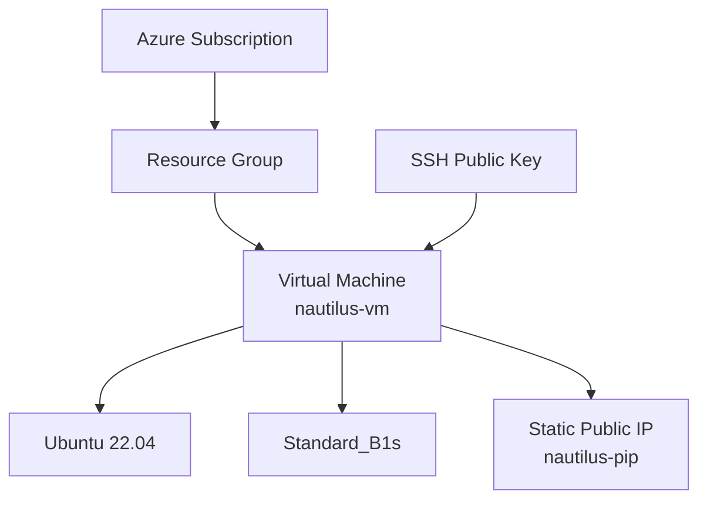
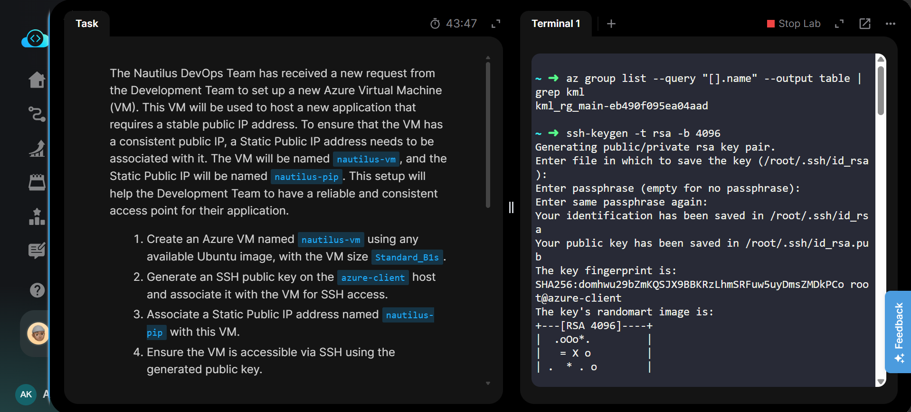
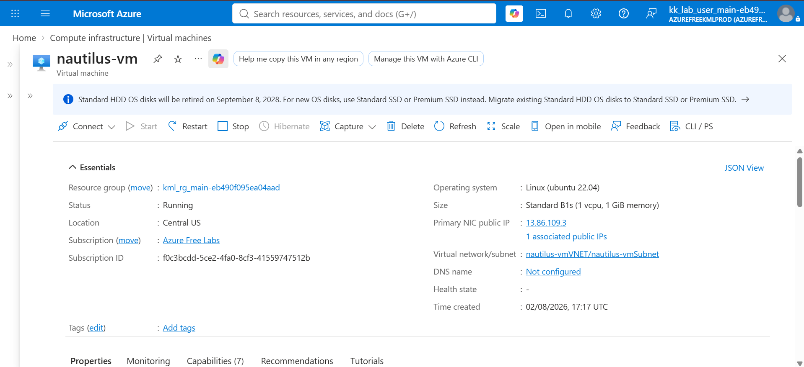
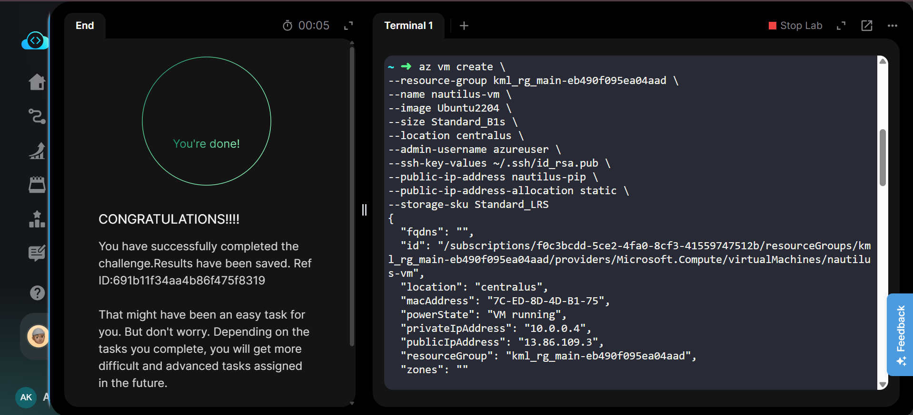

# Azure Virtual Machine - Create VM with Static Public IP

---

# 📋 Project Information

| Property | Value |
|----------|-------|
| **Project** | Create Azure VM with Static Public IP |
| **Platform** | Microsoft Azure |
| **Region** | Central US |
| **Resource Group** | Existing Lab Resource Group |
| **Virtual Machine** | nautilus-vm |
| **Operating System** | Ubuntu 22.04 |
| **VM Size** | Standard_B1s |
| **Public IP** | nautilus-pip |
| **Public IP Allocation** | Static |
| **Authentication** | SSH Public Key |
| **OS Disk SKU** | Standard HDD (Standard_LRS) |

---

# 📖 Overview

Azure Virtual Machines provide scalable Infrastructure as a Service (IaaS) resources for hosting applications and services in the cloud. A static public IP ensures that the VM always retains the same public IP address, making it suitable for production services, SSH access, and application hosting.

In this lab, an Azure Virtual Machine named **nautilus-vm** was provisioned using the Azure CLI in the **Central US** region. A **Static Public IP** named **nautilus-pip** was created and associated with the VM during deployment. An SSH key pair was generated on the Azure client host and configured for secure, passwordless SSH authentication.

---

# 🎯 Objective

- Generate an SSH key pair on the Azure client host.
- Create an Azure Virtual Machine.
- Use an Ubuntu image with **Standard_B1s** VM size.
- Attach a **Static Public IP** named **nautilus-pip**.
- Configure SSH key authentication.
- Verify successful VM deployment.

---

# 💡 Skills Demonstrated

- Azure CLI
- Azure Virtual Machine deployment
- SSH key generation
- Static Public IP configuration
- Linux VM provisioning
- Azure networking basics
- Infrastructure provisioning using CLI

---

# ☁️ Azure Services Used

- Azure Virtual Machines
- Azure Virtual Network
- Azure Public IP Address
- Azure Network Interface
- Azure Resource Group

---

# 🏗️ Architecture Diagram

---

# 📝 Steps Performed

1. Logged in to Azure using Azure CLI.
2. Identified the Resource Group.
3. Generated an SSH RSA key pair on the Azure client.
4. Created an Azure Virtual Machine named **nautilus-vm**.
5. Selected the Ubuntu 22.04 image.
6. Configured VM size as **Standard_B1s**.
7. Used **Standard HDD (Standard_LRS)** for the OS disk.
8. Created and attached a **Static Public IP** named **nautilus-pip** during VM deployment.
9. Associated the generated SSH public key with the VM.
10. Verified the VM deployment and SSH connectivity.

---

# 💻 Commands Used

This lab was performed using the **Azure CLI**.

All commands used in this lab are available here:

👉 **[Commands/commands.md](Commands/commands.md)**

---

# ⚠️ Troubleshooting

- Ensure the Resource Group exists before deployment.
- Use a supported Ubuntu image.
- Verify the SSH public key path.
- Use **Standard_LRS** for the OS disk.
- Specify **Static** public IP allocation.
- Wait until the VM provisioning completes before connecting.

---

# 🐞 Debugging Notes

- Verified SSH key generation before VM creation.
- Confirmed the VM entered the **Running** state.
- Verified that **nautilus-pip** was assigned successfully.
- Confirmed the VM was accessible using the generated SSH key.

---

# ✅ Best Practices

- Prefer SSH key authentication over passwords.
- Use Static Public IPs for production workloads.
- Apply Network Security Groups to restrict SSH access.
- Use managed disks for reliability.
- Stop unused VMs to reduce costs.

---

# 📚 Key Learnings

- Azure VM provisioning using Azure CLI
- SSH key-based authentication
- Static Public IP configuration
- Azure compute and networking basics
- End-to-end VM deployment automation

---

# 🔗 Related Concepts

- Azure Virtual Machine
- Azure CLI
- Azure Public IP
- SSH Authentication
- Azure Virtual Network
- Managed Disks

---

# 📸 Screenshots

### Task

---

### VM Overview

---

### Task Completed

---

# ✅ Result

Successfully created the Azure Virtual Machine **nautilus-vm** in the **Central US** region using the Azure CLI. A **Static Public IP** named **nautilus-pip** was associated with the VM, SSH key authentication was configured, and the deployment was successfully verified.