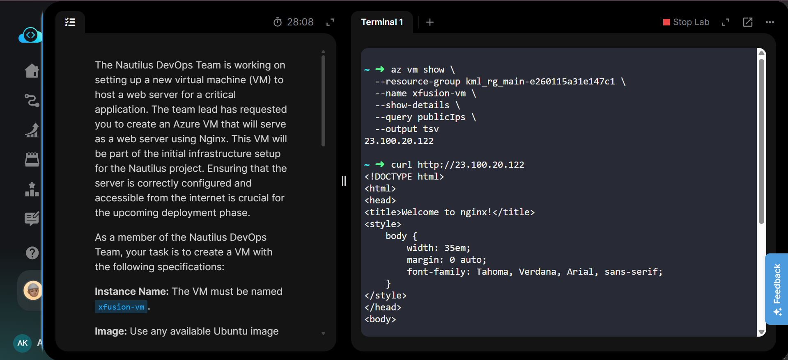
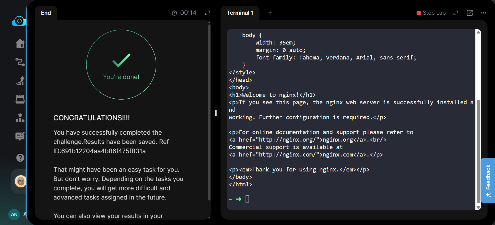

# Azure VM - Nginx Web Server

---

# 📋 Project Information

| Property | Value |
|----------|-------|
| **Project** | Create Azure VM with Nginx Web Server |
| **Platform** | Microsoft Azure |
| **Region** | East US |
| **Resource Group** | kml_rg_main-e260115a31e147c1 |
| **Virtual Machine** | xfusion-vm |
| **VM Size** | Standard_B1s |
| **OS Image** | Ubuntu 22.04 |
| **OS Disk** | Standard HDD - LRS |
| **Web Server** | Nginx |
| **HTTP Port** | 80 |
| **SSH Port** | 22 |
| **Network Security Group** | xfusion-vmNSG |

---

# 📖 Overview

Azure Virtual Machines provide scalable compute resources for hosting applications, web servers, and other workloads in the cloud.

In this lab, an Ubuntu-based Azure Virtual Machine named **xfusion-vm** was created in the **East US** region using the **Standard_B1s** VM size and **Standard HDD LRS** storage.

A custom startup script was supplied during VM creation to automatically install and start the **Nginx** web server. The VM's Network Security Group was configured to allow HTTP traffic on port **80** from the internet.

The Nginx web server was then verified by retrieving the VM's public IP address and sending an HTTP request using `curl`.

---

# 🎯 Objective

- Create an Azure Virtual Machine named **xfusion-vm**.
- Use an available Ubuntu image.
- Use the **Standard_B1s** VM size.
- Use **Standard HDD - LRS** storage.
- Generate and use an SSH key pair from the `azure-client` host.
- Configure custom data to install Nginx.
- Start the Nginx service automatically.
- Allow HTTP traffic on port **80**.
- Verify that the Nginx web server is accessible from the internet.

---

# 💡 Skills Demonstrated

- Azure Virtual Machine provisioning
- Azure CLI
- Linux VM administration
- SSH key generation
- SSH key-based authentication
- Custom data / cloud-init
- Nginx installation and configuration
- Network Security Group configuration
- HTTP connectivity testing
- Azure networking fundamentals
- Cloud infrastructure troubleshooting

---

# ☁️ Azure Services Used

- Azure Virtual Machines
- Azure Virtual Network
- Azure Network Security Group
- Azure Public IP
- Azure CLI

---

# 🏗️ Architecture Diagram

~~~mermaid
flowchart TD

    A["Internet"]
    B["Public IP"]
    C["Network Security Group xfusion-vmNSG"]
    D["Azure VM xfusion-vm"]
    E["Ubuntu 22.04"]
    F["Nginx Web Server HTTP : 80"]

    A -->|HTTP : 80| B
    B --> C
    C --> D
    D --> E
    E --> F
~~~

---

# 📝 Steps Performed

1. Logged in to the Azure environment through the `azure-client` host.
2. Identified the lab Resource Group using Azure CLI.
3. Generated an RSA 4096-bit SSH key pair on the `azure-client` host.
4. Verified the generated public key using `cat ~/.ssh/id_rsa.pub`.
5. Created a custom Nginx startup script.
6. Configured the script to update packages, install Nginx, enable the Nginx service, and start the service.
7. Created the Azure VM named **xfusion-vm**.
8. Selected **Ubuntu 22.04** as the VM image.
9. Selected **Standard_B1s** as the VM size.
10. Used **Standard_LRS** for the VM OS disk.
11. Configured SSH key-based access using the generated public key.
12. Created the VM in the **East US** region.
13. Supplied the Nginx setup script through VM custom data.
14. Identified the Network Security Group associated with the VM.
15. Added an inbound NSG rule allowing HTTP traffic on TCP port **80**.
16. Retrieved the VM's public IP address using Azure CLI.
17. Tested the web server using `curl`.
18. Verified the default **Welcome to nginx!** page.
19. Confirmed successful completion of the lab.

---

# 💻 Commands Used

This lab was performed primarily using the **Azure CLI from the `azure-client` host**.

The complete Azure CLI commands, SSH key generation commands, Nginx setup script, NSG configuration, and verification commands are documented here:

[📄 Commands/commands.md](Commands/commands.md)

---

# ⚠️ Troubleshooting

### HTTP NSG Rule During VM Creation

The initial VM creation command attempted to specify both SSH and HTTP rules using:

~~~bash
--nsg-rule SSH HTTP
~~~

Azure CLI returned:

~~~text
unrecognized arguments: HTTP
~~~

Therefore, the VM was created with the SSH rule first and the HTTP rule was added separately to the associated Network Security Group.

### Finding the VM Network Security Group

The VM's Network Interface was identified using:

~~~bash
az vm show \
  --resource-group kml_rg_main-e260115a31e147c1 \
  --name xfusion-vm \
  --query "networkProfile.networkInterfaces[0].id" \
  --output tsv
~~~

The associated NSG was then identified from the Network Interface.

### Nginx Verification

After retrieving the VM public IP, HTTP connectivity was tested with:

~~~bash
curl http://<PUBLIC_IP>
~~~

The response contained:

~~~text
Welcome to nginx!
~~~

This confirmed that Nginx was installed, running, and accessible over HTTP.

---

# 🐞 Debugging Notes

- Verified the correct Resource Group before provisioning the VM.
- Generated the SSH key pair on the `azure-client` host.
- Verified the public key before using it during VM creation.
- Confirmed the VM was created with the required **Standard_B1s** size.
- Confirmed the OS disk used **Standard_LRS**.
- Verified the VM was deployed in **East US**.
- Identified the Network Interface associated with the VM.
- Identified the Network Security Group associated with the Network Interface.
- Added an inbound TCP rule for port **80**.
- Retrieved the VM public IP using Azure CLI.
- Tested the Nginx web server using `curl`.
- Confirmed the default Nginx page was returned successfully.
- Verified that the KodeKloud challenge completed successfully.

---

# ✅ Best Practices

- Use SSH key authentication instead of password-based authentication for Linux VMs.
- Keep private SSH keys secure and never expose them.
- Allow only required ports through Network Security Groups.
- Avoid exposing unnecessary management ports to the internet.
- Use HTTPS instead of HTTP for production web applications.
- Use custom data or cloud-init for repeatable VM initialization.
- Keep the operating system and Nginx packages updated.
- Use appropriate VM sizes according to workload requirements.
- Monitor VM and network activity in production environments.
- Use static public IP addresses when applications require a consistent endpoint.

---

# 📚 Key Learnings

- Azure VM provisioning using Azure CLI
- Ubuntu VM deployment
- SSH key generation and authentication
- Azure Network Security Groups
- NSG inbound rules
- HTTP port 80 configuration
- Custom data / cloud-init
- Nginx installation and service management
- Public IP retrieval
- HTTP connectivity testing
- Azure CLI troubleshooting

---

# 🔗 Related Concepts

- Azure Virtual Machines
- Azure Virtual Network
- Azure Network Security Groups
- Azure Public IP
- Linux
- Ubuntu
- SSH
- Cloud-init
- Nginx
- HTTP
- Azure CLI
- Network Security

---

# 📸 Screenshots

### Task

---

### Nginx HTTP Verification & Task Completion

---

# ✅ Result

Successfully created the Azure Virtual Machine **xfusion-vm** in the **East US** region using **Ubuntu 22.04**, **Standard_B1s**, and **Standard HDD LRS** storage.

The VM was configured with SSH key-based authentication and a custom startup script that automatically installed and started the **Nginx** web server.

An inbound Network Security Group rule was configured to allow HTTP traffic on port **80**. The VM's public IP was successfully accessed using `curl`, which returned the default **Welcome to nginx!** page.

The Nginx web server was successfully deployed and made accessible from the internet, and the lab was completed successfully.